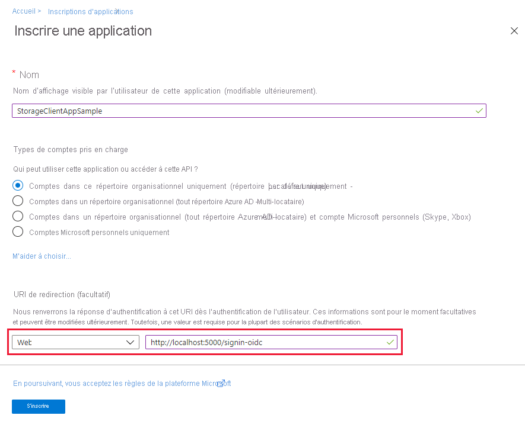
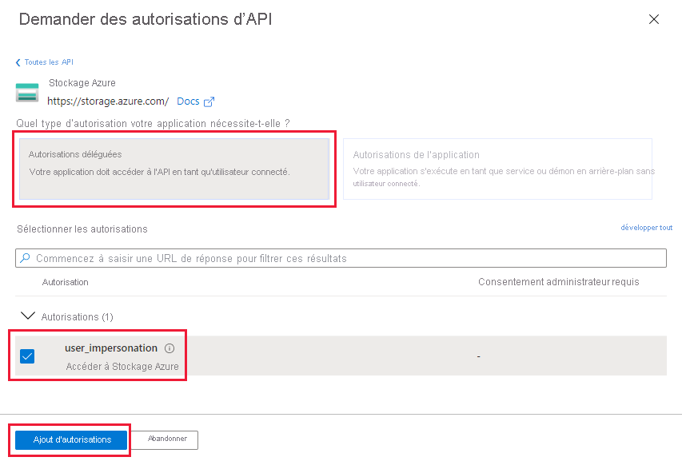

# <a name="authenticate-with-azure-active-directory-from-an-azure-storage-application-preview"></a>Authentifier avec Azure Active Directory à partir d’une application Stockage Azure (préversion)

Le principal avantage d’utiliser Azure Active Directory (Azure AD) avec le Stockage Azure est que vos informations d’identification n’ont plus besoin d’être stockées dans votre code. À la place, vous pouvez demander un jeton d’accès OAuth 2.0 à Azure AD. Azure AD gère l’authentification du principal de sécurité (un utilisateur, un groupe ou un principal de service) qui exécute l’application. Si l’authentification réussit, Azure AD retourne le jeton d’accès à l’application et l’application peut ensuite l’utiliser pour autoriser les demandes vers le Stockage Azure.

Cet article décrit comment configurer votre application pour l’authentification avec Azure AD. L’exemple de code utilise .NET, mais l’approche est similaire avec d’autres langages.

Pour pouvoir authentifier un principal de sécurité à partir de votre application de Stockage Azure, configurez les paramètres du contrôle d’accès basé sur un rôle (RBAC) pour ce principal de sécurité. Le Stockage Azure définit des rôles RBAC qui englobent les autorisations pour les conteneurs et les files d’attente. Quand le rôle RBAC est attribué à un principal de sécurité, ce dernier obtient l’accès à cette ressource. Pour plus d’informations, consultez [Gérer les droits d’accès aux données de stockage avec RBAC (préversion)](storage-auth-aad-rbac.md).

Pour avoir une vue d’ensemble du flux d’octroi de code OAuth 2.0, consultez [Autoriser l’accès aux applications web Azure Active Directory à l’aide du flux d’octroi de code OAuth 2.0](../../active-directory/develop/v1-protocols-oauth-code.md).

[!INCLUDE [storage-auth-aad-note-include](../../../includes/storage-auth-aad-note-include.md)]

## <a name="register-your-application-with-an-azure-ad-tenant"></a>Inscrire votre application à un locataire Azure AD

La première étape d’utilisation d’Azure AD pour autoriser l’accès aux ressources de stockage est d’inscrire votre application cliente dans un locataire Azure AD. L’inscription de votre application vous permet d’appeler la [Bibliothèque d’authentification Active Directory](../../active-directory/active-directory-authentication-libraries.md) (ADAL) Azure à partir de votre code. La bibliothèque ADAL fournit une API pour l’authentification avec Azure AD à partir de votre application. L’inscription de votre application vous permet aussi d’autoriser les appels de cette application aux API de Stockage Azure avec un jeton d’accès.

Lorsque vous inscrivez votre application, vous fournissez des informations sur votre application à Azure AD. Azure AD fournit ensuite un ID de client (appelé aussi *ID d’application*) que vous utilisez pour associer votre application à Azure AD au moment de l’exécution. Pour en savoir plus sur l’ID de client, consultez [Objets application et principal du service dans Azure Active Directory](../../active-directory/develop/app-objects-and-service-principals.md).

Pour inscrire votre application de Stockage Azure, suivez les étapes de la section [Ajout d’une application](../../active-directory/develop/quickstart-v1-add-azure-ad-app.md) dans [Intégration d’applications dans Azure Active Directory](../../active-directory/active-directory-integrating-applications.md). Si vous inscrivez votre application comme une application native, vous pouvez spécifier n’importe quel URI valide pour **l’URI de redirection**. La valeur ne doit pas forcément être un point de terminaison réel.



Une fois votre application inscrite, l’ID d’application (ou ID de client) se trouve sous **Paramètres** :


Pour plus d’informations sur l’inscription d’une application dans Azure AD, consultez [Intégration d’applications à Azure Active Directory](../../active-directory/develop/quickstart-v1-integrate-apps-with-azure-ad.md). 

## <a name="grant-your-registered-app-permissions-to-azure-storage"></a>Accorder à votre application inscrite des autorisations sur le Stockage Azure

Ensuite, vous devez accorder à votre application l’autorisation d’appeler les API de Stockage Azure. Cette étape permet à votre application d’autoriser les appels au Stockage Azure avec Azure AD.

1. Dans le volet de navigation de gauche du portail Azure, choisissez **Tous les services** et recherchez **Inscriptions des applications**.
2. Recherchez le nom de l’application inscrite que vous avez créée à l’étape précédente.
3. Sélectionnez votre application inscrite et cliquez sur **Paramètres**. Dans la section **Accès API**, sélectionnez **Autorisations requises**.
4. Dans le panneau **Autorisations requises**, cliquez sur le bouton **Ajouter**.
5. Sous **Sélectionner une API**, recherchez « Stockage Azure », puis sélectionnez **Stockage Azure** dans la liste des résultats.

    

6. Sous **Sélectionner des autorisations**, cochez la case à côté de **Accéder au Stockage Azure**, puis cliquez sur **Sélectionner**.
7. Cliquez sur **Done**.

La fenêtre **Autorisations nécessaires** indique à présent que votre application Azure AD a accès à Azure Active Directory et au Stockage Azure. Les autorisations sont accordées à Azure AD automatiquement quand vous inscrivez votre application pour la première fois dans Azure AD.


## <a name="net-code-example-create-a-block-blob"></a>Exemple de code .NET : Créer un objet blob de blocs

L’exemple de code montre comment obtenir un jeton d’accès d’Azure AD. Le jeton d’accès est utilisé pour authentifier l’utilisateur spécifié et autoriser une demande de création d’objet blob de blocs. Pour que cet exemple fonctionne, suivez d’abord les étapes décrites dans les sections précédentes.

> [!NOTE]
> En tant que propriétaire de votre compte de stockage Azure, vous n’avez pas automatiquement l’autorisation d’accéder aux données. Vous devez explicitement vous attribuer un rôle RBAC pour le Stockage Azure. Vous pouvez l’attribuer au niveau de votre abonnement, groupe de ressources, compte de stockage, conteneur ou file d’attente. 
>
> Par exemple, pour exécuter l’exemple de code sur un compte de stockage dont vous êtes propriétaire et sous votre propre identité d’utilisateur, vous devez vous attribuer le rôle RBAC Contributeur aux données blob. Sinon, l’appel pour créer l’objet blob échoue avec le code d’état HTTP 403 (Interdit). Pour plus d’informations, consultez [Gérer les droits d’accès aux données de stockage avec RBAC (préversion)](storage-auth-aad-rbac.md).

### <a name="well-known-values-for-authentication-with-azure-ad"></a>Valeurs connues pour l’authentification avec Azure AD

Pour authentifier un principal de sécurité avec Azure AD, vous devez inclure des valeurs connues dans votre code.

#### <a name="azure-ad-oauth-endpoint"></a>Point de terminaison OAuth Azure AD

Le point de terminaison de base de l’autorité Azure AD pour OAuth 2.0 est comme suit, où *tenant-id* est votre ID de locataire Active Directory (ou ID d’annuaire) :

`https://login.microsoftonline.com/<tenant-id>/oauth2/token`

L’ID client identifie le client Azure AD pour l’authentification. Pour récupérer l’ID de locataire, suivez les étapes décrites dans **Obtenir l’ID de locataire pour Azure Active Directory**.

#### <a name="storage-resource-id"></a>ID de ressource de stockage

Utilisez l’ID de ressource de Stockage Azure pour obtenir un jeton d’authentification des demandes sur le Stockage Azure :

`https://storage.azure.com/`

### <a name="get-the-tenant-id-for-your-azure-active-directory"></a>Obtenir l’ID client pour votre Azure Active Directory

Pour obtenir l’ID client, procédez comme suit :

1. Dans le portail Azure, sélectionnez votre Active Directory.
2. Cliquez sur **Propriétés**.
3. Copiez la valeur GUID fournie pour l’**ID de répertoire**. Cette valeur est également appelée l’ID client.


### <a name="add-references-and-using-statements"></a>Ajouter des références et des instructions using  

Dans Visual Studio, installez la préversion de la bibliothèque de client du Stockage Azure. Dans le menu **Outils**, sélectionnez **Gestionnaire de package NuGet**, puis **Console du gestionnaire de package**. Tapez la commande suivante dans la console pour installer la dernière version de la bibliothèque cliente pour .NET :

```
Install-Package WindowsAzure.Storage
```

Installez également la dernière version d’ADAL :

```
Install-Package Microsoft.IdentityModel.Clients.ActiveDirectory
```

Ensuite, ajoutez les instructions using suivantes dans votre code :

```dotnet
using System.Globalization;
using Microsoft.IdentityModel.Clients.ActiveDirectory; //ADAL client library for getting the access token
using Microsoft.WindowsAzure.Storage.Auth;
using Microsoft.WindowsAzure.Storage.Blob;
```

### <a name="get-an-oauth-token-from-azure-ad"></a>Obtenir un jeton OAuth d’Azure AD

Ensuite, ajoutez une méthode qui demande un jeton à Azure AD. Pour demander le jeton, appelez la méthode [AuthenticationContext.AcquireTokenAsync](https://docs.microsoft.com/dotnet/api/microsoft.identitymodel.clients.activedirectory.authenticationcontext.acquiretokenasync). Veillez à avoir les valeurs suivantes provenant des étapes suivies précédemment :

- ID de locataire (annuaire)
- ID de client (application)
- URI de redirection du client

```dotnet
static string GetUserOAuthToken()
{
    const string ResourceId = "https://storage.azure.com/";
    const string AuthEndpoint = "https://login.microsoftonline.com/{0}/oauth2/token";
    const string TenantId = "<tenant-id>"; // Tenant or directory ID

    // Construct the authority string from the Azure AD OAuth endpoint and the tenant ID. 
    string authority = string.Format(CultureInfo.InvariantCulture, AuthEndpoint, TenantId);
    AuthenticationContext authContext = new AuthenticationContext(authority);

    // Acquire an access token from Azure AD. 
    AuthenticationResult result = authContext.AcquireTokenAsync(ResourceId, 
                                                                "<client-id>", 
                                                                new Uri(@"<client-redirect-uri>"), 
                                                                new PlatformParameters(PromptBehavior.Auto)).Result;

    return result.AccessToken;
}
```

### <a name="create-the-block-blob"></a>Créer l’objet blob de blocs

Enfin, utilisez le jeton d’accès pour créer des informations d’identification de stockage et utilisez-les pour créer l’objet blob :

```dotnet
// Get the access token.
string accessToken = GetUserOAuthToken();

// Use the access token to create the storage credentials.
TokenCredential tokenCredential = new TokenCredential(accessToken);
StorageCredentials storageCredentials = new StorageCredentials(tokenCredential);

// Create a block blob using those credentials
CloudBlockBlob blob = new CloudBlockBlob(new Uri("https://storagesamples.blob.core.windows.net/sample-container/Blob1.txt"), storageCredentials);
```

> [!NOTE]
> L’intégration d’Azure AD au Stockage Azure nécessite l’utilisation du protocole HTTPS pour les opérations relatives au Stockage Azure.

## <a name="next-steps"></a>Étapes suivantes

- Pour en savoir plus sur les rôles RBAC relatifs au stockage Azure, consultez [Gérer les droits d’accès aux données de stockage avec RBAC (préversion)](storage-auth-aad-rbac.md).
- Pour plus d’informations sur l’utilisation des identités managées pour les ressources Azure avec le stockage Azure, consultez [S’authentifier auprès d’Azure AD à partir d’une identité Managed Service Identity Azure (préversion)](storage-auth-aad-msi.md).
- Pour apprendre à vous connecter à Azure CLI et PowerShell avec une identité Azure AD, consultez [Utiliser une identité Azure AD pour accéder au Stockage Azure avec CLI ou PowerShell (préversion)](storage-auth-aad-script.md).
- Pour plus d’informations sur l’intégration d’Azure AD aux objets blob et files d’attente Azure, consultez le billet de blog de l’équipe Stockage Azure, [Annonce de la préversion d’Azure AD Authentication pour le Stockage Azure](https://azure.microsoft.com/blog/announcing-the-preview-of-aad-authentication-for-storage/).


