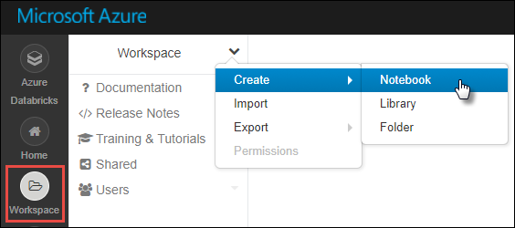
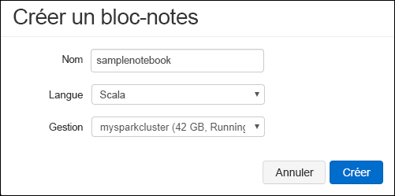

# <a name="tutorial-extract-transform-and-load-data-using-azure-databricks"></a>Tutoriel : Extraire, transformer et charger des données à l’aide d’Azure Databricks

Dans ce tutoriel, vous effectuez une opération ETL (extraction, transformation et chargement de données) pour déplacer des données d’Azure Data Lake Storage Gen2 Préversion vers Azure SQL Data Warehouse, à l’aide d’Azure Databricks.

L’illustration suivante montre le flux d’application :


Ce tutoriel décrit les tâches suivantes :

> [!div class="checklist"]
> * Créer un espace de travail Azure Databricks
> * Créer un cluster Spark dans Azure Databricks
> * Créer un compte compatible avec Azure Data Lake Storage Gen2
> * Charger des données dans Azure Data Lake Storage Gen2
> * Créer un notebook dans Azure Databricks
> * Extraire des données de Data Lake Storage Gen2
> * Transformer des données dans Azure Databricks
> * Chargement de données dans Azure SQL Data Warehouse

Si vous ne disposez pas d’abonnement Azure, créez un [compte gratuit](https://azure.microsoft.com/free/) avant de commencer.

## <a name="prerequisites"></a>Prérequis

Pour suivre ce tutoriel :

* Créez une instance Azure SQL Data Warehouse, créez une règle de pare-feu au niveau du serveur et connectez-vous au serveur en tant qu’administrateur du serveur. Suivez les instructions indiquées dans [Démarrage rapide : créer et interroger un entrepôt de données SQL Azure dans le portail Azure](../../sql-data-warehouse/create-data-warehouse-portal.md).
* Créez une clé principale de base de données pour Azure SQL Data Warehouse. Suivez les instructions indiquées dans [Créer une clé principale de base de données](https://docs.microsoft.com/sql/relational-databases/security/encryption/create-a-database-master-key).
* [Créer un compte Azure Data Lake Storage Gen2](quickstart-create-account.md)

## <a name="sign-in-to-the-azure-portal"></a>Se connecter au portail Azure

Connectez-vous au [Portail Azure](https://portal.azure.com/).

## <a name="create-an-azure-databricks-workspace"></a>Créer un espace de travail Azure Databricks

Dans cette section, vous créez un espace de travail Azure Databricks en utilisant le portail Azure. 

1. Dans le portail Azure, sélectionnez **Créer une ressource** >  **Analytique** > **Azure Databricks**.

    

2. Sous **Service Azure Databricks**, renseignez les valeurs pour créer un espace de travail Databricks.

    

    Renseignez les valeurs suivantes :

    |Propriété  |Description  |
    |---------|---------|
    |**Nom de l’espace de travail**     | Fournissez un nom pour votre espace de travail Databricks.        |
    |**Abonnement**     | Sélectionnez votre abonnement Azure dans la liste déroulante.        |
    |**Groupe de ressources**     | Indiquez si vous souhaitez créer un groupe de ressources Azure ou utiliser un groupe existant. Un groupe de ressources est un conteneur réunissant les ressources associées d’une solution Azure. Pour plus d’informations, consultez [Présentation des groupes de ressources Azure](../../azure-resource-manager/resource-group-overview.md). |
    |**Lieu**     | Sélectionnez **USA Ouest 2**. Pour les autres régions disponibles, consultez [Disponibilité des services Azure par région](https://azure.microsoft.com/regions/services/).        |
    |**Niveau tarifaire**     |  Choisissez entre **Standard** ou **Premium**. Pour plus d’informations sur ces niveaux, consultez la [page de tarification Databricks](https://azure.microsoft.com/pricing/details/databricks/).       |

    Sélectionnez **Épingler au tableau de bord**, puis sélectionnez **Créer**.

3. La création du compte prend quelques minutes. Lors de la création d’un compte, le portail affiche la vignette **Envoi du déploiement pour Azure Databricks** sur le côté droit. Vous devrez peut-être faire défiler votre tableau de bord vers la droite pour voir la vignette. Il existe également une barre de progression en haut de l’écran. Vous pouvez surveiller la progression de la zone souhaitée.

    

## <a name="create-a-spark-cluster-in-databricks"></a>Créer un cluster Spark dans Databricks

1. Dans le portail Azure, accédez à l’espace de travail Databricks que vous avez créé, puis sélectionnez **Initialiser l’espace de travail**.

2. Vous êtes redirigé vers le portail Azure Databricks. Dans le portail, sélectionnez **Cluster**.

    

3. Dans la page **Nouveau cluster**, renseignez les valeurs pour créer un cluster.

    

    Renseignez les champs suivants et acceptez les valeurs par défaut pour les autres champs :

    * Entrez un nom pour le cluster.
    * Pour cet article, créez un cluster avec le runtime **4.2**.
    * Veillez à cocher la case **Arrêter après ___ minutes d’inactivité**. Spécifiez une durée (en minutes) pour arrêter le cluster, si le cluster n’est pas utilisé.

    Sélectionnez **Créer un cluster**. Une fois que le cluster est en cours d’exécution, vous pouvez y attacher des notebooks et exécuter des travaux Spark.

## <a name="create-storage-account-file-system"></a>Créer un système de fichiers de compte de stockage

Dans cette section, vous créez un bloc-notes dans l’espace de travail Azure Databricks, puis exécutez les extraits de code pour configurer le compte de stockage.

1. Dans le [portail Azure](https://portal.azure.com), accédez à l’espace de travail Azure Databricks que vous avez créé, puis sélectionnez **Initialiser l’espace de travail**.

2. Dans le volet gauche, sélectionnez **Espace de travail**. Dans la liste déroulante **Espace de travail**, sélectionnez **Créer** > **Notebook**.

    

3. Dans la boîte de dialogue **Créer un bloc-notes**, entrez un nom pour le bloc-notes. Sélectionnez **Scala** comme langage, puis sélectionnez le cluster Spark que vous avez créé précédemment.

    

    Sélectionnez **Créer**.

4. Entrez le code suivant dans la première cellule et exécutez le code :

    ```scala
    spark.conf.set("fs.azure.account.key.<ACCOUNT_NAME>.dfs.core.windows.net", "<ACCOUNT_KEY>") 
    spark.conf.set("fs.azure.createRemoteFileSystemDuringInitialization", "true")
    dbutils.fs.ls("abfs://<FILE_SYSTEM_NAME>@<ACCOUNT_NAME>.dfs.core.windows.net/")
    spark.conf.set("fs.azure.createRemoteFileSystemDuringInitialization", "false") 
    ```

    Appuyez sur **Maj+Entrée** pour exécuter la cellule de code.

    Le système de fichiers est créé pour le compte de stockage.

## <a name="upload-data-to-the-storage-account"></a>Charger des données dans le compte de stockage

L’étape suivante consiste à charger un exemple de fichier de données dans le compte de stockage à transformer ultérieurement dans Azure Databricks. 

> [!NOTE]
> Si vous n’avez pas déjà un compte activé pour Azure Data Lake Storage Gen2, suivez le [guide de démarrage rapide pour en créer un](./quickstart-create-account.md).

1. Téléchargez (**small_radio_json.json**) à partir du dépôt [U-SQL Examples and Issue Tracking](https://github.com/Azure/usql/blob/master/Examples/Samples/Data/json/radiowebsite/small_radio_json.json) et prenez note du chemin où vous enregistrez le fichier.

2. Ensuite, vous chargez les exemples de données dans votre compte de stockage. La méthode que vous utilisez pour charger les données dans votre compte de stockage varie selon l’espace de noms hiérarchique est ou non activé.

    Si l’espace de noms hiérarchique est activé sur votre compte de stockage Azure créé pour le compte Gen2, vous pouvez utiliser Azure Data Factory, distp ou AzCopy (version 10) pour gérer le chargement. AzCopy version 10 est disponible uniquement pour les clients de la préversion. Pour utiliser AzCopy dans le code suivant dans une fenêtre de commande :

    ```bash
    set ACCOUNT_NAME=<ACCOUNT_NAME>
    set ACCOUNT_KEY=<ACCOUNT_KEY>
    azcopy cp "<DOWNLOAD_PATH>\small_radio_json.json" https://<ACCOUNT_NAME>.dfs.core.windows.net/data --recursive 
    ```
    
## <a name="extract-data-from-azure-storage"></a>Extraire des données de Stockage Azure

Retournez à votre Notebook DataBricks et entrez le code suivant dans une nouvelle cellule :

1. Ajoutez l’extrait de code suivant dans une cellule de code vide et remplacez les valeurs d’espace réservé par les valeurs que vous avez enregistrées précédemment du compte de stockage.

    ```scala
    dbutils.widgets.text("storage_account_name", "STORAGE_ACCOUNT_NAME", "<YOUR_STORAGE_ACCOUNT_NAME>")
    dbutils.widgets.text("storage_account_access_key", "YOUR_ACCESS_KEY", "<YOUR_STORAGE_ACCOUNT_SHARED_KEY>")
    ```

    Appuyez sur **Maj+Entrée** pour exécuter la cellule de code.

2. Vous pouvez maintenant charger l’exemple de fichier JSON en tant que trame de données dans Azure Databricks. Collez le code suivant dans une nouvelle cellule, puis appuyez sur **MAJ + ENTRÉE** (pour vous assurer de remplacer les valeurs d’espace réservé) :

    ```scala
    val df = spark.read.json("abfs://<FILE_SYSTEM_NAME>@<ACCOUNT_NAME>.dfs.core.windows.net/data/small_radio_json.json")
    ```

3. Exécutez le code suivant pour afficher le contenu de la trame de données.

    ```scala
    df.show()
    ```

    Le résultat ressemble à ce qui suit :

    ```bash
    +---------------------+---------+---------+------+-------------+----------+---------+-------+--------------------+------+--------+-------------+---------+--------------------+------+-------------+------+
    |               artist|     auth|firstName|gender|itemInSession|  lastName|   length|  level|            location|method|    page| registration|sessionId|                song|status|           ts|userId|
    +---------------------+---------+---------+------+-------------+----------+---------+-------+--------------------+------+--------+-------------+---------+--------------------+------+-------------+------+
    | El Arrebato         |Logged In| Annalyse|     F|            2|Montgomery|234.57914| free  |  Killeen-Temple, TX|   PUT|NextSong|1384448062332|     1879|Quiero Quererte Q...|   200|1409318650332|   309|
    | Creedence Clearwa...|Logged In|   Dylann|     M|            9|    Thomas|340.87138| paid  |       Anchorage, AK|   PUT|NextSong|1400723739332|       10|        Born To Move|   200|1409318653332|    11|
    | Gorillaz            |Logged In|     Liam|     M|           11|     Watts|246.17751| paid  |New York-Newark-J...|   PUT|NextSong|1406279422332|     2047|                DARE|   200|1409318685332|   201|
    ...
    ...
    ```

Vous avez extrait les données d’Azure Data Lake Storage Gen2 dans Azure Databricks.

## <a name="transform-data-in-azure-databricks"></a>Transformer des données dans Azure Databricks

Les exemples de données brutes **small_radio_json.json** capturent l’audience d’une station de radio et possèdent plusieurs colonnes. Dans cette section, vous transformez les données pour récupérer uniquement des colonnes spécifiques dans le jeu de données.

1. Commencez en récupérant uniquement les colonnes *firstName*, *lastName*, *gender*, *location* et *level* à partir de la trame de données que vous avez déjà créée.

    ```scala
    val specificColumnsDf = df.select("firstname", "lastname", "gender", "location", "level")
    ```

    Vous obtenez alors une sortie, comme montré dans l’extrait de code suivant :

    ```bash
    +---------+----------+------+--------------------+-----+
    |firstname|  lastname|gender|            location|level|
    +---------+----------+------+--------------------+-----+
    | Annalyse|Montgomery|     F|  Killeen-Temple, TX| free|
    |   Dylann|    Thomas|     M|       Anchorage, AK| paid|
    |     Liam|     Watts|     M|New York-Newark-J...| paid|
    |     Tess|  Townsend|     F|Nashville-Davidso...| free|
    |  Margaux|     Smith|     F|Atlanta-Sandy Spr...| free|
    |     Alan|     Morse|     M|Chicago-Napervill...| paid|
    |Gabriella|   Shelton|     F|San Jose-Sunnyval...| free|
    |   Elijah|  Williams|     M|Detroit-Warren-De...| paid|
    |  Margaux|     Smith|     F|Atlanta-Sandy Spr...| free|
    |     Tess|  Townsend|     F|Nashville-Davidso...| free|
    |     Alan|     Morse|     M|Chicago-Napervill...| paid|
    |     Liam|     Watts|     M|New York-Newark-J...| paid|
    |     Liam|     Watts|     M|New York-Newark-J...| paid|
    |   Dylann|    Thomas|     M|       Anchorage, AK| paid|
    |     Alan|     Morse|     M|Chicago-Napervill...| paid|
    |   Elijah|  Williams|     M|Detroit-Warren-De...| paid|
    |  Margaux|     Smith|     F|Atlanta-Sandy Spr...| free|
    |     Alan|     Morse|     M|Chicago-Napervill...| paid|
    |   Dylann|    Thomas|     M|       Anchorage, AK| paid|
    |  Margaux|     Smith|     F|Atlanta-Sandy Spr...| free|
    +---------+----------+------+--------------------+-----+
    ```

2.  Vous pouvez transformer ces données pour renommer la colonne **level** en **subscription_type**.

    ```scala
    val renamedColumnsDF = specificColumnsDf.withColumnRenamed("level", "subscription_type")
    renamedColumnsDF.show()
    ```

    Vous obtenez alors une sortie, comme montré dans l’extrait de code suivant.

    ```bash
    +---------+----------+------+--------------------+-----------------+
    |firstname|  lastname|gender|            location|subscription_type|
    +---------+----------+------+--------------------+-----------------+
    | Annalyse|Montgomery|     F|  Killeen-Temple, TX|             free|
    |   Dylann|    Thomas|     M|       Anchorage, AK|             paid|
    |     Liam|     Watts|     M|New York-Newark-J...|             paid|
    |     Tess|  Townsend|     F|Nashville-Davidso...|             free|
    |  Margaux|     Smith|     F|Atlanta-Sandy Spr...|             free|
    |     Alan|     Morse|     M|Chicago-Napervill...|             paid|
    |Gabriella|   Shelton|     F|San Jose-Sunnyval...|             free|
    |   Elijah|  Williams|     M|Detroit-Warren-De...|             paid|
    |  Margaux|     Smith|     F|Atlanta-Sandy Spr...|             free|
    |     Tess|  Townsend|     F|Nashville-Davidso...|             free|
    |     Alan|     Morse|     M|Chicago-Napervill...|             paid|
    |     Liam|     Watts|     M|New York-Newark-J...|             paid|
    |     Liam|     Watts|     M|New York-Newark-J...|             paid|
    |   Dylann|    Thomas|     M|       Anchorage, AK|             paid|
    |     Alan|     Morse|     M|Chicago-Napervill...|             paid|
    |   Elijah|  Williams|     M|Detroit-Warren-De...|             paid|
    |  Margaux|     Smith|     F|Atlanta-Sandy Spr...|             free|
    |     Alan|     Morse|     M|Chicago-Napervill...|             paid|
    |   Dylann|    Thomas|     M|       Anchorage, AK|             paid|
    |  Margaux|     Smith|     F|Atlanta-Sandy Spr...|             free|
    +---------+----------+------+--------------------+-----------------+
    ```

## <a name="load-data-into-azure-sql-data-warehouse"></a>Chargement de données dans Azure SQL Data Warehouse

Dans cette section, vous chargez les données transformées dans Azure SQL Data Warehouse. À l’aide du connecteur Azure SQL Data Warehouse pour Azure Databricks, vous pouvez charger directement une trame de données sous forme de table dans l’entrepôt de données SQL.

Comme mentionné précédemment, le connecteur d’entrepôt de données SQL utilise le Stockage Blob Azure comme stockage temporaire pour charger des données entre Azure Databricks et Azure SQL Data Warehouse. Vous commencez donc par fournir la configuration pour vous connecter au compte de stockage. Vous devez déjà avoir créé le compte dans le cadre de la configuration requise pour cet article.

1. Fournissez la configuration pour accéder au compte de Stockage Azure à partir d’Azure Databricks.

    ```scala
    val storageURI = "<STORAGE_ACCOUNT_NAME>.dfs.core.windows.net"
    val fileSystemName = "<FILE_SYSTEM_NAME>"
    val accessKey =  "<ACCESS_KEY>"
    ```

2. Spécifiez un dossier temporaire qui sera utilisé lors du déplacement des données entre Azure Databricks et Azure SQL Data Warehouse.

    ```scala
    val tempDir = "abfs://" + fileSystemName + "@" + storageURI +"/tempDirs"
    ```

3. Exécutez l’extrait de code suivant pour stocker les clés d’accès du Stockage Blob Azure dans la configuration. Cela garantit que vous n’avez pas à conserver la clé d’accès dans le bloc-notes en texte brut.

    ```scala
    val acntInfo = "fs.azure.account.key."+ storageURI
    sc.hadoopConfiguration.set(acntInfo, accessKey)
    ```

4. Indiquez les valeurs pour vous connecter à l’instance Azure SQL Data Warehouse. Vous devez avoir créé un entrepôt de données SQL dans le cadre de la configuration requise.

    ```scala
    //SQL Data Warehouse related settings
    val dwDatabase = "<DATABASE NAME>"
    val dwServer = "<DATABASE SERVER NAME>" 
    val dwUser = "<USER NAME>"
    val dwPass = "<PASSWORD>"
    val dwJdbcPort =  "1433"
    val dwJdbcExtraOptions = "encrypt=true;trustServerCertificate=true;hostNameInCertificate=*.database.windows.net;loginTimeout=30;"
    val sqlDwUrl = "jdbc:sqlserver://" + dwServer + ".database.windows.net:" + dwJdbcPort + ";database=" + dwDatabase + ";user=" + dwUser+";password=" + dwPass + ";$dwJdbcExtraOptions"
    val sqlDwUrlSmall = "jdbc:sqlserver://" + dwServer + ".database.windows.net:" + dwJdbcPort + ";database=" + dwDatabase + ";user=" + dwUser+";password=" + dwPass
    ```

5. Exécutez l’extrait de code suivant pour charger la trame de données transformée, **renamedColumnsDF**, en tant que table dans l’entrepôt de données SQL. Cet extrait de code crée une table appelée **SampleTable** dans la base de données SQL.

    ```scala
    spark.conf.set(
        "spark.sql.parquet.writeLegacyFormat",
        "true")
    
    renamedColumnsDF.write
        .format("com.databricks.spark.sqldw")
        .option("url", sqlDwUrlSmall) 
        .option("dbtable", "SampleTable")
        .option( "forward_spark_azure_storage_credentials","True")
        .option("tempdir", tempDir)
        .mode("overwrite")
        .save()
    ```

6. Connectez-vous à la base de données SQL et vérifiez que vous y voyez une table **SampleTable**.

    

7. Exécutez une requête SELECT pour vérifier le contenu de la table. Elle doit avoir les mêmes données que celles présentes dans la trame de données **renamedColumnsDF**.

    

## <a name="clean-up-resources"></a>Supprimer des ressources

Une fois le tutoriel terminé, vous pouvez arrêter le cluster. Pour cela, dans l’espace de travail Azure Databricks, dans le volet gauche, sélectionnez **Clusters**. Pour le cluster que vous voulez arrêter, déplacez le curseur sur les points de suspension dans la colonne **Actions**, puis sélectionnez l’icône **Arrêter**.


Si vous n’arrêtez pas le cluster manuellement, il s’arrêtera automatiquement, à condition d’avoir coché **Arrêter après __ minutes d’inactivité** lors de la création du cluster. Dans ce cas, le cluster s’arrête automatiquement s’il a été inactif pendant la période renseignée.

## <a name="next-steps"></a>Étapes suivantes

Dans ce tutoriel, vous avez appris à :

> [!div class="checklist"]
> * Créer un espace de travail Azure Databricks
> * Créer un cluster Spark dans Azure Databricks
> * Créer un compte compatible avec Azure Data Lake Storage Gen2
> * Charger des données dans Azure Data Lake Storage Gen2
> * Créer un notebook dans Azure Databricks
> * Extraire des données de Data Lake Storage Gen2
> * Transformer des données dans Azure Databricks
> * Chargement de données dans Azure SQL Data Warehouse

Passez au tutoriel suivant pour en savoir plus sur la diffusion en continu des données en temps réel dans Azure Databricks à l’aide d’Azure Event Hubs.

> [!div class="nextstepaction"]
>[Diffuser en continu des données dans Azure Databricks à l’aide d’Event Hubs](../../azure-databricks/databricks-stream-from-eventhubs.md)
