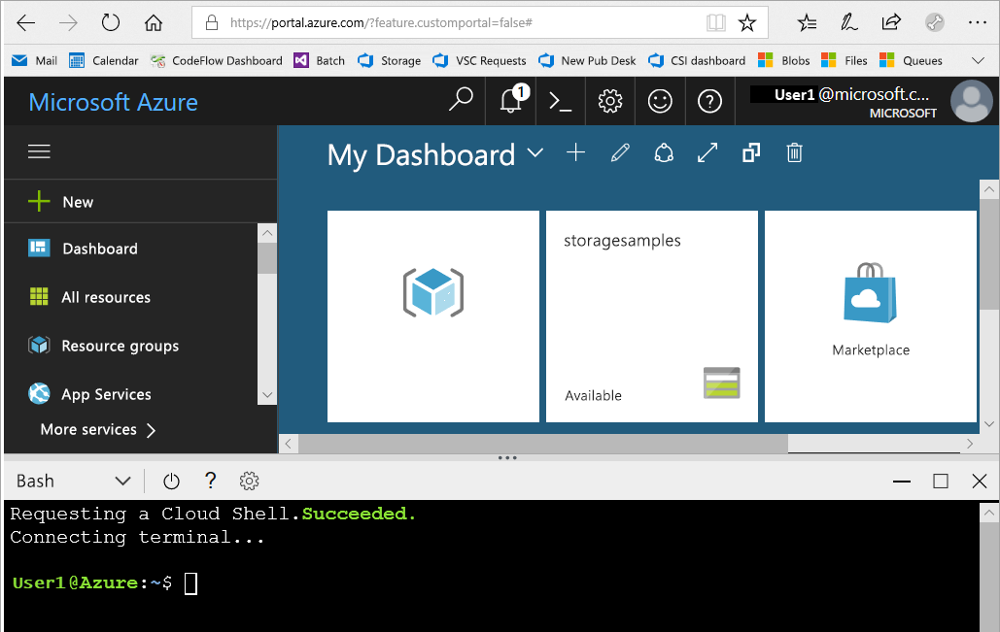
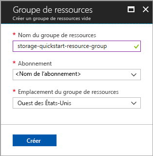

# <a name="quickstart-create-an-azure-data-lake-storage-gen2-preview-storage-account"></a>Démarrage rapide : créer un compte de stockage Azure Data Lake Storage Gen2 (Préversion)

Les comptes Azure Data Lake Storage Gen2 (Préversion) [prennent en charge un service d’espace de noms hiérarchique](introduction.md) qui fournit un système de fichiers sur la base de répertoire conçu spécifiquement pour fonctionner avec le système de fichiers DFS hadoop (HDFS). L’accès aux données Data Lake Storage Gen2 à partir du HDFS est disponible via le [pilote ABFS](abfs-driver.md).

Pour activer les fonctionnalités de Data Lake Storage Gen2 sur votre compte de stockage, [remplissez le sondage de la préversion pour demander l’accès](https://aka.ms/adlsgen2signup). Une fois validé, vous pouvez créer un nouveau compte Data Lake Storage Gen2. Ce démarrage rapide montre comment créer un compte en utilisant le [Portail Azure](https://portal.azure.com/), [Azure PowerShell](https://docs.microsoft.com/powershell/azure/overview), ou [Azure CLI](https://docs.microsoft.com/cli/azure?view=azure-cli-latest).

> [!NOTE]
> L’interface utilisateur de création de compte dans le portail Azure est mise à jour une fois que votre demande de création de compte Data Lake Storage Gen2 a été validée. De la même façon, les arguments de PowerShell et l’interface CLI liés à Data Lake Storage Gen2 fonctionnent uniquement une fois que votre demande de version préliminaire est validée.

## <a name="prerequisites"></a>Prérequis

Si vous n’avez pas d’abonnement Azure, créez un [compte gratuit](https://azure.microsoft.com/free/) avant de commencer.

|           | Configuration requise |
|-----------|--------------|
|Portail     | Aucun         |
|PowerShell | Ce démarrage rapide requiert le module Azure PowerShell version **5.0.4-preview** ou ultérieure. Exécutez `Get-Module -ListAvailable AzureRM` pour rechercher votre version actuelle. Si vous devez installer ou mettre à niveau, consultez [Installer le module Azure PowerShell](/powershell/azure/install-azurerm-ps). |
|Interface de ligne de commande        | Vous pouvez vous connecter à Azure et exécuter des commandes Azure CLI de l’une des deux façons : <ul><li>Vous pouvez exécuter des commandes CLI à partir du portail Azure, dans Azure Cloud Shell. </li><li>Vous pouvez installer la CLI et exécuter des commandes CLI localement.</li></ul>|

Lorsque vous travaillez sur la ligne de commande, vous avez la possibilité d’exécuter l’interpréteur de commandes Azure Cloud ou d’installer l’interface CLI localement.

### <a name="use-azure-cloud-shell"></a>Utiliser Azure Cloud Shell

Azure Cloud Shell est un interpréteur de commandes Bash gratuit, que vous pouvez exécuter directement dans le portail Azure. L’interface Azure CLI est préinstallée et configurée pour être utilisée avec votre compte. Cliquez sur le bouton **Cloud Shell** du menu situé dans l’angle supérieur droit de la fenêtre du portail Azure :

[](https://portal.azure.com)

Ce bouton lance un interpréteur de commandes interactif que vous pouvez utiliser pour exécuter les étapes de ce démarrage rapide :

[](https://portal.azure.com)

### <a name="install-the-cli-locally"></a>Installer la CLI localement

Vous pouvez également installer et utiliser Azure CLI localement. Ce guide de démarrage rapide vous demande d’exécuter Azure CLI version 2.0.38 ou ultérieur. Exécutez `az --version` pour trouver la version. Si vous devez installer ou mettre à niveau, consultez [Installation d’Azure CLI 2.0](/cli/azure/install-azure-cli).

## <a name="overview-of-creating-an-azure-data-lake-storage-gen2-account"></a>Aperçu de création d’un compte Azure Data Lake Storage Gen2

Avant de créer un compte, vous devez tout d’abord créer un groupe de ressources qui agit comme conteneur logique pour les comptes de stockage ou les autres ressources Azure que vous créez. Si vous souhaitez supprimer les ressources créées par ce démarrage rapide, vous pouvez simplement supprimer le groupe de ressources. La suppression du groupe de ressources efface également le compte de stockage associé et d’autres ressources liées au groupe de ressources. Pour plus d’informations sur les groupes de ressources Azure, consultez l’article [Présentation d’Azure Resource Manager](../../azure-resource-manager/resource-group-overview.md).

> [!NOTE]
> Vous devez créer de nouveaux comptes de stockage en tant que type **StorageV2 (usage général V2)** pour tirer parti des fonctionnalités de Data Lake Storage Gen2.  

Pour plus d’informations sur les types de compte de stockage, consultez l’article [Options de compte de stockage Azure](../common/storage-account-options.md).

Gardez les règles suivantes à l’esprit lorsque vous nommez votre compte de stockage :

- Les noms des comptes de stockage doivent comporter entre 3 et 24 caractères, uniquement des lettres minuscules et des chiffres.
- Le nom de votre compte de stockage doit être unique dans Azure. Deux comptes de stockage ne peuvent avoir le même nom.

## <a name="create-an-account-using-the-azure-portal"></a>Créer un compte avec le portail Azure

Connectez-vous au [portail Azure](https://portal.azure.com).

### <a name="create-a-resource-group"></a>Créer un groupe de ressources

Pour créer un groupe de ressources dans le portail Azure, procédez comme suit :

1. Sur le portail Azure, développez le menu de gauche pour ouvrir le menu des services, et sélectionnez **Groupes de ressources**.
2. Cliquez sur le bouton **Ajouter** pour ajouter un nouveau groupe de ressources.
3. Entrez un nom pour le nouveau groupe de ressources.
4. Sélectionnez l’abonnement dans lequel vous créez le nouveau groupe de ressources.
5. Choisissez l’emplacement du groupe de ressources.
6. Cliquez sur le bouton **Créer**.  



### <a name="create-a-general-purpose-v2-storage-account"></a>Créer un compte de stockage à usage général v2

Pour créer un compte de stockage à usage général v2 dans le portail Azure, procédez comme suit :

> [!NOTE]
> L’espace de noms hiérarchique est uniquement activé dans les zones suivantes : Est des États-Unis, Est des États-Unis 2, Ouest des États-Unis, Ouest des États-Unis 2, Ouest-centre des États-Unis, Europe du Nord, Europe de l’ouest, Asie du Sud-est et Est de l’Australie. Assurez-vous de spécifier l’un de ces emplacements lors de la création du compte de stockage.

1. Sur le portail Azure, développez le menu de gauche pour ouvrir le menu des services, et sélectionnez **Tous les services**. Faites défiler jusqu’à **Stockage**, puis sélectionnez **Comptes de stockage**. Sur la fenêtre **Comptes de stockage**, sélectionnez **Ajouter**.
2. Entrez un nom pour votre compte de stockage.
3. Laissez le **modèle de déploiement** paramétré à la valeur par défaut.
4. Définissez le champ **Type de compte** sur **StorageV2 (usage général v2)**.
5. Définissez l’**emplacement** à **USA Ouest 2**
6. Laissez le champ **Réplication** défini sur **Stockage localement redondant (LRS)**.
7. Laissez ces champs à leurs valeurs par défaut : **Réplication**. **Performances**, **Niveau d’accès**.
8. Choisissez l’abonnement dans lequel vous souhaitez créer le compte de stockage.
9. Dans la section **Groupe de ressources**, sélectionnez **Use existing** (Utiliser l’existant), puis choisissez le groupe de ressources que vous avez créé dans la section précédente.
10. Conservez la valeur par défaut pour les **réseaux virtuels**
11. Dans la section **Data Lake Storage Gen2 (version préliminaire)** définissez l’**espace de noms hiérarchique** sur **Activé**.
12. Cliquez sur **Créer** pour créer le compte de stockage.


Votre compte de stockage est maintenant créé via le portail.

### <a name="clean-up-resources"></a>Supprimer des ressources

Pour supprimer un groupe de ressources dans le portail Azure :

1. Sur le portail Azure, développez le menu de gauche pour ouvrir le menu des services, et sélectionnez **Groupes de ressources** pour afficher la liste de vos groupes de ressources.
2. Recherchez le groupe de ressources à supprimer, puis faites un clic droit sur le bouton **Plus** (**...**) se trouvant à droite de la liste.
3. Sélectionnez **Supprimer le groupe de ressources** et confirmez.

## <a name="create-an-account-using-powershell"></a>Créer un compte à l’aide de PowerShell

Connectez-vous à votre abonnement Azure avec la commande `Login-AzureRmAccount` et suivez les instructions à l’écran pour l’authentification.

```powershell
Login-AzureRmAccount
```

### <a name="upgrade-your-powershell-module"></a>Mettre à niveau votre module powershell

Pour interagir avec Data Lake Storage Gen2 via PowerShell, vous devez mettre à niveau votre module avec la préversion.

Pour ce faire, ouvrez PowerShell avec des privilèges élevés et entrez la commande suivante : `Install-Module AzureRM.Storage –Repository PSGallery -RequiredVersion 5.0.4-preview –AllowPrerelease –AllowClobber –Force `

Ensuite, redémarrez votre interpréteur de commandes.

### <a name="create-a-resource-group"></a>Créer un groupe de ressources

Pour créer un groupe de ressources avec PowerShell, utilisez la commande [New-AzureRmResourceGroup](/powershell/module/azurerm.resources/new-azurermresourcegroup) : 

> [!NOTE]
> L’espace de noms hiérarchique est uniquement activé dans les zones suivantes : Est des États-Unis, Est des États-Unis 2, Ouest des États-Unis, Ouest des États-Unis 2, Ouest-centre des États-Unis, Europe du Nord, Europe de l’ouest, Asie du Sud-est et Est de l’Australie. Assurez-vous de spécifier l’un de ces emplacements lors de la création du compte de stockage.

```powershell
# put resource group in a variable so you can use the same group name going forward,
# without hardcoding it repeatedly
$resourceGroup = "storage-quickstart-resource-group"
$location = "westus2"
New-AzureRmResourceGroup -Name $resourceGroup -Location $location
```

### <a name="create-a-general-purpose-v2-storage-account"></a>Créer un compte de stockage à usage général v2

Pour créer un compte de stockage à usage général v2 à partir de PowerShell avec l’option Stockage localement redondant (LRS), utilisez la commande [New-AzureRmStorageAccount](/powershell/module/azurerm.storage/New-AzureRmStorageAccount) :

```powershell
Get-AzureRmLocation | select Location 
$location = "westus2"

New-AzureRmStorageAccount -ResourceGroupName $resourceGroup `
  -Name "storagequickstart" `
  -Location $location `
  -SkuName Standard_LRS `
  -Kind StorageV2 
  -EnableHierarchicalNamespace $True
```

### <a name="clean-up-resources"></a>Supprimer des ressources

Pour supprimer le groupe de ressources et les ressources associées, y compris le nouveau compte de stockage, utilisez la commande [Remove-AzureRmResourceGroup](/powershell/module/azurerm.resources/remove-azurermresourcegroup) : 

```powershell
Remove-AzureRmResourceGroup -Name $resourceGroup
```

## <a name="create-an-account-using-azure-cli"></a>Créer un compte à l’aide d’Azure CLI

Pour lancer Azure Cloud Shell, connectez-vous au [portail Azure](https://portal.azure.com).

Pour vous connecter à votre installation locale de la CLI, exécutez la commande de connexion :

```cli
az login
```

### <a name="upgrade-your-cli-module"></a>Mettre à niveau votre module CLI

Pour interagir avec Data Lake Storage Gen2 via CLI, vous devez ajouter l’extension à votre interpréteur de commandes.

Pour effectuer cette opération, entrez la commande ci-après à l’aide de Cloud Shell ou d’un interpréteur de commandes local : `az extension add --name storage-preview`

### <a name="create-a-resource-group"></a>Créer un groupe de ressources

Pour créer un groupe de ressources avec Azure CLI, utilisez la commande [az group create](/cli/azure/group#az_group_create).

```azurecli-interactive
az group create \
    --name storage-quickstart-resource-group \
    --location westus2
```

> [!NOTE]
> L’espace de noms hiérarchique est uniquement activé dans les zones suivantes : Est des États-Unis, Est des États-Unis 2, Ouest des États-Unis, Ouest des États-Unis 2, Ouest-centre des États-Unis, Europe du Nord, Europe de l’ouest, Asie du Sud-est et Est de l’Australie. Assurez-vous de spécifier l’un de ces emplacements lors de la création du compte de stockage.

### <a name="create-a-general-purpose-v2-storage-account"></a>Créer un compte de stockage à usage général v2

Pour créer un compte de stockage à usage général v2 à partir d’Azure CLI avec l’option Stockage localement redondant, utilisez la commande [az storage account create](/cli/azure/storage/account#az_storage_account_create).

```azurecli-interactive
az storage account create \
    --name storagequickstart \
    --resource-group storage-quickstart-resource-group \
    --location westus2 \
    --sku Standard_LRS \
    --kind StorageV2 \
    --hierarchical-namespace true
```

### <a name="clean-up-resources"></a>Supprimer des ressources

Pour supprimer le groupe de ressources et les ressources associées, y compris le nouveau compte de stockage, utilisez la commande [az group delete](/cli/azure/group#az_group_delete).

```azurecli-interactive
az group delete --name myResourceGroup
```

## <a name="next-steps"></a>Étapes suivantes

Dans ce guide de démarrage rapide, vous avez créé un compte de stockage Data Lake Storage Gen2. Pour savoir comment charger et télécharger des objets blob vers/à partir de votre compte de stockage, passez au guide de démarrage rapide du stockage Blob.

* [Déplacer des données vers et depuis Stockage Blob Azure à l’aide d’AzCopy](https://docs.microsoft.com/en-us/azure/machine-learning/team-data-science-process/move-data-to-azure-blob-using-azcopy)