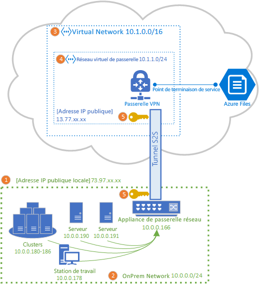
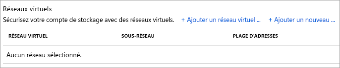

# Configurer un VPN site à site pour une utilisation avec Azure Files
Vous pouvez utiliser une connexion VPN site à site (S2S) pour monter vos partages de fichiers Azure sur SMB à partir de votre réseau local sans ouvrir le port 445. Vous pouvez configurer un VPN site à site à l’aide d’une [Passerelle VPN Azure](../../vpn-gateway/vpn-gateway-about-vpngateways.md) qui est une ressource Azure offrant des services VPN, déployée dans un groupe de ressources, à côté de comptes de stockage ou d’autres ressources Azure.

Avant de poursuivre cet article, nous vous recommandons vivement de lire l’article [Vue d’ensemble de la mise en réseau Azure Files](storage-files-networking-overview.md), qui fournit une présentation complète des options de mise en réseau disponibles pour Azure Files.

L’article décrit en détail la procédure à suivre pour configurer un VPN site à site sous Linux afin de monter des partages de fichiers Azure localement. Si vous souhaitez acheminer le trafic pour Azure File Sync via un VPN site à site, voir [Paramètres de proxy et de pare-feu d’Azure File Sync](../file-sync/file-sync-firewall-and-proxy.md).

## Prérequis
- Un partage de fichiers Azure que vous voulez monter localement. Les partages de fichiers Azure sont déployés sur des comptes de stockage. Ces comptes sont des constructions de gestion représentant un pool de stockage partagé dans lequel vous pouvez déployer plusieurs partages de fichiers, ainsi que d’autres ressources de stockage, telles que des conteneurs d’objets blob ou des files d’attente. Pour plus d’informations sur le déploiement des partages de fichiers et des comptes de stockage Azure, consultez [Créer un partage de fichiers Azure](storage-how-to-create-file-share.md).

- Un point de terminaison privé pour le compte de stockage sur lequel se trouve le partage de fichiers Azure que vous souhaitez monter localement. Pour plus d’informations sur la création d’un point de terminaison privé, consultez [Configuration des points de terminaison réseau Azure Files](storage-files-networking-endpoints.md?tabs=azure-portal). 

- Une appliance réseau ou un serveur dans votre centre de centres local qui est compatible avec la passerelle VPN Azure. Azure Files est indépendant de l’appliance de réseau local choisie, mais la passerelle VPN Azure gère une [liste d’appareils testés](../../vpn-gateway/vpn-gateway-about-vpn-devices.md). Les diverses appliances réseau offrant différentes fonctionnalités, caractéristiques de performances et fonctionnalités de gestion, vous devez tenir compte de celles-ci lors de la sélection d’une appliance réseau.

    Si vous n’avez pas d’appliance réseau, Windows Server contient un rôle serveur intégré, Routage et accès à distance (RRAS, Routing and Remote Access), utilisable comme appliance de réseau local. Pour en savoir plus sur la configuration du rôle Routage et accès à distance dans Windows Server, voir [Passerelle du serveur d’accès à distance](/windows-server/remote/remote-access/ras-gateway/ras-gateway).

## Ajouter un compte de stockage à VNet
Dans le Portail Azure, accédez au compte de stockage contenant le partage de fichiers Azure que vous souhaitez monter localement. Dans la table des matières pour le compte de stockage, sélectionnez l’entrée **Pare-feux et réseaux virtuels**. Si vous n’avez pas ajouté de réseau virtuel à votre compte de stockage lors de sa création, la case d’option **Autoriser l’accès depuis** doit être activée pour **Tous les réseaux** dans le volet qui s’affiche.

Pour ajouter votre compte de stockage au réseau virtuel souhaité, sélectionnez **Réseaux sélectionnés**. Sous le sous-titre **Réseaux virtuels**, cliquez sur **+ Ajouter un réseau virtuel existant** ou **+ Ajouter un nouveau réseau virtuel** en fonction de l’état souhaité. La création d’un réseau virtuel entraîne la création d’une nouvelle ressource Azure. La ressource de réseau virtuel nouvelle ou existante ne doit pas nécessairement être dans le même groupe de ressources ou abonnement que le compte de stockage. En revanche, elle doit se trouver dans la même région que le compte de stockage, et le groupe de ressources et l’abonnement dans lesquels vous déployez votre réseau virtuel doivent correspondre à ceux dans lesquels vous allez déployer votre passerelle VPN. 

Si vous ajoutez un réseau virtuel existant, vous êtes invité à sélectionner un ou plusieurs sous-réseaux de ce réseau virtuel auxquels le compte de stockage doit être ajouté. Si vous sélectionnez un nouveau réseau virtuel, vous allez créer un sous-réseau dans le cadre de la création du réseau virtuel, et vous pourrez en ajouter plus tard via la ressource Azure obtenue pour celui-ci.

Si vous n’avez pas ajouté de compte de stockage à votre abonnement, le point de terminaison de service Microsoft.Storage doit être ajouté au réseau virtuel. Cela peut prendre un certain temps et, tant que cette opération n’est pas terminée, vous ne pouvez pas accéder aux partages de fichiers Azure dans ce compte de stockage, même via la connexion VPN. 

## Déployer une passerelle VPN Azure
Dans la table des matières du portail Azure, sélectionnez **Créer une ressource**, puis recherchez *Passerelle de réseau virtuel*. Votre passerelle de réseau virtuel doit se trouver dans les mêmes abonnement, région Azure et groupe de ressources que le réseau virtuel que vous avez déployé à l’étape précédente (notez que groupe de ressources est sélectionné automatiquement lors du choix du réseau virtuel). 

Pour déployer une passerelle VPN Azure, vous devez renseigner les champs suivants :

- **Nom** : le nom de la ressource Azure pour la passerelle VPN. Vous pouvez choisir n’importe quel nom que vous jugez utile pour votre gestion.
- **Région** : la région dans laquelle la passerelle VPN sera déployée.
- **Type de passerelle** : dans le but de déployer un VPN site à site, vous devez sélectionner **VPN**.
- **Type de VPN** : selon votre périphérique VPN, vous avez le choix entre *Basé sur itinéraires** ou **Basé sur des stratégie** s. Les VPN basés sur itinéraires prennent en charge IKEv2, tandis que les VPN basés sur des stratégies prennent en charge uniquement IKEv1. Pour en savoir plus sur les deux types de passerelles VPN, voir [À propos des passerelles VPN basées sur le routage et les stratégies](../../vpn-gateway/vpn-gateway-connect-multiple-policybased-rm-ps.md#about)
- **SKU** : la référence SKU contrôle le nombre de tunnels de site à site autorisés et les performances souhaitées du VPN. Pour sélectionner la référence (SKU) appropriée dans votre cas d’utilisation, consultez la liste des [références SKU de passerelle](../../vpn-gateway/vpn-gateway-about-vpngateways.md#gwsku). La référence SKU de la passerelle VPN peut être modifiée ultérieurement si nécessaire.
- **Réseau virtuel** : le réseau virtuel créé à l’étape précédente.
- **Adresse IP publique** : l’adresse IP de la passerelle VPN qui sera exposée à Internet. Il est probable que vous deviez créer une adresse IP, mais vous pouvez également utiliser une adresse IP inutilisée existante si cela est approprié. Si vous sélectionnez **Créer nouveau**, une nouvelle ressource Azure d’adresse IP est créée dans le même groupe de ressources que la passerelle VPN, et le **nom de l’adresse IP publique** est celui de l’adresse IP nouvellement créée. Si vous sélectionnez **Utiliser l’existante**, vous devez sélectionner l’adresse IP inutilisée existante.
- **Activer le mode active-active** : ne sélectionnez **Activé** que si vous créez une configuration de passerelle active/active. Autrement, conservez la sélection **Désactivée** cochée. Pour en savoir plus sur le mode actif/actif, voir [Configuration haute disponibilité pour la connectivité entre les réseaux locaux et la connectivité entre deux réseaux virtuels](../../vpn-gateway/vpn-gateway-highlyavailable.md).
- **Configurer l’ASN BGP** : ne sélectionnez **Activé** que si votre configuration requiert spécifiquement ce paramètre. Pour en savoir plus sur ce paramètre, voir [À propos du protocole BGP avec la passerelle VPN Azure](../../vpn-gateway/vpn-gateway-bgp-overview.md).

Sélectionnez **Vérifier + créer** pour créer la passerelle VPN. La création et le déploiement complets d’une passerelle VPN peuvent prendre jusqu’à 45 minutes.

### Créer une passerelle de réseau local pour votre passerelle locale 
Une passerelle de réseau local est une ressource Azure représentant votre appliance de réseau local. Dans la table des matières du portail Azure, sélectionnez **Créer une ressource**, puis recherchez une *passerelle de réseau local*. La passerelle de réseau local est une ressource Azure qui sera déployée en même temps que vos compte de stockage, réseau virtuel et passerelle VPN, mais n’a pas besoin d’être dans les mêmes groupe de ressources ou abonnement que le compte de stockage. 

Pour le déploiement de la ressource de passerelle de réseau local, vous devez renseigner les champs suivants :

- **Nom** : le nom de la ressource Azure pour la passerelle du réseau local. Vous pouvez choisir n’importe quel nom que vous jugez utile pour votre gestion.
- **Adresse IP** : l’adresse IP publique de votre passerelle locale.
- **Espace d’adresse** : plages d’adresses du réseau que cette passerelle de réseau local représente. Vous pouvez ajouter plusieurs plages d’espace d’adressage, mais vous devez vous assurer que les plages que vous spécifiez ici ne se chevauchent pas avec des plages ou autres réseaux auxquels vous souhaitez vous connecter. 
- **Configurer des paramètres BGP** : ne configurez les paramètres BGP que si votre configuration en a besoin. Pour en savoir plus sur ce paramètre, voir [À propos du protocole BGP avec la passerelle VPN Azure](../../vpn-gateway/vpn-gateway-bgp-overview.md).
- **Abonnement** : abonnement souhaité. Ce ne doit pas nécessairement être l’abonnement utilisé pour la passerelle VPN ou le compte de stockage.
- **Groupe de ressources** : groupe de ressources souhaité. Ce ne doit pas nécessairement être le groupe de ressources utilisé pour la passerelle VPN ou le compte de stockage.
- **Emplacement** : région Azure dans laquelle la ressource de passerelle de réseau local doit être créée. Ce doit être la région que vous avez sélectionnée pour la passerelle VPN et le compte de stockage.

Sélectionnez **Créer** pour créer la ressource de passerelle de réseau local.  

## Configurer une appliance de réseau local
Les étapes spécifiques pour configurer votre appliance de réseau local varient en fonction de l’appliance réseau que votre organisation a sélectionnée. Selon l’appareil choisi par votre organisation, la [liste des appareils testés](../../vpn-gateway/vpn-gateway-about-vpn-devices.md) peut comporter un lien vers des instructions du fournisseur de votre périphérique pour la configuration de celui-ci avec une passerelle VPN Azure.

## Créer la connexion de site à site
Pour terminer le déploiement d’un VPN S2S, vous devez créer une connexion entre votre appliance de réseau local (représentée par la ressource de passerelle de réseau local) et la passerelle VPN. Pour ce faire, accédez à la passerelle VPN que vous avez créée ci-dessus. Dans la table des matières de la passerelle VPN, sélectionnez **Connexions**, puis cliquez sur **Ajouter**. Dans le volet **Ajouter une connexion** qui s’affiche, vous devez renseigner les champs suivants :

- **Nom** : nom de la connexion. Une passerelle VPN pouvant héberger plusieurs connexions, choisissez un nom utile pour votre gestion, qui distingue cette connexion particulière.
- **Type de connexion** : étant donné qu’il s’agit d’une connexion S2S, sélectionnez **Site à site (IPsec)** dans la liste déroulante.
- **Passerelle réseau virtuel** : ce champ est sélectionné automatiquement pour la passerelle VPN à laquelle vous établissez la connexion et ne peut pas être modifié.
- **Passerelle réseau local** : il s’agit de la passerelle réseau local que vous souhaitez connecter à votre passerelle VPN. Le volet de sélection qui s’affiche devrait avoir le nom de la passerelle de réseau local que vous avez créée ci-dessus.
- **Clé partagée** : combinaison de lettres et de chiffres utilisée pour établir le chiffrement de la connexion. La même clé partagée doit être utilisée à la fois dans le réseau virtuel et les passerelles de réseau local. Si votre périphérique de passerelle n’en fournit pas, vous pouvez en créer un ici et le fournir à votre périphérique.

Sélectionnez **OK** pour établir la connexion. Vous pouvez vérifier que la connexion a été correctement établie via la page **Connexions**.

## Monter le partage de fichiers Azure 
La dernière étape de la configuration d’un VPN S2S consiste à vérifier qu’elle fonctionne pour Azure Files. Pour ce faire, vous pouvez monter votre partage de fichiers Azure en local avec votre système d’exploitation préféré. Consultez les instructions de montage correspondant au système d’exploitation ici :

- [Windows](storage-how-to-use-files-windows.md)
- [macOS](storage-how-to-use-files-mac.md)
- [Linux](storage-how-to-use-files-linux.md)

## Voir aussi
- [Vue d’ensemble de la mise en réseau Azure Files](storage-files-networking-overview.md)
- [Configurer un VPN point à site (P2S) sous Windows pour une utilisation avec Azure Files](storage-files-configure-p2s-vpn-windows.md)
- [Configurer un VPN point à site (P2S) sous Linux pour une utilisation avec Azure Files](storage-files-configure-p2s-vpn-linux.md)