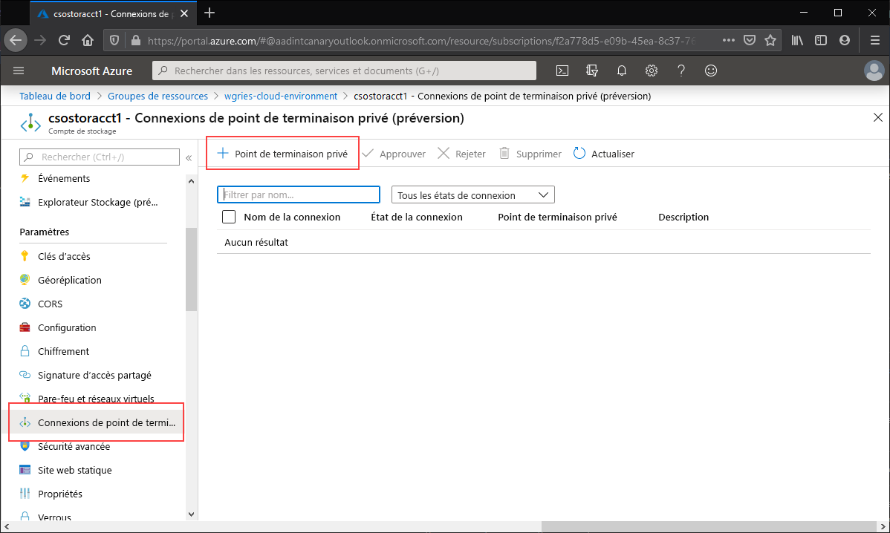
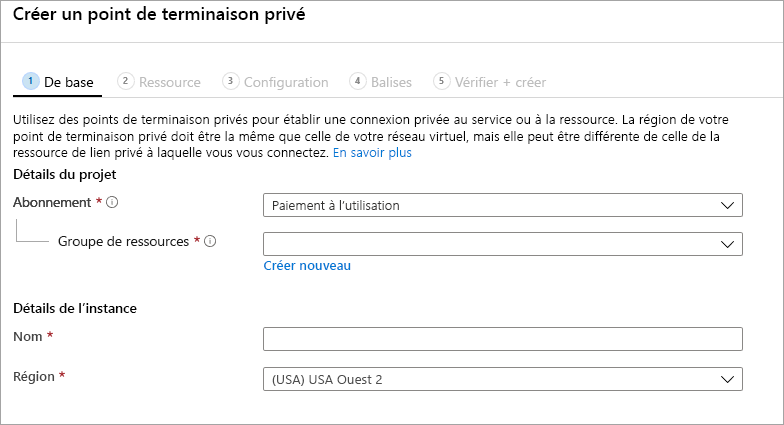
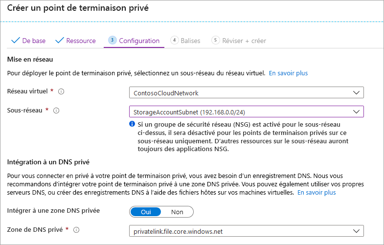
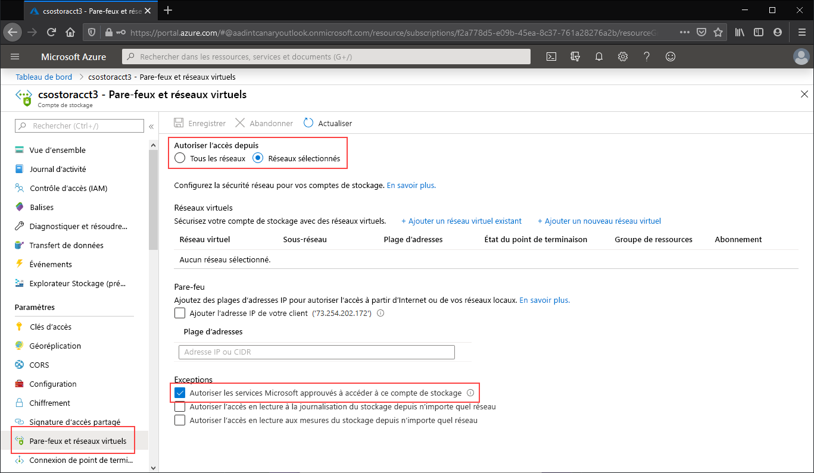
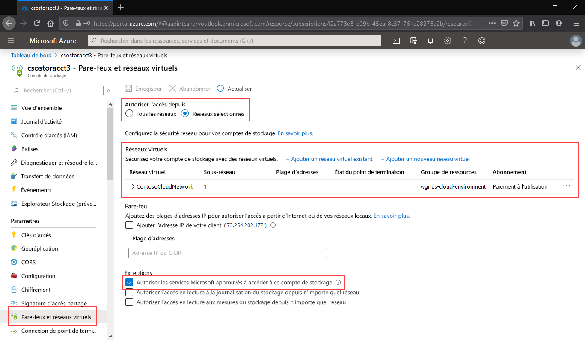

# <a name="configuring-azure-files-network-endpoints"></a>Configuration des points de terminaison réseau Azure Files
Azure Files fournit deux principaux types de points de terminaison pour accéder aux partages de fichiers Azure : 
- Les points de terminaison publics, qui ont une adresse IP publique et sont accessibles partout dans le monde.
- Les points de terminaison privés, qui existent au sein d’un réseau virtuel et ont une adresse IP privée comprise dans l’espace d’adressage de ce réseau virtuel.

Le compte de stockage Azure comprend à la fois des points de terminaison publics et des points de terminaison privés. Un compte de stockage est une construction de gestion qui représente un pool de stockage partagé dans lequel vous pouvez déployer plusieurs partages de fichiers, ainsi que d’autres ressources de stockage, telles que des conteneurs d’objets blob ou des files d’attente.

Cet article se concentre sur la configuration des points de terminaison d’un compte de stockage pour accéder directement au partage de fichiers Azure. La plupart des détails fournis dans ce document s’appliquent également à la façon dont Azure File Sync interagit avec les points de terminaison publics et privés du compte de stockage. Toutefois, pour plus d’informations sur la configuration des réseaux dans le cadre d’un déploiement Azure File Sync, consultez [Configuration des paramètres de proxy et de pare-feu d’Azure File Sync](storage-sync-files-firewall-and-proxy.md).

Avant de lire le présent guide, nous vous recommandons de lire [Considérations relatives aux réseaux Azure Files](storage-files-networking-overview.md).

## <a name="prerequisites"></a>Prérequis
- Cet article suppose que vous avez déjà créé un abonnement Azure. Si vous n’avez pas d’abonnement, vous pouvez [créer un compte gratuit](https://azure.microsoft.com/free/?WT.mc_id=A261C142F) avant de commencer.
- Cet article suppose que vous avez déjà créé un partage de fichiers Azure dans un compte de stockage auquel vous souhaitez vous connecter à partir d’un emplacement local. Pour savoir comment créer un partage de fichiers Azure, consultez [Créer un partage de fichiers Azure](storage-how-to-create-file-share.md).
- Si vous envisagez d’utiliser Azure PowerShell, [installez-en la dernière version](https://docs.microsoft.com/powershell/azure/install-az-ps).
- Si vous envisagez d’utiliser Azure CLI, [installez-en la dernière version](https://docs.microsoft.com/cli/azure/install-azure-cli?view=azure-cli-latest).

## <a name="create-a-private-endpoint"></a>Créer un Private Endpoint
La création d’un point de terminaison privé pour votre compte de stockage entraîne le déploiement des ressources Azure suivantes :

- **Un point de terminaison privé** : ressource Azure représentant le point de terminaison privé du compte de stockage. Vous pouvez le voir comme une ressource qui connecte un compte de stockage à une interface réseau.
- **Une interface réseau (NIC)**  : interface réseau qui gère une adresse IP privée au sein du réseau virtuel ou du sous-réseau spécifié. Il s’agit de la même ressource que celle déployée lors du déploiement d’une machine virtuelle. Toutefois, au lieu d’être attribuée à une machine virtuelle, elle est détenue par le point de terminaison privé.
- **Une zone DNS privée** : si vous n’avez jamais déployé de point de terminaison privé pour ce réseau virtuel, une nouvelle zone DNS privée sera déployée pour votre réseau virtuel. Un enregistrement DNS A est également créé pour le compte de stockage dans cette zone DNS. Si vous avez déjà déployé un point de terminaison privé dans ce réseau virtuel, un nouvel enregistrement A sera ajouté à la zone DNS existante pour le compte de stockage. Le déploiement d’une zone DNS est facultatif, mais fortement recommandé. Il peut être obligatoire si vous montez vos partages de fichiers Azure avec un principal de service Active Directory ou à l’aide de l’API FileREST.

> [!Note]  
> Cet article utilise le suffixe DNS de compte de stockage pour les régions publiques Azure, `core.windows.net`. Ce commentaire vaut aussi pour les clouds souverains Azure que sont notamment le cloud Azure US Government et le cloud Azure Chine (il vous suffit de remplacer les suffixes appropriés pour votre environnement). 

# <a name="portal"></a>[Portail](#tab/azure-portal)
Accédez au compte de stockage pour lequel vous souhaitez créer un point de terminaison privé. Dans la table des matières du compte de stockage, sélectionnez **Connexion de point de terminaison privé**, puis **+ Point de terminaison privé** pour créer un point de terminaison privé. 



L’Assistant obtenu comprend plusieurs pages dont vous devez suivre les instructions.

Dans le panneau **De base**, sélectionnez le groupe de ressources, le nom et la région souhaités pour votre point de terminaison privé. Vous pouvez choisir ce que vous voulez. Ils ne doivent pas nécessairement correspondre au compte de stockage. Vous devez simplement créer le point de terminaison privé dans la même région que le réseau virtuel dans lequel vous souhaitez créer le point de terminaison privé.



Dans le panneau **Ressource**, activez la case d’option **Se connecter à une ressource Azure de mon annuaire**. Sous **Type de ressource**, sélectionnez **Microsoft.Storage/storageAccounts** pour le type de ressource. Le champ **Ressource** est le compte de stockage contenant le partage de fichiers Azure auquel vous souhaitez vous connecter. La sous-ressource cible est **fichier**, car elle est destinée à Azure Files.

Le panneau **Configuration** vous permet de sélectionner le réseau virtuel et le sous-réseau auxquels vous souhaitez ajouter votre point de terminaison privé. Sélectionnez le réseau virtuel que vous avez créé précédemment. Vous devez sélectionner un sous-réseau distinct du sous-réseau auquel vous avez ajouté votre point de terminaison de service ci-dessus. Le panneau Configuration contient également les informations relatives à la création et à la mise à jour de la zone DNS privée. Nous vous recommandons d’utiliser la zone `privatelink.file.core.windows.net` par défaut.



Cliquez sur **Vérifier + créer** pour créer le point de terminaison privé. 

Si vous disposez d’une machine virtuelle dans votre réseau virtuel, ou si vous avez configuré le transfert DNS comme décrit [ici](storage-files-networking-dns.md), vous pouvez vérifier que votre point de terminaison privé a été correctement configuré en exécutant les commandes suivantes à partir de PowerShell, de la ligne de commande ou du terminal (fonctionne sur Windows, Linux et macOS). Vous devez remplacer `<storage-account-name>` par le nom du compte de stockage approprié :

```
nslookup <storage-account-name>.file.core.windows.net
```

Si tout a fonctionné correctement, vous devriez voir la sortie suivante, où `192.168.0.5` correspond à l’adresse IP privée du point de terminaison privé de votre réseau virtuel (sortie affichée pour Windows) :

```Output
Server:  UnKnown
Address:  10.2.4.4

Non-authoritative answer:
Name:    storageaccount.privatelink.file.core.windows.net
Address:  192.168.0.5
Aliases:  storageaccount.file.core.windows.net
```

# <a name="powershell"></a>[PowerShell](#tab/azure-powershell)
Si vous souhaitez créer un point de terminaison privé pour votre compte de stockage, vous devez d’abord obtenir une référence à votre compte de stockage et au sous-réseau du réseau virtuel auquel vous souhaitez ajouter le point de terminaison privé. Remplacez `<storage-account-resource-group-name>`, `<storage-account-name>`, `<vnet-resource-group-name>`, `<vnet-name>` et `<vnet-subnet-name>` ci-dessous :

```PowerShell
$storageAccountResourceGroupName = "<storage-account-resource-group-name>"
$storageAccountName = "<storage-account-name>"
$virtualNetworkResourceGroupName = "<vnet-resource-group-name>"
$virtualNetworkName = "<vnet-name>"
$subnetName = "<vnet-subnet-name>"

# Get storage account reference, and throw error if it doesn't exist
$storageAccount = Get-AzStorageAccount `
        -ResourceGroupName $storageAccountResourceGroupName `
        -Name $storageAccountName `
        -ErrorAction SilentlyContinue

if ($null -eq $storageAccount) {
    $errorMessage = "Storage account $storageAccountName not found "
    $errorMessage += "in resource group $storageAccountResourceGroupName."
    Write-Error -Message $errorMessage -ErrorAction Stop
}

# Get virtual network reference, and throw error if it doesn't exist
$virtualNetwork = Get-AzVirtualNetwork `
        -ResourceGroupName $virtualNetworkResourceGroupName `
        -Name $virtualNetworkName `
        -ErrorAction SilentlyContinue

if ($null -eq $virtualNetwork) {
    $errorMessage = "Virtual network $virtualNetworkName not found "
    $errorMessage += "in resource group $virtualNetworkResourceGroupName."
    Write-Error -Message $errorMessage -ErrorAction Stop
}

# Get reference to virtual network subnet, and throw error if it doesn't exist
$subnet = $virtualNetwork | `
    Select-Object -ExpandProperty Subnets | `
    Where-Object { $_.Name -eq $subnetName }

if ($null -eq $subnet) {
    Write-Error `
            -Message "Subnet $subnetName not found in virtual network $virtualNetworkName." `
            -ErrorAction Stop
}
```

Pour créer un point de terminaison privé, vous devez créer une connexion de service sous forme de liaison privée au compte de stockage. La connexion au service sous forme de liaison privée est une entrée pour la création du point de terminaison privé. 

```PowerShell
# Disable private endpoint network policies
$subnet.PrivateEndpointNetworkPolicies = "Disabled"
$virtualNetwork | Set-AzVirtualNetwork | Out-Null

# Create a private link service connection to the storage account.
$privateEndpointConnection = New-AzPrivateLinkServiceConnection `
        -Name "$storageAccountName-Connection" `
        -PrivateLinkServiceId $storageAccount.Id `
        -GroupId "file"

# Create a new private endpoint.
$privateEndpoint = New-AzPrivateEndpoint `
        -ResourceGroupName $storageAccountResourceGroupName `
        -Name "$storageAccountName-PrivateEndpoint" `
        -Location $virtualNetwork.Location `
        -Subnet $subnet `
        -PrivateLinkServiceConnection $privateEndpointConnection `
        -ErrorAction Stop
```

La création d’une zone DNS privée Azure permet au nom d’origine du compte de stockage (par exemple `storageaccount.file.core.windows.net`) d’être résolu en adresse IP privée dans le réseau virtuel. Bien que cela soit facultatif pour la création d’un point de terminaison privé, c’est obligatoire pour le montage du partage de fichiers Azure à l’aide d’un principal d’utilisateur Active Directory, ainsi que pour l’accès via l’API REST.  

```PowerShell
# Get the desired storage account suffix (core.windows.net for public cloud).
# This is done like this so this script will seamlessly work for non-public Azure.
$storageAccountSuffix = Get-AzContext | `
    Select-Object -ExpandProperty Environment | `
    Select-Object -ExpandProperty StorageEndpointSuffix

# For public cloud, this will generate the following DNS suffix:
# privatelink.file.core.windows.net.
$dnsZoneName = "privatelink.file.$storageAccountSuffix"

# Find a DNS zone matching desired name attached to this virtual network.
$dnsZone = Get-AzPrivateDnsZone | `
    Where-Object { $_.Name -eq $dnsZoneName } | `
    Where-Object {
        $privateDnsLink = Get-AzPrivateDnsVirtualNetworkLink `
                -ResourceGroupName $_.ResourceGroupName `
                -ZoneName $_.Name `
                -ErrorAction SilentlyContinue
        
        $privateDnsLink.VirtualNetworkId -eq $virtualNetwork.Id
    }

if ($null -eq $dnsZone) {
    # No matching DNS zone attached to virtual network, so create new one.
    $dnsZone = New-AzPrivateDnsZone `
            -ResourceGroupName $virtualNetworkResourceGroupName `
            -Name $dnsZoneName `
            -ErrorAction Stop

    $privateDnsLink = New-AzPrivateDnsVirtualNetworkLink `
            -ResourceGroupName $virtualNetworkResourceGroupName `
            -ZoneName $dnsZoneName `
            -Name "$virtualNetworkName-DnsLink" `
            -VirtualNetworkId $virtualNetwork.Id `
            -ErrorAction Stop
}
```

Maintenant que vous disposez d’une référence à la zone DNS privée, vous devez créer un enregistrement A pour votre compte de stockage.

```PowerShell
$privateEndpointIP = $privateEndpoint | `
    Select-Object -ExpandProperty NetworkInterfaces | `
    Select-Object @{ 
        Name = "NetworkInterfaces"; 
        Expression = { Get-AzNetworkInterface -ResourceId $_.Id } 
    } | `
    Select-Object -ExpandProperty NetworkInterfaces | `
    Select-Object -ExpandProperty IpConfigurations | `
    Select-Object -ExpandProperty PrivateIpAddress

$privateDnsRecordConfig = New-AzPrivateDnsRecordConfig `
        -IPv4Address $privateEndpointIP

New-AzPrivateDnsRecordSet `
        -ResourceGroupName $virtualNetworkResourceGroupName `
        -Name $storageAccountName `
        -RecordType A `
        -ZoneName $dnsZoneName `
        -Ttl 600 `
        -PrivateDnsRecords $privateDnsRecordConfig `
        -ErrorAction Stop | `
    Out-Null
```

Si vous disposez d’une machine virtuelle dans votre réseau virtuel, ou si vous avez configuré le transfert DNS comme décrit [ici](storage-files-networking-dns.md), vous pouvez vérifier que votre point de terminaison privé a été correctement configuré en exécutant les commandes suivantes :

```PowerShell
$storageAccountHostName = [System.Uri]::new($storageAccount.PrimaryEndpoints.file) | `
    Select-Object -ExpandProperty Host

Resolve-DnsName -Name $storageAccountHostName
```

Si tout a fonctionné correctement, vous devriez voir la sortie suivante, où `192.168.0.5` correspond à l’adresse IP privée du point de terminaison privé de votre réseau virtuel :

```Output
Name                             Type   TTL   Section    NameHost
----                             ----   ---   -------    --------
storageaccount.file.core.windows CNAME  60    Answer     storageaccount.privatelink.file.core.windows.net
.net

Name       : storageaccount.privatelink.file.core.windows.net
QueryType  : A
TTL        : 600
Section    : Answer
IP4Address : 192.168.0.5
```

# <a name="azure-cli"></a>[Azure CLI](#tab/azure-cli)
Si vous souhaitez créer un point de terminaison privé pour votre compte de stockage, vous devez d’abord obtenir une référence à votre compte de stockage et au sous-réseau du réseau virtuel auquel vous souhaitez ajouter le point de terminaison privé. Remplacez `<storage-account-resource-group-name>`, `<storage-account-name>`, `<vnet-resource-group-name>`, `<vnet-name>` et `<vnet-subnet-name>` ci-dessous :

```bash
storageAccountResourceGroupName="<storage-account-resource-group-name>"
storageAccountName="<storage-account-name>"
virtualNetworkResourceGroupName="<vnet-resource-group-name>"
virtualNetworkName="<vnet-name>"
subnetName="<vnet-subnet-name>"

# Get storage account ID 
storageAccount=$(az storage account show \
        --resource-group $storageAccountResourceGroupName \
        --name $storageAccountName \
        --query "id" | \
    tr -d '"')

# Get virtual network ID
virtualNetwork=$(az network vnet show \
        --resource-group $virtualNetworkResourceGroupName \
        --name $virtualNetworkName \
        --query "id" | \
    tr -d '"')

# Get subnet ID
subnet=$(az network vnet subnet show \
        --resource-group $virtualNetworkResourceGroupName \
        --vnet-name $virtualNetworkName \
        --name $subnetName \
        --query "id" | \
    tr -d '"')
```

Pour créer un point de terminaison privé, vous devez d’abord vérifier que la stratégie réseau du point de terminaison privé du sous-réseau est définie sur Désactivée. Vous pouvez ensuite créer un point de terminaison privé avec la commande `az network private-endpoint create`.

```bash
# Disable private endpoint network policies
az network vnet subnet update \
        --ids $subnet \
        --disable-private-endpoint-network-policies \
        --output none

# Get virtual network location
region=$(az network vnet show \
        --ids $virtualNetwork \
        --query "location" | \
    tr -d '"')

# Create a private endpoint
privateEndpoint=$(az network private-endpoint create \
        --resource-group $virtualNetworkResourceGroupName \
        --name "$storageAccountName-PrivateEndpoint" \
        --location $region \
        --subnet $subnet \
        --private-connection-resource-id $storageAccount \
        --group-ids "file" \
        --connection-name "$storageAccountName-Connection" \
        --query "id" | \
    tr -d '"')
```

La création d’une zone DNS privée Azure permet au nom d’origine du compte de stockage (par exemple `storageaccount.file.core.windows.net`) d’être résolu en adresse IP privée dans le réseau virtuel. Bien que cela soit facultatif pour la création d’un point de terminaison privé, c’est obligatoire pour le montage du partage de fichiers Azure à l’aide d’un principal d’utilisateur Active Directory, ainsi que pour l’accès via l’API REST.  

```bash
# Get the desired storage account suffix (core.windows.net for public cloud).
# This is done like this so this script will seamlessly work for non-public Azure.
storageAccountSuffix=$(az cloud show \
        --query "suffixes.storageEndpoint" | \
    tr -d '"')

# For public cloud, this will generate the following DNS suffix:
# privatelink.file.core.windows.net.
dnsZoneName="privatelink.file.$storageAccountSuffix"

# Find a DNS zone matching desired name attached to this virtual network.
possibleDnsZones=$(az network private-dns zone list \
        --query "[?name == '$dnsZoneName'].id" \
        --output tsv)

for possibleDnsZone in $possibleDnsZones
do
    possibleResourceGroupName=$(az resource show \
            --ids $possibleDnsZone \
            --query "resourceGroup" | \
        tr -d '"')
    
    link=$(az network private-dns link vnet list \
            --resource-group $possibleResourceGroupName \
            --zone-name $dnsZoneName \
            --query "[?virtualNetwork.id == '$virtualNetwork'].id" \
            --output tsv)
    
    if [ -z $link ]
    then
        1 > /dev/null
    else 
        dnsZoneResourceGroup=$possibleResourceGroupName
        dnsZone=$possibleDnsZone
        break
    fi  
done

if [ -z $dnsZone ]
then
    # No matching DNS zone attached to virtual network, so create a new one
    dnsZone=$(az network private-dns zone create \
            --resource-group $virtualNetworkResourceGroupName \
            --name $dnsZoneName \
            --query "id" | \
        tr -d '"')
    
    az network private-dns link vnet create \
            --resource-group $resourceGroupName \
            --zone-name $zoneName \
            --name "$virtualNetworkName-DnsLink" \
            --virtual-network $virtualNetwork \
            --registration-enabled false \
            --output none
fi
```

Maintenant que vous disposez d’une référence à la zone DNS privée, vous devez créer un enregistrement A pour votre compte de stockage.

```bash
privateEndpointNIC=$(az network private-endpoint show \
        --ids $privateEndpoint \
        --query "networkInterfaces[0].id" | \
    tr -d '"')

privateEndpointIP=$(az network nic show \
        --ids $privateEndpointNIC \
        --query "ipConfigurations[0].privateIpAddress" | \
    tr -d '"')

az network private-dns record-set a create \
        --resource-group $dnsZoneResourceGroup \
        --zone-name $dnsZoneName \
        --name $storageAccountName \
        --output none

az network private-dns record-set a add-record \
        --resource-group $dnsZoneResourceGroup \
        --zone-name $dnsZoneName \
        --record-set-name $storageAccountName \
        --ipv4-address $privateEndpointIP \
        --output none
```

Si vous disposez d’une machine virtuelle dans votre réseau virtuel, ou si vous avez configuré le transfert DNS comme décrit [ici](storage-files-networking-dns.md), vous pouvez vérifier que votre point de terminaison privé a été correctement configuré en exécutant les commandes suivantes :

```bash
httpEndpoint=$(az storage account show \
        --resource-group $storageAccountResourceGroupName \
        --name $storageAccountName \
        --query "primaryEndpoints.file" | \
    tr -d '"')

hostName=$(echo $httpEndpoint | cut -c7-$(expr length $httpEndpoint) | tr -d "/")
nslookup $hostName
```

Si tout a fonctionné correctement, vous devriez voir la sortie suivante, où `192.168.0.5` correspond à l’adresse IP privée du point de terminaison privé de votre réseau virtuel :

```Output
Server:         127.0.0.53
Address:        127.0.0.53#53

Non-authoritative answer:
storageaccount.file.core.windows.net      canonical name = storageaccount.privatelink.file.core.windows.net.
Name:   storageaccount.privatelink.file.core.windows.net
Address: 192.168.0.5
```

---

## <a name="restrict-access-to-the-public-endpoint"></a>Limiter l’accès au point de terminaison public
Vous pouvez restreindre l’accès au point de terminaison public à l’aide des paramètres de pare-feu du compte de stockage. En général, la plupart des stratégies de pare-feu d’un compte de stockage limitent l’accès réseau à un ou plusieurs réseaux virtuels. Il existe deux approches pour limiter l’accès d’un compte de stockage à un réseau virtuel :

- [Créer un ou plusieurs points de terminaison privés pour le compte de stockage](#create-a-private-endpoint) et limiter tous les accès au point de terminaison public. Seul le trafic en provenance des réseaux virtuels souhaités accède alors aux partages de fichiers Azure du compte de stockage.
- Limiter le point de terminaison public à un ou plusieurs réseaux virtuels. Cette approche s’appuie sur une fonctionnalité du réseau virtuel appelée *points de terminaison de service*. Quand vous limitez le trafic à un compte de stockage via un point de terminaison de service, vous continuez d’accéder au compte de stockage via l’adresse IP publique.

### <a name="restrict-all-access-to-the-public-endpoint"></a>Limiter tous les accès au point de terminaison public
Lorsque tous les accès au point de terminaison public sont restreints, le compte de stockage reste accessible via les points de terminaison privés. Si ce n’est pas le cas, les requêtes valides envoyées au point de terminaison public du compte de stockage seront rejetées. 

# <a name="portal"></a>[Portail](#tab/azure-portal)
Accédez au compte de stockage pour lequel vous souhaitez limiter tous les accès au point de terminaison public. Dans la table des matières du compte de stockage, sélectionnez **Pare-feux et réseaux virtuels**.

En haut de la page, activez la case d’option **Réseaux sélectionnés**. Cela aura pour effet d’afficher un certain nombre de paramètres permettant de contrôler la restriction du point de terminaison public. Cochez la case **Autoriser les services Microsoft approuvés à accéder à ce compte de service** pour autoriser les services Microsoft tiers approuvés, comme Azure File Sync, à accéder au compte de stockage.



# <a name="powershell"></a>[PowerShell](#tab/azure-powershell)
La commande PowerShell suivante refusera tout le trafic vers le point de terminaison public du compte de stockage. Notez que le paramètre `-Bypass` de cette commande est défini sur `AzureServices`. Cela permet aux services tiers approuvés, comme Azure File Sync, d’accéder au compte de stockage via le point de terminaison public.

```PowerShell
# This assumes $storageAccount is still defined from the beginning of this of this guide.
$storageAccount | Update-AzStorageAccountNetworkRuleSet `
        -DefaultAction Deny `
        -Bypass AzureServices `
        -WarningAction SilentlyContinue `
        -ErrorAction Stop | `
    Out-Null
```

# <a name="azure-cli"></a>[Azure CLI](#tab/azure-cli)
La commande CLI suivante refusera tout le trafic vers le point de terminaison public du compte de stockage. Notez que le paramètre `-bypass` de cette commande est défini sur `AzureServices`. Cela permet aux services tiers approuvés, comme Azure File Sync, d’accéder au compte de stockage via le point de terminaison public.

```bash
# This assumes $storageAccountResourceGroupName and $storageAccountName 
# are still defined from the beginning of this guide.
az storage account update \
    --resource-group $storageAccountResourceGroupName \
    --name $storageAccountName \
    --bypass "AzureServices" \
    --default-action "Deny" \
    --output none
```
---

### <a name="restrict-access-to-the-public-endpoint-to-specific-virtual-networks"></a>Limiter l’accès au point de terminaison public à certains réseaux virtuels
Lorsque vous limitez l’accès au compte de stockage à certains réseaux virtuels, vous autorisez les requêtes à être envoyées au point de terminaison public à partir des réseaux virtuels spécifiés. Cette approche s’appuie sur une fonctionnalité du réseau virtuel appelée *points de terminaison de service*. Cela peut être utilisé avec ou sans points de terminaison privés.

# <a name="portal"></a>[Portail](#tab/azure-portal)
Accédez au compte de stockage dont le point de terminaison public ne doit être accessible qu’à certains réseaux virtuels. Dans la table des matières du compte de stockage, sélectionnez **Pare-feux et réseaux virtuels**. 

En haut de la page, activez la case d’option **Réseaux sélectionnés**. Cela aura pour effet d’afficher un certain nombre de paramètres permettant de contrôler la restriction du point de terminaison public. Cliquez sur **+ Ajouter un réseau virtuel existant** pour sélectionner le réseau virtuel qui doit être autorisé à accéder au compte de stockage via le point de terminaison public. Pour cela, vous devez sélectionner un réseau virtuel et un sous-réseau de ce réseau virtuel. 

Cochez la case **Autoriser les services Microsoft approuvés à accéder à ce compte de service** pour autoriser les services Microsoft tiers approuvés, comme Azure File Sync, à accéder au compte de stockage.



# <a name="powershell"></a>[PowerShell](#tab/azure-powershell)
Si vous souhaitez utiliser des points de terminaison de service pour limiter l’accès au point de terminaison public du compte de stockage à certains réseaux virtuels, vous devez d’abord collecter des informations sur le compte de stockage et le réseau virtuel. Renseignez `<storage-account-resource-group>`, `<storage-account-name>`, `<vnet-resource-group-name>`, `<vnet-name>` et `<subnet-name>` pour recueillir ces informations.

```PowerShell
$storageAccountResourceGroupName = "<storage-account-resource-group>"
$storageAccountName = "<storage-account-name>"
$restrictToVirtualNetworkResourceGroupName = "<vnet-resource-group-name>"
$restrictToVirtualNetworkName = "<vnet-name>"
$subnetName = "<subnet-name>"

$storageAccount = Get-AzStorageAccount `
        -ResourceGroupName $storageAccountResourceGroupName `
        -Name $storageAccountName `
        -ErrorAction Stop

$virtualNetwork = Get-AzVirtualNetwork `
        -ResourceGroupName $restrictToVirtualNetworkResourceGroupName `
        -Name $restrictToVirtualNetworkName `
        -ErrorAction Stop

$subnet = $virtualNetwork | `
    Select-Object -ExpandProperty Subnets | `
    Where-Object { $_.Name -eq $subnetName }

if ($null -eq $subnet) {
    Write-Error `
            -Message "Subnet $subnetName not found in virtual network $restrictToVirtualNetworkName." `
            -ErrorAction Stop
}
```

Pour que le trafic provenant du réseau virtuel soit autorisé par la structure fabric réseau Azure à accéder au point de terminaison public du compte de stockage, le point de terminaison de service `Microsoft.Storage` du sous-réseau du réseau virtuel doit être exposé. Les commandes PowerShell suivantes ajoutent le point de terminaison de service `Microsoft.Storage` au sous-réseau, s’il n’y figure pas déjà.

```PowerShell
$serviceEndpoints = $subnet | `
    Select-Object -ExpandProperty ServiceEndpoints | `
    Select-Object -ExpandProperty Service

if ($serviceEndpoints -notcontains "Microsoft.Storage") {
    if ($null -eq $serviceEndpoints) {
        $serviceEndpoints = @("Microsoft.Storage")
    } elseif ($serviceEndpoints -is [string]) {
        $serviceEndpoints = @($serviceEndpoints, "Microsoft.Storage")
    } else {
        $serviceEndpoints += "Microsoft.Storage"
    }

    $virtualNetwork = $virtualNetwork | Set-AzVirtualNetworkSubnetConfig `
            -Name $subnetName `
            -AddressPrefix $subnet.AddressPrefix `
            -ServiceEndpoint $serviceEndpoints `
            -WarningAction SilentlyContinue `
            -ErrorAction Stop | `
        Set-AzVirtualNetwork `
            -ErrorAction Stop
}
```

La dernière étape concernant la restriction du trafic vers le compte de stockage consiste à créer une règle de réseau, puis à l’ajouter au jeu de règles de réseau du compte de stockage.

```PowerShell
$networkRule = $storageAccount | Add-AzStorageAccountNetworkRule `
    -VirtualNetworkResourceId $subnet.Id `
    -ErrorAction Stop

$storageAccount | Update-AzStorageAccountNetworkRuleSet `
        -DefaultAction Deny `
        -Bypass AzureServices `
        -VirtualNetworkRule $networkRule `
        -WarningAction SilentlyContinue `
        -ErrorAction Stop | `
    Out-Null
```

# <a name="azure-cli"></a>[Azure CLI](#tab/azure-cli)
Si vous souhaitez utiliser des points de terminaison de service pour limiter l’accès au point de terminaison public du compte de stockage à certains réseaux virtuels, vous devez d’abord collecter des informations sur le compte de stockage et le réseau virtuel. Renseignez `<storage-account-resource-group>`, `<storage-account-name>`, `<vnet-resource-group-name>`, `<vnet-name>` et `<subnet-name>` pour recueillir ces informations.

```bash
storageAccountResourceGroupName="<storage-account-resource-group>"
storageAccountName="<storage-account-name>"
restrictToVirtualNetworkResourceGroupName="<vnet-resource-group-name>"
restrictToVirtualNetworkName="<vnet-name>"
subnetName="<subnet-name>"

storageAccount=$(az storage account show \
        --resource-group $storageAccountResourceGroupName \
        --name $storageAccountName \
        --query "id" | \
    tr -d '"')

virtualNetwork=$(az network vnet show \
        --resource-group $restrictToVirtualNetworkResourceGroupName \
        --name $restrictToVirtualNetworkName \
        --query "id" | \
    tr -d '"')

subnet=$(az network vnet subnet show \
        --resource-group $restrictToVirtualNetworkResourceGroupName \
        --vnet-name $restrictToVirtualNetworkName \
        --name $subnetName \
        --query "id" | \
    tr -d '"')
```

Pour que le trafic provenant du réseau virtuel soit autorisé par la structure fabric réseau Azure à accéder au point de terminaison public du compte de stockage, le point de terminaison de service `Microsoft.Storage` du sous-réseau du réseau virtuel doit être exposé. Les commandes CLI suivantes ajoutent le point de terminaison de service `Microsoft.Storage` au sous-réseau, s’il n’y figure pas déjà.

```bash
serviceEndpoints=$(az network vnet subnet show \
        --resource-group $restrictToVirtualNetworkResourceGroupName \
        --vnet-name $restrictToVirtualNetworkName \
        --name $subnetName \
        --query "serviceEndpoints[].service" \
        --output tsv)

foundStorageServiceEndpoint=false
for serviceEndpoint in $serviceEndpoints
do
    if [ $serviceEndpoint = "Microsoft.Storage" ]
    then
        foundStorageServiceEndpoint=true
    fi
done

if [ $foundStorageServiceEndpoint = false ] 
then
    serviceEndpointList=""

    for serviceEndpoint in $serviceEndpoints
    do
        serviceEndpointList+=$serviceEndpoint
        serviceEndpointList+=" "
    done
    
    serviceEndpointList+="Microsoft.Storage"

    az network vnet subnet update \
            --ids $subnet \
            --service-endpoints $serviceEndpointList \
            --output none
fi
```

La dernière étape concernant la restriction du trafic vers le compte de stockage consiste à créer une règle de réseau, puis à l’ajouter au jeu de règles de réseau du compte de stockage.

```bash
az storage account network-rule add \
        --resource-group $storageAccountResourceGroupName \
        --account-name $storageAccountName \
        --subnet $subnet \
        --output none

az storage account update \
        --resource-group $storageAccountResourceGroupName \
        --name $storageAccountName \
        --bypass "AzureServices" \
        --default-action "Deny" \
        --output none
```

---

## <a name="see-also"></a>Voir aussi
- [Considérations relatives aux réseaux Azure Files](storage-files-networking-overview.md)
- [Configuration du transfert DNS pour Azure Files](storage-files-networking-dns.md)
- [Configuration de S2S VPN pour Azure Files](storage-files-configure-s2s-vpn.md)
