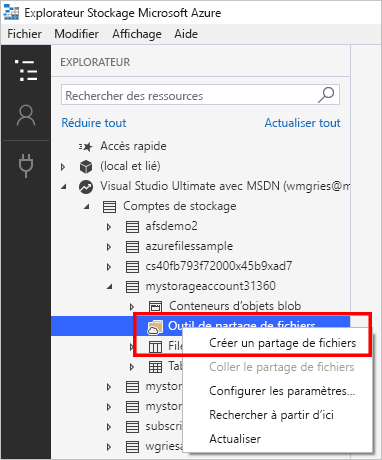
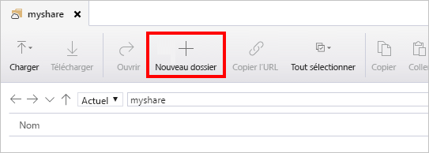

# Démarrage rapide : créer et gérer les partages de fichiers Azure avec l’Explorateur Stockage Azure
Ce guide vous explique les bases de l’utilisation du [partage de fichiers Azure](storage-files-introduction.md) avec l’Explorateur Stockage Azure. Le partage de fichiers Azure est similaire à d’autres partages de fichiers, mais est stocké dans le cloud et s’appuie sur la plateforme Azure. Il prend en charge le protocole SMB de norme industrielle et permet le partage de fichiers entre plusieurs machines, applications et instances. 

L’Explorateur Stockage Azure est un outil client populaire qui est disponible pour Windows, macOS et Linux. Vous pouvez utiliser l’Explorateur Stockage pour gérer les partages de fichiers Azure et d’autres ressources de stockage.

Si vous n’avez pas d’abonnement Azure, créez un [compte gratuit](https://azure.microsoft.com/free/?WT.mc_id=A261C142F) avant de commencer.

## Conditions préalables requises
Pour ce guide de démarrage rapide, l’Explorateur Stockage doit être installé. Pour le télécharger et l’installer, accédez à [Explorateur Stockage Azure](https://azure.microsoft.com/features/storage-explorer/).

## Créez un compte de stockage.
Vous ne pouvez pas utiliser l’Explorateur Stockage pour créer de nouvelles ressources. Dans le cadre de cette démonstration, créez le compte de stockage dans le [portail Azure](https://portal.azure.com/). 

[!INCLUDE [storage-files-create-storage-account-portal](../../../includes/storage-files-create-storage-account-portal.md)]

## Connecter l’Explorateur Stockage à des ressources Azure
Lors du premier démarrage de l’Explorateur Stockage, la fenêtre **Microsoft Azure Storage Explorer - Connect** (Explorateur Stockage Microsoft Azure - Connexion) s’affiche. L’Explorateur Stockage offre de nombreuses façons de se connecter à des comptes de stockage : 

- **Se connecter à l’aide de votre compte Azure** : vous pouvez vous connecter en utilisant les informations d’identification utilisateur de votre organisation ou votre compte Microsoft. 
- **Se connecter à un compte de stockage spécifique à l’aide d’une chaîne de connexion ou d’un jeton SAS** : une chaîne de connexion est une chaîne spéciale qui contient un nom de compte de stockage et un jeton de clé/SAS de compte de stockage. Avec le jeton, l’Explorateur Stockage accède directement au compte de stockage (plutôt que d’afficher simplement tous les comptes de stockage dans un compte Azure). Pour plus d’informations sur les chaînes de connexion, consultez [Configuration des chaînes de connexion du Stockage Azure](../common/storage-configure-connection-string.md?toc=%2fazure%2fstorage%2ffiles%2ftoc.json).
- **Se connecter à un compte de stockage spécifique à l’aide d’un nom et d’une clé de compte de stockage** : utilisez le nom et la clé de votre compte de stockage pour vous connecter au stockage Azure.

Dans le cadre de ce guide de démarrage rapide, connectez-vous à l’aide de votre compte Azure. Sélectionnez **Ajouter un compte Azure**, puis **Connexion**. Suivez les instructions de l’invite pour vous connecter à votre compte Azure.

### Créer un partage de fichiers
Pour créer votre premier partage de fichiers Azure dans le compte de stockage `storageacct<random number>` :

1. Développez le compte de stockage que vous avez créé.
2. Cliquez avec le bouton droit sur **Partages de fichiers**, puis sélectionnez **Créer un partage de fichiers**.  
    

3. Pour le partage de fichiers, entrez *myshare*, puis appuyez sur Entrée.

Le nom des partages ne peut contenir que des minuscules, des nombres et des traits d’union uniques (mais ne peut commencer par un trait d’union). Pour plus d’informations sur la façon de nommer des partages de fichiers et des fichiers, consultez [Affectation de noms et références aux partages, répertoires, fichiers et métadonnées](https://docs.microsoft.com/rest/api/storageservices/Naming-and-Referencing-Shares--Directories--Files--and-Metadata).

Lorsque le partage de fichiers est créé, un onglet pour votre partage de fichiers s’ouvre dans le volet droit. 

## Utiliser votre partage de fichiers Azure
Maintenant que vous avez créé un partage de fichiers Azure, vous pouvez monter le partage de fichiers avec SMB sur [Windows](storage-how-to-use-files-windows.md), [Linux](storage-how-to-use-files-linux.md) ou [macOS](storage-how-to-use-files-mac.md). Vous pouvez également utiliser votre partage de fichiers Azure à l’aide de l’Explorateur Stockage Azure. L’utilisation de l’Explorateur Stockage Azure au lieu du montage du partage de fichiers à l’aide de SMB a pour avantage que toutes les requêtes effectuées avec l’Explorateur Stockage le sont à l’aide de l’API REST de fichier. Vous pouvez utiliser l’API REST de fichier pour créer, modifier et supprimer des fichiers et des répertoires sur des clients n’ayant pas accès à SMB.

### Créer un répertoire
L’ajout d’un répertoire fournit une structure hiérarchique pour gérer votre partage de fichiers. Vous pouvez créer plusieurs niveaux dans votre répertoire. Vous devez toutefois vous assurer que tous les répertoires parents existent avant de créer des sous-répertoires. Par exemple, pour le chemin myDirectory/mySubDirectory, vous devez d’abord créer le répertoire *myDirectory*. Vous pouvez ensuite créer *mySubDirectory*. 

1. Sous l’onglet du partage de fichiers, dans le menu supérieur, sélectionnez le bouton **+ Nouveau dossier**. Le volet **Créer un nouvel annuaire** s’ouvre.
    

2. Pour le nom du répertoire, entrez *myDirectory*, puis sélectionnez **OK**. 

Le répertoire *myDirectory* est répertorié sur l’onglet du partage de fichiers *myshare*.

### Charger un fichier 
Vous pouvez charger un fichier depuis votre ordinateur local vers le nouveau répertoire dans votre partage de fichiers. Vous pouvez charger un dossier entier ou un seul fichier.

1. Dans le menu supérieur, sélectionnez **Charger**. Vous avez alors l’option de charger un dossier ou un fichier.
2. Sélectionnez **Charger un fichier**, puis sélectionnez un fichier à charger dans votre ordinateur local.
3. Dans **Upload to a directory** (Charger vers un répertoire), entrez *myDirectory*, puis sélectionnez sur **Charger**. 

Lorsque vous avez terminé, le fichier apparaît dans la liste du volet *myDirectory*.

### Téléchargement d’un fichier
Pour télécharger une copie d’un fichier à partir de votre partage de fichiers, cliquez avec le bouton droit sur le fichier, puis sélectionnez **Télécharger**. Choisissez où placer le fichier sur votre ordinateur local, puis sélectionnez **Enregistrer**.

La progression du téléchargement s’affiche dans le volet **Activités** en bas de la fenêtre.

## Nettoyer les ressources
Vous ne pouvez pas utiliser l’Explorateur Stockage pour supprimer des ressources. Pour nettoyer les éléments de ce guide de démarrage rapide, vous pouvez utiliser le [portail Azure](https://portal.azure.com/). 

[!INCLUDE [storage-files-clean-up-portal](../../../includes/storage-files-clean-up-portal.md)]

## Étapes suivantes

> [!div class="nextstepaction"]
> [Qu’est-ce qu’Azure Files ?](storage-files-introduction.md)
