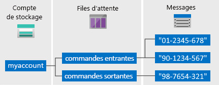

# <a name="quickstart-azure-queue-storage-client-library-v12-for-java"></a>Démarrage rapide : Bibliothèque cliente Stockage File d’attente Azure v12 pour Java

Familiarisez-vous avec la bibliothèque cliente Stockage File d’attente Azure version 12 pour Java. Le service Stockage File d’attente Azure est un service permettant de stocker un grand nombre de messages en vue de leur récupération et traitement. Suivez les étapes suivantes pour installer le package et essayer un exemple de code pour les tâches de base.

Utilisez la bibliothèque cliente Stockage File d’attente Azure v12 pour Java afin de :

* Créer une file d’attente
* Ajouter des messages à une file d’attente
* Afficher un aperçu des messages d’une file d’attente
* Mettre à jour un message dans une file d’attente
* Recevoir et supprimer des messages d’une file d’attente
* Suppression d'une file d'attente

[Documentation de référence sur l’API](https://azuresdkdocs.blob.core.windows.net/$web/java/azure-storage-queue/12.0.0/index.html) | [Code source de la bibliothèque](https://github.com/Azure/azure-sdk-for-java/tree/master/sdk/storage/azure-storage-queue) | [Package (Maven)](https://mvnrepository.com/artifact/com.azure/azure-storage-queue) | [Exemples](https://docs.microsoft.com/azure/storage/common/storage-samples-java?toc=%2fazure%2fstorage%2fqueues%2ftoc.json#queue-samples)

## <a name="prerequisites"></a>Prérequis

* [Kit de développement Java (JDK)](https://docs.microsoft.com/java/azure/jdk/?view=azure-java-stable), version 8 ou ultérieure
* [Apache Maven](https://maven.apache.org/download.cgi)
* Abonnement Azure : [créez-en un gratuitement](https://azure.microsoft.com/free/)
* Compte de stockage Azure : [créez un compte de stockage](https://docs.microsoft.com/azure/storage/common/storage-quickstart-create-account)

## <a name="setting-up"></a>Configuration

Cette section vous guide tout au long de la préparation d’un projet à utiliser avec la bibliothèque cliente Stockage File d’attente Azure v12 pour Java.

### <a name="create-the-project"></a>Créer le projet

Créez une application Java nommée *queues-quickstart-v12*.

1. Dans une fenêtre de console (par exemple cmd, PowerShell ou Bash), utilisez Maven pour créer une application de console nommée *queues-quickstart-v12*. Tapez la commande **mvn** suivante pour créer un projet Java « Hello World ! ».

   ```console
   mvn archetype:generate -DgroupId=com.queues.quickstart \
                          -DartifactId=queues-quickstart-v12 \
                          -DarchetypeArtifactId=maven-archetype-quickstart \
                          -DarchetypeVersion=1.4 \
                          -DinteractiveMode=false
   ```

1. Le résultat de la génération du projet doit ressembler à ceci :

    ```console
    [INFO] Scanning for projects...
    [INFO]
    [INFO] ------------------< org.apache.maven:standalone-pom >-------------------
    [INFO] Building Maven Stub Project (No POM) 1
    [INFO] --------------------------------[ pom ]---------------------------------
    [INFO]
    [INFO] >>> maven-archetype-plugin:3.1.2:generate (default-cli) > generate-sources @ standalone-pom >>>
    [INFO]
    [INFO] <<< maven-archetype-plugin:3.1.2:generate (default-cli) < generate-sources @ standalone-pom <<<
    [INFO]
    [INFO]
    [INFO] --- maven-archetype-plugin:3.1.2:generate (default-cli) @ standalone-pom ---
    [INFO] Generating project in Batch mode
    [INFO] ----------------------------------------------------------------------------
    [INFO] Using following parameters for creating project from Archetype: maven-archetype-quickstart:1.4
    [INFO] ----------------------------------------------------------------------------
    [INFO] Parameter: groupId, Value: com.queues.quickstart
    [INFO] Parameter: artifactId, Value: queues-quickstart-v12
    [INFO] Parameter: version, Value: 1.0-SNAPSHOT
    [INFO] Parameter: package, Value: com.queues.quickstart
    [INFO] Parameter: packageInPathFormat, Value: com/queues/quickstart
    [INFO] Parameter: version, Value: 1.0-SNAPSHOT
    [INFO] Parameter: package, Value: com.queues.quickstart
    [INFO] Parameter: groupId, Value: com.queues.quickstart
    [INFO] Parameter: artifactId, Value: queues-quickstart-v12
    [INFO] Project created from Archetype in dir: C:\quickstarts\queues\queues-quickstart-v12
    [INFO] ------------------------------------------------------------------------
    [INFO] BUILD SUCCESS
    [INFO] ------------------------------------------------------------------------
    [INFO] Total time:  6.394 s
    [INFO] Finished at: 2019-12-03T09:58:35-08:00
    [INFO] ------------------------------------------------------------------------
    ```

1. Basculez dans le répertoire *queues-quickstart-v12* créé.

   ```console
   cd queues-quickstart-v12
   ```

### <a name="install-the-package"></a>Installer le package

Ouvrez le fichier *pom.xml* dans votre éditeur de texte. Ajoutez l’élément dépendance suivant au groupe de dépendances.

```xml
<dependency>
  <groupId>com.azure</groupId>
  <artifactId>azure-storage-queue</artifactId>
  <version>12.0.1</version>
</dependency>
```

### <a name="set-up-the-app-framework"></a>Configurer le framework d’application

À partir du répertoire de projet :

1. Accédez au répertoire */src/main/java/com/queues/quickstart*
1. Ouvrez le fichier *App.java* dans votre éditeur
1. Supprimez l’instruction `System.out.println("Hello world!");`
1. Ajoutez des directives `import`.

Voici le code :

```java
package com.queues.quickstart;

/**
 * Azure queue storage v12 SDK quickstart
 */
import com.azure.storage.queue.*;
import com.azure.storage.queue.models.*;
import java.io.*;
import java.time.*;

public class App
{
    public static void main( String[] args ) throws IOException
    {
    }
}
```

[!INCLUDE [storage-quickstart-credentials-include](../../../includes/storage-quickstart-credentials-include.md)]

## <a name="object-model"></a>Modèle objet

Stockage File d’attente Azure est un service permettant de stocker un grand nombre de messages. La taille maximale d’un message de file d’attente est de 64 Ko. Une file d’attente peut contenir des millions de messages, dans la limite de la capacité totale d’un compte de stockage. Les files d’attente sont couramment utilisées pour créer un backlog de travail à traiter de façon asynchrone. Le Stockage File d’attente offre trois types de ressources :

* Le compte de stockage
* Une file d’attente dans le compte de stockage
* Les messages dans la file d’attente

Le diagramme suivant montre la relation entre ces ressources.



Utilisez les classes Java suivantes pour interagir avec ces ressources :

* [QueueClientBuilder](https://azuresdkdocs.blob.core.windows.net/$web/java/azure-storage-queue/12.0.0/com/azure/storage/queue/QueueClientBuilder.html) : la classe `QueueClientBuilder` configure et instancie un objet `QueueClient`.
* [QueueServiceClient](https://azuresdkdocs.blob.core.windows.net/$web/java/azure-storage-queue/12.0.0/com/azure/storage/queue/QueueServiceClient.html) : `QueueServiceClient` vous permet de gérer toutes les files d’attente de votre compte de stockage.
* [QueueClient](https://azuresdkdocs.blob.core.windows.net/$web/java/azure-storage-queue/12.0.0/com/azure/storage/queue/QueueClient.html) : la classe `QueueClient` vous permet de gérer et de manipuler une file d’attente individuelle et ses messages.
* [QueueMessageItem](https://azuresdkdocs.blob.core.windows.net/$web/java/azure-storage-queue/12.0.0/com/azure/storage/queue/models/QueueMessageItem.html) : La classe `QueueMessageItem` représente les objets individuels retournés lors de l’appel de [receiveMessages](https://azuresdkdocs.blob.core.windows.net/$web/java/azure-storage-queue/12.0.0/com/azure/storage/queue/QueueClient.html#receiveMessages-java.lang.Integer-) dans une file d’attente.

## <a name="code-examples"></a>Exemples de code

Ces exemples d’extraits de code vous montrent comment effectuer les actions suivantes avec la bibliothèque cliente Stockage File d’attente Azure pour Java :

* [Obtenir la chaîne de connexion](#get-the-connection-string)
* [Créer une file d’attente](#create-a-queue)
* [Ajouter des messages à une file d’attente](#add-messages-to-a-queue)
* [Afficher un aperçu des messages d’une file d’attente](#peek-at-messages -in-a-queue)
* [Mettre à jour un message dans une file d’attente](#update-a-message-in-a-queue)
* [Recevoir et supprimer des messages d’une file d’attente](#receive-and-delete-messages-from-a-queue)
* [Supprimer une file d’attente](#delete-a-queue)

### <a name="get-the-connection-string"></a>Obtenir la chaîne de connexion

Le code ci-après récupère la chaîne de connexion du compte de stockage. La chaîne de connexion est stockée dans la variable d’environnement créée dans la section [Configurer votre chaîne de connexion de stockage](#configure-your-storage-connection-string).

Ajoutez ce code dans la méthode `main` :

```java
System.out.println("Azure Queues storage v12 - Java quickstart sample\n");

// Retrieve the connection string for use with the application. The storage
// connection string is stored in an environment variable on the machine
// running the application called AZURE_STORAGE_CONNECTION_STRING. If the environment variable
// is created after the application is launched in a console or with
// Visual Studio, the shell or application needs to be closed and reloaded
// to take the environment variable into account.
String connectStr = System.getenv("AZURE_STORAGE_CONNECTION_STRING");
```

### <a name="create-a-queue"></a>Créer une file d’attente

Choisissez un nom pour la nouvelle file d’attente. Le code ci-dessous ajoute une valeur GUID au nom de la file d’attente pour s’assurer qu’il est unique.

> [!IMPORTANT]
> Les noms de file d’attente peuvent contenir uniquement des lettres minuscules, des chiffres et des traits d’union, et doivent commencer par une lettre ou un nombre. Chaque trait d’union doit être précédé et suivi d’un caractère autre qu’un tiret. Le nom doit avoir entre 3 et 63 caractères. Pour plus d’informations sur le nommage des files d’attente, consultez [Nommage des files d’attente et des métadonnées](/rest/api/storageservices/naming-queues-and-metadata).


Créez une instance de la classe [QueueClient](https://azuresdkdocs.blob.core.windows.net/$web/java/azure-storage-queue/12.0.0/com/azure/storage/queue/QueueClient.html). Ensuite, appelez la méthode [create](https://azuresdkdocs.blob.core.windows.net/$web/java/azure-storage-queue/12.0.0/com/azure/storage/queue/QueueClient.html#create--) pour créer la file d’attente dans votre compte de stockage.

Ajoutez ce code à la fin de la méthode `main` :

```java
// Create a unique name for the queue
String queueName = "quickstartqueues-" + java.util.UUID.randomUUID();

System.out.println("Creating queue: " + queueName);

// Instantiate a QueueClient which will be
// used to create and manipulate the queue
QueueClient queueClient = new QueueClientBuilder()
                                .connectionString(connectStr)
                                .queueName(queueName)
                                .buildClient();

// Create the queue
queueClient.create();
```

### <a name="add-messages-to-a-queue"></a>Ajouter des messages à une file d’attente

L’extrait de code suivant ajoute des messages à la file d’attente en appelant la méthode [sendMessage](https://azuresdkdocs.blob.core.windows.net/$web/java/azure-storage-queue/12.0.0/com/azure/storage/queue/QueueClient.html#sendMessage-java.lang.String-). Il enregistre également un [SendMessageResult](https://azuresdkdocs.blob.core.windows.net/$web/java/azure-storage-queue/12.0.0/com/azure/storage/queue/models/SendMessageResult.html) retourné à partir d’un appel de `sendMessage`. Le résultat est utilisé pour mettre à jour le message ultérieurement dans le programme.

Ajoutez ce code à la fin de la méthode `main` :

```java
System.out.println("\nAdding messages to the queue...");

// Send several messages to the queue
queueClient.sendMessage("First message");
queueClient.sendMessage("Second message");

// Save the result so we can update this message later
SendMessageResult result = queueClient.sendMessage("Third message");
```

### <a name="peek-at-messages-in-a-queue"></a>Afficher un aperçu des messages d’une file d’attente

Affichez un aperçu des messages de la file d’attente en appelant la méthode [peekMessages](https://azuresdkdocs.blob.core.windows.net/$web/java/azure-storage-queue/12.0.0/com/azure/storage/queue/QueueClient.html#peekMessages-java.lang.Integer-java.time.Duration-com.azure.core.util.Context-). La méthode `peelkMessages` récupère un ou plusieurs messages du début de la file d’attente, mais ne modifie pas la visibilité du message.

Ajoutez ce code à la fin de la méthode `main` :

```java
System.out.println("\nPeek at the messages in the queue...");

// Peek at messages in the queue
queueClient.peekMessages(10, null, null).forEach(
    peekedMessage -> System.out.println("Message: " + peekedMessage.getMessageText()));
```

### <a name="update-a-message-in-a-queue"></a>Mettre à jour un message dans une file d’attente

Mettez à jour le contenu d’un message en appelant la méthode [updateMessage](https://azuresdkdocs.blob.core.windows.net/$web/java/azure-storage-queue/12.0.0/com/azure/storage/queue/QueueClient.html#updateMessage-java.lang.String-java.lang.String-java.lang.String-java.time.Duration-). La méthode `updateMessage` peut changer le contenu et le délai d’expiration de la visibilité d’un message. Le contenu du message doit être une chaîne encodée en UTF-8 d’une taille maximale de 64 Ko. Avec le nouveau contenu du message, transmettez l’ID du message et la réception POP en utilisant le `SendMessageResult` qui a été enregistré dans le code. L’ID du message et la réception POP identifient le message à mettre à jour.

```java
System.out.println("\nUpdating the third message in the queue...");

// Update a message using the result that
// was saved when sending the message
queueClient.updateMessage(result.getMessageId(),
                          result.getPopReceipt(), 
                          "Third message has been updated",
                          Duration.ofSeconds(1));
```

### <a name="receive-and-delete-messages-from-a-queue"></a>Recevoir et supprimer des messages d’une file d’attente

Téléchargez les messages ajoutés en appelant la méthode [receiveMessages](https://azuresdkdocs.blob.core.windows.net/$web/java/azure-storage-queue/12.0.0/com/azure/storage/queue/QueueClient.html#receiveMessages-java.lang.Integer-java.time.Duration-java.time.Duration-com.azure.core.util.Context-). L’exemple de code supprime également les messages de la file d’attente une fois qu’ils sont reçus et traités. Dans ce cas, le traitement affiche simplement le message sur la console.

Avant de recevoir et de supprimer les messages, l’application s’interrompt dans l’attente d’une entrée de l’utilisateur en appelant `System.console().readLine();`. Vérifiez dans votre [portail Azure](https://portal.azure.com) que les ressources ont été créées correctement avant d’être supprimées. Tout message qui n’est pas supprimé explicitement sera de nouveau visible dans la file d’attente et pourra donc faire l’objet d’un nouveau traitement.

Ajoutez ce code à la fin de la méthode `main` :

```java
System.out.println("\nPress Enter key to receive messages and delete them from the queue...");
System.console().readLine();

// Get messages from the queue
queueClient.receiveMessages(10).forEach(
    // "Process" the message
    receivedMessage -> {
        System.out.println("Message: " + receivedMessage.getMessageText());

        // Let the service know we're finished with
        // the message and it can be safely deleted.
        queueClient.deleteMessage(receivedMessage.getMessageId(), receivedMessage.getPopReceipt());
    }
);
```

### <a name="delete-a-queue"></a>Suppression d'une file d'attente

Le code suivant nettoie les ressources créées par l’application en supprimant la file d’attente avec la méthode [delete](https://azuresdkdocs.blob.core.windows.net/$web/java/azure-storage-queue/12.0.0/com/azure/storage/queue/QueueClient.html#delete--).

Ajoutez ce code à la fin de la méthode `main` :

```java
System.out.println("\nPress Enter key to delete the queue...");
System.console().readLine();

// Clean up
System.out.println("Deleting queue: " + queueClient.getQueueName());
queueClient.delete();

System.out.println("Done");
```

## <a name="run-the-code"></a>Exécuter le code

Cette application crée trois messages et les ajoute à une file d’attente Azure. Le code liste les messages dans la file d’attente, puis les récupère et les supprime avant de supprimer la file d’attente.

Dans la fenêtre de votre console, accédez au répertoire de l’application, puis générez et exécutez l’application.

```console
mvn compile
```

Ensuite, générez le package.

```console
mvn package
```

Exécutez la commande `mvn` suivante pour exécuter l’application.

```console
mvn exec:java -Dexec.mainClass="com.queues.quickstart.App" -Dexec.cleanupDaemonThreads=false
```

La sortie de l’application ressemble à l’exemple suivant :

```output
Azure Queues storage v12 - Java quickstart sample

Adding messages to the queue...

Peek at the messages in the queue...
Message: First message
Message: Second message
Message: Third message

Updating the third message in the queue...

Press Enter key to receive messages and delete them from the queue...

Message: First message
Message: Second message
Message: Third message has been updated

Press Enter key to delete the queue...

Deleting queue: quickstartqueues-fbf58f33-4d5a-41ac-ac0e-1a05d01c7003
Done
```

Quand l’application s’interrompt avant de recevoir des messages, vérifiez votre compte de stockage dans le [portail Azure](https://portal.azure.com). Vérifiez que les messages se trouvent dans la file d’attente.

Appuyez sur la touche **Entrée** pour recevoir et supprimer les messages. Quand vous y êtes invité, réappuyez sur la touche **Entrée** pour supprimer la file d’attente et terminer la démonstration.

## <a name="next-steps"></a>Étapes suivantes

Dans ce guide de démarrage rapide, vous avez appris à créer une file d’attente et à y ajouter des messages à l’aide de code Java. Ensuite, vous avez appris à afficher un aperçu des messages, à les récupérer et à les supprimer. Enfin, vous avez appris à supprimer une file d’attente de messages.

Pour obtenir des tutoriels, des exemples, des guides de démarrage rapide et d’autres documents, visitez :

> [!div class="nextstepaction"]
> [Azure pour les développeurs cloud Java](https://docs.microsoft.com/azure/java/)

* Pour voir d’autres exemples d’applications Stockage File d’attente Azure, passez à [Exemples de bibliothèques clientes SDK Stockage File d’attente Azure V12 pour Java](https://github.com/Azure/azure-sdk-for-java/tree/master/sdk/storage/azure-storage-queue/src/samples/java/com/azure/storage/queue).
