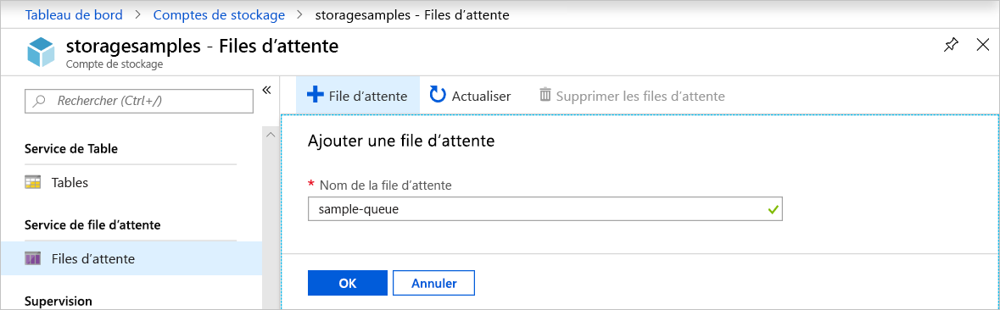
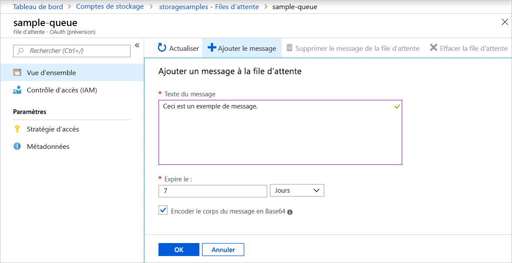
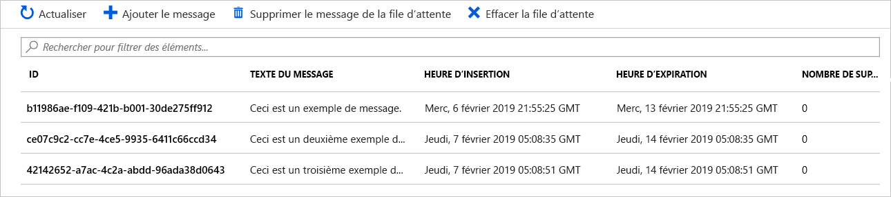
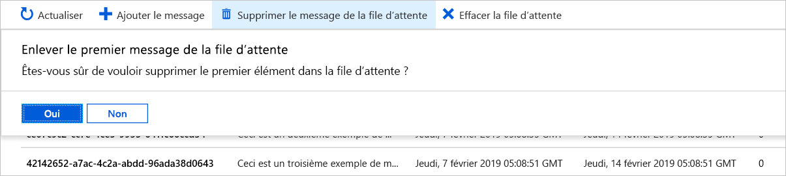

# Démarrage rapide : Créer une file d’attente et ajouter un message à l’aide du portail Azure

Ce guide de démarrage rapide explique comment utiliser le [portail Azure](https://portal.azure.com/) pour créer une file d’attente dans le stockage Azure et ajouter ou enlever des messages dans cette file d’attente.

## Prérequis

[!INCLUDE [storage-quickstart-prereq-include](../../../includes/storage-quickstart-prereq-include.md)]

## Créer une file d’attente

Pour créer une file d’attente dans le portail Azure, effectuez les étapes suivantes :

1. Accédez à votre nouveau compte de stockage dans le portail Azure.
2. Dans le menu de gauche du compte de stockage, faites défiler jusqu’à la section **Stockage File d’attente**, puis sélectionnez **Files d’attente**.
3. Sélectionnez le bouton **+ File d’attente**.
4. Entrez un nom pour votre nouvelle file d’attente. Le nom de la file d’attente doit être en minuscules et commencer par une lettre ou un chiffre. Il peut comporter uniquement des lettres, des chiffres et des tirets (-).
6. Sélectionnez **OK** pour créer la file d’attente.

    

## Ajouter un message

Ajoutez ensuite un message à la nouvelle file d’attente. La taille maximale d’un message est de 64 Ko.

1. Sélectionnez la nouvelle file d’attente dans la liste des files d’attente du compte de stockage.
1. Sélectionnez le bouton **+ Ajouter un message** pour ajouter un message à la file d’attente. Entrez un message dans le champ **Texte du message**.
1. Spécifiez le délai d’expiration du message. Les valeurs valides qui peuvent être entrées dans le champ **Expire dans** vont de 1 seconde à 7 jours. Sélectionnez **Message n’expire jamais** pour indiquer qu’un message doit rester dans la file d’attente jusqu’à ce qu’il soit supprimé explicitement.
1. Indiquez si le message doit être encodé au format Base64. L’encodage des données binaires est recommandé.
1. Sélectionnez le bouton **OK** pour ajouter le message.

    

## Afficher les propriétés d’un message

Une fois que vous avez ajouté un message, le portail Azure affiche une liste de tous les messages dans la file d’attente. Vous pouvez voir l’ID du message, ainsi que le contenu, la date/l’heure d’ajout et le délai d’expiration du message. Vous pouvez également voir combien de fois ce message a été enlevé de la file d’attente.

## Supprimer un message de la file d’attente

Vous pouvez enlever un message du haut de la file d’attente dans le portail Azure. Le message est alors supprimé.

Cette opération d’enlèvement entraîne toujours la suppression du message le plus ancien dans la file d’attente.

## Étapes suivantes

Dans ce guide de démarrage rapide, vous avez vu comment créer une file d’attente, ajouter un message, afficher les propriétés d’un message et enlever un message de la file d’attente dans le portail Azure.

> [!div class="nextstepaction"]
> [Qu’est-ce que Stockage File d’attente Azure ?](storage-queues-introduction.md)
