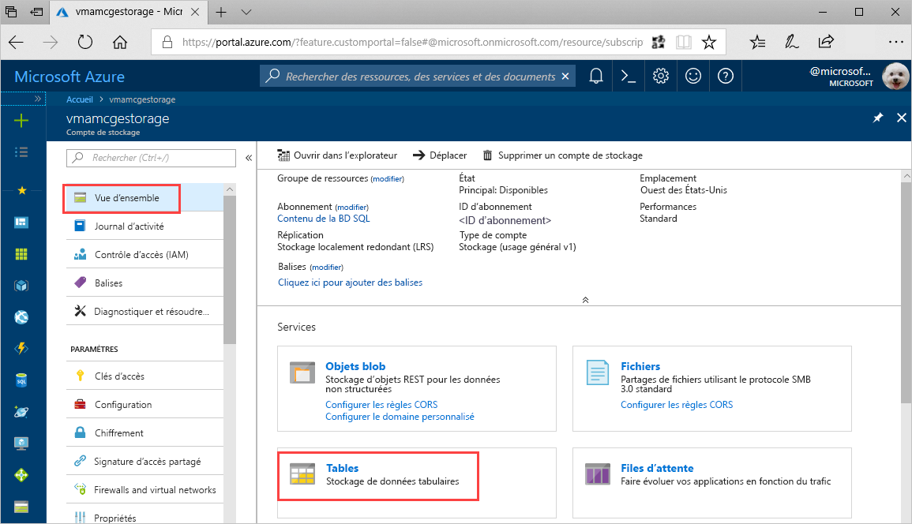
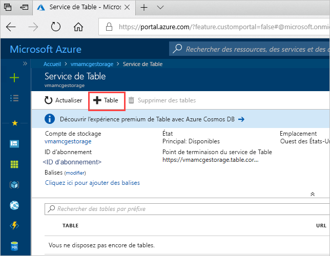
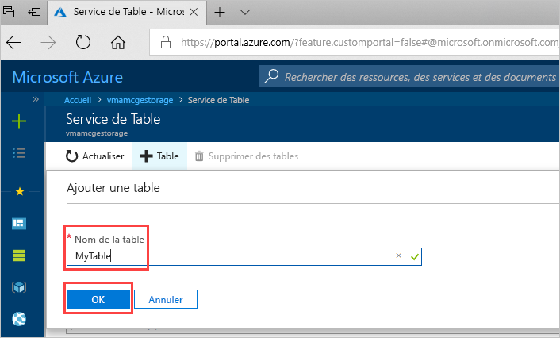

# Démarrage rapide : créer une table de stockage Azure dans le portail Azure 

Ce guide de démarrage rapide explique comment créer des tables et des entités dans le portail web Azure. Il vous montre également comment créer un compte de stockage Azure.

[!INCLUDE [quickstarts-free-trial-note](../../../includes/quickstarts-free-trial-note.md)]

## Prérequis

Pour terminer ce démarre rapide, commencez par créer un compte de stockage Azure dans le [portail Azure](https://portal.azure.com/#create/Microsoft.StorageAccount-ARM). Si vous avez besoin d’aide pour créer un compte de stockage, consultez [Créez un compte de stockage](../common/storage-account-create.md).

## Ajouter une table

Vous pouvez maintenant utiliser le service de Table dans le portail Azure pour créer une table.

1. Cliquez sur Vue d’ensemble > Tables.

   

2. Cliquez sur **+ Table**.

   

3. Saisissez un nom pour votre table dans le champ **Nom de la table**, puis cliquez sur **OK**. 

   

## Étapes suivantes

- [Conseils pour la conception de table](table-storage-design-guidelines.md)
