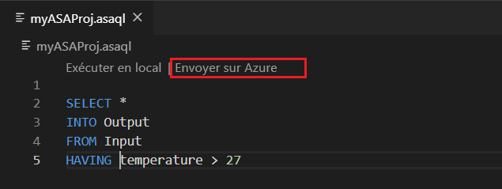

# Copier ou sauvegarder des travaux Azure Stream Analytics

Vous pouvez copier ou sauvegarder vos travaux Azure Stream Analytics déployés à l’aide de Visual Studio Code ou de Visual Studio. 

## Avant de commencer
* Si vous n’avez pas d’abonnement Azure, créez un [compte gratuit](https://azure.microsoft.com/free/).

* Connectez-vous au [portail Azure](https://portal.azure.com/).

* Installez [l’extension Azure Stream Analytics pour Visual Studio Code](quick-create-vs-code.md#install-the-azure-stream-analytics-tools-extension) ou [les outils Azure Stream Analytics pour Visual Studio](quick-create-vs-code.md#install-the-azure-stream-analytics-tools-extension).  

## Visual Studio Code

1. Cliquez sur l’icône **Azure** située sur la barre d’activités Visual Studio Code, puis développez le nœud **Stream Analytics**. Vos travaux doivent apparaître sous vos abonnements.

   

2. Pour exporter un travail vers un projet local, recherchez le travail que vous souhaitez exporter dans l’**Explorateur Stream Analytics** de Visual Studio Code. Puis, sélectionnez un dossier pour votre projet.

    

    Le projet est exporté vers le dossier que vous sélectionnez et est ajouté à votre espace de travail actuel.

    

3. Pour publier le travail dans une autre région ou dans une sauvegarde à l’aide d’un autre nom, sélectionnez **Select from your subscriptions to publish** (sélectionner parmi vos abonnements pour publier) dans l’éditeur de requête (\*.asaql) et suivez les instructions.

    

## Visual Studio

1. Suivez les instructions [Exporter une tâche Azure Stream Analytics déployée vers un projet](https://docs.microsoft.com/azure/stream-analytics/stream-analytics-vs-tools#export-jobs-to-a-project).

2. Ouvrez le fichier \*.asaql dans l’éditeur de requête, sélectionnez **Envoyer sur Azure** dans l’éditeur de script et suivez les instructions pour publier le travail dans une autre région ou une sauvegarde en utilisant un nouveau nom.

## Étapes suivantes

* [Démarrage rapide : créer un travail Stream Analytics à l’aide de Visual Studio Code](quick-create-vs-code.md)
* [Démarrage rapide : créer un travail Stream Analytics à l’aide de Visual Studio](stream-analytics-quick-create-vs.md)
* [Déployer un travail Azure Stream Analytics avec CI/CD à l’aide de Azure Pipelines](stream-analytics-tools-visual-studio-cicd-vsts.md)
