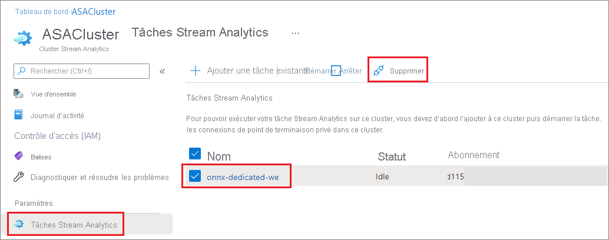

# Ajouter ou supprimer des travaux dans un cluster Azure Stream Analytics

Vous pouvez exécuter plusieurs travaux Azure Stream Analytics sur un même cluster Stream Analytics. L'exécution de travaux sur un cluster est un processus simple qui se décompose en deux étapes : l'ajout du travail au cluster et le démarrage du travail. Cet article explique comment ajouter et supprimer des travaux dans un cluster existant. Si nécessaire, suivez le guide de démarrage rapide pour [créer un cluster Stream Analytics](create-cluster.md).

## Ajouter un travail Stream Analytics à un cluster

Seuls les travaux Stream Analytics existants peuvent être ajoutés à des clusters. Suivez le guide de démarrage rapide pour [apprendre à créer un travail](stream-analytics-quick-create-portal.md) à l'aide du portail Azure. Dès que vous disposez d'un travail que vous souhaitez ajouter à un cluster, suivez les étapes ci-dessous pour l'ajouter à votre cluster.

1. Sur le portail Azure, recherchez et sélectionnez votre cluster Stream Analytics.

1. Sous **Paramètres**, sélectionnez **Travaux Stream Analytics**. Sélectionnez ensuite **Ajouter un travail existant**.

1. Sélectionnez l'abonnement et le travail Stream Analytics que vous souhaitez ajouter au cluster. Seuls les travaux Stream Analytics qui se trouvent dans la même région que le cluster peuvent être ajoutés à celui-ci.

   

1. Une fois le travail ajouté au cluster, accédez à la ressource de travail et [démarrez le travail](start-job.md#azure-portal). Le travail commence alors à s'exécuter sur votre cluster.

Vous pouvez effectuer toutes les autres opérations (surveillance, alertes, journaux de diagnostic, etc.) à partir de la page des ressources de travail Stream Analytics.

## Supprimer un travail Stream Analytics d'un cluster

Les travaux Stream Analytics doivent être arrêtés avant de pouvoir être supprimés du cluster. Si votre travail est toujours en cours d'exécution, arrêtez-le avant de passer aux étapes suivantes.

1. Recherchez et sélectionnez votre cluster Stream Analytics.

1. Sous **Paramètres**, sélectionnez **Travaux Stream Analytics**.

1. Sélectionnez les travaux que vous souhaitez supprimer du cluster, puis sélectionnez **Supprimer**.

   

   Lorsqu'un travail est supprimé d'un cluster Stream Analytics, il revient à l'environnement multi-locataire standard.

## Étapes suivantes

Vous savez maintenant comment ajouter et supprimer des travaux dans votre cluster Azure Stream Analytics. Vous pouvez ensuite apprendre à gérer les points de terminaison privés et à mettre vos clusters à l'échelle :

* [Mettre à l'échelle un cluster Azure Stream Analytics](scale-cluster.md)
* [Gérer les points de terminaison privés dans un cluster Azure Stream Analytics](private-endpoints.md)
