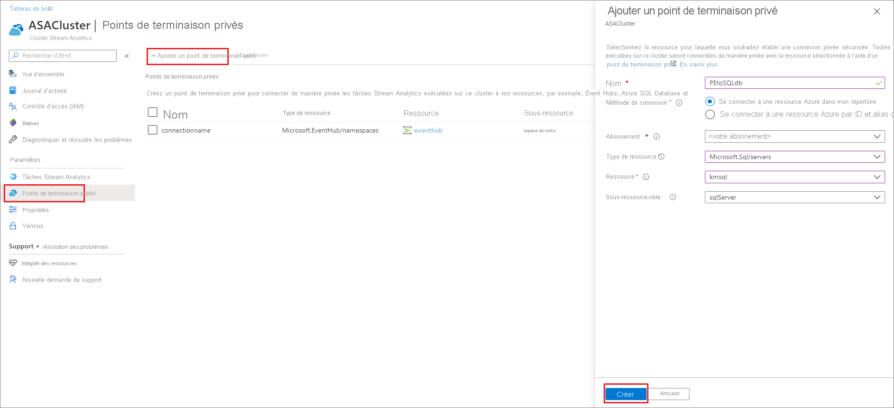

# Créer et supprimer des points de terminaison privés dans un cluster Azure Stream Analytics

Vous pouvez connecter les travaux Azure Stream Analytics exécutés sur un cluster à des ressources d'entrée et de sortie situées derrière un pare-feu ou un réseau virtuel Azure. Commencez par créer un point de terminaison privé pour une ressource, telle qu'Azure Event Hub ou Azure SQL Database, dans votre cluster Stream Analytics. Approuvez ensuite la connexion du point de terminaison privé à partir de votre entrée ou de votre sortie.

Une fois la connexion approuvée, tout travail en cours d'exécution dans votre cluster Stream Analytics a accès à la ressource via le point de terminaison privé. Cet article explique comment créer et supprimer des points de terminaison privés dans un cluster Azure Stream Analytics.

## Créer un point de terminaison privé dans un cluster Stream Analytics

Dans cette section, vous allez apprendre à créer un point de terminaison privé dans un cluster Stream Analytics.

1. Sur le portail Azure, recherchez et sélectionnez votre cluster Stream Analytics.

1. Sous **Paramètres**, sélectionnez **Points de terminaison privés**.

1. Sélectionnez **Ajouter un point de terminaison privé** et entrez les informations suivantes pour choisir la ressource à laquelle vous souhaitez accéder en toute sécurité via un point de terminaison privé.

   |Paramètre|Valeur|
   |---|---|
   |Nom|Entrez un nom pour votre point de terminaison privé. Si ce nom est utilisé, créez un nom unique.|
   |Méthode de connexion|Sélectionnez **Se connecter à une ressource Azure dans mon répertoire**.  Vous pouvez choisir parmi vos ressources celle à laquelle vous souhaitez vous connecter en toute sécurité à l'aide du point de terminaison privé, ou vous pouvez vous connecter à la ressource d'une autre personne en utilisant un ID de ressource ou un alias qu'elle a partagé avec vous.|
   |Abonnement|Sélectionnez votre abonnement.|
   |Type de ressource|Choisissez le [type de ressource qui correspond à votre ressource](../private-link/private-endpoint-overview.md#private-link-resource).|
   |Ressource|Sélectionnez la ressource à laquelle vous souhaitez vous connecter à l'aide d'un point de terminaison privé.|
   |Sous-ressource cible|Type de sous-ressource de la ressource sélectionnée ci-dessus à laquelle votre point de terminaison privé peut accéder.|

   

1. Approuvez la connexion à partir de la ressource cible. Par exemple, si vous avez créé un point de terminaison privé sur une instance d'Azure SQL Database à l'étape précédente, vous devez accéder à cette instance et voir une connexion en attente qui doit être approuvée. L'affichage de la demande de connexion peut prendre quelques minutes.

    

1. Vous pouvez revenir à votre cluster Stream Analytics ; en quelques minutes, vous verrez alors l'état passer de **Approbation du client en attente** à **Configuration DNS en attente** puis à **Configuration terminée**.

## Supprimer un point de terminaison privé dans un cluster Stream Analytics

1. Sur le portail Azure, recherchez et sélectionnez votre cluster Stream Analytics.

1. Sous **Paramètres**, sélectionnez **Points de terminaison privés**.

1. Choisissez le point de terminaison privé à supprimer et sélectionnez **Supprimer**.

   

## Étapes suivantes

Vous disposez maintenant d'une vue d'ensemble de la gestion des points de terminaison privés dans un cluster Azure Stream Analytics. Vous pouvez ensuite apprendre à mettre vos clusters à l'échelle et à exécuter des travaux dans votre cluster :

* [Mettre à l'échelle un cluster Azure Stream Analytics](scale-cluster.md)
* [Gérer des travaux Stream Analytics dans un cluster Stream Analytics](manage-jobs-cluster.md)