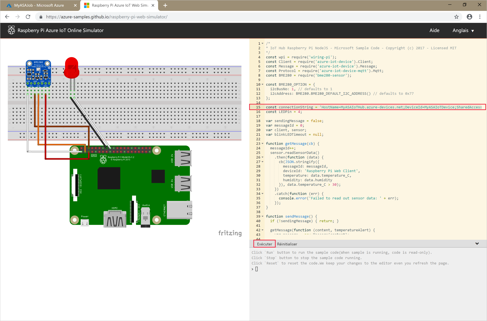

# <a name="quickstart-create-an-azure-stream-analytics-job-using-the-azure-cli"></a>Démarrage rapide : Créer un travail Azure Stream Analytics avec l’interface de ligne de commande Azure

Dans ce guide de démarrage rapide, vous utilisez l’interface de ligne de commande Azure pour définir un travail Stream Analytics qui filtre les messages de capteur en temps réel faisant état d’une température supérieure à 27 degrés. Votre travail Stream Analytics lira les données à partir d’IoT Hub, transformera ces données et les réécrira dans un conteneur de stockage d’objets blob. Les données d’entrée utilisées dans ce guide de démarrage rapide sont générées par un simulateur en ligne Raspberry Pi.

## <a name="before-you-begin"></a>Avant de commencer

[!INCLUDE [quickstarts-free-trial-note](../../includes/quickstarts-free-trial-note.md)]

[!INCLUDE [azure-cli-prepare-your-environment.md](../../includes/azure-cli-prepare-your-environment.md)]

- Créez un groupe de ressources. Toutes les ressources Azure doivent être déployées dans un groupe de ressources. Les groupes de ressources vous permettent d’organiser et de gérer les ressources Azure connexes.

   Pour ce guide de démarrage rapide, créez un groupe de ressources nommé *streamanalyticsrg* dans la zone *eastus* à l’aide de la commande [az group create](/cli/azure/group#az-group-create) suivante :

   ```azurecli
   az group create --name streamanalyticsrg --location eastus
   ```

## <a name="prepare-the-input-data"></a>Préparer les données d’entrée

Avant de définir le travail Stream Analytics, préparez les données utilisées pour l’entrée du travail.

Le bloc de code Azure CLI ci-après est constitué de commandes qui préparent les données d’entrée requises par le travail. Passez en revue les différentes sections pour comprendre le code.

1. Créez un hub IoT à l’aide de la commande [az iot hub create](../iot-hub/iot-hub-create-using-cli.md#create-an-iot-hub). Cet exemple crée un hub IoT appelé **MyASAIoTHub**. Comme les noms de hub IoT sont uniques, vous devez spécifier votre propre nom de hub IoT. Définissez la référence SKU sur F1 pour utiliser le niveau Gratuit s’il est disponible avec votre abonnement. Si ce n’est pas le cas, choisissez le niveau le plus bas suivant.

    ```azurecli
    az iot hub create --name "MyASAIoTHub" --resource-group streamanalyticsrg --sku S1
    ```

    Après avoir créé le hub IoT, obtenez la chaîne de connexion du hub IoT à l’aide de la commande [az iot hub show-connection-string](/cli/azure/iot/hub). Copiez la chaîne de connexion complète et enregistrez-la, car vous en aurez besoin quand vous ajouterez le hub IoT comme entrée dans votre travail Stream Analytics.

    ```azurecli
    az iot hub show-connection-string --hub-name "MyASAIoTHub"
    ```

2. Ajoutez un appareil au hub IoT à l’aide de la commande [az iothub device-identity create](../iot-hub/quickstart-send-telemetry-c.md#register-a-device). Cet exemple crée un appareil appelé **MyASAIoTDevice**.

    ```azurecli
    az iot hub device-identity create --hub-name "MyASAIoTHub" --device-id "MyASAIoTDevice"
    ```

3. Obtenez la chaîne de connexion de l’appareil à l’aide de la commande [az iot hub device-identity show-connection-string](/cli/azure/ext/azure-iot/iot/hub/device-identity#ext-azure-iot-az-iot-hub-device-identity-show-connection-string). Copiez la chaîne de connexion complète et enregistrez-la, car vous en aurez besoin quand vous créerez le simulateur Raspberry Pi.

    ```azurecli
    az iot hub device-identity show-connection-string --hub-name "MyASAIoTHub" --device-id "MyASAIoTDevice" --output table
    ```

    **Exemple de sortie :**

    ```output
    HostName=MyASAIoTHub.azure-devices.net;DeviceId=MyASAIoTDevice;SharedAccessKey=a2mnUsg52+NIgYudxYYUNXI67r0JmNubmfVafojG8=
    ```

## <a name="create-a-blob-storage-account"></a>Création d’un compte de stockage d’objets blob

Les blocs de code Azure CLI suivants créent un compte de stockage d’objets blob qui est utilisé pour la sortie du travail. Passez en revue les différentes sections pour comprendre le code.

1. Créez un compte de stockage à usage général avec la commande [az storage account create](/cli/azure/storage/account). Le compte de stockage à usage général peut être utilisé pour les quatre services : objets blob, fichiers, tables et files d’attente.

   N’oubliez pas de remplacer les valeurs d’espace réservé entre crochets par vos propres valeurs :

   ```azurecli
   az storage account create \
       --name <storage-account> \
       --resource-group streamanalyticsrg \
       --location eastus \
       --sku Standard_ZRS \
       --encryption-services blob
   ```

2. Pour obtenir la clé de votre compte de stockage, exécutez la commande [az storage account keys list](/cli/azure/storage/account/keys). Enregistrez cette clé en vue de l’utiliser à l’étape suivante.

   ```azurecli
   az storage account keys list -g streamanalyticsrg -n <storage-account>
   ```

3. Créez un conteneur pour stocker des objets blob avec la commande [az storage container create](/cli/azure/storage/container). Vous utilisez la clé de compte de stockage pour autoriser l’opération de création du conteneur. Pour plus d’informations sur l’autorisation d’opérations de données avec Azure CLI, consultez [Autoriser l’accès aux données d’objet blob et de file d’attente avec Azure CLI](../storage/blobs/authorize-data-operations-cli.md).

   ```azurecli
   az storage container create \
       --account-name <storage-account> \
       --name sample-container \
       --account-key <key>
       --auth-mode key
   ```

## <a name="create-a-stream-analytics-job"></a>Création d’un travail Stream Analytics

Les blocs de code Azure CLI suivants créent un travail Stream Analytics. Passez en revue les différentes sections pour comprendre le code.

1. Créez un travail Stream Analytics avec la commande [az stream-analytics job create](/cli/azure/ext/stream-analytics/stream-analytics/job#ext-stream-analytics-az-stream-analytics-job-create).

```azurecli
az stream-analytics job create \
    --resource-group streamanalyticsrg 
    --name streamanalyticsjob \
    --location eastus \
    --output-error-policy "Drop" \
    --events-outoforder-policy "Drop" \
    --events-outoforder-max-delay 5 \
    --events-late-arrival-max-delay 16 \     
    --data-locale "en-US"
```

## <a name="configure-input-to-the-job"></a>Configurer l’entrée du travail

Ajoutez une entrée à votre travail à l’aide de l’applet de commande [az stream-analytics input](/cli/azure/ext/stream-analytics/stream-analytics/input#ext-stream-analytics-az-stream-analytics-input-create). Cette applet de commande prend le nom du travail, le nom de l’entrée du travail, le nom du groupe de ressources et la définition de l’entrée du travail comme paramètres. La définition de l’entrée du travail est un fichier JSON qui contient les propriétés nécessaires à la configuration de l’entrée du travail. Dans cet exemple, vous allez créer un hub IoT en tant qu’entrée.

Sur votre ordinateur local, créez un fichier nommé `datasource.json` et ajoutez-y les données JSON ci-après. Remplacez la valeur de `sharedAccessPolicyKey` par la partie `SharedAccessKey` de la chaîne de connexion du hub IoT que vous avez enregistrée dans une section précédente.

```json
{
    "type": "Microsoft.Devices/IotHubs",
    "properties": {
        "iotHubNamespace": "iothub",
        "sharedAccessPolicyName": "iothubowner",
        "sharedAccessPolicyKey": "sharedAccessPolicyKey=",
        "consumerGroupName": "sdkconsumergroup",
        "endpoint": "messages/events"
    }
}
```

Sur votre ordinateur local, créez un fichier nommé `serialization.json` et ajoutez-y les données JSON ci-après.

```json
{
     "type": "Json",
     "properties": {
         "encoding": "UTF8"
     }
}
```

Ensuite, exécutez l’applet de commande `az stream-analytics input create`. Veillez à remplacer la valeur de la variable `datasource` par le chemin où vous avez stocké le fichier JSON de définition d’entrée du travail et la valeur de la variable `serialization` par le chemin où vous avez stocké le fichier JSON de sérialisation.

```azurecli
az stream-analytics input create \
    --resource-group streamanalyticsrg 
    --job-name streamanalyticsjob \
    --name asaiotinput \
    --type Stream \
    --datasource datasource.json \
    --serialization serialization.json
```

## <a name="configure-output-to-the-job"></a>Configurer la sortie du travail

Ajoutez une sortie à votre travail à l’aide de l’applet de commande [az stream-analytics output create](/cli/azure/ext/stream-analytics/stream-analytics/output#ext-stream-analytics-az-stream-analytics-output-create). Cette applet de commande prend le nom du travail, le nom de la sortie du travail, le nom du groupe de ressources et la définition de la sortie du travail comme paramètres. La définition de la sortie du travail est un fichier JSON qui contient les propriétés nécessaires à la configuration de la sortie du travail. Cet exemple utilise le stockage blob en guise de sortie.

Sur votre ordinateur local, créez un fichier nommé `datasink.json` et ajoutez-y les données JSON ci-après. Veillez à remplacer la valeur de `accountKey` par la clé d’accès de votre compte de stockage qui correspond à la valeur stockée dans $storageAccountKey.

```json
{
    "type": "Microsoft.Storage/Blob",
    "properties": {
        "storageAccounts": [
            {
                "accountName": "<storage-account>",
                "accountKey": "accountKey=="
            }
        ],
        "container": "state",
        "pathPattern": "{date}/{time}",
        "dateFormat": "yyyy/MM/dd",
        "timeFormat": "HH"
    }
}
```

Ensuite, exécutez l’applet de commande `az stream-analytics output`. Veillez à remplacer la valeur de la variable `datasource` par le chemin où vous avez stocké le fichier JSON de définition de sortie du travail et la valeur de la variable `serialization` par le chemin où vous avez stocké le fichier JSON de sérialisation.

```azurecli
az stream-analytics output create \
    --resource-group streamanalyticsrg \
    --job-name streamanalyticsjob \
    --name asabloboutput \
    --datasource datasink.json \
    --serialization serialization.json
```

## <a name="define-the-transformation-query"></a>Définir la requête de transformation

Ajoutez une transformation à votre travail à l’aide de l’applet de commande [az stream-analytics transformation create](/cli/azure/ext/stream-analytics/stream-analytics/transformation#ext-stream-analytics-az-stream-analytics-transformation-create). Cette applet de commande prend le nom du travail, le nom de la transformation du travail, le nom du groupe de ressources et la définition de la transformation du travail comme paramètres. 

Exécutez l’applet de commande `az stream-analytics transformation create`.

```azurecli
az stream-analytics transformation create \
    --resource-group streamanalyticsrg \
    --job-name streamanalyticsjob \
    --name Transformation \
    --streaming-units "6" \
    --transformation-query "SELECT * INTO asabloboutput FROM asaiotinput HAVING Temperature > 27"
```
## <a name="run-the-iot-simulator"></a>Exécuter le simulateur IoT

1. Ouvrez le [simulateur en ligne Azure IoT Raspberry Pi](https://azure-samples.github.io/raspberry-pi-web-simulator/).

2. Remplacez l’espace réservé à la ligne 15 par la chaîne de connexion entière de l’appareil Azure IoT Hub que vous avez enregistrée dans une section précédente.

3. Cliquez sur **Exécuter**. La sortie doit indiquer les données de capteur et les messages qui sont envoyés à votre hub IoT.

    

## <a name="start-the-stream-analytics-job-and-check-the-output"></a>Démarrer le travail Stream Analytics et observer le résultat

Démarrez le travail à l’aide de l’applet de commande [az stream-analytics job start](/cli/azure/ext/stream-analytics/stream-analytics/job#ext-stream-analytics-az-stream-analytics-job-start). Cette applet de commande prend le nom du travail, le nom du groupe de ressources, le mode de démarrage de la sortie et l’heure de démarrage comme paramètres. `OutputStartMode` accepte les valeurs de `JobStartTime`, `CustomTime` ou `LastOutputEventTime`.

Après son exécution, l’applet de commande ci-après renvoie la valeur `True` en guise de sortie si le travail démarre. Dans le conteneur de stockage, un dossier de sortie est créé avec les données transformées.

```azurecli
az stream-analytics job start \
    --resource-group streamanalyticsrg \
    --name streamanalyticsjob \
    --output-start-mode JobStartTime
```

## <a name="clean-up-resources"></a>Nettoyer les ressources

Lorsque vous n’en avez plus besoin, supprimez le groupe de ressources, le travail de streaming et toutes les ressources associées. La suppression du travail évite la facturation des unités de streaming consommées par le travail. Si vous envisagez d’utiliser le travail à l’avenir, vous pouvez vous abstenir de le supprimer et vous contenter de l’arrêter à ce stade. Si vous n’avez plus besoin de ce travail, supprimez toutes les ressources créées dans le cadre de ce guide de démarrage rapide en exécutant l’applet de commande suivante :

```azurecli
az group delete \
    --name streamanalyticsrg \
    --no-wait
```

## <a name="next-steps"></a>Étapes suivantes

Dans ce guide de démarrage rapide, vous avez déployé un travail Stream Analytics simple à l’aide d’Azure CLI. Vous pouvez également déployer des travaux Stream Analytics à l’aide du [Portail Azure](stream-analytics-quick-create-portal.md) et de [Visual Studio](stream-analytics-quick-create-vs.md).

Pour savoir comment configurer d’autres sources d’entrée et effectuer une détection en temps réel, passez à l’article suivant :

> [!div class="nextstepaction"]
> [Détection des fraudes en temps réel à l’aide d’Azure Stream Analytics](stream-analytics-real-time-fraud-detection.md)