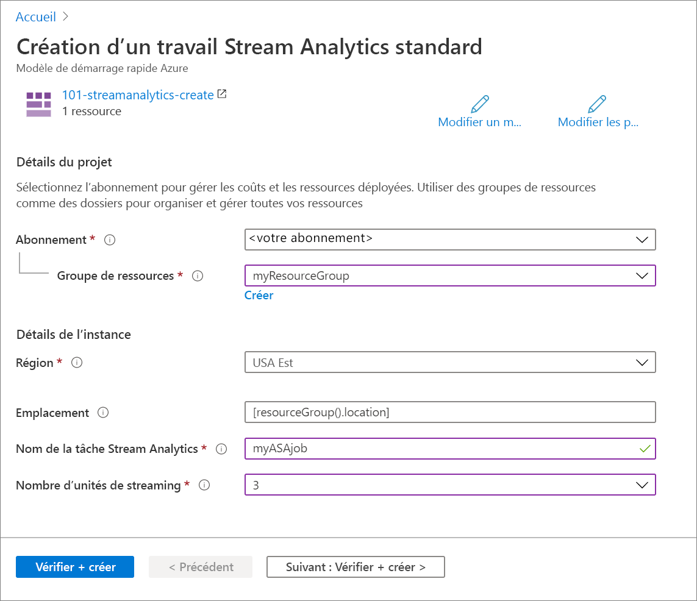

# <a name="quickstart-create-an-azure-stream-analytics-job-by-using-an-arm-template"></a>Démarrage rapide : Créer une tâche Azure Stream Analytics à l’aide d’un modèle Resource Manager

Dans le cadre de ce guide de démarrage rapide, vous allez utiliser un modèle Resource Manager (Azure Resource Manager) pour créer une tâche Azure Stream Analytics. Une fois la tâche créée, vous vérifierez le déploiement.

[!INCLUDE [About Azure Resource Manager](../../includes/resource-manager-quickstart-introduction.md)]

Si votre environnement remplit les prérequis et que vous êtes déjà familiarisé avec l’utilisation des modèles ARM, sélectionnez le bouton **Déployer sur Azure**. Le modèle s’ouvre dans le portail Azure.

[](https://portal.azure.com/#create/Microsoft.Template/uri/https%3A%2F%2Fraw.githubusercontent.com%2FAzure%2Fazure-quickstart-templates%2Fmaster%2F101-streamanalytics-create%2Fazuredeploy.json)

## <a name="prerequisites"></a>Prérequis

Pour effectuer ce qui est décrit dans cet article, vous avez besoin de ce qui suit :

* Un abonnement Azure - [En créer un gratuitement](https://azure.microsoft.com/free/)

## <a name="review-the-template"></a>Vérifier le modèle

Le modèle utilisé dans ce démarrage rapide est tiré des [modèles de démarrage rapide Azure](https://azure.microsoft.com/resources/templates/101-streamanalytics-create/).

:::code language="json" source="~/quickstart-templates/101-streamanalytics-create/azuredeploy.json":::

La ressource Azure définie dans le modèle est [Microsoft.StreamAnalytics/StreamingJobs](/azure/templates/microsoft.streamanalytics/streamingjobs) : créer une tâche Azure Stream Analytics.

## <a name="deploy-the-template"></a>Déployer le modèle

Dans cette section, vous créez une tâche Azure Stream Analytics en utilisant le modèle Resource Manager.

1. Cliquez sur l’image ci-après pour vous connecter à Azure et ouvrir un modèle. Le modèle crée une tâche Azure Stream Analytics.

   [](https://portal.azure.com/#create/Microsoft.Template/uri/https%3A%2F%2Fraw.githubusercontent.com%2FAzure%2Fazure-quickstart-templates%2Fmaster%2F101-streamanalytics-create%2Fazuredeploy.json)

2. Spécifiez les valeurs requises pour créer votre tâche Azure Stream Analytics.

   

   Renseignez les valeurs suivantes :

   |Propriété  |Description  |
   |---------|---------|
   |**Abonnement**     | Sélectionnez votre abonnement Azure dans la liste déroulante.        |
   |**Groupe de ressources**     | Indiquez si vous souhaitez créer un groupe de ressources Azure ou utiliser un groupe existant. Un groupe de ressources est un conteneur réunissant les ressources associées d’une solution Azure. Pour plus d’informations, consultez [Présentation des groupes de ressources Azure](../azure-resource-manager/management/overview.md). |
   |**Région**     | Sélectionnez **USA Est**. Pour les autres régions disponibles, consultez [Disponibilité des services Azure par région](https://azure.microsoft.com/regions/services/).        |
   |**Nom de la tâche Stream Analytics**     | Spécifiez le nom de votre tâche Stream Analytics.      |
   |**Nombre d’unités de streaming**     |  Indiquez le nombre d’unités de streaming dont vous avez besoin. Pour plus d’informations, voir [Comprendre et ajuster les unités de streaming](stream-analytics-streaming-unit-consumption.md).       |

3. Sélectionnez **Vérifier + créer**, puis **Créer**.

## <a name="review-deployed-resources"></a>Vérifier les ressources déployées

Vous pouvez soit utiliser le portail Azure pour vérifier la tâche Azure Stream Analytics, soit utiliser le script Azure CLI ou Azure PowerShell ci-dessous pour lister la ressource.

### <a name="azure-cli"></a>Azure CLI

```azurecli-interactive
echo "Enter your Azure Stream Analytics job name:" &&
read streamAnalyticsJobName &&
echo "Enter the resource group where the Azure Stream Analytics job exists:" &&
read resourcegroupName &&
az stream-analytics job show -g $resourcegroupName -n $streamAnalyticsJobName
```

### <a name="azure-powershell"></a>Azure PowerShell

```azurepowershell-interactive
$resourceGroupName = Read-Host -Prompt "Enter the resource group name where your Azure Stream Analytics job exists"
(Get-AzResource -ResourceType "Microsoft.StreamAnalytics/StreamingJobs" -ResourceGroupName $resourceGroupName).Name
 Write-Host "Press [ENTER] to continue..."
```

## <a name="clean-up-resources"></a>Nettoyer les ressources

Si vous prévoyez de suivre les tutoriels suivants, il peut être utile de conserver ces ressources. Si vous n’en avez plus besoin, supprimez le groupe de ressources. La tâche Azure Stream Analytics sera également supprimée. Pour supprimer le groupe de ressources avec Azure CLI ou Azure PowerShell :

### <a name="azure-cli"></a>Azure CLI

```azurecli-interactive
echo "Enter the Resource Group name:" &&
read resourceGroupName &&
az group delete --name $resourceGroupName &&
echo "Press [ENTER] to continue ..."
```

### <a name="azure-powershell"></a>Azure PowerShell

```azurepowershell-interactive
$resourceGroupName = Read-Host -Prompt "Enter the Resource Group name"
Remove-AzResourceGroup -Name $resourceGroupName
Write-Host "Press [ENTER] to continue..."
```

## <a name="next-steps"></a>Étapes suivantes

Dans le cadre de ce guide de démarrage rapide, vous avez créé une tâche Azure Stream Analytics en utilisant un modèle Resource Manager, puis vous avez vérifié le déploiement. Passez à l’article suivant pour découvrir comment exporter un modèle Resource Manager pour une tâche existante à l’aide de VS Code.

> [!div class="nextstepaction"]
> [Exporter un modèle Resource Manager de tâche Azure Stream Analytics](resource-manager-export.md)
