# <a name="quickstart-create-an-azure-stream-analytics-job-in-visual-studio-code-preview"></a>Démarrage rapide : Créer une tâche Azure Stream Analytics dans Visual Studio Code (préversion)

Ce démarrage rapide vous montre comment créer et exécuter une tâche Azure Stream Analytics à l’aide de l’extension Azure Stream Analytics Tools pour Visual Studio Code. Cet exemple de travail lit les données de streaming à partir d’un appareil Azure IoT Hub. Vous définissez un travail qui calcule la température moyenne quand elle dépasse 27 degrés et qui écrit les événements de sortie résultants dans un nouveau fichier du stockage d’objets blob.

> [!NOTE]
> Les outils Visual Studio et Visual Studio Code ne prennent pas en charge les travaux dans les régions Chine Est, Chine Nord, Allemagne Centre et Allemagne Nord-Est.

## <a name="before-you-begin"></a>Avant de commencer

* Si vous n’avez pas d’abonnement Azure, créez un [compte gratuit](https://azure.microsoft.com/free/).

* Connectez-vous au [portail Azure](https://portal.azure.com/).

* Installez [Visual Studio Code](https://code.visualstudio.com/).

## <a name="install-the-azure-stream-analytics-tools-extension"></a>Installer l’extension Azure Stream Analytics Tools

1. Ouvrez Visual Studio Code.

2. Sous **Extensions** dans le volet gauche, recherchez **Stream Analytics** , puis sélectionnez **Installer** sur l’extension **Azure Stream Analytics Tools**.

3. Une fois l’extension installée, vérifiez qu’ **Azure Stream Analytics Tools** est visible dans **Extensions activées**.

   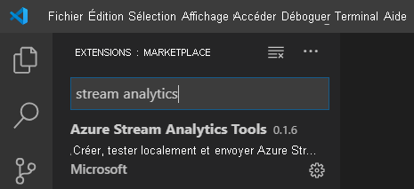

## <a name="activate-the-azure-stream-analytics-tools-extension"></a>Activer l’extension Azure Stream Analytics Tools

1. Sélectionnez l’icône **Azure** dans la barre d’activités Visual Studio Code. Sous **Stream Analytics** dans la barre latérale, sélectionnez **Se connecter à Azure**.

   

2. Une fois connecté, le nom de votre compte Azure s’affiche dans la barre d’état dans le coin inférieur gauche de la fenêtre Visual Studio Code.

> [!NOTE]
> Si vous ne vous déconnectez pas, l’extension Azure Stream Analytics Tools vous connectera automatiquement la prochaine fois. Si l’authentification à 2 facteurs est activée pour votre compte, nous vous recommandons d’utiliser l’authentification par téléphone plutôt qu’un code PIN.
> Si vous rencontrez des problèmes pour afficher la liste des ressources, déconnectez-vous, puis reconnectez-vous. Cette solution est généralement efficace. Pour vous déconnecter, entrez la commande `Azure: Sign Out`.

## <a name="prepare-the-input-data"></a>Préparer les données d’entrée

Avant de définir la tâche Stream Analytics, vous devez préparer les données qui seront configurées ultérieurement comme entrée de la tâche. Pour préparer les données d’entrée requises par la tâche, suivez les étapes ci-dessous :

1. Connectez-vous au [portail Azure](https://portal.azure.com/).

2. Sélectionnez **Créer une ressource** > **Internet des objets** > **IoT Hub**.

3. Dans le volet **IoT Hub** , entrez les informations suivantes :

   |**Paramètre**  |**Valeur suggérée**  |**Description**  |
   |---------|---------|---------|
   |Abonnement  | \<Your subscription\> |  Sélectionnez l’abonnement Azure que vous souhaitez utiliser. |
   |Groupe de ressources   |   asaquickstart-resourcegroup  |   Sélectionnez **Créer** et saisissez le nom du nouveau groupe de ressources pour votre compte. |
   |Région  |  \<Select the region that is closest to your users\> | Sélectionnez un emplacement géographique où vous pouvez héberger votre hub IoT. Utilisez l’emplacement le plus proche de vos utilisateurs. |
   |Nom du hub IoT  | MyASAIoTHub  |   Sélectionnez un nom pour votre hub IoT.   |

   

4. Sélectionnez **Suivant : Définir la taille et l’échelle**.

5. Effectuez une sélection pour **Niveau de tarification et de mise à l’échelle**. Pour ce guide de démarrage rapide, sélectionnez le niveau **F1 - Gratuit** s’il est toujours disponible sur votre abonnement. Si le niveau Gratuit n’est pas disponible, choisissez le niveau le plus bas disponible. Pour plus d’informations, voir la [tarification d’Azure IoT Hub](https://azure.microsoft.com/pricing/details/iot-hub/).

   

6. Sélectionnez **Revoir + créer**. Passez en revue les informations de votre hub IoT et sélectionnez **Créer**. La création de votre IoT Hub peut prendre plusieurs minutes. Vous pouvez superviser la progression dans le volet **Notifications**.

7. Dans le menu de navigation de votre hub IoT, sélectionnez **Ajouter** sous **Appareils IoT**. Ajoutez un ID pour **ID d’appareil** , puis sélectionnez **Enregistrer**.

   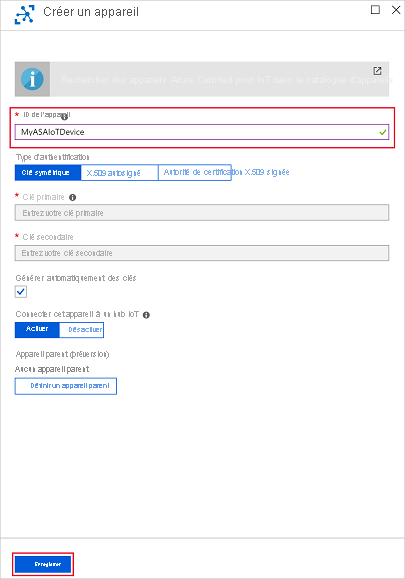

8. Une fois que l’appareil est créé, ouvrez-le dans la liste **Appareils IoT**. Copiez la chaîne dans **Chaîne de connexion (clé primaire)** et enregistrez-la dans un bloc-notes pour une utilisation ultérieure.

   

## <a name="run-the-iot-simulator"></a>Exécuter le simulateur IoT

1. Ouvrez le [simulateur en ligne Azure IoT Raspberry Pi](https://azure-samples.github.io/raspberry-pi-web-simulator/) dans un autre onglet ou une nouvelle fenêtre de navigateur.

2. Remplacez l’espace réservé à la ligne 15 par la chaîne de connexion de l’appareil IoT Hub enregistrée précédemment.

3. Sélectionnez **Exécuter**. La sortie doit indiquer les données de capteur et les messages qui sont envoyés à votre hub IoT.

   

## <a name="create-blob-storage"></a>Créer un stockage d’objets blob

1. Dans le coin supérieur gauche du portail Azure, sélectionnez **Créer une ressource** > **Stockage** > **Compte de stockage**.

2. Dans le volet **Créer un compte de stockage** , entrez un nom, un emplacement et un groupe de ressources de compte de stockage. Choisissez les mêmes emplacement et groupe de ressources que pour le hub IoT que vous avez créé. Ensuite, sélectionnez **Vérifier + créer** pour créer le compte.

   

3. Une fois que votre compte de stockage est créé, sélectionnez la vignette **Objets blob** dans le volet **Vue d’ensemble**.

   

4. Dans la page **Service Blob** , sélectionnez **Conteneur** et donnez un nom à votre conteneur, tel que **conteneur1**. Pour **Niveau d’accès public** laissez la valeur **Privé (aucun accès anonyme)** et sélectionnez **OK**.

   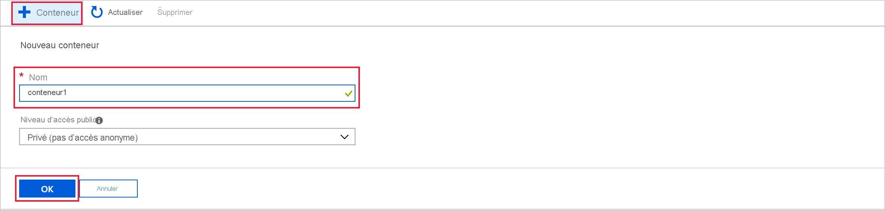

## <a name="create-a-stream-analytics-project"></a>Créer un projet Stream Analytics

1. Dans Visual Studio Code, sélectionnez **Ctrl+Maj+P** pour ouvrir la palette de commandes. Entrez ensuite **ASA** et sélectionnez **ASA : Créer un projet**.

   

2. Entrez le nom de votre projet, par exemple **myASAproj** , puis sélectionnez un dossier pour votre projet.

    

3. Le nouveau projet est ajouté à votre espace de travail. Un projet Stream Analytics se compose de trois dossiers : **Entrées** , **Sorties** et **Fonctions**. Il comprend aussi le script de requête **(*.asaql)** , un fichier **JobConfig.json** et un fichier de configuration **asaproj.json**.

    Le fichier de configuration **asaproj.json** contient les entrées, les sorties et les informations du fichier de configuration de tâche nécessaires pour soumettre la tâche Stream Analytics à Azure.

    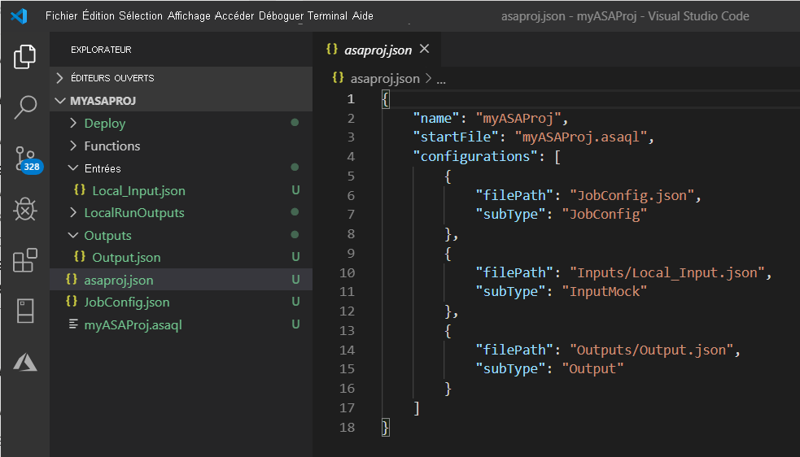

> [!Note]
> Lorsque vous ajoutez des entrées et sorties à partir de la palette de commandes, les chemins correspondants sont automatiquement ajoutés au fichier **asaproj.json**. Si vous ajoutez ou supprimez des entrées ou sorties directement sur disque, vous devez le faire manuellement dans le fichier **asaproj.json**. Vous pouvez choisir de placer les entrées et sorties à un seul emplacement, puis de les référencer dans différentes tâches en spécifiant leurs chemins dans chaque fichier **asaproj.json**.

## <a name="define-the-transformation-query"></a>Définir la requête de transformation

1. Ouvrez **myASAproj.asaql** à partir du dossier de votre projet.

2. Ajoutez la requête suivante :

   ```sql
   SELECT *
   INTO Output
   FROM Input
   HAVING Temperature > 27
   ```

## <a name="define-a-live-input"></a>Définir une entrée en production

1. Cliquez avec le bouton droit sur le dossier **Entrées** dans votre projet Stream Analytics. Sélectionnez ensuite **ASA : Ajouter une entrée** dans le menu contextuel.

    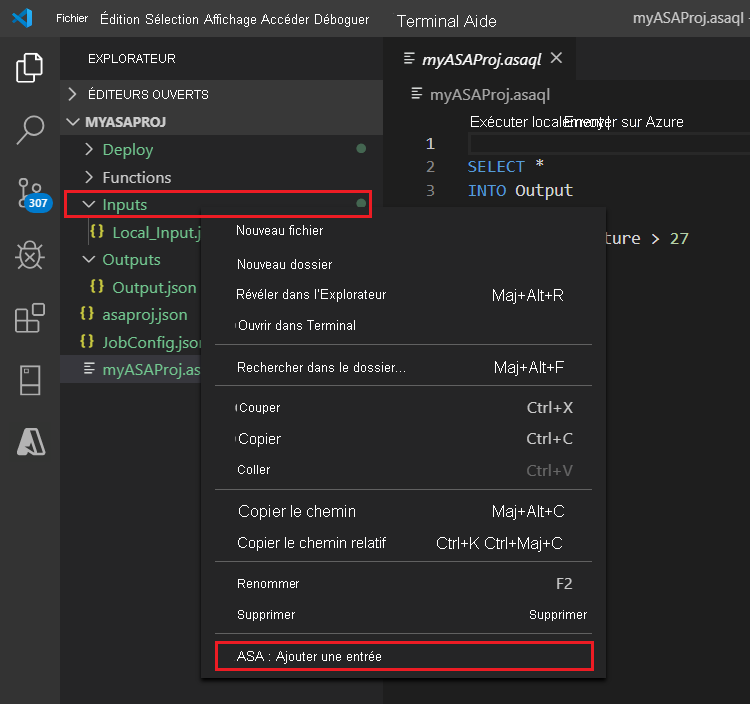

    Sinon, sélectionnez **Ctrl+Maj+P** pour ouvrir la palette de commandes, puis entrez **ASA : Ajouter une entrée**.

   

2. Choisissez **IoT Hub** pour le type d’entrée.

   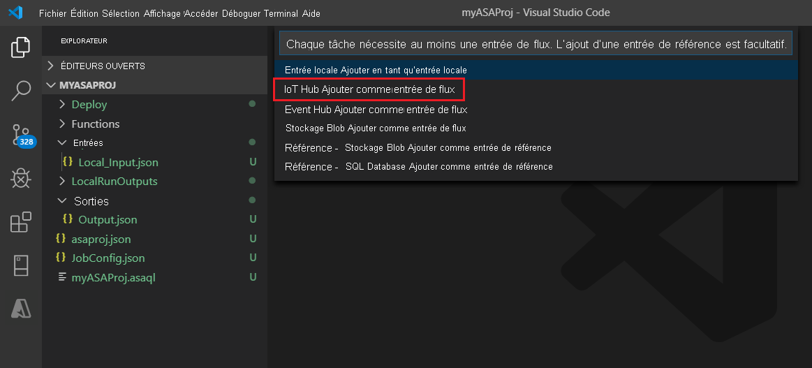

3. Si vous avez ajouté l'entrée à partir de la palette de commandes, choisissez le script de requête Stream Analytics qui utilisera l'entrée. Celui-ci doit être automatiquement renseigné avec le chemin du fichier **myASAproj.asaql**.

   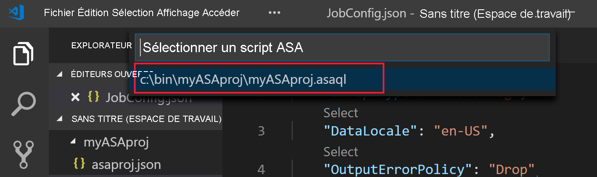

4. Choisissez **Sélectionner parmi vos abonnements Azure** dans le menu déroulant.

    

5. Modifiez le fichier **IoTHub1.json** qui vient d’être généré avec les valeurs suivantes. Conservez les valeurs par défaut pour les champs non mentionnés ici.

   |Paramètre|Valeur suggérée|Description|
   |-------|---------------|-----------|
   |Nom|Entrée|Saisissez un nom pour identifier l’entrée de la tâche.|
   |IotHubNamespace|MyASAIoTHub|Choisissez ou entrez le nom de votre hub IoT. Si les hubs IoT sont créés dans le même abonnement, leurs noms sont automatiquement détectés.|
   |SharedAccessPolicyName|iothubowner| |

   Vous pouvez vous aider de la fonctionnalité CodeLens pour entrer une chaîne, opérer une sélection dans une liste déroulante ou modifier le texte directement dans le fichier. La capture d’écran suivante montre **Sélectionner parmi vos abonnements** à titre d’exemple. Les informations d’identification sont automatiquement listées et enregistrées dans le gestionnaire d’informations d’identification local.

   

   

## <a name="preview-input"></a>Afficher un aperçu de l'entrée

Sélectionnez **Aperçu des données** dans **IoTHub1.json** à partir de la ligne supérieure. Certaines données d’entrée sont extraites du hub IoT et affichées dans la fenêtre d’aperçu. Ce processus peut prendre un certain temps.

 

## <a name="define-an-output"></a>Définition d’une sortie

1. Sélectionnez **Ctrl+Maj+P** pour ouvrir la palette de commandes. Puis saisissez **ASA : Ajouter une sortie**.

   

2. Choisissez **Stockage Blob** comme type de récepteur.

3. Choisissez le script de requête Stream Analytics qui utilisera cette entrée.

4. Entrez **BlobStorage** comme nom du fichier de sortie.

5. Modifiez **BlobStorage** avec les valeurs suivantes. Conservez les valeurs par défaut pour les champs non mentionnés ici. Utilisez la fonctionnalité CodeLens pour opérer une sélection dans une liste déroulante ou pour entrer une chaîne.

   |Paramètre|Valeur suggérée|Description|
   |-------|---------------|-----------|
   |Nom|Output| Saisissez un nom pour identifier la sortie de la tâche.|
   |Compte de stockage|asaquickstartstorage|Sélectionnez ou saisissez le nom de votre compte de stockage. Les noms de compte de stockage sont automatiquement détectés s’ils sont créés dans le même abonnement.|
   |Conteneur|conteneur1|Sélectionnez un conteneur existant que vous avez créé dans votre compte de stockage.|
   |Modèle de chemin d'accès|sortie|Entrez le nom d’un chemin de fichier qui doit être créé dans le conteneur.|

   

## <a name="compile-the-script"></a>Compiler le script

La compilation du script vérifie la syntaxe et génère les modèles Azure Resource Manager pour le déploiement automatique.

Vous pouvez déclencher la compilation du script de deux façons :

- Sélectionnez le script dans l’espace de travail, puis compilez à partir de la palette de commandes.

   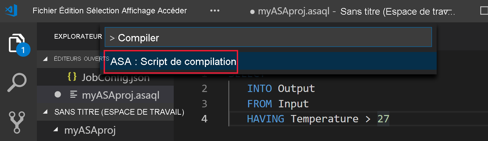

- Cliquez avec le bouton droit sur le script et sélectionnez **ASA : Compile Script**.

    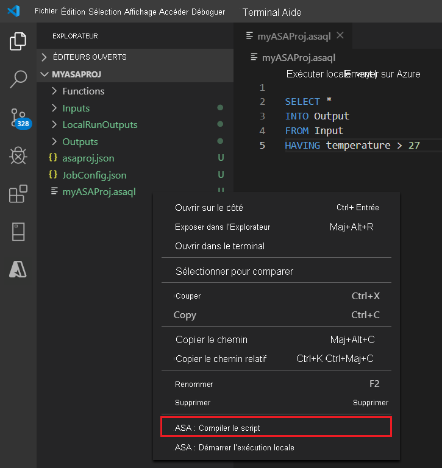

Une fois la compilation terminée, vous pouvez trouver les deux modèles Azure Resource Manager générés dans le dossier **Déployer** de votre projet. Ces deux fichiers sont utilisés pour le déploiement automatique.

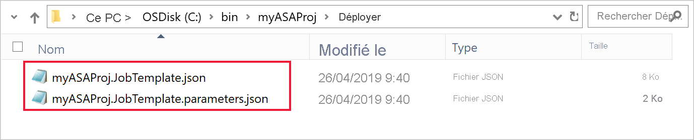

## <a name="submit-a-stream-analytics-job-to-azure"></a>Envoyer une tâche Stream Analytics à Azure

1. Dans la fenêtre de l’éditeur de script de votre script de requête, sélectionnez **Envoyer sur Azure**.

   

2. Dans la liste contextuelle, sélectionnez votre abonnement.

3. Choisissez **Select a job** (Sélectionner une tâche). Choisissez ensuite **Create New Job** (Créer une tâche).

4. Entrez le nom de votre tâche, **myASAjob**. Suivez ensuite les instructions pour choisir le groupe de ressources et l’emplacement.

5. Sélectionnez **Envoyer sur Azure**. Vous pouvez trouver les journaux dans la fenêtre Sortie. 

6. Une fois que vous avez créé votre tâche, vous pouvez la voir dans l’ **Explorateur Stream Analytics**.

    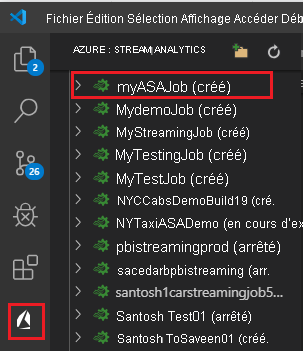

## <a name="start-the-stream-analytics-job-and-check-output"></a>Démarrer la tâche Stream Analytics et observez le résultat

1. Ouvrez **Stream Analytics Explorer** dans Visual Studio Code, puis recherchez votre tâche **myASAJob**.

2. Cliquez avec le bouton droit sur le nom de la tâche. Ensuite, sélectionnez **Démarrer** dans le menu contextuel.

   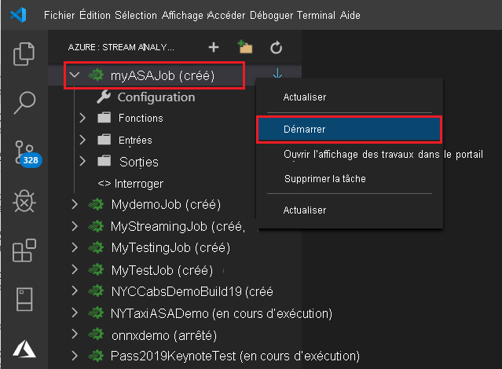

3. Choisissez **Maintenant** dans la fenêtre contextuelle pour démarrer la tâche.

4. Notez que l’état de la tâche est désormais **En cours d’exécution**. Cliquez avec le bouton droit sur le nom de la tâche, puis sélectionnez **Open Job View in Portal** (Ouvrir la vue de la tâche dans le portail) pour voir les métriques d’événement d’entrée et de sortie. Cette action peut prendre quelques minutes.

5. Pour afficher les résultats, ouvrez le stockage d’objets blob dans l’extension Visual Studio Code ou dans le portail Azure.

## <a name="clean-up-resources"></a>Nettoyer les ressources

Lorsque vous n’en avez plus besoin, supprimez le groupe de ressources, la tâche de streaming et toutes les ressources associées. La suppression de la tâche évite la facturation des unités de streaming consommées par celle-ci. 

Si vous envisagez d’utiliser la tâche à l’avenir, vous pouvez l’arrêter et la redémarrer plus tard. Si vous n’allez pas réutiliser cette tâche, procédez comme suit pour supprimer toutes les ressources que vous avez créées dans ce guide de démarrage rapide :

1. Dans le menu de gauche du portail Azure, sélectionnez **Groupes de ressources** , puis le nom de la ressource que vous avez créée.  

2. Dans la page de votre groupe de ressources, sélectionnez **Supprimer**. Entrez le nom de la ressource à supprimer dans la zone de texte, puis sélectionnez **Supprimer**.

## <a name="next-steps"></a>Étapes suivantes

En suivant ce guide de démarrage rapide, vous avez déployé une tâche Stream Analytics simple à l’aide de Visual Studio Code. Vous pouvez également déployer des tâches Stream Analytics à l’aide du [portail Azure](stream-analytics-quick-create-portal.md), de [PowerShell](stream-analytics-quick-create-powershell.md) et de [Visual Studio](stream-analytics-quick-create-vs.md).

Pour en savoir plus sur Azure Stream Analytics Tools pour Visual Studio Code, consultez les articles suivants :

* [Tester des requêtes Stream Analytics localement avec des exemples de données à l’aide de Visual Studio Code](visual-studio-code-local-run.md)

* [Tester des tâches Azure Stream Analytics localement par rapport à une entrée en production à l’aide de Visual Studio Code](visual-studio-code-local-run-live-input.md)

* [Utiliser Visual Studio Code pour afficher les tâches Azure Stream Analytics](visual-studio-code-explore-jobs.md)

* [Configurer des pipelines CI/CD à l’aide du package npm](./cicd-overview.md)