# <a name="quickstart-create-an-azure-stream-analytics-cloud-job-in-visual-studio-code-preview"></a>Démarrage rapide : Créer une tâche cloud Azure Stream Analytics dans Visual Studio Code (préversion)

Ce démarrage rapide vous montre comment créer et exécuter une tâche Stream Analytics à l’aide de l’extension Azure Stream Analytics pour Visual Studio Code. Cet exemple de travail lit les données de streaming à partir d’un appareil IoT Hub. Vous définissez un travail qui calcule la température moyenne quand elle dépasse 27 degrés et qui écrit les événements de sortie résultants dans un nouveau fichier du stockage d’objets blob.

## <a name="before-you-begin"></a>Avant de commencer

* Si vous n’avez pas d’abonnement Azure, créez un [compte gratuit](https://azure.microsoft.com/free/).

* Connectez-vous au [Portail Azure](https://portal.azure.com/).

* Installez [Visual Studio Code](https://code.visualstudio.com/).

## <a name="install-the-azure-stream-analytics-extension"></a>Installez l’extension Azure Stream Analytics.

1. Ouvrez Visual Studio Code.

2. Sous **Extensions** dans le volet gauche, recherchez **Stream Analytics**, puis sélectionnez **Installer** sur l’extension **Azure Stream Analytics**.

3. Une fois l’extension installée, vérifiez que l’option **Azure Stream Analytics Tools** est visible dans vos **Extensions activées**.

   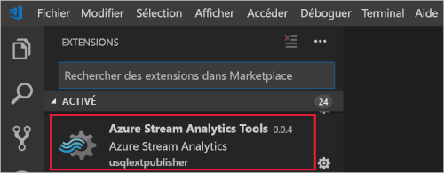

## <a name="activate-the-azure-stream-analytics-extension"></a>Activer l’extension d’Azure Stream Analytics

1. Sélectionnez l’icône **Azure** dans la barre d’activités de VS Code. **Stream Analytics** sera visible dans la barre latérale. Sous **Stream Analytics**, sélectionnez **Connectez-vous à Azure**. 

   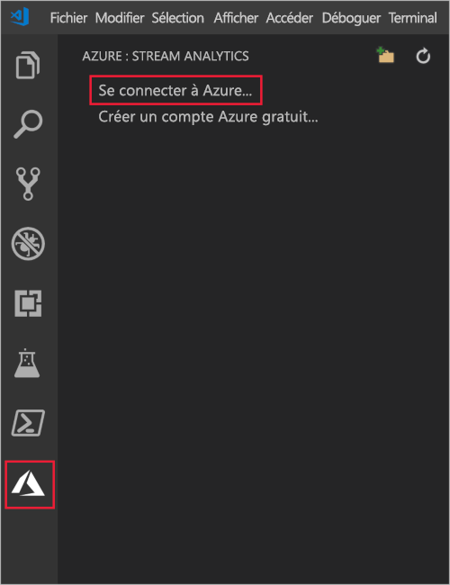

2. Une fois connecté, le nom de votre compte Azure s’affiche dans la barre d’état dans l’ange inférieur gauche de la fenêtre VS Code.

> [!NOTE]
> Si vous ne vous déconnectez pas, Azure Stream Analytics Tools vous connectera automatiquement la prochaine fois. Si l’authentification à 2 facteurs est activée pour votre compte, nous vous recommandons d’utiliser l’authentification par téléphone plutôt qu’un code confidentiel.
> Si vous rencontrez des problèmes pour afficher la liste des ressources, déconnectez-vous, puis reconnectez-vous. Cette solution est généralement efficace. Pour vous déconnecter, entrez la commande `Azure: Sign Out`.

## <a name="prepare-the-input-data"></a>Préparer les données d’entrée

Avant de définir le travail Stream Analytics, vous devez préparer les données qui seront configurées ultérieurement comme entrée pour le travail. Pour préparer les données d’entrée requises pour le travail, exécutez les opérations suivantes :

1. Connectez-vous au [Portail Azure](https://portal.azure.com/).

2. Sélectionnez **Créer une ressource** > **Internet des objets** > **IoT Hub**.

3. Dans le volet **IoT Hub**, entrez les informations suivantes :
   
   |**Paramètre**  |**Valeur suggérée**  |**Description**  |
   |---------|---------|---------|
   |Subscription  | \<Votre abonnement\> |  Sélectionnez l’abonnement Azure que vous souhaitez utiliser. |
   |Resource group   |   asaquickstart-resourcegroup  |   Sélectionnez **Créer** et saisissez le nom du nouveau groupe de ressources pour votre compte. |
   |Région  |  \<Sélectionnez la région la plus proche de vos utilisateurs\> | Sélectionnez l’emplacement géographique où vous pouvez héberger votre hub IoT. Utilisez l’emplacement le plus proche de vos utilisateurs. |
   |Nom du hub IoT  | MyASAIoTHub  |   Sélectionnez un nom pour votre hub IoT.   |

   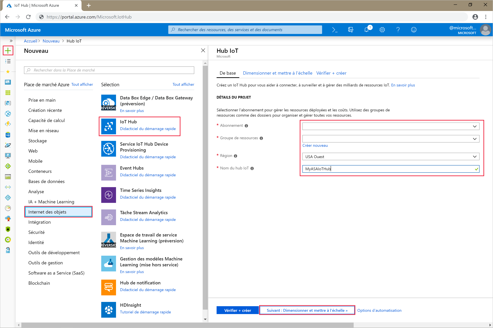

4. Sélectionnez **Suivant : Définir la taille et l’échelle**.

5. Choisissez votre **niveau de tarification et de mise à l’échelle**. Pour ce guide de démarrage rapide, sélectionnez le niveau **F1 - Gratuit** s’il est toujours disponible sur votre abonnement. Si le niveau Gratuit n’est pas disponible, choisissez le niveau le plus bas disponible. Pour plus d’informations, consultez la [tarification IoT Hub](https://azure.microsoft.com/pricing/details/iot-hub/).

   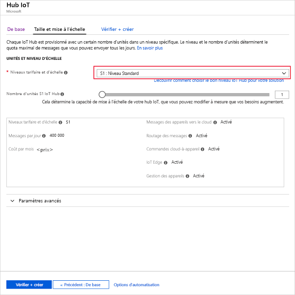

6. Sélectionnez **Revoir + créer**. Passez en revue les informations de votre hub IoT et cliquez sur **Créer**. La création de votre hub IoT peut prendre plusieurs minutes. Vous pouvez suivre la progression dans le volet **Notifications**.

7. Dans le menu de navigation de votre hub IoT, cliquez sur **Ajouter** sous **Appareils IoT**. Ajoutez un **ID d’appareil** et cliquez sur **Enregistrer**.

   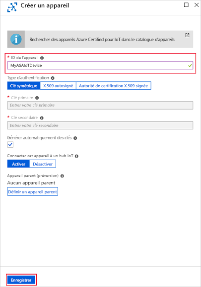

8. Une fois que l’appareil a été créé, ouvrez-le dans la liste **Appareils IoT**. Copiez la valeur **Chaîne de connexion -- clé primaire** et enregistrez-la dans un bloc-notes pour une utilisation ultérieure.

   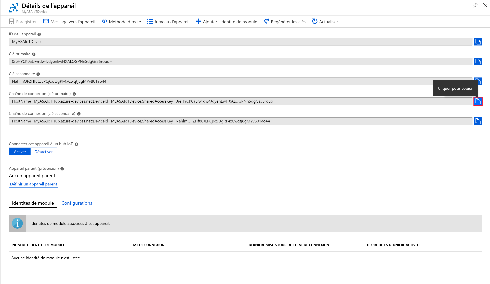

## <a name="create-blob-storage"></a>Créer un stockage d’objets blob

1. Dans le coin supérieur gauche du portail Azure, sélectionnez **Créer une ressource** > **Stockage** > **Compte de stockage**.

2. Dans le volet **Créer un compte de stockage**, entrez un nom, un emplacement et un groupe de ressources de compte de stockage. Choisissez les mêmes emplacement et groupe de ressources que pour le hub IoT que vous avez créé. Ensuite, cliquez sur **Vérifier + créer** pour créer le compte.

   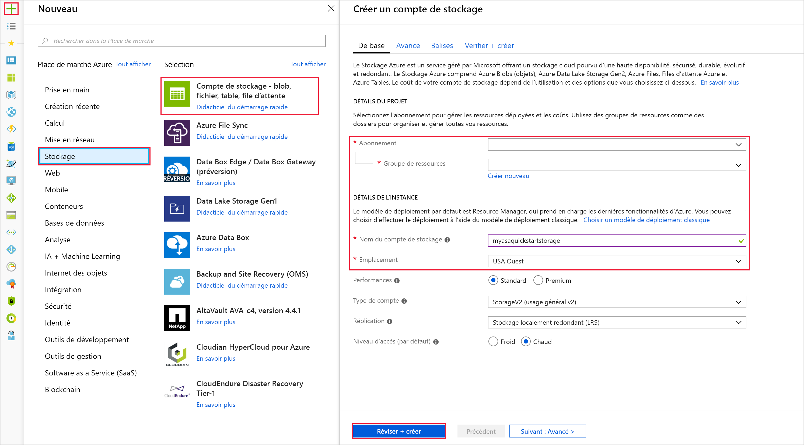

3. Une fois que votre compte de stockage a été créé, sélectionnez la vignette **Objets blob** dans le volet **Vue d’ensemble**.

   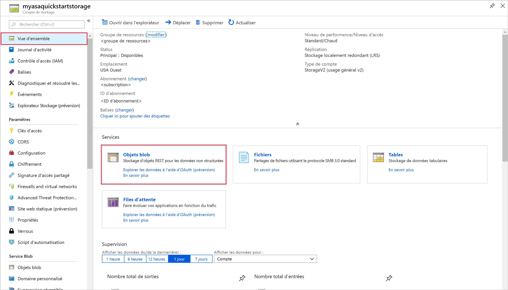

4. Dans la page **Service Blob**, sélectionnez **Conteneur** et donnez un nom à votre conteneur, tel que *conteneur1*. Pour **Niveau d’accès public** laissez la valeur **Privé (aucun accès anonyme)** et sélectionnez **OK**.

   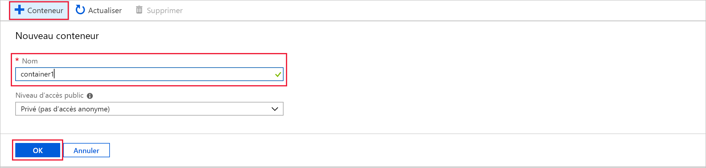

## <a name="create-a-stream-analytics-project"></a>Créer un projet Stream Analytics

1. Dans Visual Studio Code, appuyez sur **Ctrl+Maj+P** pour ouvrir la palette de commandes. Saisissez ensuite **ASA** et sélectionnez **ASA : Créer un projet**.

   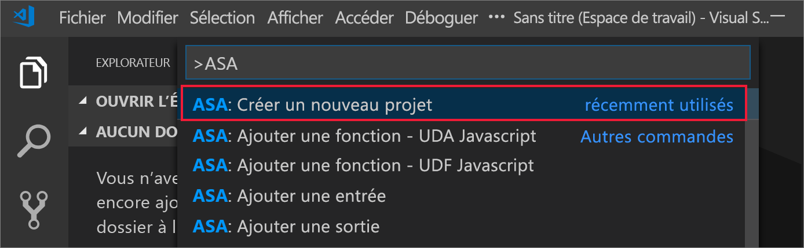

2. Entrez le nom de votre projet, par exemple **myASAproj**, puis sélectionnez un dossier pour votre projet.

    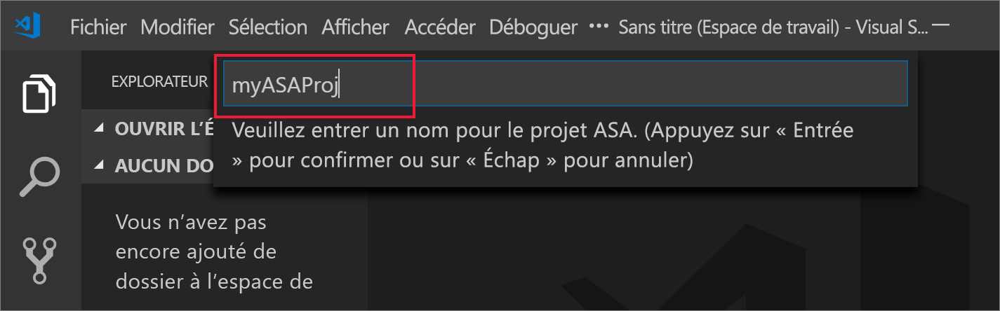

3. Le nouveau projet est ajouté à votre espace de travail. Un projet ASA comprend un script de requête **(*.asaql)** , un fichier **JobConfig.json** et un fichier de configuration **asaproj.json**.

   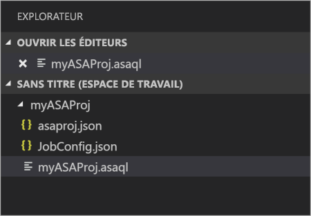

4. Le fichier de configuration **asaproj.json** contient les entrées, les sorties et les informations du fichier de configuration de tâche nécessaires pour soumettre la tâche Stream Analytics à Azure.

   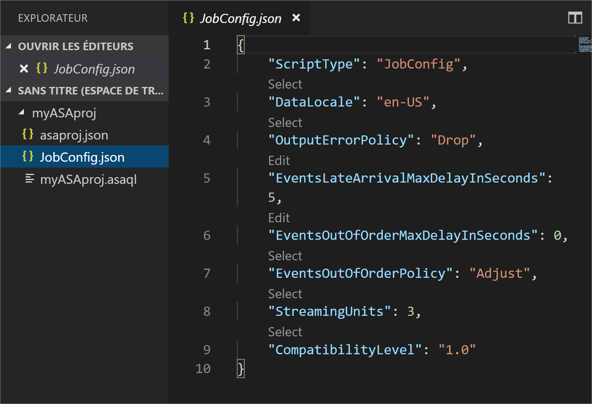

> [!Note]
> Lorsque vous ajoutez des entrées et sorties à partir de la palette de commandes, les chemins d’accès correspondants sont automatiquement ajoutés au fichier **asaproj.json**. Si vous ajoutez ou supprimez des entrées ou sorties directement sur disque, vous devez le faire manuellement dans le fichier **asaproj.json**. Vous pouvez choisir de placer les entrées et sorties dans un seul emplacement, puis les référencer dans différentes tâches en spécifiant leurs chemins d’accès dans chaque **asaproj.json**.

## <a name="define-the-transformation-query"></a>Définir la requête de transformation

1. Ouvrez **myASAproj.asaql** à partir du dossier de votre projet.

2. Ajoutez la requête suivante :

   ```sql
   SELECT * 
   INTO Output
   FROM Input
   HAVING Temperature > 27
   ```
## <a name="test-with-sample-data"></a>Tester avec des exemples de données
Avant d’exécuter la requête dans le cloud, vous pouvez tester votre requête sur des exemples de données locaux afin de vérifier la logique de la requête.

Pour plus d’informations, suivez les instructions fournies dans [Effectuer des tests sur des exemples de données](vscode-local-run.md). 

 

## <a name="define-an-input"></a>Définition d’une entrée

1. Sélectionnez **Ctrl+Maj+P** pour ouvrir la palette de commandes, puis entrez **ASA : Ajouter une entrée**.

   

2. Choisissez **IoT Hub** pour le type d’entrée.

   

3. Choisissez le script de requête ASA qui utilisera l’entrée. Il doit renseigner automatiquement le chemin d’accès à **myASAproj.asaql**.

   

4. Entrez **IotHub** comme nom du fichier d’entrée.

5. Modifiez **IoTHub.json** avec les valeurs suivantes. Conservez les valeurs par défaut pour les champs non mentionnés ci-dessous. Vous pouvez vous aider de CodeLens pour entrer une chaîne, opérer une sélection dans une liste déroulante ou modifier le texte directement dans le fichier.

   |Paramètre|Valeur suggérée|Description|
   |-------|---------------|-----------|
   |Nom|Entrée|Saisissez un nom pour identifier l’entrée du travail.|
   |IotHubNamespace|MyASAIoTHub|Choisissez ou entrez le nom de votre hub IoT. Si les hubs IoT sont créés dans le même abonnement, leurs noms sont automatiquement détectés.|
   |SharedAccessPolicyName|iothubowner| |

   


## <a name="define-an-output"></a>Définition d’une sortie

1. Sélectionnez **Ctrl+Maj+P** pour ouvrir la palette de commandes. Puis saisissez **ASA : Ajouter une sortie**.

   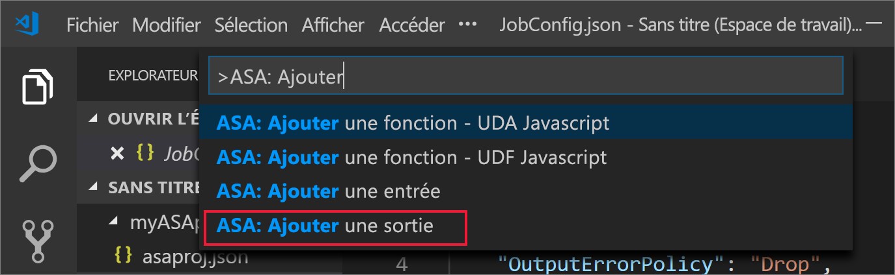

2. Choisissez **Stockage Blob** comme Type de récepteur.

3. Choisissez le script de requête ASA qui utilisera cette entrée.

4. Entrez **BlobStorage** comme nom du fichier de sortie.

5. Modifiez **BlobStorage** avec les valeurs suivantes. Conservez les valeurs par défaut pour les champs non mentionnés ci-dessous. Utilisez CodeLens pour opérer une sélection dans une liste déroulante ou pour entrer une chaîne. 

   |Paramètre|Valeur suggérée|Description|
   |-------|---------------|-----------|
   |Nom|Output| Saisissez un nom pour identifier la sortie de la tâche.|
   |Compte de stockage|asaquickstartstorage|Sélectionnez ou saisissez le nom de votre compte de stockage. Les noms de compte de stockage sont automatiquement détectés s’ils sont créés dans le même abonnement.|
   |Conteneur|conteneur1|Sélectionnez un conteneur existant que vous avez créé dans votre compte de stockage.|
   |Modèle de chemin d'accès|sortie|Entrez le nom d’un chemin de fichier qui doit être créé dans le conteneur.|

 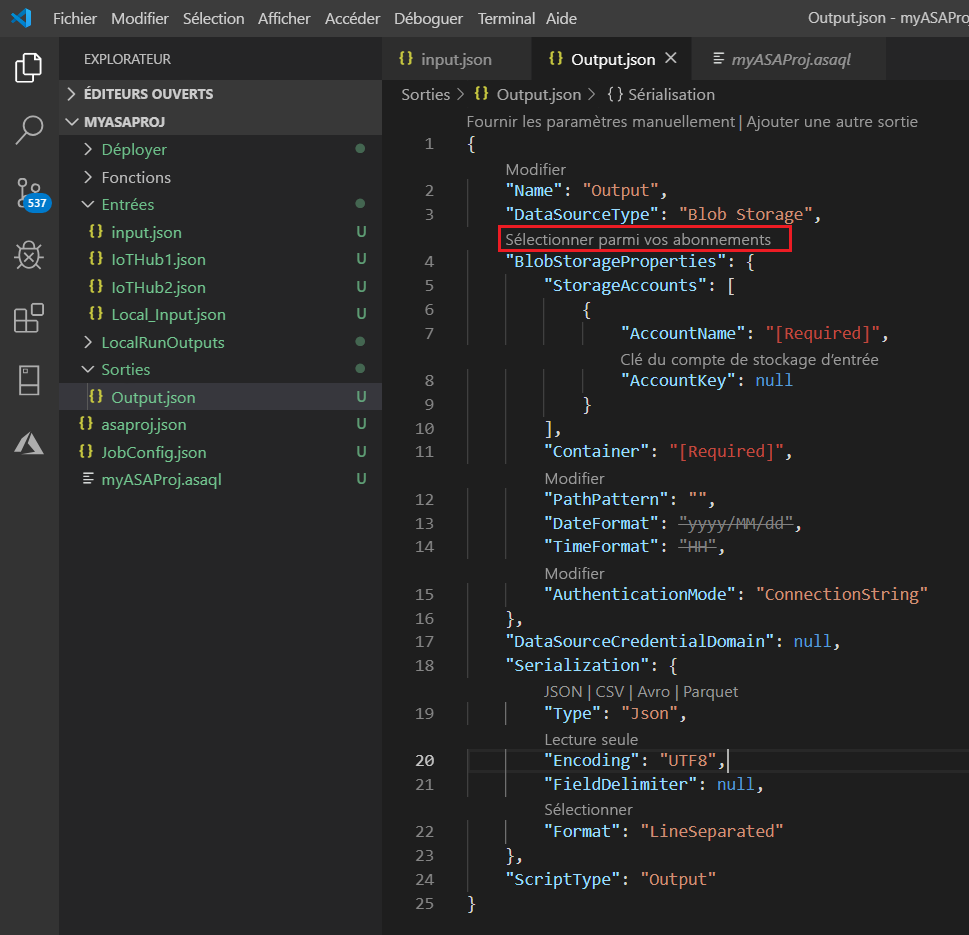

## <a name="compile-the-script"></a>Compiler le script

La compilation du script a deux fonctions : vérifier la syntaxe et générer les modèles Azure Resource Manager pour le déploiement automatique.

Vous pouvez déclencher la compilation du script de deux façons :

1. Sélectionnez le script dans l’espace de travail, puis déclenchez la compilation à partir de la palette de commandes. 

   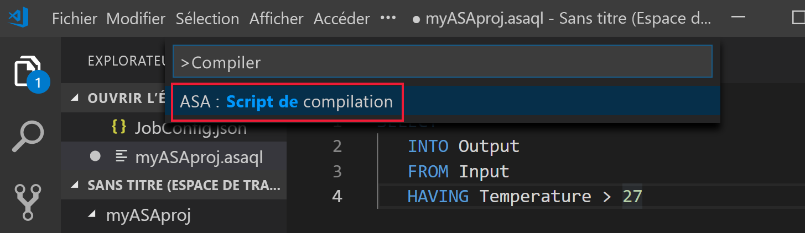

2. Cliquez avec le bouton droit sur le script, puis sélectionnez **ASA : Compiler le script**.

    

3. Une fois la compilation terminée, vous pouvez trouver les deux modèles Azure Resource Manager générés dans le dossier **Déployer** de votre projet. Ces deux fichiers sont utilisés pour le déploiement automatique.

    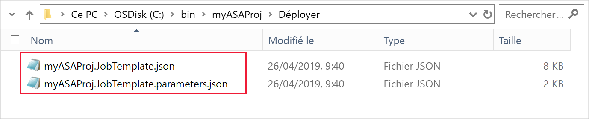

## <a name="submit-a-stream-analytics-job-to-azure"></a>Envoyer une tâche Stream Analytics à Azure

1. Dans la fenêtre de l’éditeur de script de Visual Studio Code, choisissez **Select from your subscriptions** (Sélectionnez parmi vos abonnements).

   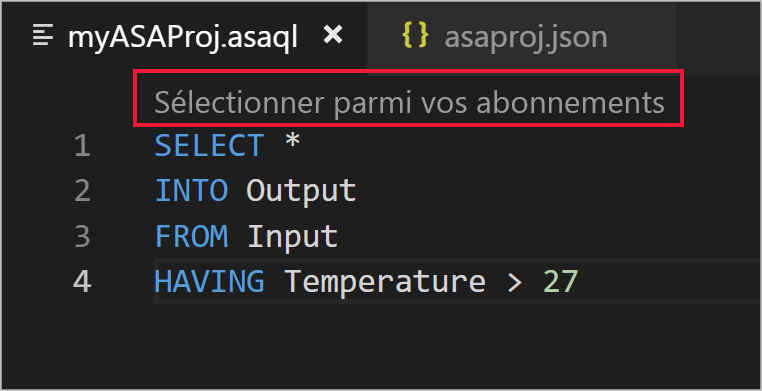

2. Dans la liste déroulante, sélectionnez votre abonnement.

3. Sélectionnez une tâche**. Choisissez ensuite Create a new job (Créer une tâche).

4. Entrez le nom de votre tâche, **myASAjob**, puis suivez les instructions pour choisir le groupe de ressources et l’emplacement.

5. Sélectionnez **Envoyer sur Azure**. Les journaux figurent dans la fenêtre de sortie. 

6. Une fois que vous avez créé votre tâche, vous pouvez la voir dans l’**Explorateur Stream Analytics**.

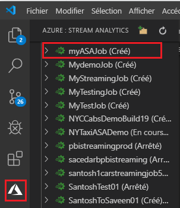


## <a name="run-the-iot-simulator"></a>Exécuter le simulateur IoT

1. Ouvrez le [simulateur en ligne Azure IoT Raspberry Pi](https://azure-samples.github.io/raspberry-pi-web-simulator/) dans un autre onglet ou une nouvelle fenêtre de navigateur.

2. Remplacez l’espace réservé à la ligne 15 par la chaîne de connexion de l’appareil Azure IoT Hub.

3. Cliquez sur **Exécuter**. La sortie doit indiquer les données de capteur et les messages qui sont envoyés à votre hub IoT.

   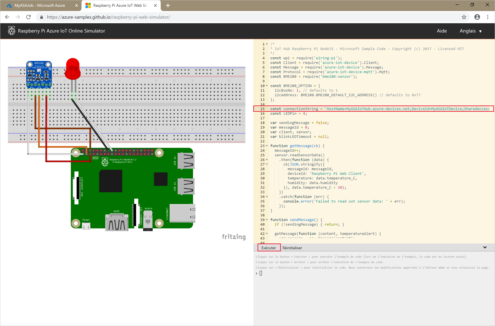

## <a name="start-the-stream-analytics-job-and-check-output"></a>Démarrer la tâche Stream Analytics et observez le résultat

1. Ouvrez **Stream Analytics Explorer** dans Visual Studio Code, puis recherchez votre tâche **myASAJob**.

2. Cliquez avec le bouton droit sur le nom de la tâche. Ensuite, sélectionnez **Démarrer** dans le menu contextuel.

   

3. Choisissez **Maintenant** dans la fenêtre contextuelle pour démarrer la tâche.

4. Notez que l’état de la tâche travail est désormais **En cours d’exécution**. Cliquez avec le bouton droit sur le nom de la tâche, puis choisissez **Open Job View in Portal** (Ouvrir la vue de la tâche dans le portail) pour voir les métriques d’événement d’entrée et de sortie. Cette action peut prendre quelques minutes.

5. Pour afficher les résultats, ouvrez le stockage d’objets blob dans l’extension Visual Studio Code ou dans le portail Azure.

## <a name="clean-up-resources"></a>Supprimer des ressources

Lorsque vous n’en avez plus besoin, supprimez le groupe de ressources, le travail de streaming et toutes les ressources associées. La suppression du travail évite la facturation des unités de streaming consommées par le travail. Si vous envisagez d’utiliser le travail à l’avenir, vous pouvez l’arrêter et le redémarrer plus tard lorsque vous en avez besoin. Si vous ne pensez pas continuer à utiliser ce travail, supprimez toutes les ressources créées pendant ce guide de démarrage rapide en procédant comme suit :

1. Dans le menu de gauche du portail Azure, cliquez sur **Groupes de ressources**, puis sur le nom de la ressource que vous avez créée.  

2. Sur la page de votre groupe de ressources, sélectionnez **Supprimer**, saisissez le nom de la ressource à supprimer dans la zone de texte, puis sélectionnez **Supprimer**.

## <a name="next-steps"></a>Étapes suivantes

En suivant ce guide de démarrage rapide, vous avez déployé une tâche Stream Analytics simple à l’aide de Visual Studio Code. Vous pouvez également déployer des tâches Stream Analytics à l’aide du [portail Azure](stream-analytics-quick-create-portal.md), de [PowerShell](stream-analytics-quick-create-powershell.md) et de Visual Studio (stream-analytics-quick-create-vs.md). 

Pour en savoir plus sur les outils Azure Stream Analytics pour Visual Studio, consultez l’article suivant :

> [!div class="nextstepaction"]
> [Utiliser Visual Studio pour afficher les tâches Azure Stream Analytics](stream-analytics-vs-tools.md)
