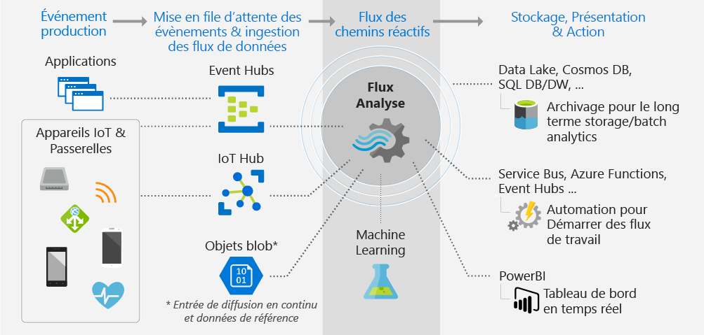
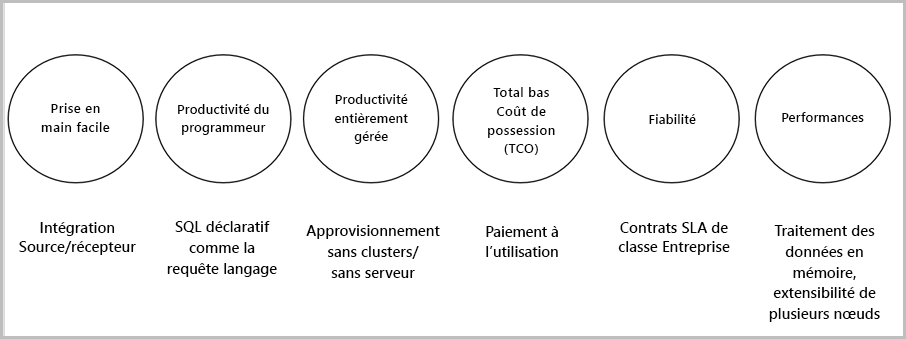

# Qu’est-ce que Stream Analytics ?

Azure Stream Analytics est un moteur de traitement des événements qui vous permet d’examiner de grands volumes de données de streaming à partir d’appareils. Les données entrantes peuvent provenir d’appareils, de capteurs, de sites web, de flux issus des réseaux sociaux, d’applications, et bien plus encore. L’outil prend également en charge l’extraction d’informations à partir de flux de données, et l’identification des modèles et des relations. Vous pouvez ensuite utiliser ces modèles pour déclencher d’autres actions en aval telles que des alertes, envoyer des informations vers un outil de création de rapports ou bien les stocker pour une utilisation ultérieure.

Voici quelques exemples d’utilisation d’Azure Stream Analytics : 

* Fusion de capteurs IoT et analyses en temps réel sur la télémétrie des appareils
* Analyse de journaux/parcours web
* Analyses géospatiales pour la gestion de flotte et les véhicules sans pilote
* Surveillance à distance et maintenance prédictive de ressources stratégiques
* Analyse en temps réel sur les données de point de vente pour le contrôle des stocks et la détection d’anomalies

## Comment fonctionne Stream Analytics ?

Azure Stream Analytics commence par une source de données de streaming qui est ingérée dans Azure Event Hub, Azure IoT Hub ou à partir d’un magasin de données tel que le stockage Blob Azure. Pour examiner les flux de données, vous créez un travail Stream Analytics qui spécifie la source d’entrée qui diffuse les données. Le travail spécifie également une requête de transformation qui indique comment rechercher des données, des modèles ou des relations. La requête de transformation utilise un langage de requête de type SQL qui permet de filtrer, trier, agréger et joindre des données de streaming sur une période de temps donnée. Lors de l’exécution du travail, vous pouvez modifier l’ordre des événements et la durée des fenêtres de temps lors des opérations d’agrégation.

Après avoir analysé les données entrantes, vous spécifiez une sortie pour les données transformées, et vous pouvez définir les mesures à prendre en fonction des informations que vous avez analysées. Par exemple, vous pouvez effectuer les actions suivantes :

* Envoyer des données à une file d’attente contrôlée pour déclencher des flux de travail personnalisés en aval.
* Envoyer des données au tableau de bord Power BI pour une visualisation en temps réel.
* Archiver les données dans d’autres services de stockage Azure.

L’image suivante illustre le pipeline Stream Analytics. Votre travail Stream Analytics peut utiliser tout ou partie des entrées et sorties disponibles. Cette illustration montre comment les données sont envoyées à Stream Analytics, analysées, puis transmises dans le cadre d’autres actions telles que le stockage, ou une présentation :

## Avantages et fonctionnalités clés

Azure Stream Analytics est conçu pour être facile à utiliser, flexible, fiable et évolutif selon le volume du travail. Il est disponible dans plusieurs centres de données, ainsi que dans les clouds souverains. L’image suivante illustre les fonctionnalités clés d’Azure Stream Analytics :

## Prise en main rapide

La prise en main d’Azure Stream Analytics est rapide. Quelques clics suffisent pour se connecter à différents récepteurs et sources de données, et créer un pipeline de bout en bout. Stream Analytics peut se connecter à [Azure Event Hubs](https://docs.microsoft.com/azure/event-hubs/) et [Azure IoT Hub](https://docs.microsoft.com/azure/iot-hub/) pour ingérer les données de streaming. Il peut également se connecter au [stockage Blob Azure](https://docs.microsoft.com/azure/storage/storage-introduction) pour ingérer des données historiques. Il peut associer des données à partir de concentrateurs d’événements à d’autres sources de données et moteurs de traitement. L’entrée du travail peut également inclure des données de référence statiques ou à variation lente et vous pouvez joindre des données de streaming à ces données de référence pour effectuer des opérations de recherche.

Stream Analytics peut acheminer la sortie du travail vers de nombreux systèmes de stockage tels que [Blob Azure](https://docs.microsoft.com/azure/storage/storage-introduction), [Azure SQL Database](https://docs.microsoft.com/azure/sql-database/), [Azure Data Lake Store](https://docs.microsoft.com/azure/data-lake-store/) ou [Azure Cosmos DB](https://docs.microsoft.com/azure/cosmos-db/introduction). Après avoir stocké les données, vous pouvez exécuter des analyses en mode batch à l’aide d’Azure HDInsight ou envoyer la sortie vers un autre service, tel que des concentrateurs d’événements à des fins de consommation ou vers [Power BI](https://docs.microsoft.com/power-bi/) pour une visualisation en temps réel à l’aide de l’API de streaming Power BI.

## Productivité du programmeur

Azure Stream Analytics utilise un langage de requête SQL simple qui intègre des contraintes temporelles puissantes pour analyser les données en mouvement. Pour définir les transformations de travail, vous utilisez un [langage de requête Stream Analytics](https://msdn.microsoft.com/library/azure/dn834998.aspx) simple et déclaratif qui vous permet de créer des requêtes temporelles complexes ainsi que des opérations d’analyse à l’aide de constructions SQL simples. Le langage de requête Stream Analytics est similaire au langage SQL. Une bonne connaissance du langage SQL est donc suffisante pour commencer à créer des travaux. Vous pouvez également créer des travaux à l’aide d’outils de développement tels que Azure PowerShell, [les outils Visual Studio de Stream Analytics](stream-analytics-tools-for-visual-studio-install.md) ou les modèles Azure Resource Manager. Les outils de développement vous permettent de développer des requêtes de transformation en mode hors connexion et d’utiliser le [pipeline CI/CD](stream-analytics-tools-for-visual-studio-cicd.md) pour envoyer des travaux vers Azure. 

Le langage de requête Stream Analytics offre une large gamme de fonctions pour analyser et traiter les données de streaming. Ce langage de requête prend en charge la manipulation de données standard, des fonctions d’agrégation aux fonctions géospatiales plus complexes. Vous pouvez modifier les requêtes dans le portail et les tester à l’aide d’exemples de données extraits à partir de flux en direct.

Vous pouvez étendre les fonctionnalités du langage de requête en définissant et en appelant des fonctions supplémentaires. Vous pouvez définir des appels de fonction dans le service Azure Machine Learning pour tirer parti des solutions d’Azure Machine Learning et intégrer des fonctions JavaScript définies par l’utilisateur ou des agrégats définis par l’utilisateur pour effectuer des calculs complexes dans le cadre d’une requête Stream Analytics.

## Gestion intégrale 

Azure Stream Analytics est une plate-forme entièrement gérée et sans serveur (PaaS) disponible sur Azure. Cela signifie que vous n’avez pas besoin d’investir dans un matériel spécifique ou de gérer des clusters pour exécuter vos travaux. Azure Stream Analytics gère intégralement votre travail, en prenant soin de configurer des clusters de calcul complexes dans le cloud et de définir les performances nécessaires pour exécuter le travail. L’intégration à Azure Event Hubs et Azure IoT Hub permet aux travaux d’ingérer des millions d’événements par seconde. Ces événements peuvent provenir d’appareils connectés, de flux de clics, de fichiers journaux, etc. À l’aide de la fonction de partition des concentrateurs d’événements, vous pouvez partitionner des calculs en étapes logiques, chacune avec la possibilité d’être partitionnée pour augmenter l’évolutivité.

## Faible coût total de possession

Comme un service cloud, Stream Analytics est optimisé pour réduire le coût. Aucun frais initial ne s’applique. Vous payez uniquement pour les [unités de streaming que vous consommez](stream-analytics-streaming-unit-consumption.md) et pour la quantité de données traitées. Aucun engagement ou approvisionnement de cluster n’est requis. Vous pouvez mettre à l’échelle vos travaux de streaming selon les besoins de votre entreprise. 

## Fiabilité 

En tant que service managé, Stream Analytics garantit le traitement des événements avec une disponibilité de 99,9 %. Il vous protège contre la perte de données et assure la continuité de vos activités. Pour en savoir plus, consultez la page dédiée aux [contrats de niveau de service de Stream Analytics](https://azure.microsoft.com/support/legal/sla/stream-analytics/v1_0/). Stream Analytics peut traiter des millions d’événements par seconde et fournir des résultats avec une faible latence.
Stream Analytics garantit un traitement des événements « Exactement une fois » et une remise des événements « Une fois au minimum ». Il possède des fonctionnalités de récupération intégrées en cas d’échec de la remise d’un événement. Stream Analytics gère l’état de votre travail en interne. Vous pouvez ainsi démarrer un travail à partir de l’heure de la dernière sortie. Il garantit des résultats reproductibles en fournissant les mêmes résultats tout le temps. Cette fonctionnalité de Stream Analytics vous permet de revenir en arrière et d’examiner les calculs lors de l’analyse des causes premières. 

## Performances

Azure Stream Analytics est optimisé pour fournir des performances élevées. Il est capable de traiter les données de streaming et d’effectuer des calculs en mémoire. Il vous permet de mettre à l’échelle vos travaux pour prendre en charge des applications de traitement des événements complexes et en temps réel. Stream Analytics offre des performances optimisées grâce au partitionnement. Une requête complexe peut être parallélisée et exécutée sur plusieurs nœuds de streaming. 

## Étapes suivantes

Vous connaissez désormais les notions de base sur Azure Stream Analytics. Pour approfondir ces connaissances et créer votre premier travail Stream Analytics, consultez les articles suivants :

* [Créer un travail Stream Analytics à l’aide du portail Azure](stream-analytics-quick-create-portal.md).
* [Créer un travail Stream Analytics à l’aide d’Azure PowerShell](stream-analytics-quick-create-powershell.md).
