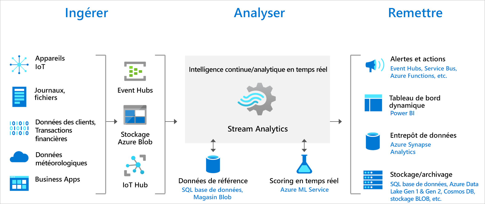

# Bienvenue dans Azure Stream Analytics

Azure Stream Analytics est un moteur complexe d’analyse et de traitement d’événements en temps réel conçu pour analyser et traiter de grands volumes de données diffusées, ou de données diffusées rapidement à partir de nombreuses sources à la fois. Les modèles et les relations peuvent être identifiés dans des informations extraites de plusieurs sources d’entrée, notamment des appareils, des capteurs, des journaux de parcours de site web, des flux de médias sociaux et des applications. Ces modèles peuvent être utilisés pour déclencher des actions est initier des workflows, comme la création d’alertes, l’envoi d’informations à un outil de création de rapports ou bien le stockage de données transformées pour une utilisation ultérieure. De plus, Stream Analytics est disponible sur le runtime Azure IoT Edge, ce qui permet de traiter des données sur les appareils IoT.

Les scénarios suivants sont des exemples d’utilisation d’Azure Stream Analytics :

* Analyser les flux de données de télémétrie en temps réel à partir d’appareils IoT
* Analyse de journaux d’activité/parcours web
* Analyses géospatiales pour la gestion de flotte et les véhicules sans pilote
* Surveillance à distance et maintenance prédictive de ressources stratégiques
* Analyse en temps réel sur les données de point de vente pour le contrôle des stocks et la détection d’anomalies

Vous pouvez essayer Azure Stream Analytics avec un abonnement Azure gratuit.

> [!div class="nextstepaction"]
> [Essayer Azure Stream Analytics](https://azure.microsoft.com/services/stream-analytics/)

## Comment fonctionne Stream Analytics ?

Un travail Azure Stream Analytics se compose d’une entrée, d’une requête et d’une sortie. Stream Analytics ingère des données à partir d’Azure Event Hubs (y compris Azure Event Hubs depuis Apache Kafka), Azure IoT Hub ou Stockage Blob Azure. La requête, qui est basée sur un langage de requête de type SQL, peut être utilisée pour filtrer, trier, agréger et joindre facilement des données de streaming sur une période de temps donnée. Vous pouvez également étendre ce langage SQL avec JavaScript et les fonctions C# définies par l’utilisateur. Vous pouvez facilement modifier les options d’ordre des événements et la durée des fenêtres de temps lors des opérations d’agrégation via de simples constructions et/ou configurations de langage.

Chaque travail a une ou plusieurs sorties pour les données transformées, et vous pouvez définir ce qui arrive en fonction des informations que vous avez analysées. Vous pouvez par exemple :

* Envoyez des données à des services tels qu’Azure Functions ou Rubriques/Files d'attente Service Bus pour déclencher des communications ou flux de travail personnalisés en aval.
* Envoyer des données à un tableau de bord Power BI pour un tableau de bord en temps réel.
* Stocker des données dans d’autres services de stockage Azure (par exemple, Azure Data Lake, Azure Synapse Analytics, etc.) afin d’entraîner un modèle Machine Learning basé sur des données historiques ou d’effectuer des analyses en mode batch.

L’illustration suivante montre comment les données sont envoyées à Stream Analytics, analysées, puis transmises dans le cadre d’autres actions telles que le stockage, ou une présentation :

## Avantages et fonctionnalités clés

Azure Stream Analytics est conçu pour être facile à utiliser, flexible, fiable et évolutif selon le volume du travail. Il est disponible dans de nombreuses régions Azure et s’exécute sur IoT Edge ou Azure Stack.

## Prise en main rapide

Azure Stream Analytics est prêt à fonctionner. Quelques clics suffisent pour se connecter à différents récepteurs et sources de données et créer un pipeline de bout en bout. Stream Analytics peut se connecter directement à Azure Event Hubs et à Azure IoT Hub pour l’ingestion de données diffusées en continu, ainsi qu’au stockage Blob Azure pour l’ingestion de données historiques. L’entrée du travail peut également inclure des données de référence statiques ou à variation lente du stockage blob Azure ou de SQL Database, que vous pouvez joindre aux données de streaming pour effectuer des opérations de recherche.

Stream Analytics peut acheminer la sortie du travail vers de nombreux systèmes de stockage, tels que Stockage Blob Azure, Azure SQL Database, Azure Data Lake Store et Azure CosmosDB. Vous pouvez également exécuter des analyses en mode batch sur des sorties de flux avec Azure Synapse Analytics ou HDInsight, ou envoyer les sorties vers un autre service comme Event Hubs pour les consommer ou comme Power BI pour les visualiser en temps réel.

Pour obtenir la liste complète des sorties Stream Analytics, consultez [Comprendre les sorties d’Azure Stream Analytics](stream-analytics-define-outputs.md).

## Productivité du programmeur

Azure Stream Analytics utilise un langage de requête SQL qui intègre des contraintes temporelles puissantes pour analyser les données en mouvement. Vous pouvez également créer des travaux à l’aide d’outils de développement comme Azure PowerShell, Azure CLI, les outils Visual Studio Stream Analytics, l’[extension Stream Analytics Visual Studio Code](quick-create-visual-studio-code.md) ou les modèles Azure Resource Manager. Les outils de développement vous permettent de développer des requêtes de transformation en mode hors connexion et d’utiliser le pipeline CI/CD pour envoyer des travaux vers Azure.

Le langage de requête Stream Analytics permet d’effectuer le traitement des événements complexes (CEP) en proposant un large choix de fonctions d’analyse des données de streaming. Ce langage de requête prend en charge les fonctions simples de manipulation, d’agrégation et d’analytique des données, des fonctions géospatiales, des critères spéciaux et la détection d’anomalie. Vous pouvez modifier les requêtes dans le portail ou à l’aide de nos outils de développement, et les tester à l’aide d’exemples de données extraits à partir d’un stream en direct.

Vous pouvez étendre les fonctionnalités du langage de requête en définissant et en appelant des fonctions supplémentaires. Vous pouvez définir des appels de fonction dans Azure Machine Learning pour tirer parti des solutions d’Azure Machine Learning et intégrer des fonctions JavaScript ou C# définies par l’utilisateur ou des agrégats définis par l’utilisateur pour effectuer des calculs complexes dans le cadre d’une requête Stream Analytics.

## Gestion intégrale

Azure Stream Analytics est une offre (PaaS) complètement managée sur Azure. Vous n’avez pas besoin de provisionner de matériel ni d’infrastructure, ni de mettre à jour le système d’exploitation ou des logiciels. Azure Stream Analytics gère entièrement votre travail, ce qui vous permet de vous concentrer sur votre logique métier et non sur l’infrastructure.

## Exécuter dans le cloud ou à la périphérie intelligente

Azure Stream Analytics peut être exécuté dans le cloud pour une analytique à grande échelle, ou sur IoT Edge ou Azure Stack pour une analytique à très faible latence. Azure Stream Analytics utilise le même langage de requête et les mêmes outils dans le cloud et à la périphérie. Ainsi, les développeurs peuvent créer des architectures véritablement hybrides à des fins de traitement de flux. 

## Faible coût total de possession

Comme un service cloud, Stream Analytics est optimisé pour réduire le coût. Aucun frais initial ne s’applique. Vous payez uniquement pour les [unités de streaming que vous consommez](stream-analytics-streaming-unit-consumption.md). Aucun engagement ni aucun approvisionnement de cluster requis, et vous pouvez faire évoluer le travail vers le haut ou vers le bas en fonction des besoins de votre entreprise.

## Intégration stratégique immédiate

Le moteur Azure Stream Analytics est disponible dans de nombreuses régions du monde entier. Il est conçu pour l’exécution des charges de travail critiques tout en prenant en charge les exigences de conformité, de sécurité et de fiabilité.

### Fiabilité

Azure Stream Analytics garantit un traitement des événements en « exactement une fois », et une remise des événements « une fois au minimum », ce qui évite la perte d’événements. Le traitement en une fois exactement est garanti avec une sortie sélectionnée, comme décrit dans Garanties de remise d’événement.

Azure Stream Analytics dispose de fonctionnalités de récupération intégrées, en cas d’échec de la remise d’un événement. Stream Analytics fournit également des points de contrôle intégrés pour gérer l’état de votre travail et fournir des résultats reproductibles.

Stream Analytics est un service managé qui garantit le traitement des événements avec une disponibilité de 99,9 % au niveau de granularité Minute. 

### Sécurité

En termes de sécurité, Azure Stream Analytics chiffre toutes les communications entrantes et sortantes, il prend également en charge TLS 1.2. Les points de contrôle intégrés sont également chiffrés. Stream Analytics ne stocke pas les données entrantes dans la mesure où tout le traitement s’effectue en mémoire. Stream Analytics prend également en charge les réseaux virtuels Azure (VNET) lors de l’exécution d’un travail dans un [cluster Stream Analytics](./cluster-overview.md).

### Conformité

Azure Stream Analytics suit plusieurs certifications de conformité, comme décrit dans la [vue d’ensemble de la conformité Azure](https://gallery.technet.microsoft.com/Overview-of-Azure-c1be3942). 

## Performances

Stream Analytics peut traiter des millions d’événements par seconde et fournir des résultats avec une latence ultra faible. Il vous permet de mettre à l’échelle vos travaux pour prendre en charge des applications volumineuses de traitement des événements complexes et en temps réel. Stream Analytics offre de meilleures performances à l’aide du partitionnement, permettant de paralléliser des requêtes complexes et de les exécuter sur plusieurs nœuds de streaming. Azure Stream Analytics repose sur [Trill](https://github.com/Microsoft/Trill), un moteur haute performance d’analyse de streaming en mémoire développé en collaboration avec Microsoft Research.

## Étapes suivantes

Vous connaissez désormais les notions de base sur Azure Stream Analytics. Pour approfondir ces connaissances et créer votre premier travail Stream Analytics, consultez les articles suivants :

* [Créer un travail Stream Analytics à l’aide du portail Azure](stream-analytics-quick-create-portal.md)
* [Créer un travail Stream Analytics à l’aide d’Azure PowerShell](stream-analytics-quick-create-powershell.md)
* [Créer un travail Stream Analytics à l’aide de Visual Studio](stream-analytics-quick-create-vs.md)
* [Créer un travail Stream Analytics à l’aide de Visual Studio Code](quick-create-visual-studio-code.md)
