# <a name="quickstart-create-a-stream-analytics-job-by-using-the-azure-portal"></a>Démarrage rapide : Créer un travail Stream Analytics à l’aide du portail Azure

Ce guide de démarrage rapide vous explique comment créer un travail Stream Analytics. Dans ce guide de démarrage rapide, vous allez définir un travail Stream Analytics qui lit des données de streaming en temps réel et filtre les messages qui contiennent une température supérieure à 27. Votre travail Stream Analytics lira les données à partir d’IoT Hub, transformera ces données et les réécrira dans un conteneur de stockage d’objets blob. Les données d’entrée utilisées dans ce guide de démarrage rapide sont générées par un simulateur en ligne Raspberry Pi. 

## <a name="before-you-begin"></a>Avant de commencer

* Si vous n’avez pas d’abonnement Azure, créez un [compte gratuit](https://azure.microsoft.com/free/).

* Connectez-vous au [portail Azure](https://portal.azure.com/).

## <a name="prepare-the-input-data"></a>Préparer les données d’entrée

Avant de définir le travail Stream Analytics, vous devez préparer les données d’entrée. Les données de capteur en temps réel sont ingérées par IoT Hub, configuré plus tard comme entrée du travail. Pour préparer les données d’entrée requises pour le travail, exécutez les opérations suivantes :

1. Connectez-vous au [portail Azure](https://portal.azure.com/).

2. Sélectionnez **Créer une ressource** > **Internet des objets** > **IoT Hub**.

3. Dans le volet **IoT Hub**, entrez les informations suivantes :
   
   |**Paramètre**  |**Valeur suggérée**  |**Description**  |
   |---------|---------|---------|
   |Subscription  | \<Votre abonnement\> |  Sélectionnez l’abonnement Azure que vous souhaitez utiliser. |
   |Resource group   |   asaquickstart-resourcegroup  |   Sélectionnez **Créer** et saisissez le nom du nouveau groupe de ressources pour votre compte. |
   |Région  |  \<Sélectionnez la région la plus proche de vos utilisateurs\> | Sélectionnez l’emplacement géographique où vous pouvez héberger votre hub IoT. Utilisez l’emplacement le plus proche de vos utilisateurs. |
   |Nom du hub IoT  | MyASAIoTHub  |   Sélectionnez un nom pour votre hub IoT.   |

   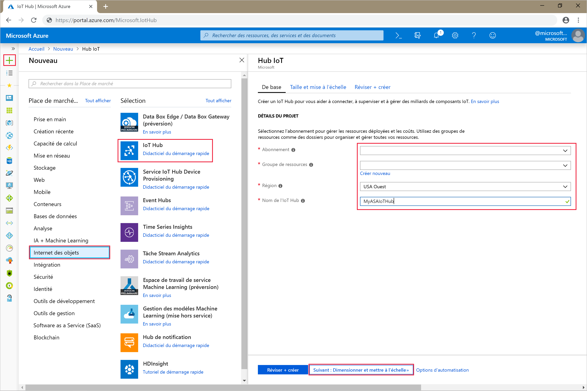

4. Sélectionnez **Suivant : Définir la taille et l’échelle**.

5. Choisissez votre **niveau de tarification et de mise à l’échelle**. Pour ce guide de démarrage rapide, sélectionnez le niveau **F1 - Gratuit** s’il est toujours disponible sur votre abonnement. Pour plus d’informations, consultez la [tarification IoT Hub](https://azure.microsoft.com/pricing/details/iot-hub/).

   

6. Sélectionnez **Revoir + créer**. Passez en revue les informations de votre hub IoT et cliquez sur **Créer**. La création de votre hub IoT peut prendre plusieurs minutes. Vous pouvez suivre la progression dans le volet **Notifications**.

7. Dans le menu de navigation de votre hub IoT, cliquez sur **Ajouter** sous **Appareils IoT**. Ajoutez un **ID d’appareil** et cliquez sur **Enregistrer**.

   

8. Une fois que l’appareil a été créé, ouvrez-le dans la liste **Appareils IoT**. Copiez la valeur **Chaîne de connexion -- clé primaire** et enregistrez-la dans un bloc-notes pour une utilisation ultérieure.

   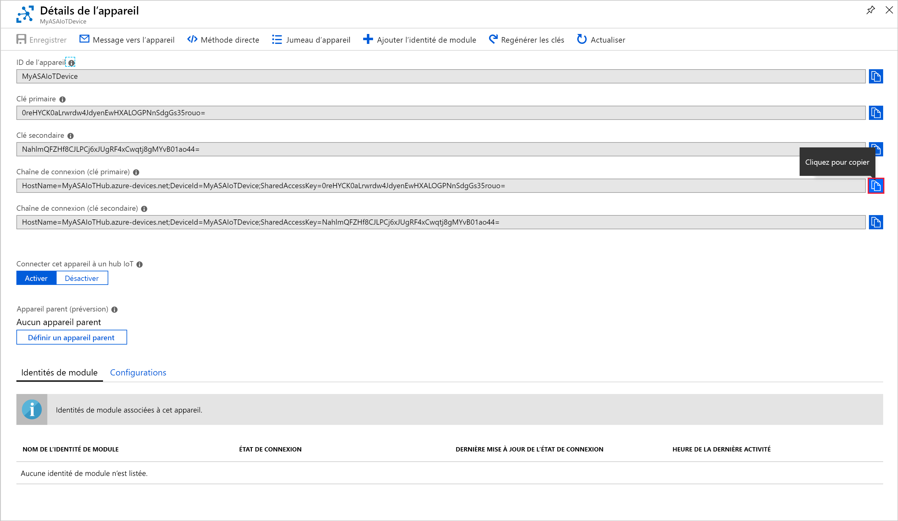

## <a name="create-blob-storage"></a>Créer un stockage d’objets blob

1. Dans le coin supérieur gauche du portail Azure, sélectionnez **Créer une ressource** > **Stockage** > **Compte de stockage**.

2. Dans le volet **Créer un compte de stockage**, entrez un nom, un emplacement et un groupe de ressources de compte de stockage. Choisissez les mêmes emplacement et groupe de ressources que pour le hub IoT que vous avez créé. Ensuite, cliquez sur **Vérifier + créer** pour créer le compte.

   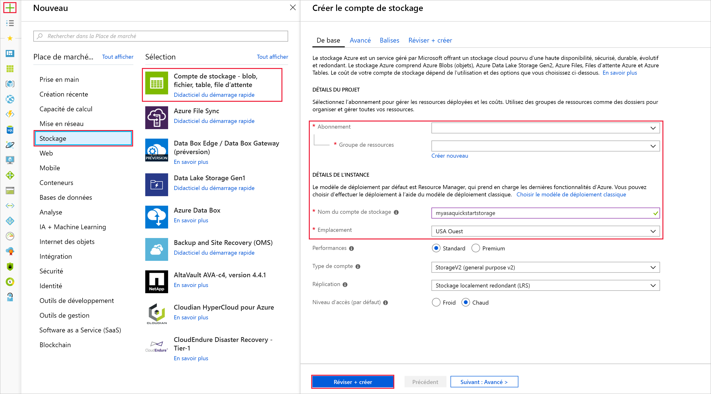

3. Une fois que votre compte de stockage a été créé, sélectionnez la vignette **Objets blob** dans le volet **Vue d’ensemble**.

   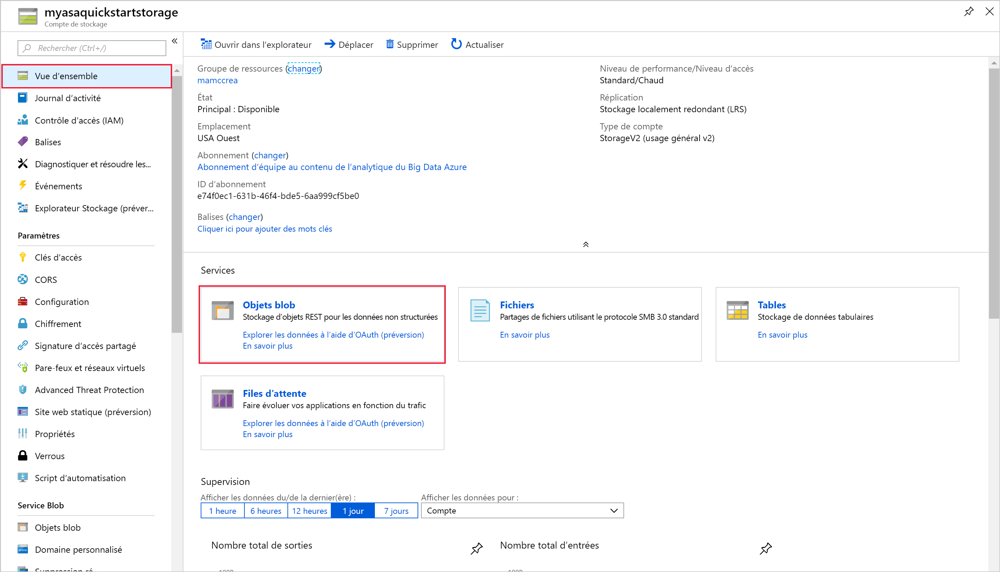

4. Dans la page **Service Blob**, sélectionnez **Conteneur** et donnez un nom à votre conteneur, tel que *conteneur1*. Pour **Niveau d’accès public** laissez la valeur **Privé (aucun accès anonyme)** et sélectionnez **OK**.

   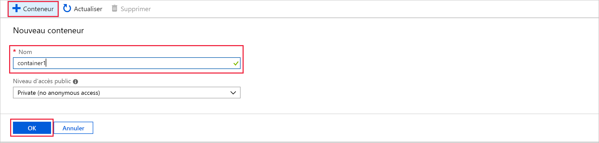

## <a name="create-a-stream-analytics-job"></a>Création d’un travail Stream Analytics

1. Connectez-vous au portail Azure.

2. Sélectionnez **Créer une ressource** dans le coin supérieur gauche du portail Azure.  

3. Dans la liste des résultats, sélectionnez **Analytics** > **Travail Stream Analytics**.  

4. Renseignez les informations suivantes dans la page du travail Stream Analytics :

   |**Paramètre**  |**Valeur suggérée**  |**Description**  |
   |---------|---------|---------|
   |Nom du travail   |  MyASAJob   |   Saisissez un nom pour identifier votre travail Stream Analytics. Le nom d’un travail Stream Analytics peut contenir uniquement des caractères alphanumériques, des traits d’union et des traits de soulignement, et doit avoir entre 3 et 63 caractères. |
   |Subscription  | \<Votre abonnement\> |  Sélectionnez l’abonnement Azure que vous souhaitez utiliser pour ce travail. |
   |Resource group   |   asaquickstart-resourcegroup  |   Sélectionnez le même groupe de ressources que pour votre hub IoT. |
   |Location  |  \<Sélectionnez la région la plus proche de vos utilisateurs\> | Sélectionnez l’emplacement géographique où vous pouvez héberger votre travail Stream Analytics. Utilisez l’emplacement le plus proche de vos utilisateurs pour bénéficier de meilleures performances et réduire les coûts de transfert de données. |
   |Unités de diffusion en continu  | 1  |   Les unités de streaming sont les ressources de calcul requises pour exécuter un travail. Par défaut, cette valeur est définie sur 1. Pour en savoir plus sur la mise à l’échelle des unités de streaming, consultez l’article [Understanding and adjusting streaming units](stream-analytics-streaming-unit-consumption.md) (Présentation et réglage des unités de streaming).   |
   |Environnement d’hébergement  |  Cloud  |   Les travaux Stream Analytics peuvent être déployés dans le cloud ou sur des appareils Edge. L’option Cloud vous permet de déployer votre travail dans le cloud Azure, et l’option Edge sur un appareil IoT Edge. |

   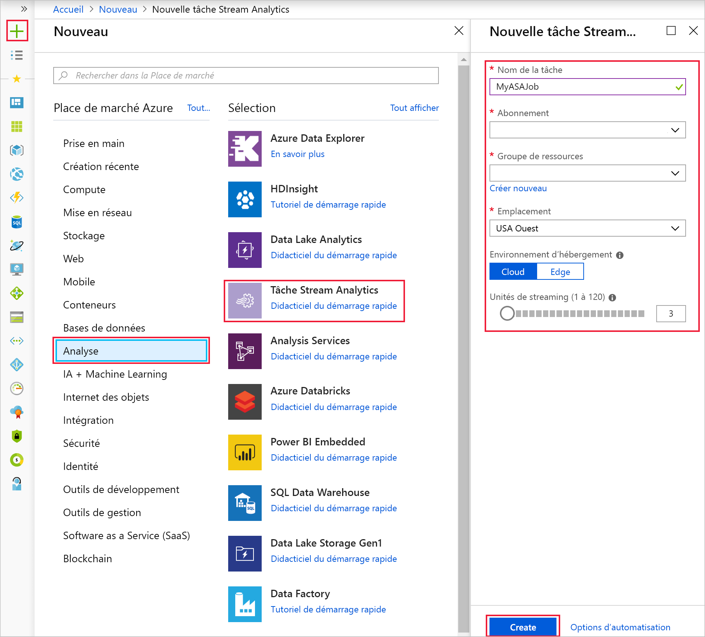

5. Cochez la case **Épingler au tableau de bord** pour placer votre travail sur votre tableau de bord, puis sélectionnez **Créer**.  

6. Vous devriez voir une notification *Déploiement en cours...* s’afficher en haut à droite de la fenêtre de votre navigateur. 

## <a name="configure-job-input"></a>Configurer les entrées du travail

Dans cette section, vous allez configurer une entrée d’appareil IoT Hub pour le travail Stream Analytics. Utilisez le hub IoT que vous avez créé dans la section précédente de ce guide de démarrage rapide.

1. Accédez à votre travail Stream Analytics.  

2. Sélectionnez **Entrées** > **Ajouter une entrée de flux** > **IoT Hub**.  

3. Spécifiez les valeurs suivantes dans la page **IoT Hub**:

   |**Paramètre**  |**Valeur suggérée**  |**Description**  |
   |---------|---------|---------|
   |Alias d’entrée  |  IoTHubInput   |  Saisissez un nom pour identifier l’entrée du travail.   |
   |Subscription   |  \<Votre abonnement\> |  Sélectionnez l’abonnement Azure contenant le compte de stockage que vous avez créé. Le compte de stockage peut être dans le même abonnement ou dans un abonnement distinct. Cet exemple suppose que vous avez créé le compte de stockage dans le même abonnement. |
   |IoT Hub  |  MyASAIoTHub |  Entrez le nom du hub IoT que vous avez créé dans la section précédente. |

4. Conservez les valeurs par défaut pour les autres options et sélectionnez **Enregistrer** pour enregistrer les paramètres.  

   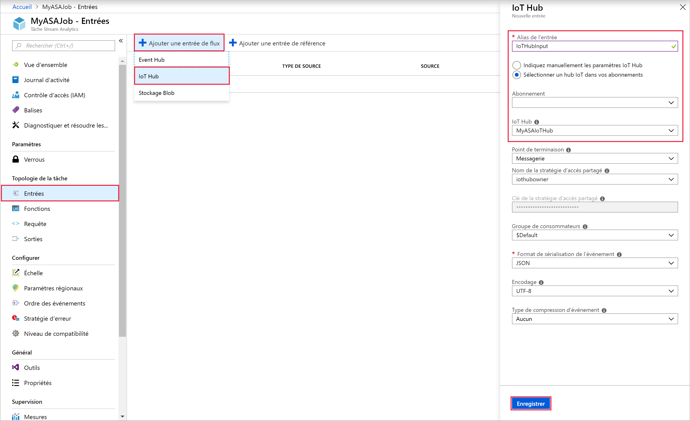
 
## <a name="configure-job-output"></a>Configurer la sortie du travail

1. Accédez au travail Stream Analytics que vous avez créé précédemment.  

2. Sélectionnez **Sorties** > **Ajouter** > **Stockage d’objets blob**.  

3. Indiquez les valeurs suivantes dans la page **Stockage Blob** :

   |**Paramètre**  |**Valeur suggérée**  |**Description**  |
   |---------|---------|---------|
   |Alias de sortie |   BlobOutput   |   Saisissez un nom pour identifier la sortie du travail. |
   |Subscription  |  \<Votre abonnement\>  |  Sélectionnez l’abonnement Azure contenant le compte de stockage que vous avez créé. Le compte de stockage peut être dans le même abonnement ou dans un abonnement distinct. Cet exemple suppose que vous avez créé le compte de stockage dans le même abonnement. |
   |Compte de stockage |  asaquickstartstorage |   Sélectionnez ou saisissez le nom du compte de stockage. Les noms de compte de stockage sont automatiquement détectés s’ils sont créés dans le même abonnement.       |
   |Conteneur |   conteneur1  |  Sélectionnez un conteneur existant que vous avez créé dans votre compte de stockage.   |

4. Conservez les valeurs par défaut pour les autres options et sélectionnez **Enregistrer** pour enregistrer les paramètres.  

   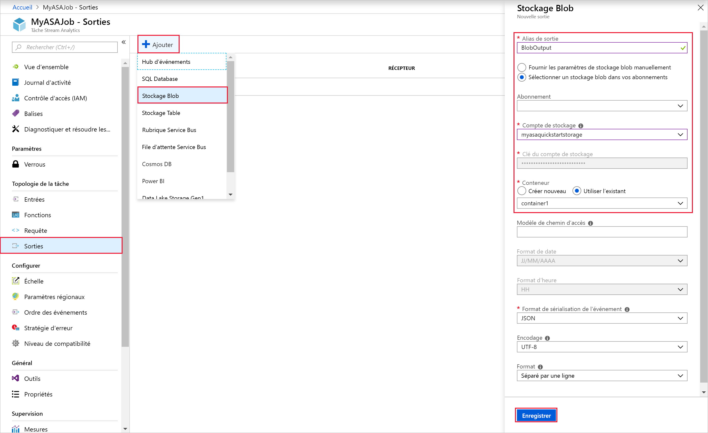
 
## <a name="define-the-transformation-query"></a>Définir la requête de transformation

1. Accédez au travail Stream Analytics que vous avez créé précédemment.  

2. Sélectionnez **Requête** et mettez à jour la requête tel que suit :  

   ```sql
   SELECT *
   INTO BlobOutput
   FROM IoTHubInput
   HAVING Temperature > 27
   ```

3. Dans cet exemple, la requête lit les données à partir du hub IoT et les copie dans un nouveau fichier dans l’objet blob. Sélectionnez **Enregistrer**.  

   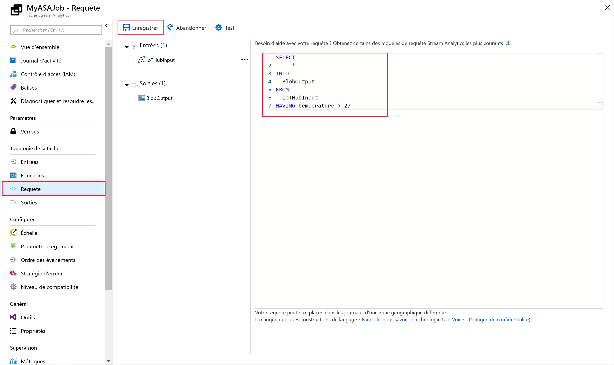

## <a name="run-the-iot-simulator"></a>Exécuter le simulateur IoT

1. Ouvrez le [simulateur en ligne Azure IoT Raspberry Pi](https://azure-samples.github.io/raspberry-pi-web-simulator/).

2. Remplacez l’espace réservé à la ligne 15 par la chaîne de connexion de l’appareil Azure IoT Hub.

3. Cliquez sur **Exécuter**. La sortie doit indiquer les données de capteur et les messages qui sont envoyés à votre hub IoT.

   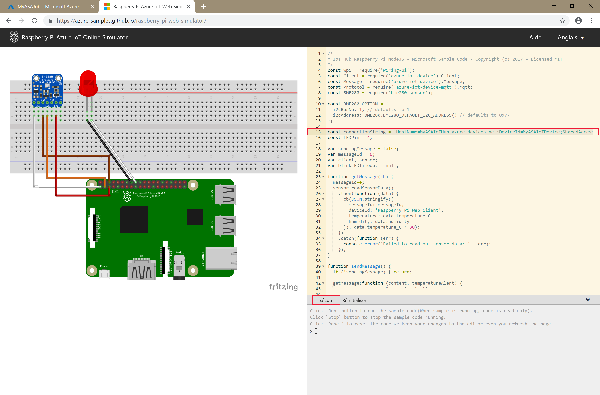

## <a name="start-the-stream-analytics-job-and-check-the-output"></a>Démarrer le travail Stream Analytics et observer le résultat

1. Revenez à la page de vue d’ensemble du travail et sélectionnez **Démarrer**.

2. Sous **Démarrer le travail**, sélectionnez **Maintenant** pour le champ **Heure de début de la sortie de la tâche**. Ensuite, sélectionnez **Démarrer** pour démarrer votre travail.

3. Après quelques minutes, dans le portail, recherchez le compte de stockage et le conteneur que vous avez configuré en tant que sortie pour le travail. Vous pouvez maintenant voir le fichier de sortie dans le conteneur. La première fois, le travail prend quelques minutes à démarrer. Une fois qu’il a démarré, il continuera à s’exécuter tant que des données arrivent.  

   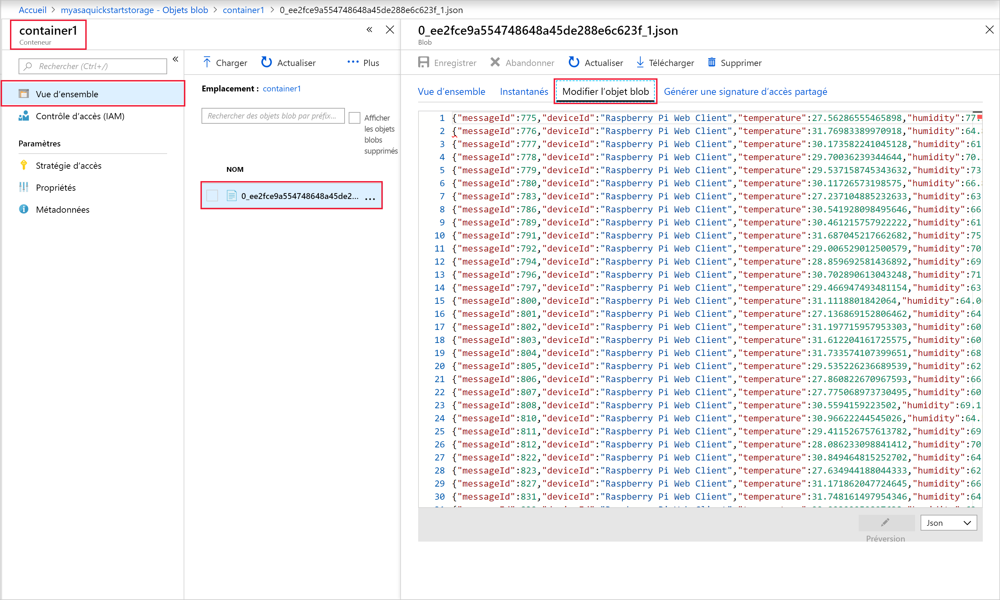

## <a name="clean-up-resources"></a>Nettoyer les ressources

Lorsque vous n’en avez plus besoin, supprimez le groupe de ressources, le travail Stream Analytics et toutes les ressources associées. La suppression du travail évite la facturation des unités de streaming consommées par le travail. Si vous envisagez d’utiliser le travail à l’avenir, vous pouvez l’arrêter et le redémarrer plus tard lorsque vous en avez besoin. Si vous ne pensez pas continuer à utiliser ce travail, supprimez toutes les ressources créées pendant ce guide de démarrage rapide en procédant comme suit :

1. Dans le menu de gauche du portail Azure, cliquez sur **Groupes de ressources**, puis sur le nom de la ressource que vous avez créée.  

2. Sur la page de votre groupe de ressources, sélectionnez **Supprimer**, saisissez le nom de la ressource à supprimer dans la zone de texte, puis sélectionnez **Supprimer**.

## <a name="next-steps"></a>Étapes suivantes

Dans ce guide de démarrage rapide, vous avez déployé un travail Stream Analytics simple à l’aide du portail Azure. Vous pouvez également déployer des travaux Stream Analytics à l’aide de [PowerShell](stream-analytics-quick-create-powershell.md), de [Visual Studio](stream-analytics-quick-create-vs.md) et de [Visual Studio Code](quick-create-vs-code.md).

Pour savoir comment configurer d’autres sources d’entrée et effectuer une détection en temps réel, passez à l’article suivant :

> [!div class="nextstepaction"]
> [Détection des fraudes en temps réel à l’aide d’Azure Stream Analytics](stream-analytics-real-time-fraud-detection.md)
