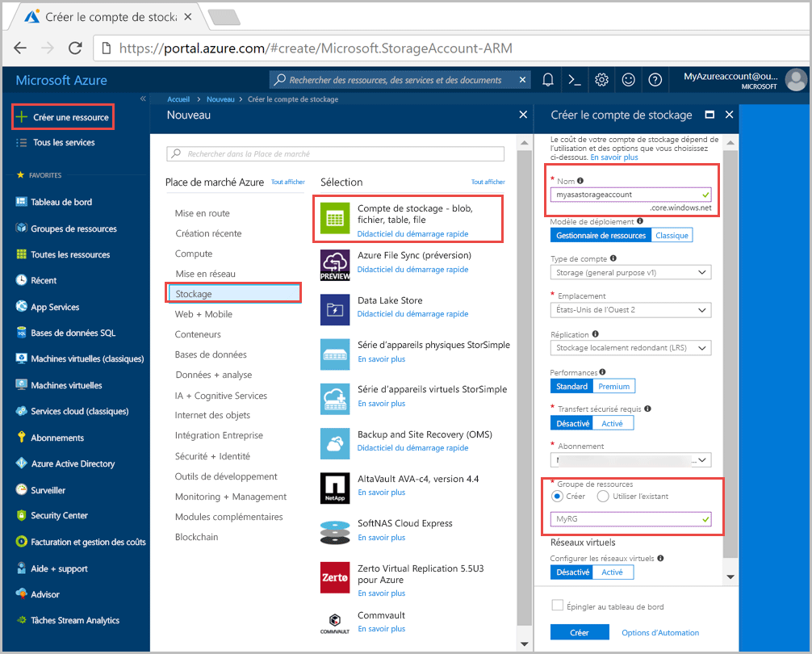
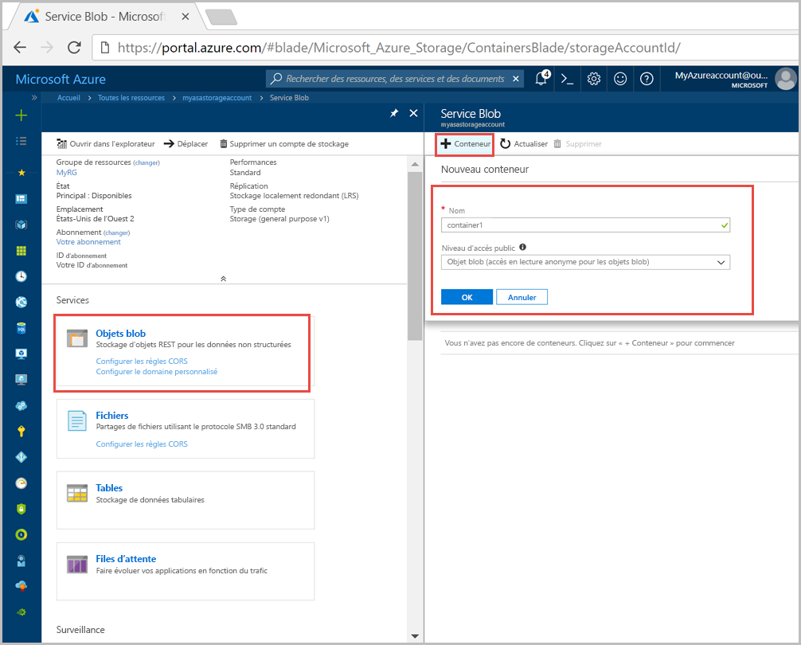
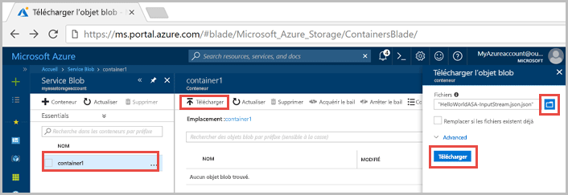
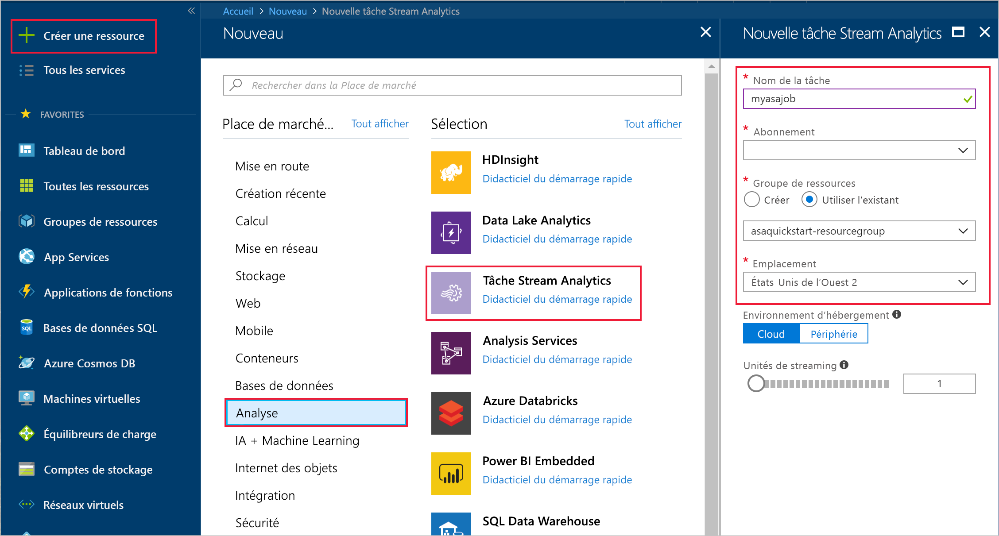
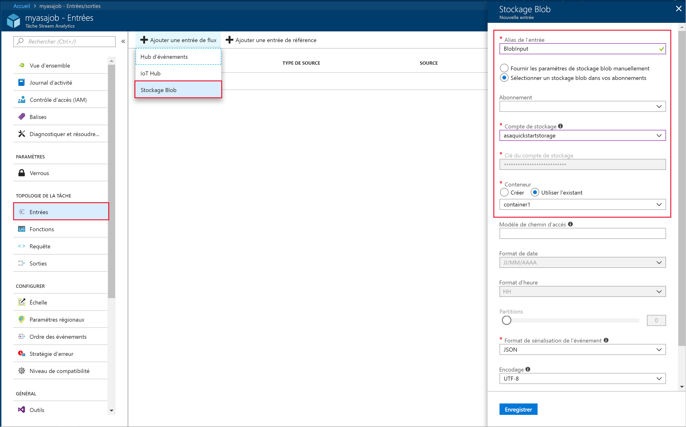
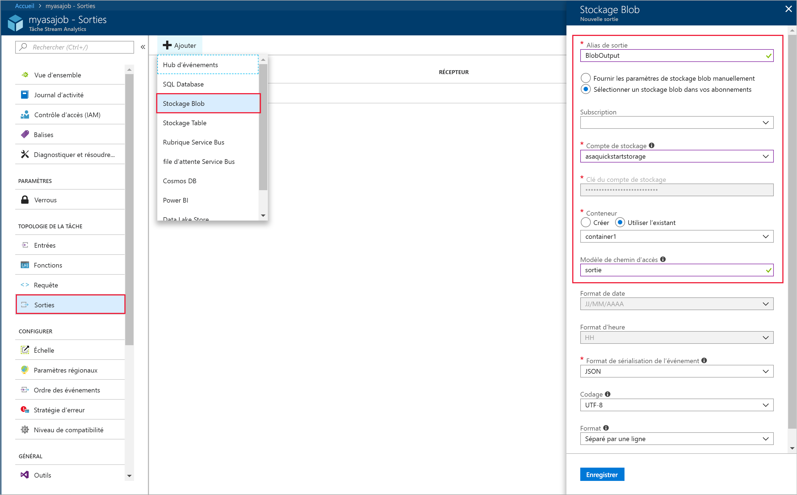
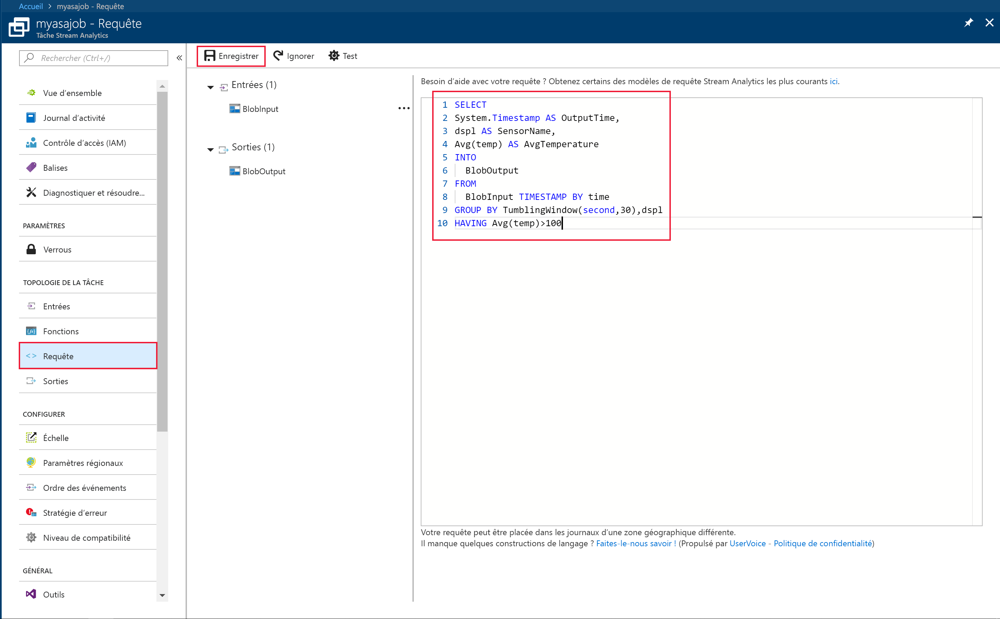
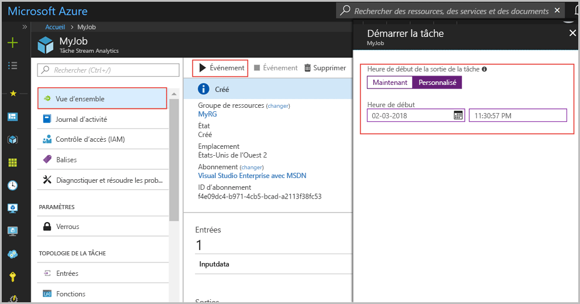
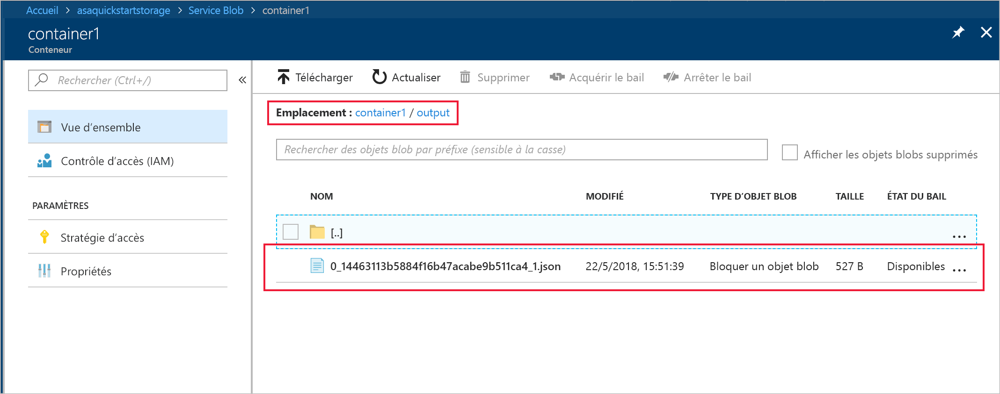

# <a name="quickstart-create-a-stream-analytics-job-by-using-the-azure-portal"></a>Démarrage rapide : Créer un travail Stream Analytics à l’aide du portail Azure

Ce guide de démarrage rapide vous explique comment créer un travail Stream Analytics. Dans ce guide de démarrage rapide, vous allez configurer un travail Stream Analytics qui lit des exemples de données de capteur et filtre les lignes qui contiennent une température moyenne supérieure à 100 toutes les 30 secondes. Dans cet article, vous allez lire les données à partir du stockage Blob, transformer les données et les réécrire dans un autre conteneur au sein du même stockage Blob.

## <a name="before-you-begin"></a>Avant de commencer

* Si vous n’avez pas d’abonnement Azure, créez un [compte gratuit](https://azure.microsoft.com/free/).

* Connectez-vous au [Portail Azure](https://portal.azure.com/).

## <a name="prepare-the-input-data"></a>Préparer les données d’entrée

Avant de définir le travail Stream Analytics, vous devez préparer les données qui seront configurées en tant qu’entrée pour le travail. Exécutez les opérations suivantes pour préparer les données d’entrée requises pour le travail :

1. Téléchargez les [exemples de données de capteur](https://github.com/Azure/azure-stream-analytics/blob/master/Samples/GettingStarted/HelloWorldASA-InputStream.json) à partir de GitHub. Les exemples de données contiennent des informations de capteur au format JSON suivant :  

   ```json
   {
     "time": "2016-01-26T21:18:52.0000000",
     "dspl": "sensorC",
     "temp": 87,
     "hmdt": 44
   }
   ```
2. Connectez-vous au portail Azure.  

3. Dans le coin supérieur gauche du portail Azure, sélectionnez **Créer une ressource** > **Stockage** > **Compte de stockage**. Dans le panneau de travail du compte de stockage, définissez le paramètre **Nom** sur « myasastorageaccount », le paramètre **Emplacement** sur « Ouest des États-Unis 2 », le paramètre **Groupe de ressources** sur « MyRG » (pour bénéficier de meilleures performances, hébergez le compte de stockage dans le même groupe de ressources que le travail Stream Analytics). Vous pouvez conserver les valeurs par défaut des autres paramètres.  

   

4. À partir du panneau **Toutes les ressources**, recherchez le compte de stockage que vous avez créé à l’étape précédente. Ouvrez le panneau **Vue d’ensemble**, puis la vignette **Objets blob**.  

5. À partir du panneau **Service blob**, sélectionnez **Conteneur**, saisissez un **nom** pour votre conteneur, tel que *conteneur1*, définissez le paramètre **Niveau d’accès public** sur Blob (anonymous read access for blobs only) [Blob (accès en lecture anonyme pour les objets blob uniquement)] et sélectionnez **OK**.  

   

6. Accédez au conteneur que vous avez créé à l’étape précédente, sélectionnez **Télécharger** et téléchargez les données de capteur obtenues à l’étape 1.  

   

## <a name="create-a-stream-analytics-job"></a>Création d’un travail Stream Analytics

1. Connectez-vous au portail Azure.  

2. Sélectionnez **Créer une ressource** dans le coin supérieur gauche du portail Azure.  

3. Dans la liste des résultats, sélectionnez **Data+Analytics (Données+Analytics)** > **Travail Stream Analytics**.  

4. Renseignez les informations suivantes dans le panneau du travail Stream Analytics :

   |**Paramètre**  |**Valeur suggérée**  |**Description**  |
   |---------|---------|---------|
   |Nom du travail   |  myJob   |   Saisissez un nom pour identifier votre travail Stream Analytics. Le nom d’un travail Stream Analytics peut contenir uniquement des caractères alphanumériques, des traits d’union et des traits de soulignement, et doit avoir entre 3 et 63 caractères. |
   |Abonnement  | \<Votre abonnement\> |  Sélectionnez l’abonnement Azure que vous souhaitez utiliser pour ce travail. |
   |Groupe de ressources   |   myResourceGroup  |   Sélectionnez **Créer** et saisissez le nom du nouveau groupe de ressources pour votre compte. |
   |Lieu  |  \<Sélectionnez la région la plus proche de vos utilisateurs\> | Sélectionnez l’emplacement géographique où vous pouvez héberger votre travail Stream Analytics. Utilisez l’emplacement le plus proche de vos utilisateurs pour bénéficier de meilleures performances et réduire les coûts de transfert de données. |
   |Unités de diffusion en continu  | 1  |   Les unités de streaming sont les ressources de calcul requises pour exécuter un travail. Par défaut, cette valeur est définie sur 1. Pour en savoir plus sur la mise à l’échelle des unités de streaming, consultez l’article [Understanding and adjusting streaming units](stream-analytics-streaming-unit-consumption.md) (Présentation et réglage des unités de streaming).   |
   |Environnement d’hébergement  |  Cloud  |   Les travaux Stream Analytics peuvent être déployés dans le cloud ou sur des appareils Edge. L’option Cloud vous permet de déployer votre travail dans le cloud Azure, et l’option Edge sur un appareil IoT Edge. |

   

5. Cochez la case **Épingler au tableau de bord** pour placer votre travail sur votre tableau de bord, puis sélectionnez **Créer**.  

6. Vous devriez voir le message « Déploiement en cours... » s’afficher en haut à droite de la fenêtre de votre navigateur. 

## <a name="configure-input-to-the-job"></a>Configurer l’entrée du travail

Dans cette section, vous allez configurer le stockage Blob comme entrée pour le travail Stream Analytics. Avant de configurer l’entrée, créez un compte de stockage Blob.  

### <a name="add-the-input"></a>Ajouter l’entrée 

1. Accédez à votre travail Stream Analytics.  

2. Sélectionnez **Entrées** > **Ajouter une entrée de flux** > **Stockage Blob**.  

3. Indiquez les valeurs suivantes dans le panneau **Stockage Blob** :

   |**Paramètre**  |**Valeur suggérée**  |**Description**  |
   |---------|---------|---------|
   |Alias d’entrée  |  BlobInput   |  Saisissez un nom pour identifier l’entrée du travail.   |
   |Abonnement   |  \<Votre abonnement\> |  Sélectionnez l’abonnement Azure contenant le compte de stockage que vous avez créé. Le compte de stockage peut être dans le même abonnement ou dans un abonnement distinct. Cet exemple suppose que vous avez créé le compte de stockage dans le même abonnement. |
   |Compte de stockage  |  myasastorageaccount |  Sélectionnez ou saisissez le nom du compte de stockage. Les noms de compte de stockage sont automatiquement détectés s’ils sont créés dans le même abonnement. |
   |Conteneur  | conteneur1 | Choisissez le nom du conteneur qui contient les exemples de données. Les noms de conteneur sont automatiquement détectés s’ils sont créés dans le même abonnement. |

4. Conservez les valeurs par défaut pour les autres options et sélectionnez **Enregistrer** pour enregistrer les paramètres.  

   
 
## <a name="configure-output-to-the-job"></a>Configurer la sortie du travail

1. Accédez au travail Stream Analytics que vous avez créé précédemment.  

2. Sélectionnez **Sorties > Ajouter > Stockage Blob**.  

3. Indiquez les valeurs suivantes dans le panneau **Stockage Blob** :

   |**Paramètre**  |**Valeur suggérée**  |**Description**  |
   |---------|---------|---------|
   |Alias de sortie |   BlobOutput   |   Saisissez un nom pour identifier la sortie du travail. |
   |Abonnement  |  \<Votre abonnement\>  |  Sélectionnez l’abonnement Azure contenant le compte de stockage que vous avez créé. Le compte de stockage peut être dans le même abonnement ou dans un abonnement distinct. Cet exemple suppose que vous avez créé le compte de stockage dans le même abonnement. |
   |Compte de stockage |  myasastorageaccount |   Sélectionnez ou saisissez le nom du compte de stockage. Les noms de compte de stockage sont automatiquement détectés s’ils sont créés dans le même abonnement.       |
   |Conteneur |   conteneur2  |  Créez un nouveau conteneur dans le même compte de stockage que vous avez utilisé pour l’entrée.   |

4. Conservez les valeurs par défaut pour les autres options et sélectionnez **Enregistrer** pour enregistrer les paramètres.  

   
 
## <a name="define-the-transformation-query"></a>Définir la requête de transformation

1. Accédez au travail Stream Analytics que vous avez créé précédemment.  

2. Sélectionnez **Requête** et mettez à jour la requête tel que suit :  

   ```sql
   SELECT 
   System.Timestamp AS OutputTime,
   dspl AS SensorName,
   Avg(temp) AS AvgTemperature
   INTO
     MyBlobOutput
   FROM
     MyBlobInput TIMESTAMP BY time
   GROUP BY TumblingWindow(second,30),dspl
   HAVING Avg(temp)>100
   ```

3. Dans cet exemple, la requête lit les données à partir du stockage Blob et les copie dans un nouveau fichier dans le stockage Blob. Sélectionnez **Enregistrer**.  

   

## <a name="start-the-stream-analytics-job-and-check-the-output"></a>Démarrer le travail Stream Analytics et observer le résultat

1. Revenez au panneau de vue d’ensemble du travail et sélectionnez **Démarrer**.  

2. Sous **Démarrage du travail**, sélectionnez **Personnalisée** pour le champ **Heure de démarrage**. Sélectionnez un jour avant la date de téléchargement du fichier dans le stockage Blob, car l’heure à laquelle le fichier a été téléchargé est antérieure à l’heure actuelle. Lorsque vous avez terminé, sélectionnez **Démarrer**.  

   

3. Après quelques minutes, dans le portail, recherchez le compte de stockage et le conteneur que vous avez configuré en tant que sortie pour le travail. Vous pouvez maintenant voir le fichier de sortie dans le conteneur. La première fois, le travail prend quelques minutes à démarrer. Une fois qu’il a démarré, il continuera à s’exécuter tant que des données arrivent.  

   

## <a name="clean-up-resources"></a>Supprimer des ressources

Lorsque vous n’en avez plus besoin, supprimez le groupe de ressources, le travail de streaming et toutes les ressources associées. La suppression du travail évite la facturation des unités de streaming consommées par le travail. Si vous envisagez d’utiliser le travail à l’avenir, vous pouvez l’arrêter et le redémarrer plus tard lorsque vous en avez besoin. Si vous ne pensez pas continuer à utiliser ce travail, supprimez toutes les ressources créées pendant ce guide de démarrage rapide en procédant comme suit :

1. Dans le menu de gauche du portail Azure, cliquez sur **Groupes de ressources**, puis sur le nom de la ressource que vous avez créée.  

2. Sur la page de votre groupe de ressources, sélectionnez **Supprimer**, saisissez le nom de la ressource à supprimer dans la zone de texte, puis sélectionnez **Supprimer**.

## <a name="next-steps"></a>Étapes suivantes

Dans ce guide de démarrage rapide, vous avez déployé un travail Stream Analytics. Pour savoir comment configurer d’autres sources d’entrée et effectuer une détection en temps réel, passez à l’article suivant :

> [!div class="nextstepaction"]
> [Détection des fraudes en temps réel à l’aide d’Azure Stream Analytics](stream-analytics-real-time-fraud-detection.md)

