# <a name="quickstart-create-an-azure-stream-analytics-job-by-using-visual-studio"></a>Démarrage rapide : Créer une tâche Azure Stream Analytics à l’aide de Visual Studio

Ce démarrage rapide vous montre comment créer et exécuter une tâche Stream Analytics à l’aide d’Azure Stream Analytics Tools pour Visual Studio. Cet exemple de travail lit les données de streaming à partir d’un appareil IoT Hub. Vous définissez un travail qui calcule la température moyenne quand elle dépasse 27 degrés et qui écrit les événements de sortie résultants dans un nouveau fichier du stockage d’objets blob.

## <a name="before-you-begin"></a>Avant de commencer

* Si vous n’avez pas d’abonnement Azure, créez un [compte gratuit](https://azure.microsoft.com/free/).

* Connectez-vous au [Portail Azure](https://portal.azure.com/).

* Installez Visual Studio 2019, Visual Studio 2015 ou Visual Studio 2013 Update 4. Les éditions Enterprise (Ultimate/Premium), Professional et Community sont prises en charge. L’édition Express n’est pas prise en charge.

* Suivez les [instructions d’installation](https://docs.microsoft.com/azure/stream-analytics/stream-analytics-tools-for-visual-studio-install) pour installer Stream Analytics Tools pour Visual Studio.

## <a name="prepare-the-input-data"></a>Préparer les données d’entrée

Avant de définir le travail Stream Analytics, vous devez préparer les données qui seront configurées ultérieurement comme entrée pour le travail. Pour préparer les données d’entrée requises pour le travail, exécutez les opérations suivantes :

1. Connectez-vous au [Portail Azure](https://portal.azure.com/).

2. Sélectionnez **Créer une ressource** > **Internet des objets** > **IoT Hub**.

3. Dans le volet **IoT Hub**, entrez les informations suivantes :
   
   |**Paramètre**  |**Valeur suggérée**  |**Description**  |
   |---------|---------|---------|
   |Subscription  | \<Votre abonnement\> |  Sélectionnez l’abonnement Azure que vous souhaitez utiliser. |
   |Resource group   |   asaquickstart-resourcegroup  |   Sélectionnez **Créer** et saisissez le nom du nouveau groupe de ressources pour votre compte. |
   |Région  |  \<Sélectionnez la région la plus proche de vos utilisateurs\> | Sélectionnez l’emplacement géographique où vous pouvez héberger votre hub IoT. Utilisez l’emplacement le plus proche de vos utilisateurs. |
   |Nom du hub IoT  | MyASAIoTHub  |   Sélectionnez un nom pour votre hub IoT.   |

   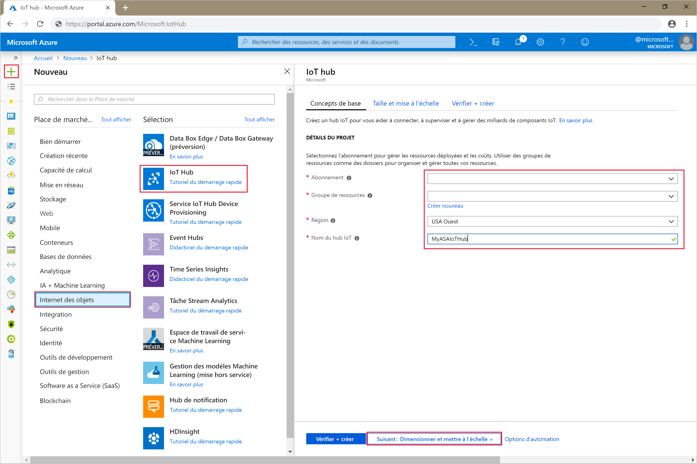

4. Sélectionnez **Suivant : Définir la taille et l’échelle**.

5. Choisissez votre **niveau de tarification et de mise à l’échelle**. Pour ce guide de démarrage rapide, sélectionnez le niveau **F1 - Gratuit** s’il est toujours disponible sur votre abonnement. Si le niveau Gratuit n’est pas disponible, choisissez le niveau le plus bas disponible. Pour plus d’informations, consultez la [tarification IoT Hub](https://azure.microsoft.com/pricing/details/iot-hub/).

   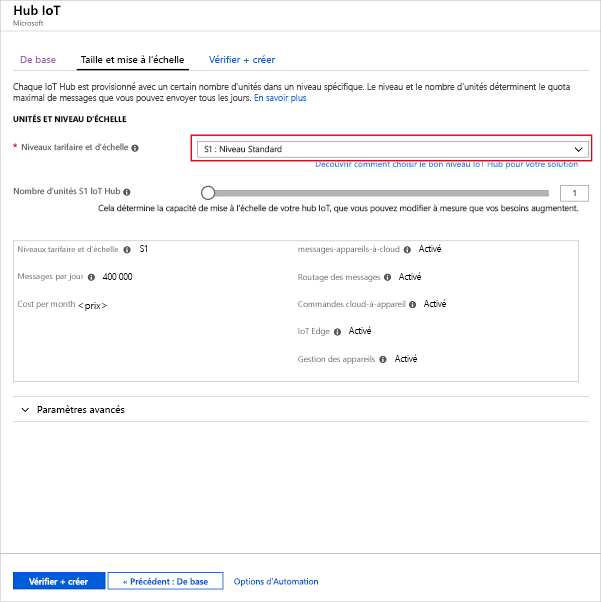

6. Sélectionnez **Revoir + créer**. Passez en revue les informations de votre hub IoT et cliquez sur **Créer**. La création de votre hub IoT peut prendre plusieurs minutes. Vous pouvez suivre la progression dans le volet **Notifications**.

7. Dans le menu de navigation de votre hub IoT, cliquez sur **Ajouter** sous **Appareils IoT**. Ajoutez un **ID d’appareil** et cliquez sur **Enregistrer**.

   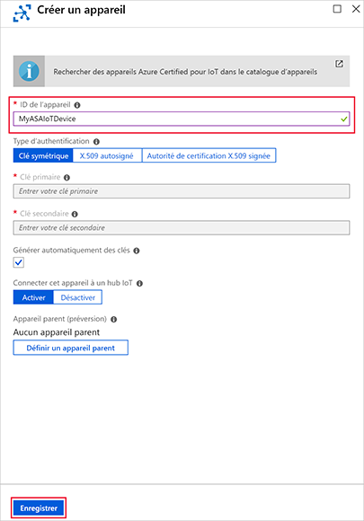

8. Une fois que l’appareil a été créé, ouvrez-le dans la liste **Appareils IoT**. Copiez la valeur **Chaîne de connexion -- clé primaire** et enregistrez-la dans un bloc-notes pour une utilisation ultérieure.

   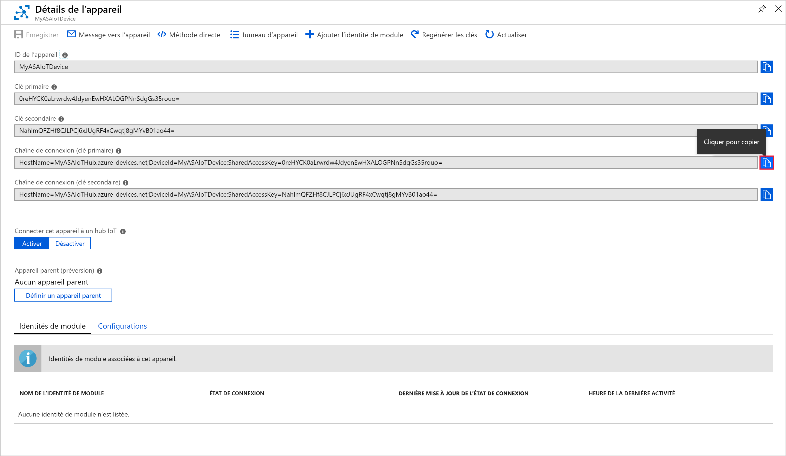

## <a name="create-blob-storage"></a>Créer un stockage d’objets blob

1. Dans le coin supérieur gauche du portail Azure, sélectionnez **Créer une ressource** > **Stockage** > **Compte de stockage**.

2. Dans le volet **Créer un compte de stockage**, entrez un nom, un emplacement et un groupe de ressources de compte de stockage. Choisissez les mêmes emplacement et groupe de ressources que pour le hub IoT que vous avez créé. Ensuite, cliquez sur **Vérifier + créer** pour créer le compte.

   

3. Une fois que votre compte de stockage a été créé, sélectionnez la vignette **Objets blob** dans le volet **Vue d’ensemble**.

   

4. Dans la page **Service Blob**, sélectionnez **Conteneur** et donnez un nom à votre conteneur, tel que *conteneur1*. Pour **Niveau d’accès public** laissez la valeur **Privé (aucun accès anonyme)** et sélectionnez **OK**.

   

## <a name="create-a-stream-analytics-project"></a>Créer un projet Stream Analytics

1. Démarrez Visual Studio.

2. Sélectionnez **Fichier > Nouveau Projet**.  

3. Dans la liste des modèles sur la gauche, sélectionnez **Stream Analytics**, puis **Application Azure Stream Analytics**.  

4. Entrez les éléments **Nom**, **Emplacement** et **Nom de la solution** de votre projet, puis sélectionnez **OK**.

   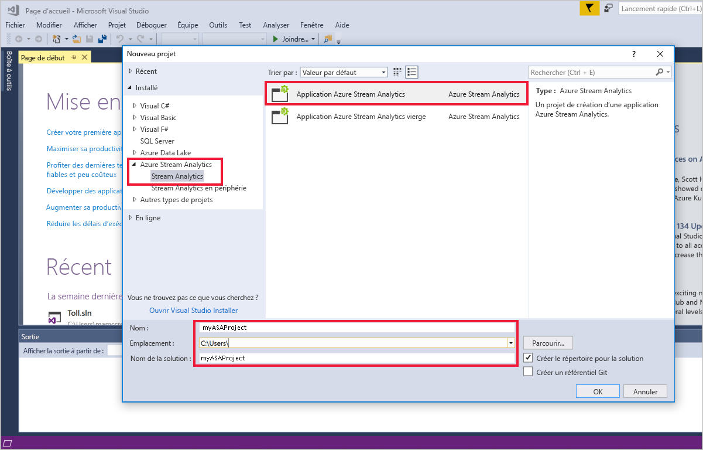

Notez les éléments inclus dans un projet Azure Stream Analytics.

   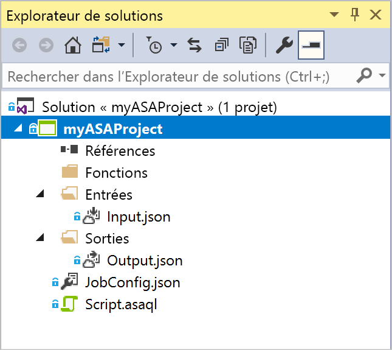


## <a name="choose-the-required-subscription"></a>Choisir le bon abonnement

1. Dans le menu **Affichage** de Visual Studio, sélectionnez **Explorateur de serveurs**.

2. Cliquez avec le bouton droit sur **Azure**, sélectionnez **Se connecter à un abonnement Microsoft Azure**, puis connectez-vous avec votre compte Azure.

## <a name="define-input"></a>Définir l’entrée

1. Dans l’**Explorateur de solutions**, développez le nœud **Entrées** et double-cliquez sur **Input.json**.

2. Renseignez la **Configuration d'entrée Stream Analytics** avec les valeurs suivantes :

   |**Paramètre**  |**Valeur suggérée**  |**Description**   |
   |---------|---------|---------|
   |Alias d’entrée  |  Entrée   |  Saisissez un nom pour identifier l’entrée du travail.   |
   |Type de source   |  Flux de données |  Choisissez la source d’entrée appropriée : Flux de données ou Données de référence.   |
   |Source  |  IoT Hub |  Sélectionnez la bonne source d’entrée.   |
   |Ressource  | Choisir une source de données du compte actuel | Vous pouvez entrer les données manuellement ou sélectionner un compte existant.   |
   |Subscription  |  \<Votre abonnement\>   | Sélectionnez l’abonnement Azure qui contient le hub IoT que vous avez créé.   |
   |IoT Hub  |  MyASAIoTHub   |  Choisissez ou entrez le nom de votre hub IoT. Si les hubs IoT sont créés dans le même abonnement, leurs noms sont automatiquement détectés.   |
   
3. Conservez les valeurs par défaut pour les autres options et sélectionnez **Enregistrer** pour enregistrer les paramètres.  

   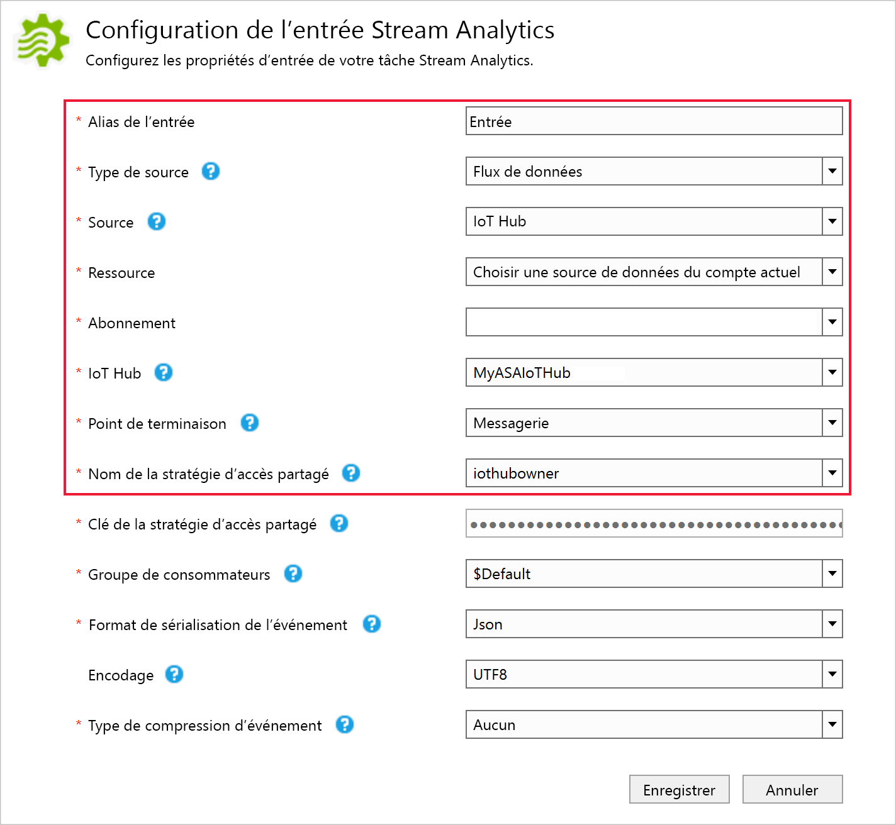

## <a name="define-output"></a>Définir la sortie

1. Dans l’**Explorateur de solutions**, développez le nœud **Sorties** et double-cliquez sur **Output.json**.

2. Renseignez la **Configuration de sortie Stream Analytics** avec les valeurs suivantes :

   |**Paramètre**  |**Valeur suggérée**  |**Description**   |
   |---------|---------|---------|
   |Alias de sortie  |  Output   |  Saisissez un nom pour identifier la sortie du travail.   |
   |Récepteur   |  Stockage Blob |  Sélectionnez le bon récepteur.    |
   |Ressource  |  Spécifier manuellement les paramètres de la source de données |  Vous pouvez entrer les données manuellement ou sélectionner un compte existant.   |
   |Subscription  |  \<Votre abonnement\>   | Sélectionnez l’abonnement Azure contenant le compte de stockage que vous avez créé. Le compte de stockage peut être dans le même abonnement ou dans un abonnement distinct. Cet exemple suppose que vous avez créé le compte de stockage dans le même abonnement.   |
   |Compte de stockage  |  asaquickstartstorage   |  Sélectionnez ou saisissez le nom du compte de stockage. Les noms de compte de stockage sont automatiquement détectés s’ils sont créés dans le même abonnement.   |
   |Conteneur  |  conteneur1   |  Sélectionnez un conteneur existant que vous avez créé dans votre compte de stockage.   |
   |Modèle de chemin d'accès  |  sortie   |  Entrez le nom d’un chemin de fichier qui doit être créé dans le conteneur.   |
   
3. Conservez les valeurs par défaut pour les autres options et sélectionnez **Enregistrer** pour enregistrer les paramètres.  

   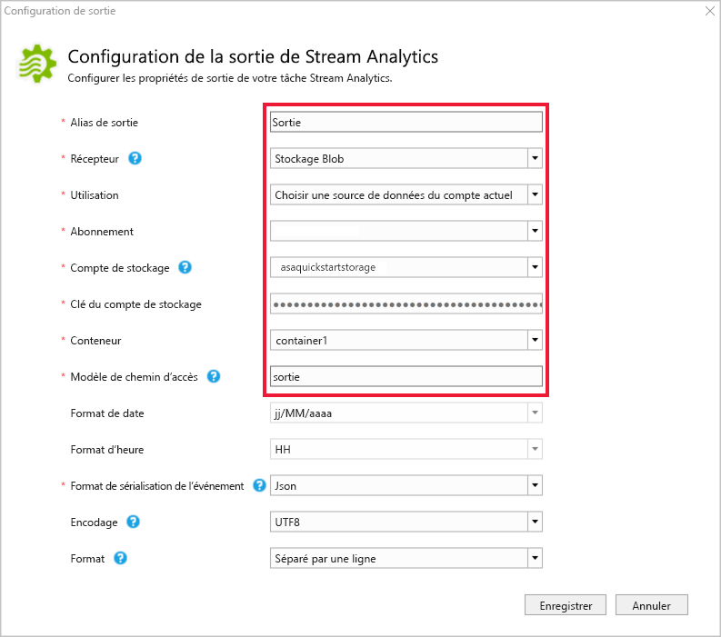

## <a name="define-the-transformation-query"></a>Définir la requête de transformation

1. Ouvrez **Script.asaql** à partir de l’**Explorateur de solutions** dans Visual Studio.

2. Ajoutez la requête suivante :

   ```sql
   SELECT *
   INTO BlobOutput
   FROM IoTHubInput
   HAVING Temperature > 27
   ```

## <a name="submit-a-stream-analytics-query-to-azure"></a>Envoyer une requête Stream Analytics sur Azure

1. Dans l’**éditeur de requête**, sélectionnez **Envoyer sur Azure** dans l’éditeur de script.

2. Sélectionnez **Créer une tâche Azure Stream Analytics** et entrez un **Nom de tâche**. Choisissez l’**Abonnement**, le **Groupe de ressources**, et l’**Emplacement** que vous avez utilisés au début du démarrage rapide.

   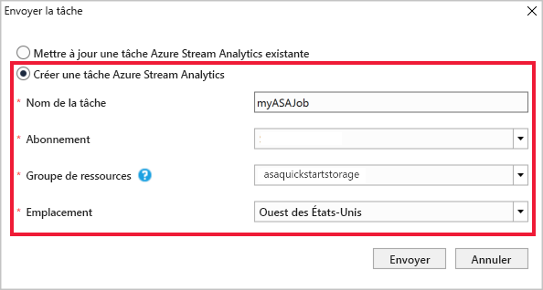

## <a name="run-the-iot-simulator"></a>Exécuter le simulateur IoT

1. Ouvrez le [simulateur en ligne Azure IoT Raspberry Pi](https://azure-samples.github.io/raspberry-pi-web-simulator/) dans un autre onglet ou une nouvelle fenêtre de navigateur.

2. Remplacez l’espace réservé à la ligne 15 par la chaîne de connexion de l’appareil Azure IoT Hub.

3. Cliquez sur **Exécuter**. La sortie doit indiquer les données de capteur et les messages qui sont envoyés à votre hub IoT.

   

## <a name="start-the-stream-analytics-job-and-check-output"></a>Démarrer la tâche Stream Analytics et observez le résultat

1. Dès lors que votre tâche est créée, sa vue s’ouvre automatiquement. Cliquez sur le bouton à la flèche verte pour commencer la tâche,

   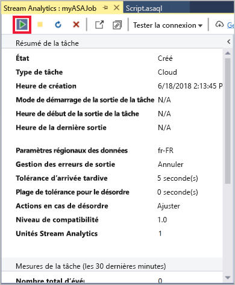

2. Changez le **mode de démarrage de la sortie du projet**  à **JobStartTime** et sélectionnez **Démarrer**.

   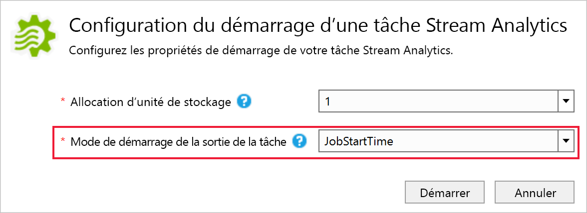

3. Constatez que l’état du travail est passé à **En cours d’exécution** et qu'il existe des événements d’entrée/de sortie. Cela peut prendre quelques minutes.

   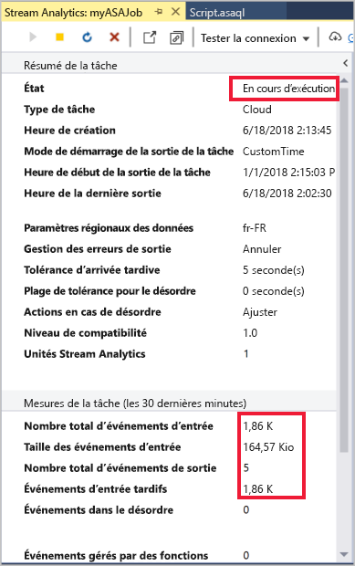

4. Pour afficher les résultats, dans le menu **Affichage**, sélectionnez **Cloud Explorer**et accédez au compte de stockage dans votre groupe de ressources. Sous **Conteneurs d’objets blob**, double-cliquez sur **container1**, puis le chemin du fichier de **sortie**.

   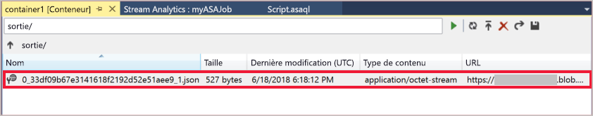

## <a name="clean-up-resources"></a>Supprimer des ressources

Lorsque vous n’en avez plus besoin, supprimez le groupe de ressources, le travail de streaming et toutes les ressources associées. La suppression du travail évite la facturation des unités de streaming consommées par le travail. Si vous envisagez d’utiliser le travail à l’avenir, vous pouvez l’arrêter et le redémarrer plus tard lorsque vous en avez besoin. Si vous ne pensez pas continuer à utiliser ce travail, supprimez toutes les ressources créées pendant ce guide de démarrage rapide en procédant comme suit :

1. Dans le menu de gauche du portail Azure, cliquez sur **Groupes de ressources**, puis sur le nom de la ressource que vous avez créée.  

2. Sur la page de votre groupe de ressources, sélectionnez **Supprimer**, saisissez le nom de la ressource à supprimer dans la zone de texte, puis sélectionnez **Supprimer**.

## <a name="next-steps"></a>Étapes suivantes

Dans ce guide de démarrage rapide, vous avez déployé un travail Stream Analytics simple à l’aide de Visual Studio. Vous pouvez également déployer des travaux Stream Analytics à l’aide du [Portail Azure](stream-analytics-quick-create-portal.md) et de [PowerShell](stream-analytics-quick-create-powershell.md). 

Pour en savoir plus sur les outils Azure Stream Analytics pour Visual Studio, consultez l’article suivant :

> [!div class="nextstepaction"]
> [Utiliser Visual Studio pour afficher les tâches Azure Stream Analytics](stream-analytics-vs-tools.md)
