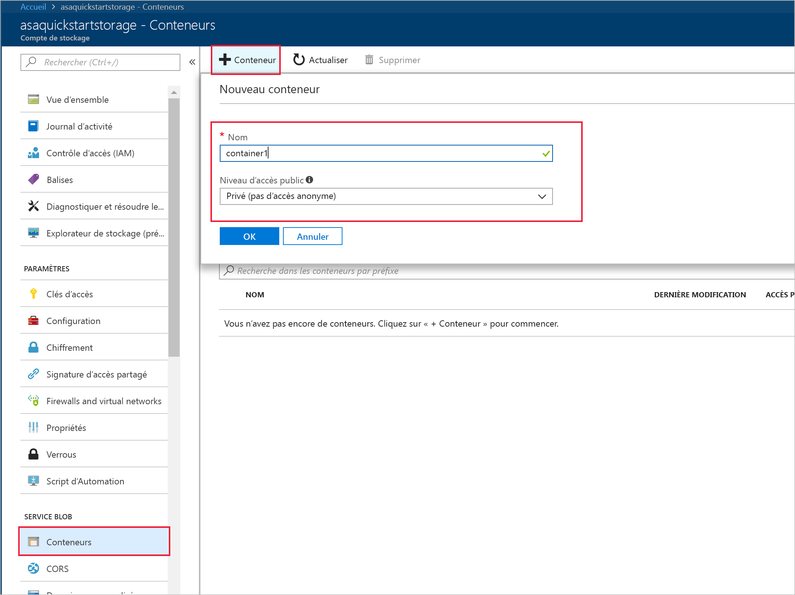
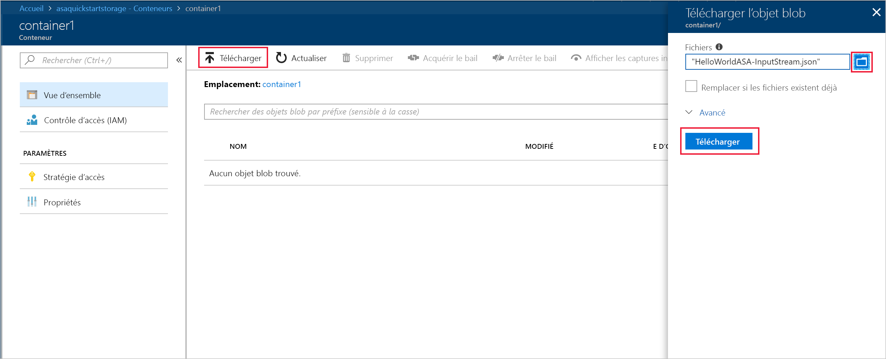

# <a name="quickstart-create-a-stream-analytics-job-by-using-the-azure-stream-analytics-tools-for-visual-studio"></a>Démarrage rapide : Créer une tâche Stream Analytics à l’aide d’Azure Stream Analytics Tools pour Visual Studio

Ce démarrage rapide vous montre comment créer et exécuter une tâche Stream Analytics à l’aide d’Azure Stream Analytics Tools pour Visual Studio. Cet exemple de tâche lit les données de diffusion en continu à partir d’un stockage Blob Azure. Le fichier de données d’entrée utilisé dans ce démarrage rapide contient des données statiques à des fins d’illustration uniquement. Dans un scénario réel, vous utilisez la diffusion en continu des données d’entrée pour un travail Stream Analytics. Dans ce démarrage rapide, vous définissez une tâche qui calcule la température moyenne lorsqu’elle dépasse 100° et écrit les événements de sortie résultants dans un nouveau fichier.

## <a name="before-you-begin"></a>Avant de commencer

* Si vous n’avez pas d’abonnement Azure, créez un [compte gratuit](https://azure.microsoft.com/free/).

* Connectez-vous au [Portail Azure](https://portal.azure.com/).

* Installez Visual Studio 2017, Visual Studio 2015 ou Visual Studio 2013 Update 4. Les éditions Enterprise (Ultimate/Premium), Professional et Community sont prises en charge. L’édition Express n’est pas prise en charge.

* Suivez les [instructions d’installation](https://docs.microsoft.com/azure/stream-analytics/stream-analytics-tools-for-visual-studio-install) pour installer Stream Analytics Tools pour Visual Studio.

## <a name="prepare-the-input-data"></a>Préparer les données d’entrée

Avant de définir le travail Stream Analytics, vous devez préparer les données qui seront configurées en tant qu’entrée pour le travail. Pour préparer les données d’entrée requises pour le travail, exécutez les opérations suivantes :

1. Téléchargez les [exemples de données de capteur](https://raw.githubusercontent.com/Azure/azure-stream-analytics/master/Samples/GettingStarted/HelloWorldASA-InputStream.json) à partir de GitHub. Les exemples de données contiennent des informations de capteur au format JSON suivant :  

   ```json
   {
     "time": "2018-01-26T21:18:52.0000000",
     "dspl": "sensorC",
     "temp": 87,
     "hmdt": 44
   }
   ```
2. Connectez-vous au [Portail Azure](https://portal.azure.com/).

3. Dans le coin supérieur gauche du portail Azure, sélectionnez **Créer une ressource** > **Stockage** > **Compte de stockage**. Sur la page de travail du compte de stockage, définissez le paramètre **Nom** sur « asaquickstartstorage », le paramètre **Emplacement** sur « Ouest des États-Unis », le paramètre **Groupe de ressources** sur « asaquickstart-resourcegroup » (pour bénéficier de meilleures performances, hébergez le compte de stockage dans le même groupe de ressources que le travail Stream Analytics). Vous pouvez conserver les valeurs par défaut des autres paramètres.  

   

4. À partir de la page **Toutes les ressources**, recherchez le compte de stockage que vous avez créé à l’étape précédente. Ouvrez la page **Vue d’ensemble**, puis la vignette **Objets blob**.  

5. Dans la page **Service Blob**, sélectionnez **Conteneur**, donnez un **Nom** à votre conteneur, tel que *container1*, puis cliquez sur  **OK**.  

   

6. Accédez au conteneur que vous avez créé à l’étape précédente. Sélectionnez **Charger** et chargez les données de capteur que vous avez obtenues à la première étape.  

   

## <a name="create-a-stream-analytics-project"></a>Créer un projet Stream Analytics

1. Démarrez Visual Studio.

2. Sélectionnez **Fichier > Nouveau Projet**.  

3. Dans la liste des modèles sur la gauche, sélectionnez **Stream Analytics**, puis **Application Azure Stream Analytics**.  

4. Entrez les éléments **Nom**, **Emplacement** et **Nom de la solution** de votre projet, puis sélectionnez **OK**.

   

## <a name="choose-the-required-subscription"></a>Choisir le bon abonnement

1. Dans le menu **Affichage** de Visual Studio, sélectionnez **Explorateur de serveurs**.

2. Cliquez avec le bouton droit sur **Azure**, sélectionnez **Se connecter à un abonnement Microsoft Azure**, puis connectez-vous avec votre compte Azure.

## <a name="define-input"></a>Définir l’entrée

1. Dans l’**Explorateur de solutions**, développez le nœud **Entrées** et double-cliquez sur **Input.json**.

2. Renseignez la **Configuration d'entrée Stream Analytics** avec les valeurs suivantes :

   |**Paramètre**  |**Valeur suggérée**  |**Description**   |
   |---------|---------|---------|
   |Alias d’entrée  |  Entrée   |  Saisissez un nom pour identifier l’entrée du travail.   |
   |Type de source   |  Flux de données |  Choisissez la source d’entrée appropriée : Flux de données ou Données de référence.   |
   |Source  |  Stockage Blob |  Sélectionnez la bonne source d’entrée.   |
   |Ressource  | Choisir une source de données du compte actuel | Vous pouvez entrer les données manuellement ou sélectionner un compte existant.   |
   |Abonnement  |  \<Votre abonnement\>   | Sélectionnez l’abonnement Azure contenant le compte de stockage que vous avez créé. Le compte de stockage peut être dans le même abonnement ou dans un abonnement distinct. Cet exemple suppose que vous avez créé le compte de stockage dans le même abonnement.   |
   |Compte de stockage  |  asaquickstartstorage   |  Sélectionnez ou saisissez le nom du compte de stockage. Les noms de compte de stockage sont automatiquement détectés s’ils sont créés dans le même abonnement.   |
   |Conteneur  |  conteneur1   |  Sélectionnez un conteneur existant que vous avez créé dans votre compte de stockage.   |
   
3. Conservez les valeurs par défaut pour les autres options et sélectionnez **Enregistrer** pour enregistrer les paramètres.  

   

## <a name="define-output"></a>Définir la sortie

1. Dans l’**Explorateur de solutions**, développez le nœud **Sorties** et double-cliquez sur **Output.json**.

2. Renseignez la **Configuration de sortie Stream Analytics** avec les valeurs suivantes :

   |**Paramètre**  |**Valeur suggérée**  |**Description**   |
   |---------|---------|---------|
   |Alias de sortie  |  Sortie   |  Saisissez un nom pour identifier la sortie du travail.   |
   |Récepteur   |  Stockage Blob |  Sélectionnez le bon récepteur.    |
   |Ressource  |  Spécifier manuellement les paramètres de la source de données |  Vous pouvez entrer les données manuellement ou sélectionner un compte existant.   |
   |Abonnement  |  \<Votre abonnement\>   | Sélectionnez l’abonnement Azure contenant le compte de stockage que vous avez créé. Le compte de stockage peut être dans le même abonnement ou dans un abonnement distinct. Cet exemple suppose que vous avez créé le compte de stockage dans le même abonnement.   |
   |Compte de stockage  |  asaquickstartstorage   |  Sélectionnez ou saisissez le nom du compte de stockage. Les noms de compte de stockage sont automatiquement détectés s’ils sont créés dans le même abonnement.   |
   |Conteneur  |  conteneur1   |  Sélectionnez un conteneur existant que vous avez créé dans votre compte de stockage.   |
   |Modèle de chemin d'accès  |  sortie   |  Entrez le nom d’un chemin de fichier qui doit être créé dans le conteneur.   |
   
3. Conservez les valeurs par défaut pour les autres options et sélectionnez **Enregistrer** pour enregistrer les paramètres.  

   

## <a name="define-the-transformation-query"></a>Définir la requête de transformation

1. Ouvrez **Script.asaql** à partir de l’**Explorateur de solutions** dans Visual Studio.

2. Ajoutez la requête suivante :

   ```sql
   SELECT 
   System.Timestamp AS OutputTime,
   dspl AS SensorName,
   Avg(temp) AS AvgTemperature
   INTO
     Output
   FROM
     Input TIMESTAMP BY time
   GROUP BY TumblingWindow(second,30),dspl
   HAVING Avg(temp)>100
   ```

## <a name="submit-a-stream-analytics-query-to-azure"></a>Envoyer une requête Stream Analytics sur Azure

1. Dans l’**éditeur de requête**, sélectionnez **Envoyer sur Azure** dans l’éditeur de script.

2. Sélectionnez **Créer une tâche Azure Stream Analytics** et entrez un **Nom de tâche**. Choisissez l’**Abonnement**, le **Groupe de ressources**, et l’**Emplacement** que vous avez utilisés au début du démarrage rapide.

   

## <a name="start-the-stream-analytics-job-and-check-output"></a>Démarrer la tâche Stream Analytics et observez le résultat

1. Dès lors que votre tâche est créée, sa vue s’ouvre automatiquement. Cliquez sur le bouton à la flèche verte pour commencer la tâche,

   

2. Modifiez la date **Heure personnalisée** en `2018-01-01` et sélectionnez **Démarrer**.

   

3. Constatez que l’état du travail est passé à **En cours d’exécution** et qu'il existe des événements d’entrée/de sortie. Cela peut prendre quelques minutes.

   

4. Pour afficher les résultats, dans le menu **Affichage**, sélectionnez **Cloud Explorer**et accédez au compte de stockage dans votre groupe de ressources. Sous **Conteneurs d’objets blob**, double-cliquez sur **container1**, puis le chemin du fichier de **sortie**.

   

## <a name="clean-up-resources"></a>Supprimer des ressources

Lorsque vous n’en avez plus besoin, supprimez le groupe de ressources, le travail de streaming et toutes les ressources associées. La suppression du travail évite la facturation des unités de streaming consommées par le travail. Si vous envisagez d’utiliser le travail à l’avenir, vous pouvez l’arrêter et le redémarrer plus tard lorsque vous en avez besoin. Si vous ne pensez pas continuer à utiliser ce travail, supprimez toutes les ressources créées pendant ce guide de démarrage rapide en procédant comme suit :

1. Dans le menu de gauche du portail Azure, cliquez sur **Groupes de ressources**, puis sur le nom de la ressource que vous avez créée.  

2. Sur la page de votre groupe de ressources, sélectionnez **Supprimer**, saisissez le nom de la ressource à supprimer dans la zone de texte, puis sélectionnez **Supprimer**.

## <a name="next-steps"></a>Étapes suivantes

Dans ce guide de démarrage rapide, vous avez déployé un travail Stream Analytics simple. Pour savoir comment configurer d’autres sources d’entrée et effectuer une détection en temps réel, passez à l’article suivant :

> [!div class="nextstepaction"]
> [Détection des fraudes en temps réel à l’aide d’Azure Stream Analytics](stream-analytics-real-time-fraud-detection.md)
