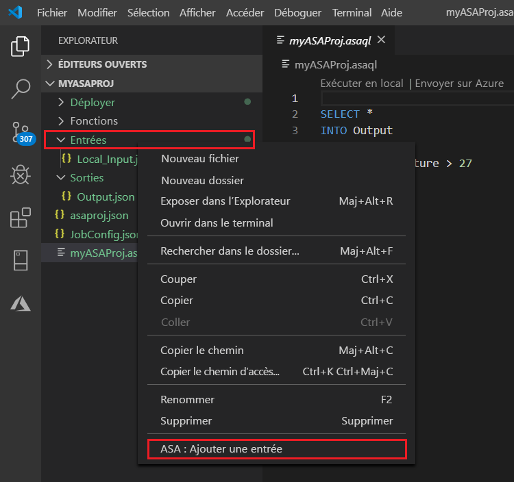
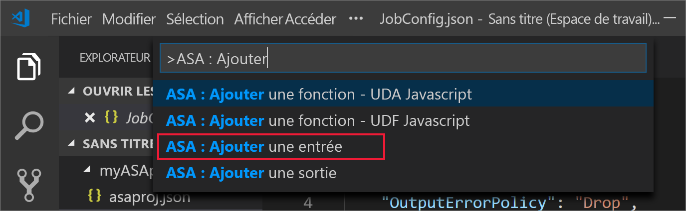
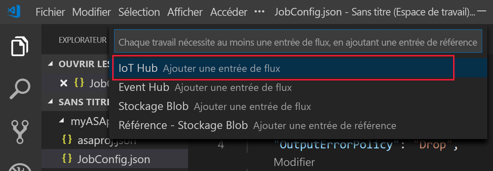
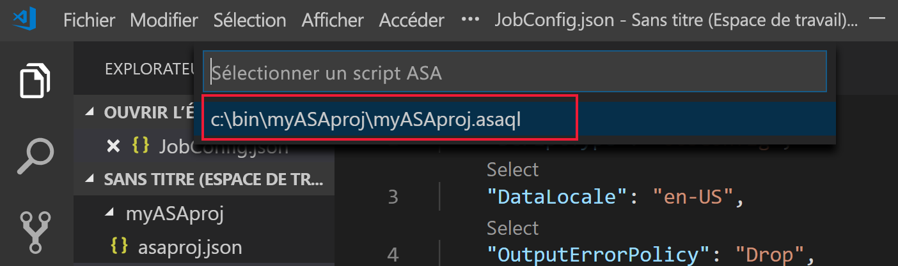
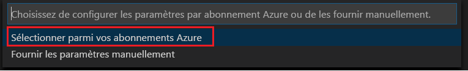
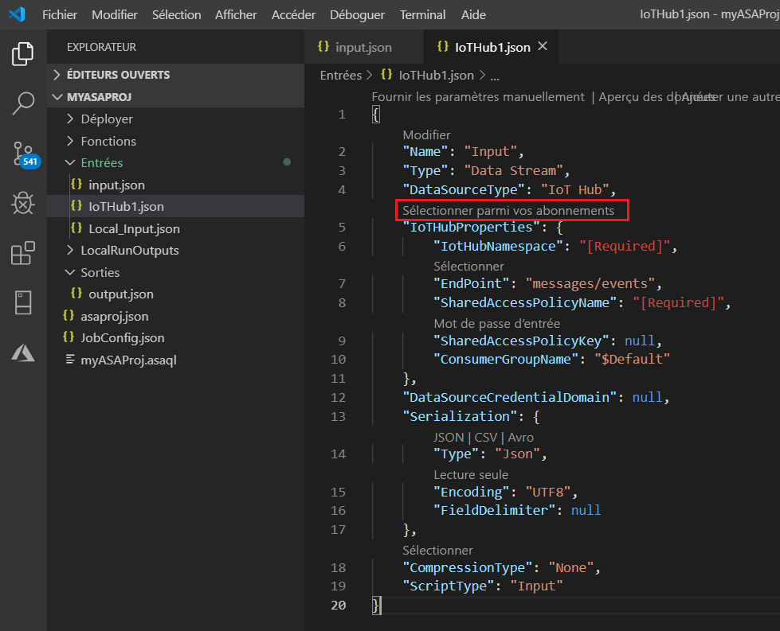
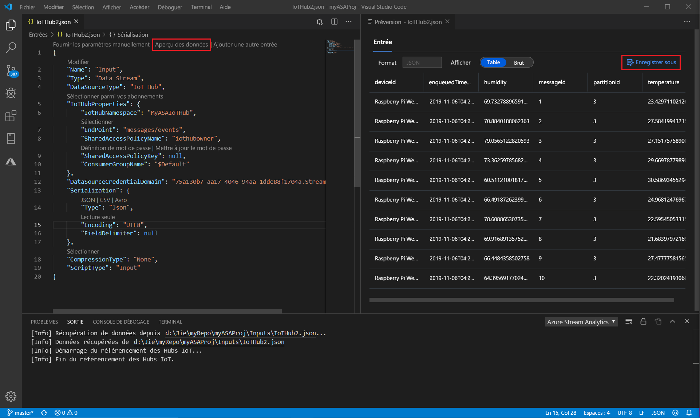

# Tester des requêtes Stream Analytics localement par rapport à une entrée de stream en direct à l'aide de Visual Studio Code

Vous pouvez utiliser Azure Stream Analytics Tools pour Visual Studio Code afin de tester vos travaux Stream Analytics localement par rapport à une entrée de stream en direct. L'entrée peut provenir d'une source comme Azure Event Hubs ou Azure IoT Hub. Les résultats sont envoyés sous forme de fichiers JSON vers un dossier de votre projet nommé **LocalRunOutputs**.

## Prérequis

* Installez le [kit SDK .NET Core](https://dotnet.microsoft.com/download) et redémarrez Visual Studio Code.

* Utilisez ce [guide de démarrage rapide](quick-create-vs-code.md) pour apprendre à créer un travail Stream Analytics à l'aide de Visual Studio Code.

## Définir une entrée de stream en direct

1. Cliquez avec le bouton droit sur le dossier **Entrées** de votre projet Stream Analytics. Sélectionnez ensuite **ASA : Ajouter une entrée** dans le menu contextuel.

   

   Vous pouvez également sélectionner **Ctrl+Maj+P** pour ouvrir la palette de commandes, puis entrer **ASA : Ajouter une entrée**.

   

2. Dans la liste déroulante, sélectionnez un type de source d'entrée.

   

3. Si vous avez ajouté l'entrée à partir de la palette de commandes, choisissez le script de requête Stream Analytics qui utilisera l'entrée. Celui-ci doit être automatiquement renseigné avec le chemin du fichier **myASAproj.asaql**.

   

4. Choisissez **Sélectionner parmi vos abonnements Azure** dans le menu déroulant.

    

5. Configurez le fichier JSON qui vient d'être généré. Vous pouvez vous aider de la fonctionnalité CodeLens pour entrer une chaîne, opérer une sélection dans une liste déroulante ou modifier le texte directement dans le fichier. La capture d’écran suivante montre **Sélectionner parmi vos abonnements** à titre d’exemple.

   

## Afficher un aperçu de l'entrée

Pour afficher un aperçu des données d'entrée, sélectionnez **Aperçu des données** dans le fichier de configuration des entrées en direct, sur la ligne supérieure. Certaines données d'entrée proviennent d'un hub IoT et sont affichées dans la fenêtre d'aperçu. L'affichage de l'aperçu peut prendre quelques secondes.

 

## Exécuter des requêtes localement

Revenez à votre éditeur de requête, puis sélectionnez **Exécuter localement**. Sélectionnez ensuite **Utiliser l'entrée en direct** dans la liste déroulante.

Le résultat apparaît dans la fenêtre de droite et est actualisé toutes les 3 secondes. Vous pouvez sélectionner **Exécuter** pour effectuer un nouveau test. Vous pouvez également sélectionner **Ouvrir dans le dossier** pour afficher les fichiers de résultats dans l'Explorateur de fichiers et les ouvrir avec Visual Studio Code ou un outil comme Excel. Notez que les fichiers de résultats sont uniquement disponibles au format JSON.

L'heure par défaut à laquelle le travail doit commencer à créer la sortie est définie sur **Maintenant**. Vous pouvez personnaliser cette heure en sélectionnant le bouton **Heure de début de la sortie** dans la fenêtre des résultats.

## Étapes suivantes

* [Explorer des travaux Azure Stream Analytics avec Visual Studio Code (préversion)](visual-studio-code-explore-jobs.md)

* [Configurer des pipelines CI/CD à l'aide du package npm](setup-cicd-vs-code.md)
