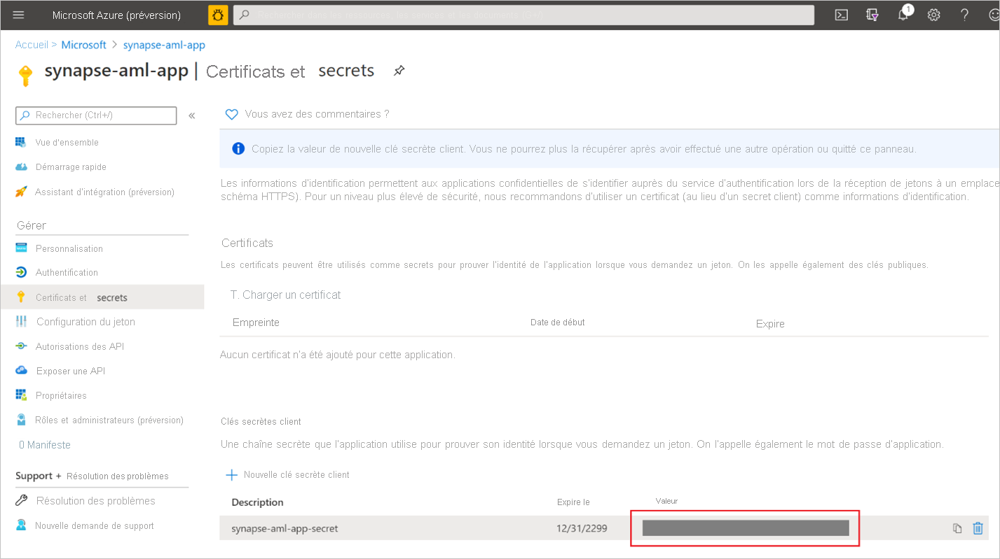
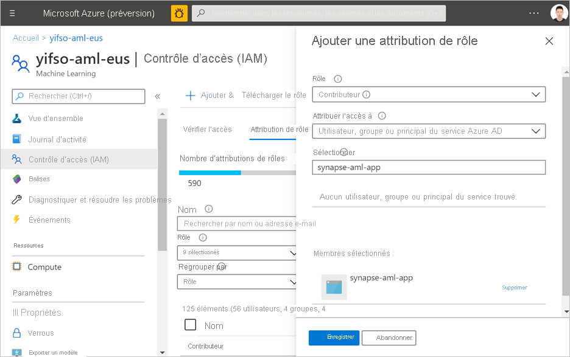

# Démarrage rapide : Créer un nouveau service lié Azure Machine Learning dans Synapse

Dans ce guide de démarrage rapide, vous allez lier un espace de travail Azure Synapse Analytics à un espace de travail Azure Machine Learning. La liaison de ces espaces de travail vous permet de tirer parti d’Azure Machine Learning à partir de diverses expériences dans Synapse.

Par exemple, ce lien vers un espace de travail Azure Machine Learning permet d’effectuer les expériences suivantes :

- Exécuter des pipelines Azure Machine Learning en tant qu’étape dans vos pipelines Synapse. Pour plus d’informations, consultez [Exécuter des pipelines Azure Machine Learning](../../data-factory/transform-data-machine-learning-service.md).

- Enrichissez vos données avec des prédictions en plaçant un modèle Machine Learning à partir du registre de modèle Azure Machine Learning et notez le modèle dans des pools Synapse SQL. Pour plus d’informations, consultez le [Didacticiel : Assistant de notation de modèles Machine Learning pour les pools Synapse SQL](tutorial-sql-pool-model-scoring-wizard.md).

## Prérequis

- Abonnement Azure : [créez-en un gratuitement](https://azure.microsoft.com/free/).
- [Espace de travail Synapse Analytics](../get-started-create-workspace.md) avec un compte de stockage ADLS Gen2 configuré comme stockage par défaut. Vous devez être le **contributeur de données Blob du stockage** du système de fichiers ADLS Gen2 que vous utilisez.
- [Espace de travail Azure Machine Learning](../../machine-learning/how-to-manage-workspace.md).
- Vous devez disposer d’autorisations (ou demander à une personne disposant d’autorisations) pour créer un principal de service et un secret que vous pouvez utiliser pour créer le service lié. Notez que le rôle contributeur doit être attribué à ce principal du service dans l’espace de travail Azure Machine Learning.

## Connectez-vous au portail Azure.

Connectez-vous au [portail Azure](https://portal.azure.com/)

## Créer un principal du service

Cette étape va créer un nouveau principal de service. Si vous souhaitez utiliser un principal de service existant, vous pouvez ignorer cette étape.
1. Ouvrez le portail Azure. 

1. Accédez à **Azure Active Directory** -> **Inscriptions des applications**.

1. Cliquez sur **Nouvelle inscription**. Ensuite, suivez les instructions de l’interface utilisateur pour inscrire une nouvelle application.

1. Une fois l’application inscrite. Générez un secret pour l’application. Accédez à **Votre application** -> **Certificat et secret**. Cliquez sur **Ajouter une clé secrète client** pour générer un secret. Conservez la sécurité secrète et elle sera utilisée ultérieurement.

   

1. Créez un principal de service pour l’application. Accédez à **Votre application** -> **Vue d’ensemble**, puis cliquez sur **Créer un principal de service**. Dans certains cas, ce principal de service est automatiquement créé.

   

1. Ajoutez le principal du service en tant que « contributeur » de l’espace de travail Azure Machine Learning. Notez que cette opération nécessite le propriétaire du groupe de ressources auquel appartient l’espace de travail Azure Machine Learning.

   

## Créer un service lié

1. Dans l’espace de travail Synapse dans lequel vous souhaitez créer le service lié Azure Machine Learning, accédez à **Gestion** -> **Service lié**, créez un service lié de type « Azure Machine Learning ».

   

2. Remplissez le formulaire :

   - ID de principal de service : Il s’agit de l’**ID d’application (client)** de l’application.
  
     > [!NOTE]
     > Il ne s’agit PAS du nom de l’application. Vous pouvez trouver cet ID dans la page de présentation de l’application. Il doit s’agir d’une chaîne longue ressemblant à ce qui suit : « 81707eac-ab38-406u-8f6c-10ce76a568d5 ».

   - Clé du principal du service : Le secret que vous avez généré dans la section précédente.

3. Cliquez sur **Tester la connexion** pour vérifier si la configuration est correcte. Si le test de connexion réussit, cliquez sur **Enregistrer**.

   Si le test de connexion a échoué, assurez-vous que l’ID de principal de service et le secret sont corrects, puis réessayez.

## Étapes suivantes

- [Tutoriel : Assistant Scoring de modèle Machine learning - Pool SQL dédié](tutorial-sql-pool-model-scoring-wizard.md)
- [Fonctionnalités de Machine Learning dans Azure Synapse Analytics](what-is-machine-learning.md)