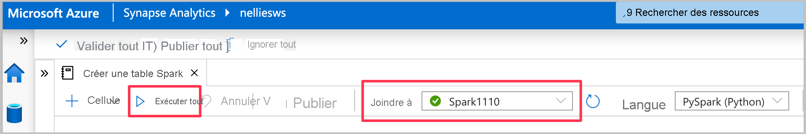
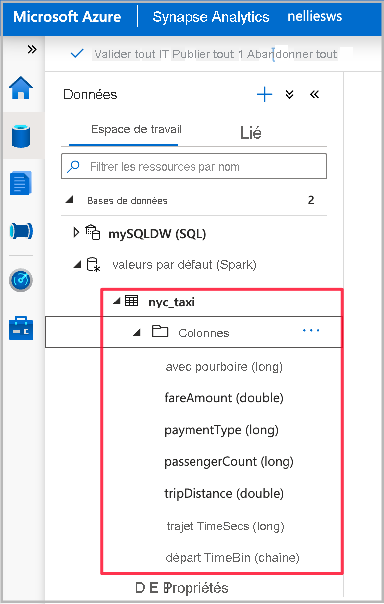
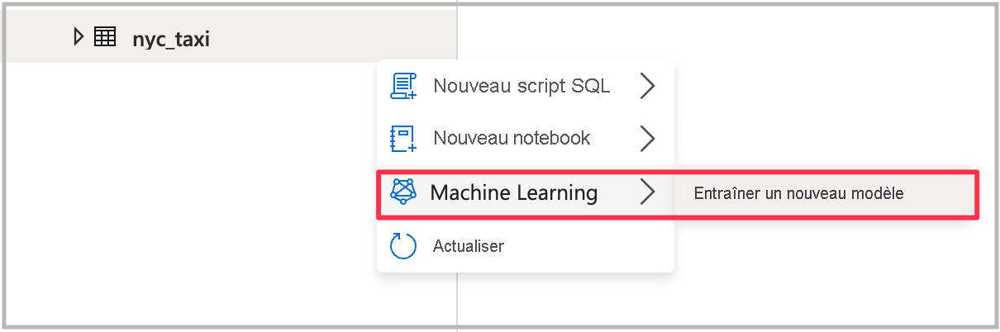
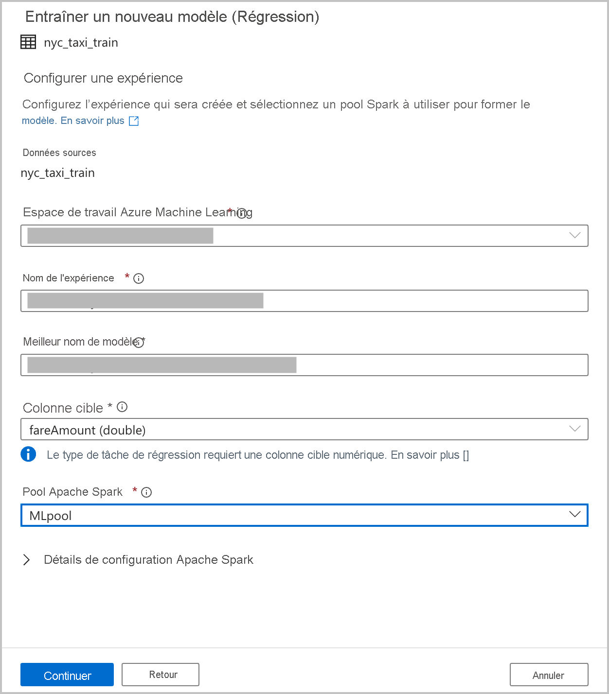
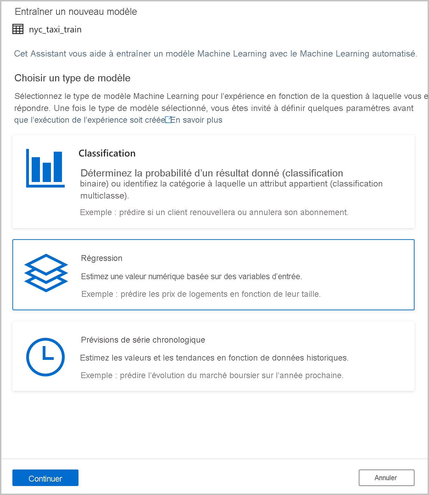
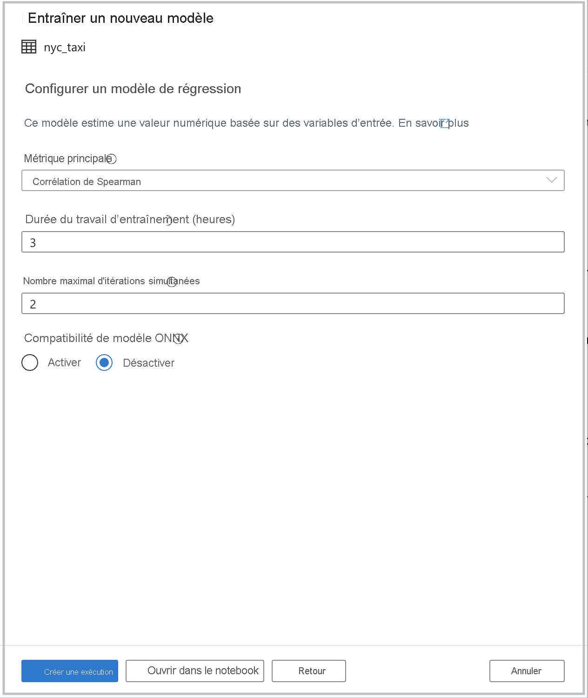
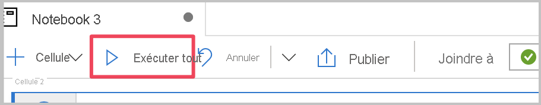
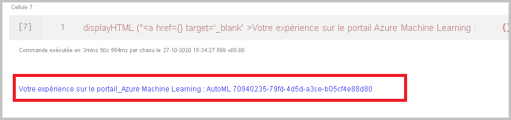

# Tutoriel : Entraîner un modèle Machine Learning sans code

Vous pouvez enrichir vos données dans les tables Spark avec de nouveaux modèles Machine Learning que vous entraînez à l’aide du [Machine Learning automatisé](../../machine-learning/concept-automated-ml.md). Dans Azure Synapse Analytics, vous pouvez sélectionner une table Spark dans l’espace de travail pour l’utiliser comme jeu de données d’entraînement afin de générer des modèles Machine Learning, et vous pouvez le faire sans code.

Dans ce tutoriel, vous apprenez à entraîner des modèles Machine Learning en utilisant une expérience sans code dans Synapse Studio. Synapse Studio est une fonctionnalité d’Azure Synapse Analytics. 

Vous allez utiliser le Machine Learning automatisé dans Azure Machine Learning, au lieu de coder manuellement l’expérience. Le type de modèle que vous entraînez dépend du problème que vous essayez de résoudre.

Si vous n’avez pas d’abonnement Azure, [créez un compte gratuit avant de commencer](https://azure.microsoft.com/free/).

## Prérequis

- Un [espace de travail Azure Synapse Analytics](../get-started-create-workspace.md). Assurez-vous qu’il comporte un compte de stockage Azure Data Lake Storage Gen2 configuré comme stockage par défaut. Pour le système de fichiers Data Lake Storage Gen2 que vous utilisez, vérifiez que vous êtes *contributeur aux données Blob de stockage*.
- Un pool Apache Spark dans votre espace de travail Azure Synapse Analytics. Pour en savoir plus, voir [Démarrage rapide : Créer un pool SQL dédié en utilisant Synapse Studio](../quickstart-create-sql-pool-studio.md).
- Un service lié Azure Machine Learning dans votre espace de travail Azure Synapse Analytics. Pour en savoir plus, voir [Démarrage rapide : Créer un service lié Azure Machine Learning dans Azure Synapse Analytics](quickstart-integrate-azure-machine-learning.md).

## Connectez-vous au portail Azure.

Connectez-vous au [portail Azure](https://portal.azure.com/).

## Créer une table Spark pour le jeu de données d’entraînement

Pour ce tutoriel, vous avez besoin d’une table Spark. Le notebook suivant en crée une :

1. Téléchargez le notebook [Create-Spark-Table-NYCTaxi-Data.ipynb](https://go.microsoft.com/fwlink/?linkid=2149229).

1. Importez le notebook dans Synapse Studio.

1. Sélectionnez le pool Spark à utiliser, puis sélectionnez **Exécuter tout**. Cette étape permet d’obtenir les données de taxi de New York du jeu de données ouvert, puis de les enregistrer dans votre base de données Spark par défaut.

1. Une fois l’exécution du notebook terminée, vous voyez une nouvelle table Spark sous la base de données Spark par défaut. À partir de **Données**, recherchez la table nommée **nyc_taxi**.

## Ouvrir l’Assistant Machine Learning automatisé

Pour ouvrir l’Assistant :

1. Cliquez avec le bouton droit sur la table Spark que vous avez créée à l’étape précédente. Sélectionnez ensuite **Machine Learning** > **Enrichir avec un nouveau modèle**.

1. Fournissez les détails de configuration pour la création d’une exécution de l’expérience de Machine Learning automatisé dans Azure Machine Learning. Cette exécution entraîne plusieurs modèles. Le meilleur modèle issu d’une exécution réussie est inscrit dans le registre de modèles Azure Machine Learning.

   

    - **Espace de travail Azure Machine Learning** : Un espace de travail Azure Machine Learning est nécessaire pour la création d’une exécution d’expérience de Machine Learning automatisé. Vous avez également besoin de lier votre espace de travail Azure Synapse Analytics à l’espace de travail Azure Machine Learning à l’aide d’un [service lié](quickstart-integrate-azure-machine-learning.md). Une fois tous les prérequis remplis, vous pouvez spécifier l’espace de travail Azure Machine Learning que vous voulez utiliser pour cette exécution automatisée.

    - **Nom de l’expérience** : spécifiez le nom de l’expérience. Quand vous soumettez une exécution de Machine Learning automatisé, vous fournissez un nom d’expérience. Les informations concernant l’exécution sont stockées sous cette expérience dans l’espace de travail Azure Machine Learning. Par défaut, une expérience est ainsi créée. Elle génère un nom proposé, mais vous pouvez également fournir le nom d’une expérience existante.

    - **Nom du meilleur modèle** : Spécifiez le nom du meilleur modèle de l’exécution automatisée. Celui-ci est attribué au meilleur modèle qui est automatiquement enregistré dans le registre de modèles Azure Machine Learning après cette exécution. Une exécution de Machine Learning automatisé crée de nombreux modèles de Machine Learning. En fonction de la métrique principale que vous sélectionnez dans une étape ultérieure, ces modèles peuvent être comparés et le meilleur modèle peut être sélectionné.

    - **Colonne cible** : il s’agit de ce que le modèle est entraîné à prédire. Choisissez la colonne que vous voulez prédire. (Dans ce tutoriel, nous allons sélectionner la colonne numérique `fareAmount` comme colonne cible.)

    - **Pool Spark** : Spécifiez le pool Spark à utiliser pour l’exécution de l’expérience automatisée. Les calculs sont exécutés sur le pool que vous spécifiez.

    - **Détails de configuration Spark** : en plus du pool Spark, vous avez la possibilité de fournir des détails sur la configuration de session.

1. Sélectionnez **Continuer**.

## Choisir un type de tâche

Sélectionnez le type de modèle Machine Learning pour l’expérience en fonction de la question à laquelle vous essayez de répondre. Étant donné que `fareAmount` est la colonne cible et qu’il s’agit d’une valeur numérique, nous vous recommandons de sélectionner **Régression** ici. Sélectionnez **Continuer**.

## Configurations supplémentaires

Si vous avez sélectionné **Régression** ou **Classification** comme type de modèle dans la section précédente, les configurations suivantes sont disponibles :

- **Métrique principale** : entrez la métrique qui mesure les performances du modèle. Vous utilisez cette métrique pour comparer les différents modèles créés lors de l’exécution automatisée et déterminer quel modèle a le mieux fonctionné.

- **Durée du travail de formation (heures)**  : spécifiez la durée maximale, en heures, pour l’exécution et l’entraînement des modèles lors d’une expérience. Notez que vous pouvez également fournir des valeurs inférieures à 1 (par exemple **0.5**).

- **Nombre maximal d'itérations simultanées** : choisissez le nombre maximal d’itérations qui sont exécutées en parallèle.

- **Compatibilité du modèle ONNX** : Si vous activez cette option, les modèles entraînés par le Machine Learning automatisé sont convertis au format ONNX. Cette opération est particulièrement utile si vous voulez utiliser le modèle pour le scoring dans des pools SQL Azure Synapse Analytics.

Ces paramètres ont tous une valeur par défaut que vous pouvez personnaliser.

Une fois toutes les configurations nécessaires effectuées, vous pouvez démarrer votre exécution automatisée. Vous pouvez choisir **Créer une exécution**, qui démarre votre exécution directement, sans code. Si vous préférez le code, vous pouvez aussi sélectionner **Ouvrir dans un notebook**. Cette option vous permet de voir le code qui crée l’exécution, puis d’exécuter le notebook.

>[!NOTE]
>Si vous avez sélectionné **Prévision de série chronologique** comme type de modèle dans la section précédente, vous devez effectuer des configurations supplémentaires. Les prévisions ne prennent pas non plus en charge la compatibilité du modèle ONNX.

### Créer une exécution directement

Pour démarrer directement votre exécution de Machine Learning automatisé, sélectionnez **Démarrer l’exécution**. Vous voyez une notification indiquant que l’exécution est en cours de démarrage. Vous voyez ensuite une autre notification qui indique la réussite de l’opération. Vous pouvez aussi vérifier l’état dans Azure Machine Learning en sélectionnant le lien dans la notification.

### Créer une exécution avec un notebook

Pour générer un notebook, sélectionnez **Ouvrir dans un notebook**. Ensuite, sélectionnez **Exécuter tout**. Cela vous donne également la possibilité d’ajouter des paramètres à votre exécution de Machine Learning automatisé.

Une fois que vous avez correctement envoyé l’exécution, vous voyez un lien vers l’exécution de l’expérience dans l’espace de travail Azure Machine Learning dans la sortie du notebook. Sélectionnez le lien pour superviser votre exécution automatisée dans Azure Machine Learning.

## Étapes suivantes

- [Tutoriel : Assistant de scoring de modèle Machine Learning pour les pools SQL dédiés](tutorial-sql-pool-model-scoring-wizard.md)
- [Démarrage rapide : Créer un service lié Azure Machine Learning dans Azure Synapse Analytics](quickstart-integrate-azure-machine-learning.md)
- [Fonctionnalités de Machine Learning dans Azure Synapse Analytics](what-is-machine-learning.md)