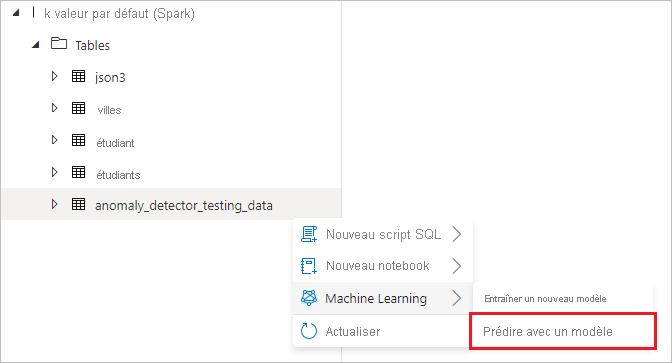
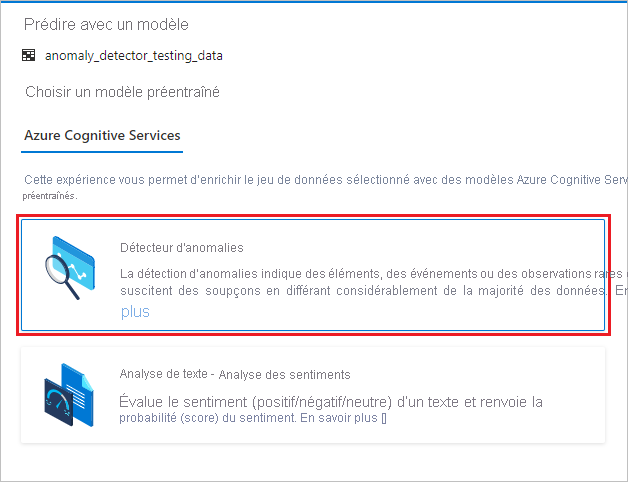
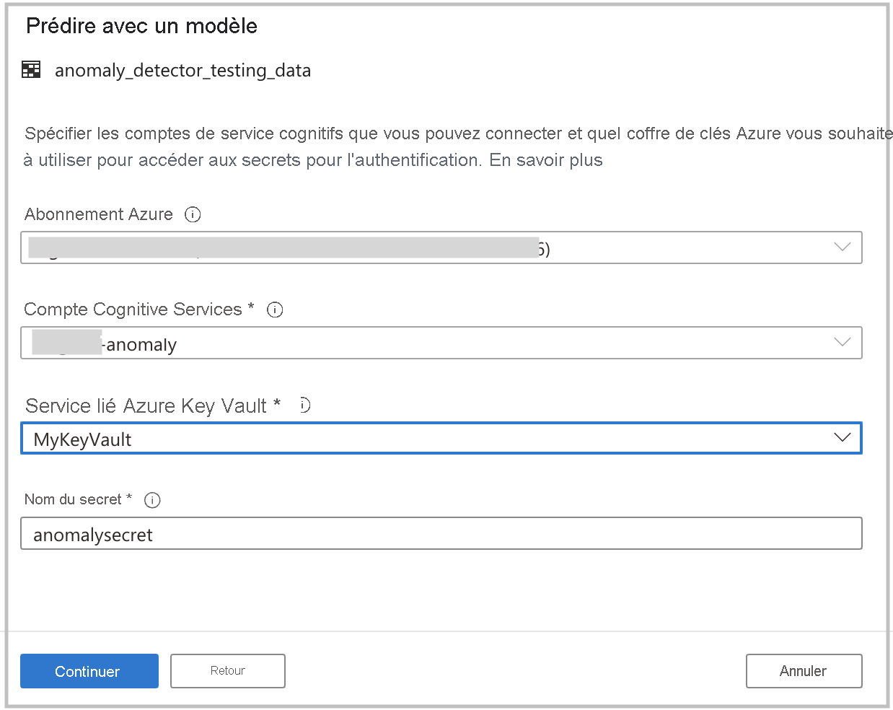
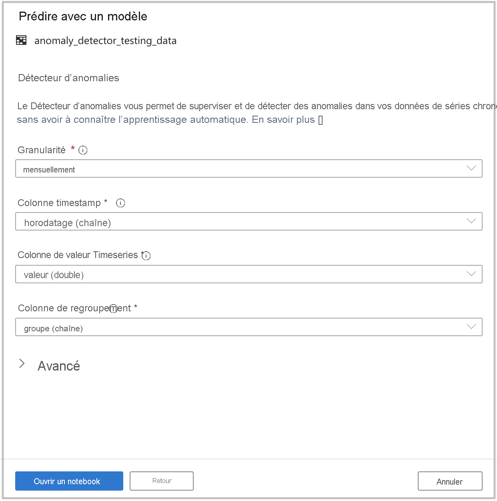

# Tutoriel : Détection d’anomalie avec Cognitive Services (préversion)

Dans ce tutoriel, vous allez apprendre à enrichir facilement vos données dans Azure Synapse Analytics avec [Azure Cognitive Services](../../cognitive-services/index.yml). Vous utiliserez le [Détecteur d’anomalies](../../cognitive-services/anomaly-detector/index.yml) pour détecter les anomalies. Dans Azure Synapse, un utilisateur peut simplement sélectionner une table à enrichir pour la détection d’anomalie.

Ce didacticiel contient les sections suivantes :

> [!div class="checklist"]
> - Étapes à effectuer pour obtenir un jeu de données de table Spark qui contient des données de série chronologique.
> - Utilisation d’une expérience d’assistant dans Azure Synapse pour enrichir les données à l’aide du Détecteur d’anomalies dans Cognitive Services.

Si vous n’avez pas d’abonnement Azure, [créez un compte gratuit avant de commencer](https://azure.microsoft.com/free/).

## Prérequis

- [Espace de travail Azure Synapse Analytics](../get-started-create-workspace.md) avec un compte de stockage Azure Data Lake Storage Gen2 configuré comme stockage par défaut. Vous devez être le *contributeur aux données Blob du stockage* du système de fichiers Data Lake Storage Gen2 que vous utilisez.
- Pool Spark dans votre espace de travail Azure Synapse Analytics. Pour plus d’informations, consultez [Créer un pool Spark dans Azure Synapse](../quickstart-create-sql-pool-studio.md).
- Avoir effectué les étapes de préconfiguration indiquées dans le tutoriel [Configurer Cognitive Services dans Azure Synapse](tutorial-configure-cognitive-services-synapse.md).

## Connectez-vous au portail Azure.

Connectez-vous au [portail Azure](https://portal.azure.com/).

## Créer une table Spark

Vous avez besoin d’une table Spark pour ce tutoriel.

1. Téléchargez le fichier de notebook suivant qui contient du code pour générer une table Spark : [prepare_anomaly_detector_data.ipynb](https://go.microsoft.com/fwlink/?linkid=2149577).

1. Chargez le fichier dans votre espace de travail Azure Synapse.

   

1. Ouvrez le fichier de notebook, puis sélectionnez **Exécuter tout** pour exécuter toutes les cellules.

   

1. Une table Spark nommée **anomaly_detector_testing_data** doit maintenant apparaître dans la base de données Spark par défaut.

## Ouvrir l’Assistant Cognitive Services

1. Cliquez avec le bouton droit sur la table Spark créée à l’étape précédente. Sélectionnez **Machine Learning** > **Enrichir avec un modèle existant** pour ouvrir l’Assistant.

   

2. Un panneau de configuration s’affiche et vous êtes invité à sélectionner un modèle Cognitive Services. Sélectionnez le **Détecteur d’anomalies**.

   

## Fournir des informations d’authentification

Pour vous authentifier auprès de Cognitive Services, vous devez référencer le secret dans votre coffre de clés. Les entrées suivantes dépendent des [étapes préalables](tutorial-configure-cognitive-services-synapse.md) que vous devez avoir effectuées avant cette étape.

- **Abonnement Azure** : Sélectionnez l’abonnement auquel appartient votre coffre de clés.
- **Compte Cognitive Services** : entrez la ressource Analyse de texte à laquelle vous allez vous connecter.
- **Service lié Azure Key Vault** : dans le cadre des étapes préalables, vous avez créé un service lié à votre ressource Analyse de texte. Sélectionnez-le ici.
- **Nom du secret** : entrez le nom du secret dans votre coffre de clés contenant la clé qui permet de vous authentifier auprès de votre ressource Cognitive Services.

## Configurer le Détecteur d’anomalies

Fournissez les informations suivantes pour configurer le Détecteur d’anomalies :

- **Fréquence** : fréquence d’échantillonnage de vos données. Choisissez **mensuelle**. 

- **Colonne timestamp** : colonne qui représente l’heure de la série. Choisissez **timestamp (chaîne)** .

- **Colonne de la valeur de série chronologique** : colonne qui représente la valeur de la série au moment spécifié par la colonne Horodatage. Choisissez **value (double)** .

- **Colonne de regroupement** : colonne qui regroupe les séries. Autrement dit, toutes les lignes qui ont la même valeur dans cette colonne doivent former une série chronologique. Choisissez **group (chaîne)** .

Quand vous avez terminé, sélectionnez **Ouvrir le notebook**. Cette opération génère automatiquement un notebook avec le code PySpark qui utilise Azure Cognitive Services pour détecter les anomalies.

## Exécuter le bloc-notes

Le notebook que vous venez d’ouvrir utilise la [bibliothèque mmlspark](https://github.com/Azure/mmlspark) pour se connecter à Cognitive Services. Les détails Azure Key Vault que vous avez fournis vous permettent de référencer vos secrets de manière sécurisée à partir de cette expérience sans les divulguer.

Vous pouvez maintenant exécuter toutes les cellules pour effectuer une détection d’anomalie. Sélectionnez **Exécuter tout**. [Découvrez-en plus sur le Détecteur d’anomalies dans Cognitive Services](../../cognitive-services/anomaly-detector/index.yml).

## Étapes suivantes

- [Tutoriel : Analyse des sentiments avec Azure Cognitive Services](tutorial-cognitive-services-sentiment.md)
- [Tutoriel : Scoring de modèle Machine Learning dans des pools SQL dédiés Azure Synapse](tutorial-sql-pool-model-scoring-wizard.md)
- [Fonctionnalités de Machine Learning dans Azure Synapse Analytics](what-is-machine-learning.md)
