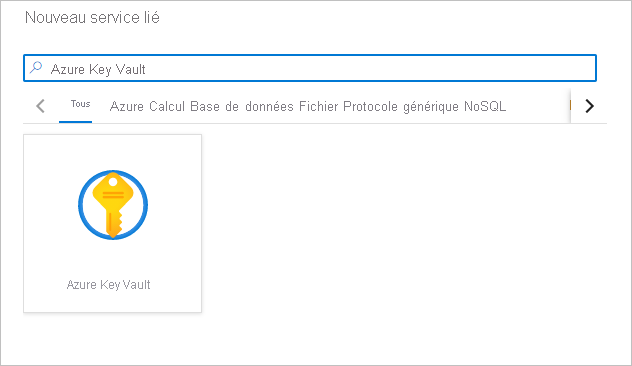

# Tutoriel : Prérequis de l’utilisation de Cognitive Services dans Azure Synapse Analytics

Dans ce tutoriel, vous allez apprendre à configurer les prérequis de l’utilisation sécurisée d’Azure Cognitive Services dans Azure Synapse Analytics.

Ce tutoriel contient les sections suivantes :
> [!div class="checklist"]
> - Créer une ressource Cognitive Services comme Analyse de texte ou Détecteur d’anomalies.
> - Stocker une clé d’authentification auprès des ressources Cognitive Services sous la forme de secrets dans Azure Key Vault et configurer l’accès pour un espace de travail Azure Synapse Analytics.
> - Créer un service lié Azure Key Vault dans votre espace de travail Azure Synapse Analytics.

Si vous n’avez pas d’abonnement Azure, [créez un compte gratuit avant de commencer](https://azure.microsoft.com/free/).

## Prérequis

- [Espace de travail Azure Synapse Analytics](../get-started-create-workspace.md) avec un compte de stockage Azure Data Lake Storage Gen2 configuré comme stockage par défaut. Vous devez être le *contributeur aux données Blob de stockage* du système de fichiers Azure Data Lake Storage Gen2 que vous utilisez.

## Connectez-vous au portail Azure.

Connectez-vous au [portail Azure](https://portal.azure.com/).

## Créer une ressource Cognitive Services

[Azure Cognitive Services](../../cognitive-services/index.yml) comprend de nombreux types de services. Analyse de texte et Détecteur d’anomalies sont deux exemples dans les tutoriels Azure Synapse.

Vous pouvez créer une ressource [Analyse de texte](https://ms.portal.azure.com/#create/Microsoft.CognitiveServicesTextAnalytics) dans le portail Azure :

Vous pouvez créer une ressource [Détecteur d’anomalies](https://ms.portal.azure.com/#create/Microsoft.CognitiveServicesTextAnalytics) dans le portail Azure :

## Créer un coffre de clés et configurer des secrets et l’accès

1. Créez un [coffre de clés](https://ms.portal.azure.com/#create/Microsoft.KeyVault) dans le portail Azure.
2. Accédez à **Coffre de clés** > **Stratégies d’accès**, puis accordez à l’[Identité de service managée (MSI) de l’espace de travail Azure Synapse](../security/synapse-workspace-managed-identity.md) des autorisations pour lire des secrets à partir d’Azure Key Vault.

   > [!NOTE]
   > Vérifiez que les changements de stratégie sont enregistrés. Il est facile d’oublier cette étape.

   

3. Accédez à votre ressource Cognitive Services. Par exemple, accédez à **Détecteur d’anomalies** > **Clés et point de terminaison**. Copiez ensuite l’une des deux clés dans le Presse-papiers.

4. Accédez à **Coffre de clés** > **Secret** pour créer un secret. Spécifiez le nom du secret, puis collez la clé de l’étape précédente dans le champ **Valeur**. Pour finir, sélectionnez **Créer**.

   

   > [!IMPORTANT]
   > Veillez à mémoriser ou à noter le nom de ce secret. Vous l’utiliserez ultérieurement quand vous vous connecterez à Cognitive Services à partir d’Azure Synapse Studio.

## Créer un service lié Azure Key Vault dans Azure Synapse

1. Ouvrez votre espace de travail dans Azure Synapse Studio. 
2. Accédez à **Gérer** > **Services liés**. Créez un service lié **Azure Key Vault** en pointant vers le coffre de clés que vous venez de créer. 
3. Vérifiez la connexion en sélectionnant le bouton **Tester la connexion**. Si la connexion est verte, sélectionnez **Créer**, puis **Publier tout** pour enregistrer vos modifications.

Vous êtes maintenant prêt à passer à l’un des tutoriels concernant l’utilisation de l’expérience Azure Cognitive Services dans Azure Synapse Studio.

## Étapes suivantes

- [Tutoriel : Analyse des sentiments avec Azure Cognitive Services](tutorial-cognitive-services-sentiment.md)
- [Tutoriel : Détection d’anomalie avec Azure Cognitive Services](tutorial-cognitive-services-sentiment.md)
- [Tutoriel : Scoring de modèle Machine Learning dans des pools SQL dédiés Azure Synapse](tutorial-sql-pool-model-scoring-wizard.md).
- [Fonctionnalités de Machine Learning dans Azure Synapse Analytics](what-is-machine-learning.md)