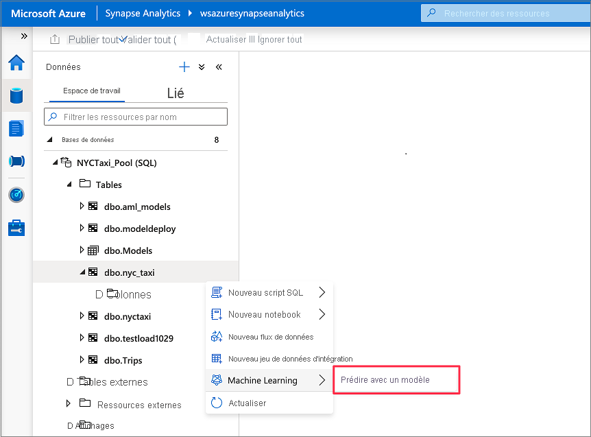
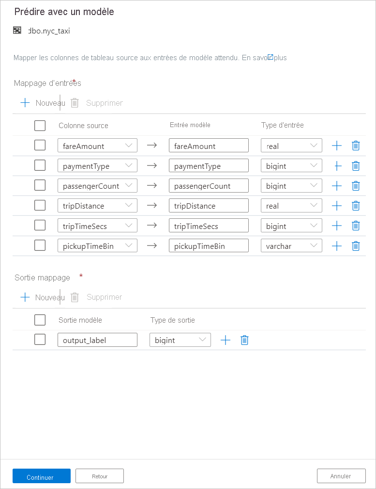
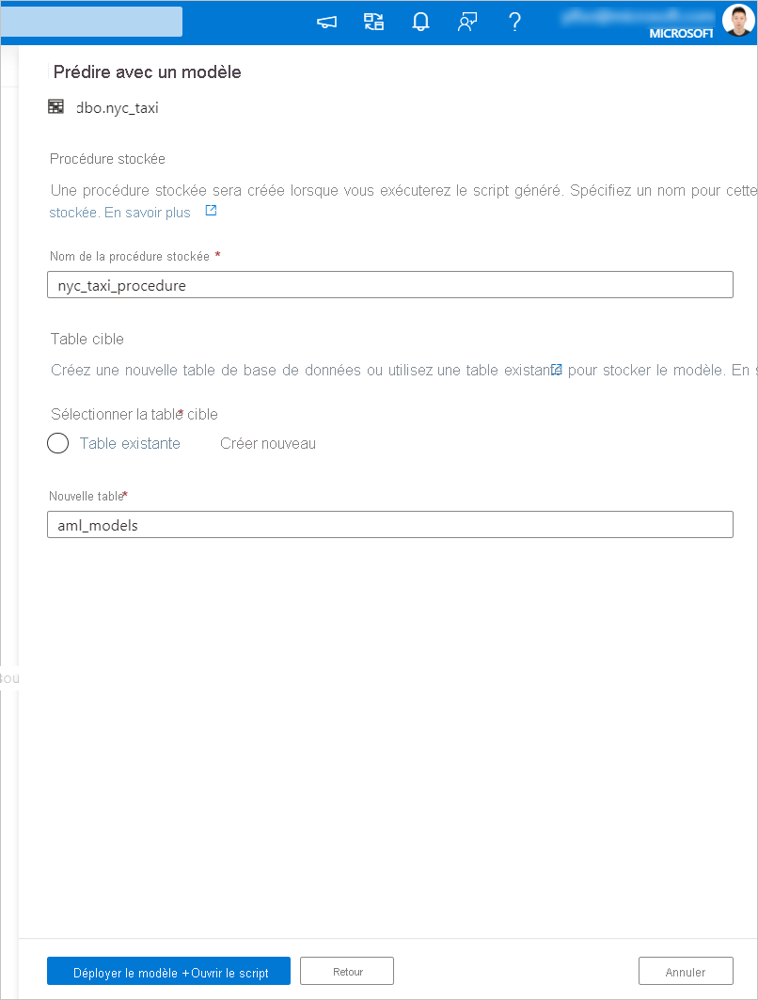

# <a name="tutorial-machine-learning-model-scoring-wizard-preview-for-dedicated-sql-pools"></a>Tutoriel : Assistant de scoring de modèle Machine Learning pour les pools SQL dédiés

Découvrez comment enrichir facilement les données de vos pools SQL dédiés avec des modèles Machine Learning prédictifs. Les modèles créés par vos scientifiques de données sont désormais facilement accessibles aux professionnels des données pour l’analyse prédictive. Dans Azure Synapse Analytics, un professionnel des données peut simplement sélectionner un modèle dans le registre de modèles Azure Machine Learning afin de le déployer dans des pools Azure Synapse SQL, et lancer des prédictions pour enrichir les données.

Ce didacticiel vous montre comment effectuer les opérations suivantes :

> [!div class="checklist"]
> - Entraîner un modèle Machine Learning prédictif et enregistrer le modèle dans le registre de modèles Azure Machine Learning
> - Utiliser l’Assistant de scoring SQL pour lancer des prédictions dans un pool SQL dédié

Si vous n’avez pas d’abonnement Azure, [créez un compte gratuit avant de commencer](https://azure.microsoft.com/free/).

## <a name="prerequisites"></a>Prérequis

- [Espace de travail Azure Synapse Analytics](../get-started-create-workspace.md) avec un compte de stockage Azure Data Lake Storage Gen2 configuré comme stockage par défaut. Vous devez être le *contributeur aux données Blob de stockage* du système de fichiers Data Lake Storage Gen2 que vous utilisez.
- Pool SQL dédié dans votre espace de travail Azure Synapse Analytics. Pour plus d’informations, consultez [Créer un pool SQL dédié](../quickstart-create-sql-pool-studio.md).
- Service lié Azure Machine Learning dans votre espace de travail Azure Synapse Analytics. Pour plus de détails, consultez [Créer un service lié Azure Machine Learning dans Azure Synapse](quickstart-integrate-azure-machine-learning.md).

## <a name="sign-in-to-the-azure-portal"></a>Connectez-vous au portail Azure.

Connectez-vous au [portail Azure](https://portal.azure.com/).

## <a name="train-a-model-in-azure-machine-learning"></a>Effectuer l’apprentissage d’un modèle dans Azure Machine Learning

Avant de commencer, vérifiez vous utilisez la version 0.20.3 de sklearn.

Avant d’exécuter toutes les cellules du notebook, vérifiez que l’instance de calcul est en cours d’exécution.


1. Accédez à votre espace de travail Azure Machine Learning.

1. Téléchargez [Predict NYC Taxi Tips.ipynb](https://go.microsoft.com/fwlink/?linkid=2144301).

1. Ouvrez l’espace de travail Azure Machine Learning dans [Azure Machine Learning Studio](https://ml.azure.com).

1. Accédez à **Notebooks** > **Charger des fichiers**. Sélectionnez ensuite le fichier **Predict NYC Taxi Tips.ipynb** que vous avez téléchargé et chargez-le.
   

1. Une fois le notebook chargé et ouvert, sélectionnez **Exécuter toutes les cellules**.

   L’une des cellules peut échouer et vous inviter à vous authentifier auprès d’Azure. Surveillez ce point dans les sorties de cellule et authentifiez-vous dans votre navigateur en suivant le lien et en entrant le code. Réexécutez ensuite le notebook.

1. Le notebook entraîne un modèle ONNX et l’inscrit auprès de MLFlow. Accédez à **Modèles** pour vérifier que le nouveau modèle est correctement inscrit.
   

1. L’exécution du notebook exporte également les données de test dans un fichier CSV. Téléchargez le fichier CSV sur votre système local. Plus tard, vous importerez le fichier CSV dans un pool SQL dédié et utiliserez les données pour tester le modèle.

   Le fichier CSV est créé dans le même dossier que votre fichier de notebook. Sélectionnez **Actualiser** dans l’Explorateur de fichiers s’il ne s’affiche pas.

   

## <a name="launch-predictions-with-the-sql-scoring-wizard"></a>Lancer les prédictions avec l’Assistant de scoring SQL

1. Ouvrez l’espace de travail Azure Synapse avec Synapse Studio.

1. Accédez à **Comptes de stockage** > **liés** > **aux données**. Téléchargez `test_data.csv` vers le compte de stockage par défaut

   

1. Accédez à **Développer** > **Scripts SQL**. Créez un script SQL pour charger `test_data.csv` dans votre pool SQL dédié.

   > [!NOTE]
   > Mettez à jour l’URL du fichier dans ce script avant de l’exécuter.

   ```SQL
   IF NOT EXISTS (SELECT * FROM sys.objects WHERE NAME = 'nyc_taxi' AND TYPE = 'U')
   CREATE TABLE dbo.nyc_taxi
   (
       tipped int,
       fareAmount float,
       paymentType int,
       passengerCount int,
       tripDistance float,
       tripTimeSecs bigint,
       pickupTimeBin nvarchar(30)
   )
   WITH
   (
       DISTRIBUTION = ROUND_ROBIN,
       CLUSTERED COLUMNSTORE INDEX
   )
   GO
   
   COPY INTO dbo.nyc_taxi
   (tipped 1, fareAmount 2, paymentType 3, passengerCount 4, tripDistance 5, tripTimeSecs 6, pickupTimeBin 7)
   FROM '<URL to linked storage account>/test_data.csv'
   WITH
   (
       FILE_TYPE = 'CSV',
       ROWTERMINATOR='0x0A',
       FIELDQUOTE = '"',
       FIELDTERMINATOR = ',',
       FIRSTROW = 2
   )
   GO
   
   SELECT TOP 100 * FROM nyc_taxi
   GO
   ```

   

1. Accédez à **Données** > **Espace de travail**. Ouvrez l’Assistant de scoring SQL en cliquant avec le bouton droit sur la table du pool SQL dédié. Sélectionnez **Machine Learning** > **Enrichir avec un modèle existant**.

   > [!NOTE]
   > L’option Machine Learning n’apparaît que si vous disposez d’un service lié créé pour Azure Machine Learning. (Consultez [Prérequis](#prerequisites) au début de ce tutoriel.)

   

1. Sélectionnez un espace de travail Azure Machine Learning lié dans la zone de liste déroulante. Cette étape charge une liste de modèles Machine Learning à partir du registre de modèles de l’espace de travail Azure Machine Learning choisi. Cette étape n’affiche que les modèles ONNX, car seuls ces derniers sont pris en charge.

1. Sélectionnez le modèle que vous venez d’entraîner, puis sélectionnez **Continuer**.

   

1. Mappez les colonnes de la table aux entrées de modèle et spécifiez les sorties de modèle. Si le modèle est enregistré au format MLFlow et que la signature du modèle est présente, le mappage s’effectue automatiquement en utilisant une logique basée sur la similarité des noms. L’interface prend également en charge le mappage manuel.

   Sélectionnez **Continuer**.

   

1. Le code T-SQL généré est encapsulé à l’intérieur d’une procédure stockée. C’est la raison pour laquelle vous devez fournir le nom d’une procédure stockée. Le modèle binaire et les métadonnées (version, description et autres informations) sont physiquement copiés entre Azure Machine Learning et une table de pool SQL dédié. Ainsi, vous devez spécifier la table dans laquelle enregistrer le modèle. 

   Vous pouvez choisir **Table existante** ou **Créer**. Quand vous avez terminé, sélectionnez **Déployer le modèle + ouvrir le script** pour déployer le modèle et générer un script de prédiction T-SQL.

   

1. Une fois le script généré, sélectionnez **Exécuter** pour exécuter le scoring et obtenir des prédictions.

   

## <a name="next-steps"></a>Étapes suivantes

- [Démarrage rapide : Créer un service lié Azure Machine Learning dans Azure Synapse](quickstart-integrate-azure-machine-learning.md)
- [Fonctionnalités de Machine Learning dans Azure Synapse Analytics](what-is-machine-learning.md)
