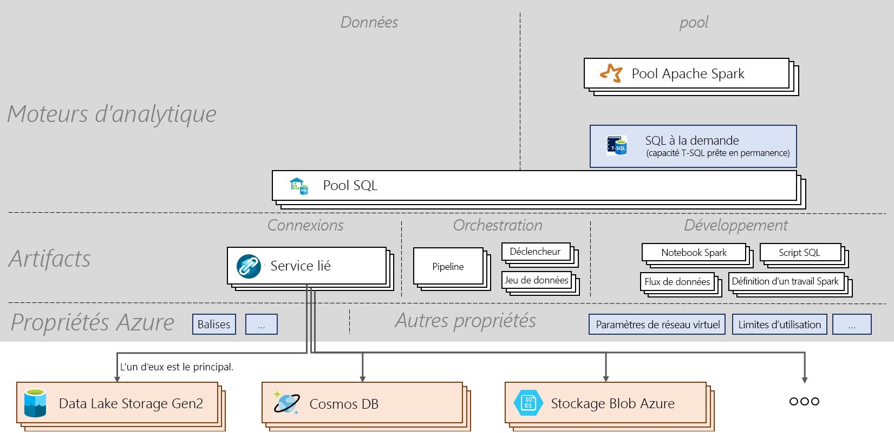

# Aide-mémoire sur Azure Synapse Analytics

[!INCLUDE [preview](includes/note-preview.md)]

L’aide-mémoire sur Azure Synapse Analytics vous guide tout au long des concepts de base du service et des commandes importantes. Cet article est utile tant pour les débutants que pour les personnes qui souhaitent connaître les points essentiels des principales rubriques Azure Synapse.

## Architecture

> [!div class="mx-imgBorder"]
>

## Concepts
| Noms et verbes                         | Résultat       |
|:---                                 |:---                 |
| **Espace de travail Synapse (préversion)** | Limite de collaboration sécurisable pour l’analytique d’entreprise basée sur le cloud dans Azure. Un espace de travail est déployé dans une région spécifique et est associé à un compte ADLS Gen2 et à un système de fichiers (pour le stockage des données temporaires). Un espace de travail se trouve sous un groupe de ressources. |
| **SQL Synapse**   | Exécutez des analytiques avec des pools ou avec des fonctionnalités à la demande.  |
| **Pool SQL**   | 0 à N ressources provisionnées SQL avec leurs bases de données correspondantes peuvent être déployées dans un espace de travail. Chaque pool SQL est associé à une base de données. Un pool SQL peut être mis à l’échelle, suspendu et repris manuellement ou automatiquement. Un pool SQL peut évoluer de 100 DWU à 30 000 DWU.       |
| **SQL à la demande (préversion)**   | Système de traitement de données distribué conçu pour les données à grande échelle qui vous permet d’exécuter des requêtes T-SQL sur les données d’un lac de données. Comme il est serverless, vous n’avez pas besoin de gérer l’infrastructure.       |
|**Apache Spark** | Runtime Spark utilisé dans un pool Spark. La version actuelle prise en charge est Spark 2.4 avec Python 3.6.1, Scala 2.11.12, la prise en charge de .NET pour Apache Spark 0.5 et Delta Lake 0.3.  | 
| **Pool Apache Spark (préversion)**  | 0 à N ressources provisionnées Spark avec leurs bases de données correspondantes peuvent être déployées dans un espace de travail. Un pool Spark peut être mis en pause, repris et mis à l’échelle automatiquement.  |
| **Application Spark**  |   Elle se compose d’un processus de pilote et d’un ensemble de processus d’exécuteur. Une application Spark s’exécute sur un pool Spark.            |
| **Session Spark**  |   Point d’entrée unifié d’une application Spark. Elle offre un moyen d’interagir avec les différentes fonctionnalités de Spark et avec un nombre inférieur de constructions. Pour exécuter un notebook, vous devez créer une session. Une session peut être configurée pour s’exécuter sur un nombre spécifique d’exécuteurs d’une taille donnée. Par défaut, une session de notebook est configurée pour s’exécuter sur 2 exécuteurs de taille moyenne. |
| **Requête SQL**  |   Opération telle qu’une requête exécutée par le biais du pool SQL ou de SQL à la demande. |
|**Intégration de données**| Permet d’ingérer des données de diverses sources et d’orchestrer des activités exécutées dans un espace de travail ou à l’extérieur d’un espace de travail.| 
|**Artefacts**| Concept qui englobe tous les objets nécessaires à un utilisateur pour les tâches de gestion de sources de données, de développement, d’orchestration et de visualisation.|
|**Notebook**| Interface d’ingénierie et de science des données interactive et réactive prenant en charge C#, Scala, PySpark et SparkSQL. |
|**Définition d’un travail Spark**|Interface pour soumettre un travail Spark avec un fichier jar d’assembly contenant le code et ses dépendances.|
|**Flux de données**|  Offre une expérience entièrement visuelle sans qu’aucun code ne soit nécessaire pour effectuer la transformation de Big Data. L’optimisation et l’exécution sont entièrement gérées de manière serverless. |
|**Script SQL**| Ensemble de commandes SQL enregistrées dans un fichier. Un script SQL peut contenir une ou plusieurs instructions SQL. Il peut être utilisé pour exécuter des requêtes SQL par le biais du pool SQL ou de SQL à la demande.|
|**Pipeline**| Regroupement logique d’activités qui exécutent une tâche ensemble.|
|**Activité**| Définit les actions à effectuer sur des données telles que la copie de données ou l’exécution d’un notebook ou d’un script SQL.|
|**Déclencheur**| Exécute un pipeline. Il peut être exécutée manuellement ou automatiquement (planification, fenêtre bascule ou événement).|
|**Service lié**| Chaînes de connexion qui définissent les informations de connexion nécessaires à l’espace de travail pour se connecter à des ressources externes.|
|**Dataset**|  Vue de données nommée qui pointe ou référence simplement les données à utiliser dans une activité en guise d’entrée et de sortie. Elle appartient à un service lié.|

## Étapes suivantes

- [Créer un espace de travail](quickstart-create-workspace.md)
- [Utiliser Synapse Studio](quickstart-synapse-studio.md)
- [Créer un pool SQL](quickstart-create-sql-pool-portal.md)
- [Utiliser SQL à la demande](quickstart-sql-on-demand.md)
- [Créer un pool Apache Spark](quickstart-create-apache-spark-pool-portal.md)

