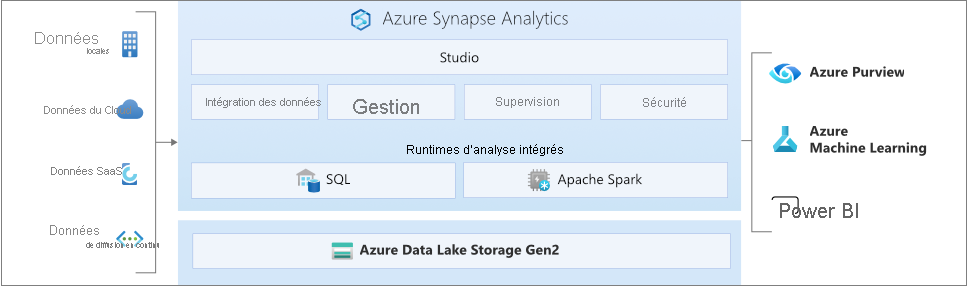

# Qu’est-ce qu’Azure Synapse Analytics ?

**Azure Synapse** est un service d’analyse pour entreprise qui raccourcit le délai d’obtention d’analyses sur l’ensemble des entrepôts de données et des systèmes Big Data. Azure Synapse réunit ce qui se fait de mieux dans les technologies **SQL** utilisées dans l’entreposage des données d’entreprise, les **technologies Spark** utilisées pour le Big Data et les **pipelines** pour l’intégration des données et l’ETL/ELT. Il offre également un haut degré d’intégration à d’autres services Azure tels que **Power BI**, **CosmosDB** et **AzureML**.

## SQL de pointe

**Synapse SQL** est un système de requêtes distribuées pour T-SQL qui autorise les scénarios d’entreposage de données et de virtualisation de données et qui permet à T-SQL de gérer les scénarios de streaming et de machine learning.

* Synapse SQL propose des modèles de ressources à la fois **serverless** et **dédiés**. Pour bénéficier de performances et de coûts prévisibles, créez des pools SQL dédiés afin de réserver de la puissance de traitement aux données stockées dans les tables SQL. Pour des charges de travail non planifiées ou en rafale, utilisez le point de terminaison SQL serverless toujours disponible.
* Utilisez les fonctionnalités de **streaming** intégrées pour placer des données de sources de données cloud dans des tables SQL.
* Intégrez l’IA à SQL en utilisant des modèles **Machine Learning** pour effectuer le scoring des données avec la [fonction T-SQL PREDICT](/sql/t-sql/queries/predict-transact-sql?view=azure-sqldw-latest&preserve-view=true).

## Apache Spark standard

**Apache Spark pour Azure Synapse** offre une intégration profonde et fluide avec Apache Spark, le moteur de Big Data open source le plus répandu dans les domaines de la préparation des données, de l’engineering données, des processus ETL (extraction, transformation et chargement) et de l’apprentissage automatique.

* Modèles ML avec algorithmes SparkML et intégration d’AzureML pour Apache Spark 2.4 avec prise en charge intégrée de Linux Foundation Delta Lake.
* Modèle de ressource simplifié qui vous évite d’avoir à vous soucier de la gestion des clusters.
* Démarrage rapide Spark et mise à l’échelle automatique agressive.
* Prise en charge intégrée de .NET pour Spark, ce qui vous permet de mettre à profit votre expertise en C# et votre code .NET existant au sein d’une application Spark.

## Travailler avec votre lac de données

Azure Synapse supprime les barrières technologiques traditionnelles qui empêchent d’utiliser conjointement SQL et Spark. Vous pouvez mélanger les fonctions de façon fluide selon vos besoins et votre expertise.

* Les tables définies sur les fichiers du lac de données sont utilisées de manière transparente par Spark ou Hive.
* SQL et Spark peuvent explorer et analyser directement des fichiers Parquet, CSV, TSV et JSON stockés dans le lac de données.
* Chargement de données rapide et évolutif entre les bases de données SQL et Spark

## Intégration de données prédéfinie

Azure Synapse contient le même moteur et les mêmes expériences d’intégration des données qu’Azure Data Factory, ce qui vous permet de créer des pipelines ETL enrichis à l’échelle sans quitter Azure Synapse Analytics.

* Ingérer des données depuis plus de 90 sources de données
* ETL sans code avec les activités de flux de données
* Orchestrer des notebooks, des travaux Spark, des procédures stockées, des scripts SQL, etc.

## Data Explorer (préversion)

L'explorateur de données Azure Synapse offre aux clients une expérience d'interrogation interactive permettant de dégager des informations à partir des données de journal et de télémétrie. Pour compléter les moteurs d'exécution d'analyse SQL et Apache Spark existants, le moteur d'exécution d'analyse Data Explorer est optimisé pour une analyse efficace des journaux en utilisant une technologie d'indexation puissante pour indexer automatiquement les données en texte libre et semi-structurées que l'on trouve généralement dans les données de télémétrie. 

Utilisez Data Explorer comme plateforme de données pour créer des solutions d'analyse de journaux et d'analyse IoT en quasi temps réel pour :

* Consolidez et corrélez vos données de journaux et d'événements à travers des sources de données sur site, dans le nuage et tierces.
* Accélérez votre parcours d’opérations d’intelligence artificielle (reconnaissance de modèle, détection d’anomalie, prévision, etc.)
* Remplacez les solutions de recherche de journal basées sur l’infrastructure pour réduire les coûts et accroître la productivité.
* Créez une solution d’analytique IoT pour vos données IoT.
* Créez des solutions SaaS analytiques pour offrir des services à vos clients internes et externes.

## Expérience unifiée 

**Synapse Studio** offre aux entreprises un moyen unique de créer des solutions, ainsi que de les gérer et les sécuriser toutes dans une même expérience utilisateur.

* Effectuer les tâches clés : ingestion, exploration, préparation, orchestration, visualisation
* Surveiller les ressources, l’utilisation et les utilisateurs sur SQL, Spark et Explorateur de données
* Utiliser le contrôle d’accès en fonction du rôle pour simplifier l’accès aux ressources d’analytique
* Écrire du code SQL, Spark ou KQL et l'intégrer aux processus CI/CD de l'entreprise

## Impliquez-vous dans la communauté Synapse

- [Microsoft Q&A](/answers/topics/azure-synapse-analytics.html) : posez vos questions techniques
- [Stack Overflow](https://stackoverflow.com/questions/tagged/azure-synapse) : posez vos questions sur le développement.

## Étapes suivantes

* [Bien démarrer avec Azure Synapse Analytics](get-started.md)
* [Créer un espace de travail](quickstart-create-workspace.md)
* [Utiliser un pool SQL serverless](quickstart-sql-on-demand.md)
* [Créer un pool Data Explorer en utilisant Synapse Studio (Préversion)](data-explorer/data-explorer-create-pool-studio.md)
