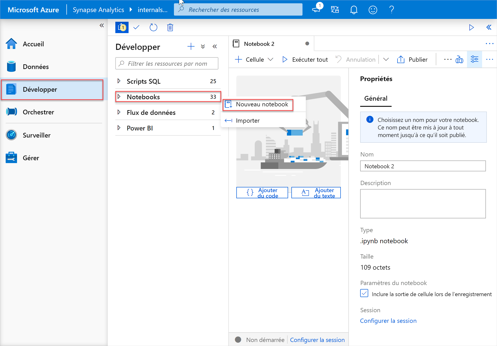
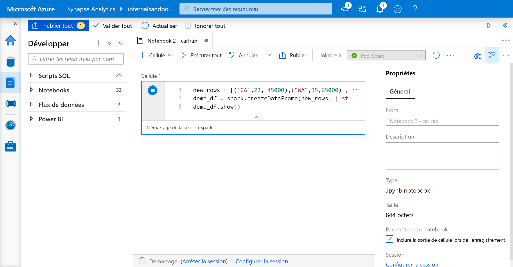
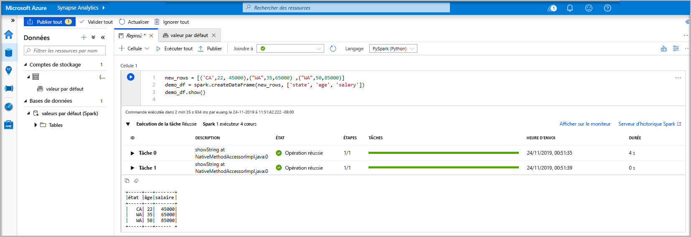
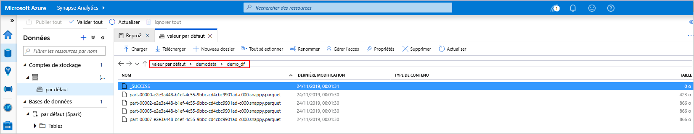
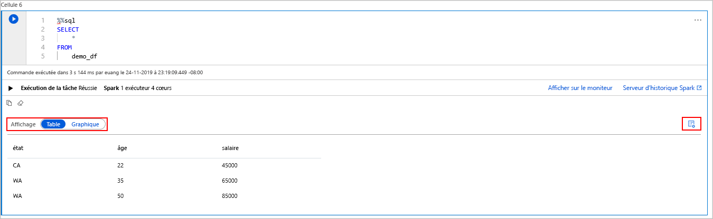
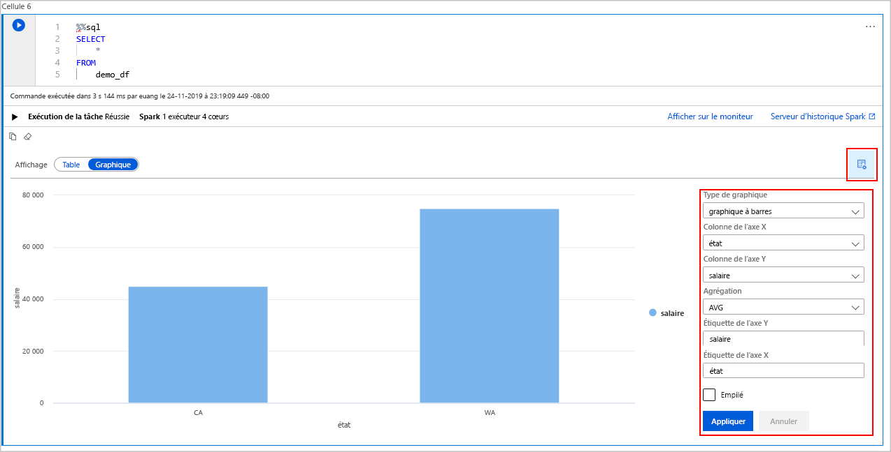

# <a name="quickstart-create-an-apache-spark-pool-in-azure-synapse-analytics-using-web-tools"></a>Démarrage rapide : Créer un pool Apache Spark dans Azure Synapse Analytics avec des outils web

Dans ce guide de démarrage rapide, vous allez découvrir comment créer un pool Apache Spark (préversion) dans Azure Synapse avec des outils web. Vous apprendrez ensuite à vous connecter au pool Apache Spark et à exécuter des requêtes Spark SQL sur des fichiers et des tables. Apache Spark permet une analytique des données et des calculs sur cluster rapides à l’aide du traitement en mémoire. Pour plus d’informations sur Spark dans Azure Synapse, consultez [Vue d’ensemble : Apache Spark sur Azure Synapse](./spark/apache-spark-overview.md).

> [!IMPORTANT]
> La facturation des instances Spark est calculée au prorata des minutes écoulées, que vous les utilisiez ou non. Veillez à arrêter votre instance Spark une fois que vous avez fini de l’utiliser, ou définissez un délai d’expiration court. Pour plus d’informations, consultez la section **Nettoyer les ressources** de cet article.

Si vous n’avez pas d’abonnement Azure, [créez un compte gratuit avant de commencer](https://azure.microsoft.com/free/).

## <a name="prerequisites"></a>Prérequis

- Abonnement Azure : [créez-en un gratuitement](https://azure.microsoft.com/free/)
- [Espace de travail Synapse Analytics](quickstart-create-workspace.md)
- [Pool Apache Spark](quickstart-create-apache-spark-pool-studio.md)

## <a name="sign-in-to-the-azure-portal"></a>Connectez-vous au portail Azure.

Connectez-vous au [portail Azure](https://portal.azure.com/).

Si vous ne disposez pas d’abonnement Azure, créez un [compte gratuit](https://azure.microsoft.com/free/) avant de commencer.

## <a name="create-a-notebook"></a>Créer un notebook

Un notebook est un environnement interactif qui prend en charge divers langages de programmation. Le notebook vous permet d’interagir avec vos données, de combiner du code avec du Markdown, du texte, et d’effectuer des visualisations simples.

1. Dans la vue du portail Azure de l’espace de travail Azure Synapse que vous voulez utiliser, sélectionnez **Lancer Synapse Studio**.
2. Une fois que Synapse Studio a été lancé, sélectionnez **Développer**. Ensuite, pointez sur l’entrée **Notebooks**. Sélectionnez les points de suspension ( **...** ).
3. À partir de là, sélectionnez **Nouveau notebook**. Un notebook est créé et ouvert avec un nom généré automatiquement.
  

4. Dans la fenêtre **Propriétés**, spécifiez un nom pour le notebook.
5. Dans la barre d’outils, cliquez sur **Publier**.
6. S’il n’existe qu’un seul pool Apache Spark dans votre espace de travail, il est sélectionné par défaut. Utilisez la liste déroulante pour sélectionner le pool Apache Spark approprié si aucun n’est sélectionné.
7. Cliquez sur **Ajouter du code**. Le langage par défaut est `Pyspark`, ce qui convient très bien puisque vous allez utiliser une combinaison de Pyspark et de SQL Spark.
8. Ensuite, vous allez créer un objet Spark DataFrame simple à manipuler. En l’occurrence, vous allez le créer à partir du code. Il y a trois lignes et trois colonnes :

   ```python
   new_rows = [('CA',22, 45000),("WA",35,65000) ,("WA",50,85000)]
   demo_df = spark.createDataFrame(new_rows, ['state', 'age', 'salary'])
   demo_df.show()
   ```

9. Maintenant, exécutez la cellule en appliquant l’une des méthodes suivantes :

   - Appuyez sur **MAJ + ENTRÉE**.
   - Sélectionnez l’icône de lecture bleue à gauche de la cellule
   - Sélectionnez le bouton **Exécuter tout** dans la barre d’outils

   

10. Si l’instance du pool Apache Spark n’est pas en cours d’exécution, elle est démarrée automatiquement. Vous pouvez voir l’état de l’instance du pool Apache Spark sous la cellule que vous exécutez ainsi que dans le panneau d’état au bas du notebook. En fonction de la taille du pool, le démarrage doit prendre de deux à cinq minutes. Une fois l’exécution du code terminée, les informations sous la cellule affichent le temps nécessaire à l’exécution. La sortie s’affiche dans la cellule de sortie.

    

11. Les données existent maintenant dans un DataFrame. À partir de là, vous pouvez utiliser les données de plusieurs façons différentes. Vous en aurez besoin dans différents formats pour le reste de ce guide de démarrage rapide.
12. Entrez le code ci-dessous dans une autre cellule, puis exécutez-le pour créer une table Spark, un fichier CSV et un fichier Parquet, tous avec des copies des données :

    ```python
     demo_df.createOrReplaceTempView('demo_df')
     demo_df.write.csv('demo_df', mode='overwrite')
     demo_df.write.parquet('abfss://<<TheNameOfAStorageAccountFileSystem>>@<<TheNameOfAStorageAccount>>.dfs.core.windows.net/demodata/demo_df', mode='overwrite')
    ```

    Si vous utilisez l’explorateur de stockage, il est possible de voir l’impact des deux différentes façons d’écrire un fichier utilisées ci-dessus. Quand aucun système de fichiers n’est spécifié, la valeur par défaut est utilisée, en l’occurrence `default>user>trusted-service-user>demo_df`. Les données sont enregistrées à l’emplacement du système de fichiers spécifié.

    Notez que dans les opérations d’écriture aux formats « csv » et « parquet », un répertoire est créé avec de nombreux fichiers partitionnés.

    

    

## <a name="run-spark-sql-statements"></a>Exécuter des instructions Spark SQL

SQL (Structured Query Language) est le langage le plus courant et le plus largement utilisé pour interroger et définir des données. Spark SQL fonctionne en tant qu’extension d’Apache Spark pour le traitement des données structurées, à l’aide de la syntaxe SQL classique.

1. Collez le code suivant dans une cellule vide, puis exécutez le code. La commande liste les tables sur le pool.

   ```sql
   %%sql
   SHOW TABLES
   ```

   Quand vous utilisez un notebook avec votre pool Apache Spark d’Azure Synapse, vous disposez d’un `sqlContext` prédéfini que vous pouvez utiliser pour exécuter des requêtes à l’aide de Spark SQL. `%%sql` indique au notebook qu’il faut utiliser le `sqlContext` prédéfini pour exécuter la requête. Par défaut, la requête extrait les 10 premières lignes d’une table système qui est fournie avec tous les pools Apache Spark d’Azure Synapse.

2. Exécutez une autre requête pour afficher les données dans `demo_df`.

    ```sql
    %%sql
    SELECT * FROM demo_df
    ```

    Le code génère deux cellules de sortie, l’une contenant les données, l’autre qui affiche la vue du travail.

    Par défaut, la vue de résultats affiche une grille. Toutefois, il existe un sélecteur de vue sous la grille qui permet de basculer entre les vues de grille et de graphique.

    

3. Dans le sélecteur de **Vue**, sélectionnez **Graphique**.
4. Sélectionnez l’icône **Options d’affichage** qui se trouve tout à droite.
5. Dans le champ **Type de graphique**, sélectionnez « graphique à barres ».
6. Dans le champ de colonne de l’axe X, sélectionnez « state ».
7. Dans le champ de colonne de l’axe Y, sélectionnez « salary ».
8. Dans le champ **Agrégation**, sélectionnez « AVG ».
9. Sélectionnez **Appliquer**.

   

10. Il est possible d’obtenir la même expérience d’exécution SQL, mais sans avoir à changer de langage. Pour ce faire, vous pouvez remplacer la cellule SQL ci-dessus par cette cellule PySpark. L’expérience de sortie est la même car la commande **display** est utilisée :

    ```python
    display(spark.sql('SELECT * FROM demo_df'))
    ```

11. Chacune des cellules précédemment exécutées offrait la possibilité d’accéder à **Serveur d’historique** et **Supervision**. Un clic sur les liens vous permet d’accéder à différentes parties de l’expérience utilisateur.

## <a name="clean-up-resources"></a>Nettoyer les ressources

Azure Synapse enregistre vos données dans Azure Data Lake Storage. Vous pouvez laisser une instance Spark s’arrêter en toute sécurité quand elle n’est pas utilisée. Un pool Apache Spark d’Azure Synapse vous est facturé tant qu’il est en cours d’exécution, même s’il n’est pas en cours d’utilisation. 

Étant donné que les frais pour le pool sont bien plus élevés que les frais de stockage, économique, mieux vaut laisser les instances Spark s’arrêter quand elles ne sont pas utilisées.

Pour vous assurer que l’instance Spark est arrêtée, mettez fin aux sessions connectées (notebooks). Le pool s’arrête quand la **durée d’inactivité** spécifiée dans le pool Apache Spark est atteinte. Vous pouvez également sélectionner **terminer la session** dans la barre d’état en bas du notebook.

## <a name="next-steps"></a>Étapes suivantes

Dans ce guide de démarrage rapide, vous avez découvert comment créer un pool Apache Spark d’Azure Synapse et exécuter une requête Spark SQL de base.

- [Azure Synapse Analytics](overview-what-is.md)
- [Documentation .NET pour Apache Spark](/dotnet/spark?toc=/azure/synapse-analytics/toc.json&bc=/azure/synapse-analytics/breadcrumb/toc.json)
- [Documentation officielle Apache Spark](https://spark.apache.org/docs/latest/)

>[!NOTE]
> Une partie de la documentation Apache Spark officielle repose sur l’utilisation de la console Spark qui n’est pas disponible sur Azure Synapse Spark. Utilisez à la place les expériences [notebook](quickstart-apache-spark-notebook.md) ou [IntelliJ](./spark/intellij-tool-synapse.md).
