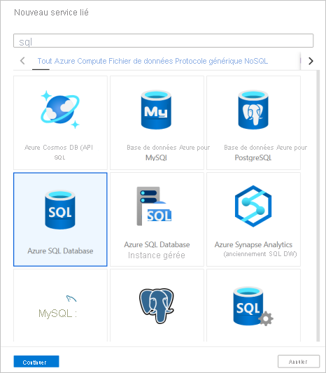
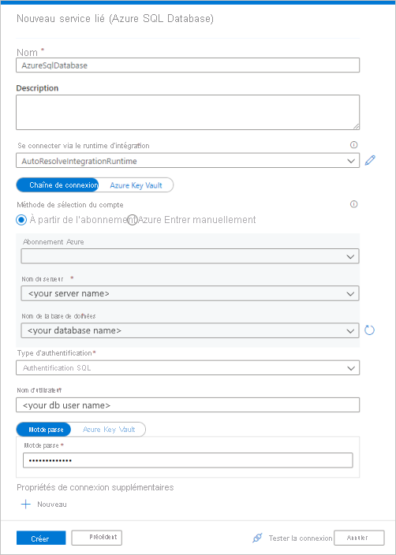
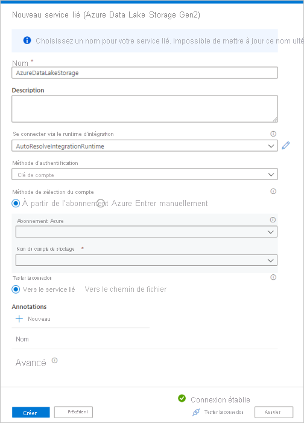
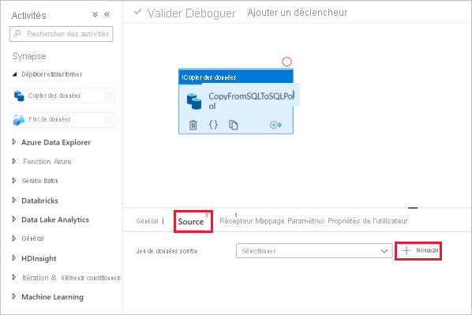
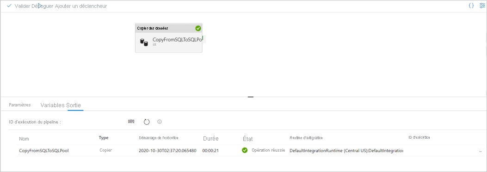

# Démarrage rapide : Charger des données dans un pool SQL dédié en utilisant l’activité de copie

Azure Synapse Analytics propose différents moteurs d’analytique pour vous aider à ingérer, transformer, modéliser et analyser vos données. Un pool SQL dédié offre des fonctionnalités de calcul et de stockage basées sur T-SQL. Après avoir créé un pool SQL dédié dans votre espace de travail Synapse, vous pouvez charger, modéliser, traiter et distribuer les données pour obtenir plus rapidement des insights.

Dans ce guide de démarrage rapide, vous allez apprendre à *charger des données depuis Azure SQL Database dans Azure Synapse Analytics*. Vous pouvez procéder de même pour copier des données à partir d’autres types de banques de données. Ce flux similaire s’applique aussi à la copie de données pour d’autres sources et récepteurs.

## Prérequis

* Abonnement Azure : Si vous n’avez pas d’abonnement Azure, créez un [compte gratuit](https://azure.microsoft.com/free/) avant de commencer.
* Espace de travail Azure Synapse : créez un espace de travail Synapse à l’aide du portail Azure en suivant les instructions fournies dans [Démarrage rapide : Créer un espace de travail Synapse](quickstart-create-workspace.md).
* Azure SQL Database : ce tutoriel copie les données de l’échantillon de jeu de données Adventure Works LT à Azure SQL Database. Vous pouvez créer cet échantillon de base de données dans SQL Database en suivant les instructions données dans [Création d’un échantillon de base de données dans Azure SQL Database](../azure-sql/database/single-database-create-quickstart.md). Ou vous pouvez utiliser d’autres magasins de données en procédant de la même façon.
* Compte Azure Storage : Stockage Azure est utilisé comme zone de *préproduction* dans l’opération de copie. Si vous ne possédez pas de compte de stockage Azure, consultez les instructions dans [Créer un compte de stockage](../storage/common/storage-account-create.md).
* Azure Synapse Analytics : Vous utilisez un pool SQL dédié en tant que magasin de données récepteur. Si vous ne disposez pas d’une instance Synapse Analytics, consultez [Créer un pool SQL dédié](quickstart-create-sql-pool-portal.md) pour savoir comment procéder.

### Accéder à Synapse Studio

Une fois que votre espace de travail Synapse a été créé, vous disposez de deux méthodes pour ouvrir Synapse Studio :

* Ouvrez votre espace de travail Synapse dans le [Portail Azure](https://ms.portal.azure.com/#home). Sélectionnez **Ouvrir** sur la carte Ouvrir Synapse Studio dans la section Démarrage.
* Ouvrez [Azure Synapse Analytics](https://web.azuresynapse.net/) et connectez-vous à votre espace de travail.

Dans ce guide de démarrage rapide, nous utilisons l’espace de travail nommé « adftest2020 » comme exemple. Vous accéderez automatiquement à la page d’accueil de Synapse Studio.

## Créez des services liés

Dans Azure Synapse Analytics, un service lié vous permet de définir vos informations de connexion à d’autres services. Dans cette section, vous allez créer les deux types de services liés suivants : services liés Azure SQL Database et Azure Data Lake Storage Gen2 (ADLS Gen2).

1. Dans la page d’accueil de Synapse Studio, sélectionnez l’onglet **Gérer** dans le volet de navigation gauche.
1. Sous Connexions externes, sélectionnez Services liés.
  
   

1. Pour ajouter un service lié, sélectionnez **Nouveau**.
1. Sélectionnez **Azure SQL Database** dans la galerie, puis sélectionnez **Continuer**. Vous pouvez taper « sql » dans la zone de recherche pour filtrer les connecteurs.

   

1. Dans la page Nouveau service lié, sélectionnez le nom de votre serveur et le nom de votre base de données dans la liste déroulante, puis spécifiez le nom d’utilisateur et le mot de passe. Cliquez sur **Tester la connexion** pour vérifier les paramètres, puis sélectionnez **Créer**.

   

1. Répétez les étapes 3 et 4, mais sélectionnez **Azure Data Lake Storage Gen2** à la place dans la galerie. Dans la page Nouveau service lié, sélectionnez le nom de votre compte de stockage dans la liste déroulante. Cliquez sur **Tester la connexion** pour vérifier les paramètres, puis sélectionnez **Créer**. 

   
 
## Créer un pipeline

Un pipeline contient le flux logique pour l’exécution d’un ensemble d’activités. Dans cette section, vous allez créer un pipeline contenant une activité de copie qui ingère des données d’Azure SQL Database dans un pool SQL dédié.

1. Accédez à l’onglet **Intégrer**. Sélectionnez l’icône + à côté de l’en-tête Pipelines, puis sélectionnez Pipeline.

   

1. Dans le volet *Activités*, sous *Déplacer et transformer*, faites glisser **Copier les données** sur le canevas du pipeline.
1. Sélectionnez l’activité de copie, puis accédez à l’onglet Source. Sélectionnez **Nouveau** pour créer un jeu de données source.

   

1. Sélectionnez **Azure SQL Database** comme magasin de données, puis sélectionnez **Continuer**.
1. Dans le volet *Définir les propriétés*, sélectionnez le service lié Azure SQL Database que vous avez créé à l’étape précédente. 
1. Sous Nom de la table, sélectionnez un exemple de table à utiliser dans l’activité de copie. Dans ce guide de démarrage rapide, nous utilisons la table « SalesLT.Customer » comme exemple. 

   
1. Quand vous avez terminé, sélectionnez **OK**.
1. Sélectionnez l’activité de copie, puis accédez à l’onglet Récepteur. Sélectionnez **Nouveau** pour créer un jeu de données récepteur.
1. Sélectionnez **Pool SQL dédié Azure Synapse** en tant que magasin de données, puis sélectionnez **Continuer**.
1. Dans le volet **Définir les propriétés**, sélectionnez le pool SQL Analytics que vous avez créé à l’étape précédente. Si vous écrivez dans une table existante, sélectionnez-la dans la liste déroulante *Nom de la table*. Sinon, cochez « Modifier » et entrez le nom de la nouvelle table. Quand vous avez terminé, sélectionnez **OK**.
1. Pour les paramètres du jeu de données récepteur, activez **Créer automatiquement une table** dans le champ Option de table.

   

1. Dans la page **Paramètres**, cochez la case **Activer le mode de préproduction**. Cette option s’applique si vos données sources ne sont pas compatibles avec PolyBase. Dans la section **Paramètres de préproduction**, sélectionnez le service lié Azure Data Lake Storage Gen2 que vous avez créé à l’étape précédente comme stockage de préproduction. 

    Le stockage est utilisé pour les données en préproduction avant leur chargement dans Azure Synapse Analytics avec PolyBase. Une fois la copie terminée, les données temporaires dans Azure Data Lake Storage Gen2 sont nettoyées automatiquement.

   

1. Pour valider le pipeline, sélectionnez **Valider** dans la barre d’outils. Le résultat de la validation du pipeline s’affiche sur le côté droit de la page. 

## Déboguer et publier le pipeline

Une fois la configuration de votre pipeline terminée, avant de publier vos artefacts, vous pouvez exécuter un débogage pour vérifier que tout est correct.

1. Pour déboguer le pipeline, sélectionnez **Déboguer** dans la barre d’outils. L’état d’exécution du pipeline apparaît dans l’onglet **Sortie** au bas de la fenêtre. 

   

1. Une fois que le pipeline s’exécute correctement, sélectionnez **Publier tout** dans la barre d’outils supérieure. Cette action publie les entités (jeux de données et pipelines) que vous avez créées dans le service Synapse Analytics.
1. Patientez jusqu’à voir le message **Publication réussie**. Pour voir les messages de notification, sélectionnez le bouton avec l’icône de cloche en haut à droite. 

## Déclencher et surveiller le pipeline

Dans cette section, vous déclenchez manuellement le pipeline publié à l’étape précédente. 

1. Sélectionnez **Ajouter déclencheur** dans la barre d’outils, puis **Déclencher maintenant**. Dans la page **Exécution du pipeline**, sélectionnez **OK**.  
1. Accédez à l’onglet **Surveiller** dans la barre latérale gauche. Vous voyez un pipeline qui est déclenché par un déclencheur manuel. 
1. Quand l’exécution du pipeline s’effectue correctement, sélectionnez le lien dans la colonne **Nom du pipeline** pour afficher les détails de l’exécution d’activité ou réexécuter le pipeline. Dans cet exemple, il n’y a qu’une seule activité, vous ne voyez donc qu’une seule entrée dans la liste. 
1. Pour plus de détails sur l’opération de copie, sélectionnez le lien **Détails** (icône en forme de lunettes) dans la colonne **Nom de l’activité**. Vous pouvez suivre les informations détaillées comme le volume de données copiées à partir de la source dans le récepteur, le débit des données, les étapes d’exécution avec une durée correspondante et les configurations utilisées.

   

1. Pour revenir à l’affichage des exécutions du pipeline, sélectionnez le lien **Toutes les exécutions de pipelines** affiché en haut de la fenêtre. Sélectionnez **Actualiser** pour actualiser la liste.
1. Vérifiez que vos données sont correctement écrites dans le pool SQL dédié.

## Étapes suivantes

Lisez l’article suivant pour en savoir plus sur la prise en charge d’Azure Synapse Analytics :

> [!div class="nextstepaction"]
> [Pipeline et activités](../data-factory/concepts-pipelines-activities.md?bc=%2fazure%2fsynapse-analytics%2fbreadcrumb%2ftoc.json&toc=%2fazure%2fsynapse-analytics%2ftoc.json)
> [Vue d’ensemble du connecteur](../data-factory/connector-overview.md?bc=%2fazure%2fsynapse-analytics%2fbreadcrumb%2ftoc.json&toc=%2fazure%2fsynapse-analytics%2ftoc.json)
> [Activité de copie](../data-factory/copy-activity-overview.md?bc=%2fazure%2fsynapse-analytics%2fbreadcrumb%2ftoc.json&toc=%2fazure%2fsynapse-analytics%2ftoc.json)