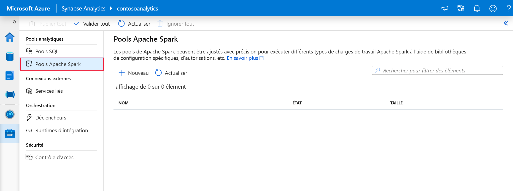
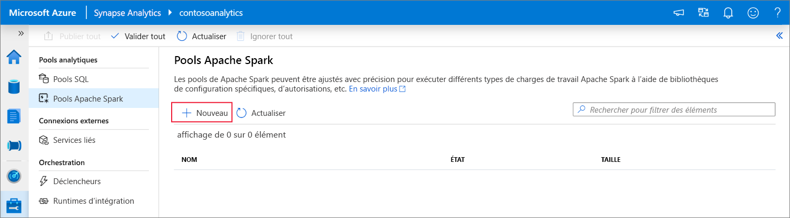
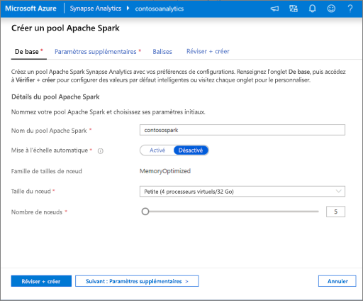
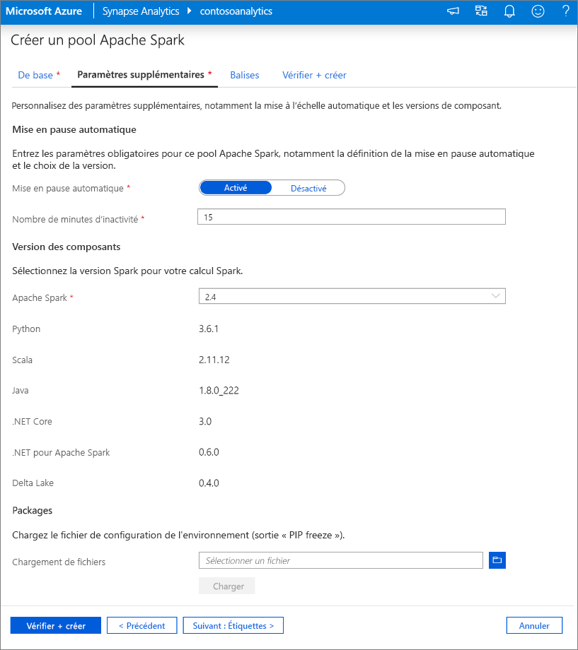
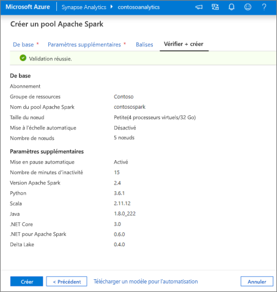
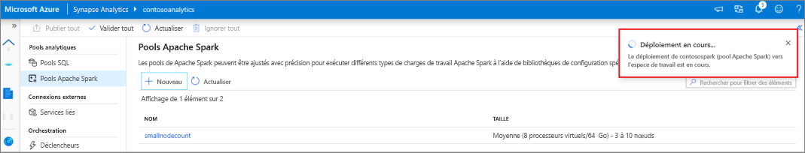
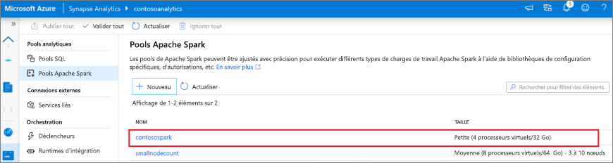
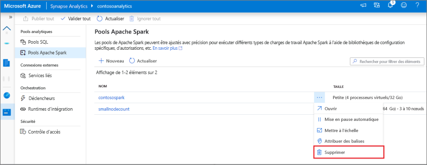
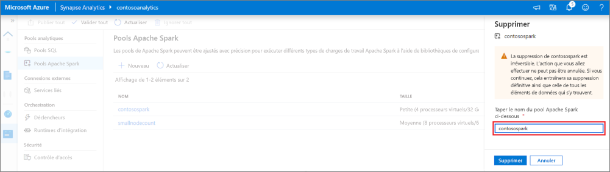

# Démarrage rapide : Créer un pool Apache Spark (préversion) à l’aide de Synapse Studio

Azure Synapse Analytics propose différents moteurs d’analytique pour vous aider à ingérer, transformer, modéliser, analyser et servir vos données. Un pool Apache Spark offre des fonctionnalités de calcul Big Data open source. Après avoir créé un pool Apache Spark dans votre espace de travail Synapse, vous pouvez charger, modéliser, traiter et servir les données pour obtenir des insights.  

Ce guide de démarrage rapide décrit les étapes à suivre pour créer un pool Apache Spark dans un espace de travail Synapse à l’aide de Synapse Studio.

> [!IMPORTANT]
> La facturation des instances Spark est calculée au prorata des minutes écoulées, que vous les utilisiez ou non. Veillez à arrêter votre instance Spark une fois que vous avez fini de l’utiliser, ou définissez un délai d’expiration court. Pour plus d’informations, consultez la section **Nettoyer les ressources** de cet article.

Si vous n’avez pas d’abonnement Azure, [créez un compte gratuit avant de commencer](https://azure.microsoft.com/free/).

## Prérequis

- Abonnement Azure : [créez-en un gratuitement](https://azure.microsoft.com/free/)
- [Espace de travail Synapse](./quickstart-create-workspace.md)

## Connectez-vous au portail Azure.

Connectez-vous au [portail Azure](https://portal.azure.com/)

## Accéder à l’espace de travail Synapse

1. Accédez à l’espace de travail Synapse dans lequel vous allez créer le pool Apache Spark en saisissant le nom du service (ou directement le nom de la ressource) dans la barre de recherche.

1. Dans la liste des espaces de travail, saisissez le nom (ou une partie du nom) de l’espace de travail à ouvrir. Pour cet exemple, nous allons utiliser un espace de travail nommé **contosoanalytics**.

## Lancer Synapse Studio 

1. Dans la vue d’ensemble de l’espace de travail, sélectionnez **Lancer Synapse Studio** pour ouvrir l’emplacement où le pool Apache Spark sera créé. Saisissez le nom du service ou de la ressource directement dans la barre de recherche.

## Créer le pool Apache Spark dans Synapse Studio

1. Sur la page d’accueil de Synapse Studio, accédez au **hub de gestion** dans le volet de navigation gauche en sélectionnant l’icône **Gérer**.

1. Une fois dans le hub de gestion, accédez à la section **Pools Apache Spark** pour afficher la liste actuelle des pools Apache Spark disponibles dans l’espace de travail.

1. Sélectionnez la commande **+ Nouveau** ; l’assistant de création d’un pool Apache Spark s’affiche. 

1. Sous l’onglet **Informations de base**, entrez ce qui suit :

    | Paramètre | Valeur suggérée | Description |
    | :------ | :-------------- | :---------- |
    | **Nom du pool Apache Spark** | contosospark | Il s’agit du nom du pool Apache Spark. |
    | **Taille du nœud** | Petite (4 processeurs virtuels/32 Go) | Définissez ce paramètre sur la plus petite taille pour réduire les coûts de ce guide de démarrage rapide. |
    | **Autoscale** | Désactivé | Ce guide de démarrage rapide ne nécessite pas de mise à l’échelle automatique |
    | **Nombre de nœuds** | 8 | Utilisez une petite taille pour limiter les coûts de ce guide de démarrage rapide|
    
    
    > [!IMPORTANT]
    > Notez que les noms que vous pouvez attribuer aux pools Apache Spark sont soumis à des limitations spécifiques. Les noms doivent contenir uniquement des lettres ou des chiffres, ne doivent pas comporter plus de 15 caractères, doivent commencer par une lettre, ne pas contenir de mots réservés et être uniques dans l’espace de travail.

1. Dans l’onglet suivant (Paramètres supplémentaires), laissez tous les paramètres par défaut, puis appuyez sur **Vérifier + créer** (nous n’ajouterons aucune balise).
 

1. Nous n’ajoutons aucune étiquette pour le moment. Par conséquent, sélectionnez **Vérifier + créer**.

1. Dans l’onglet **Vérifier + créer**, vérifiez que les informations reflètent bien ce que vous avez entré, puis appuyez **Créer**. 
 

1. Le pool Apache Spark démarre le processus d’approvisionnement.

1. Une fois l’approvisionnement terminé, le nouveau pool Apache Spark s’affiche dans la liste.

## Nettoyer les ressources d’un pool Apache Spark à l’aide de Synapse Studio

Effectuez les étapes ci-dessous pour supprimer le pool Apache Spark de l’espace de travail à l’aide de Synapse Studio.
> [!WARNING]
> La suppression d’un pool Spark supprime le moteur d’analytique de l’espace de travail. Il n’est plus possible de se connecter au pool, et l’ensemble des requêtes, pipelines et notebooks qui utilisent ce pool Spark ne fonctionnent plus.

Si vous souhaitez supprimer le pool Apache Spark, procédez comme suit :

1. Accédez aux pools Apache Spark dans le hub de gestion de Synapse Studio.
1. Sélectionnez les points de suspension en regard du pool Apache à supprimer (dans ce cas, **contosospark**) pour afficher les commandes du pool Apache Spark.

1. Appuyez sur la touche **Supprimer**.
1. Confirmez la suppression, puis appuyez sur le bouton **Supprimer**.
 
1. Une fois le processus terminé, le pool Apache Spark ne figure plus dans la liste des ressources de l’espace de travail. 

## Étapes suivantes

- Consultez [Démarrage rapide : Créer un pool Apache Spark dans Synapse Studio à l’aide des outils web](quickstart-apache-spark-notebook.md).
- Consultez [Démarrage rapide : Créer un pool Apache Spark à l’aide du portail Azure](quickstart-create-apache-spark-pool-portal.md).