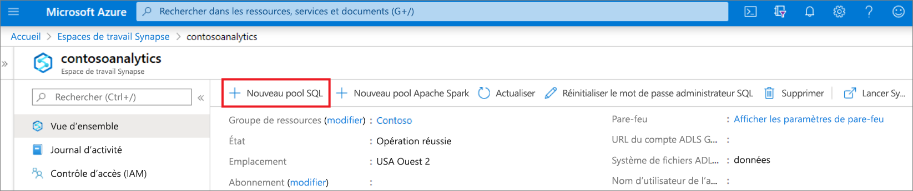
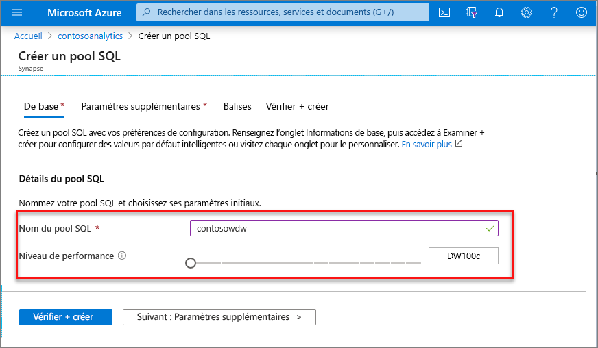
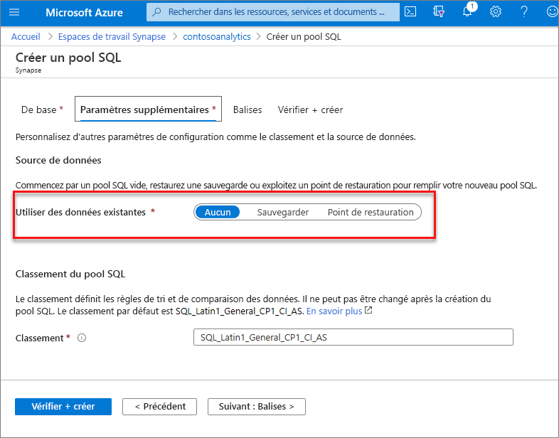
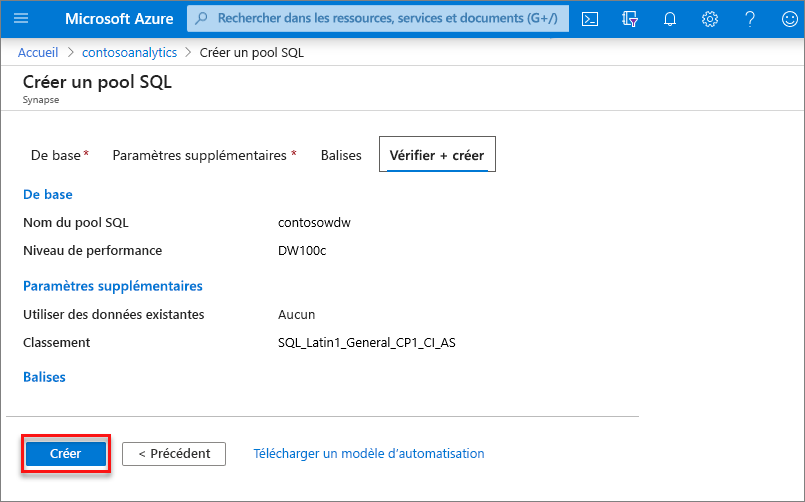
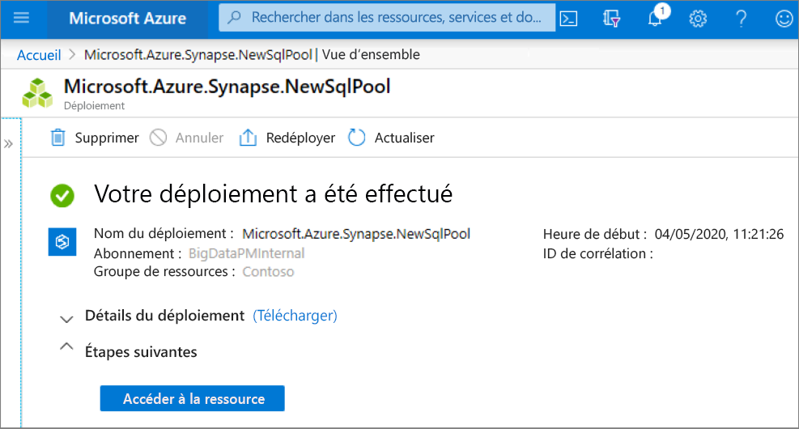
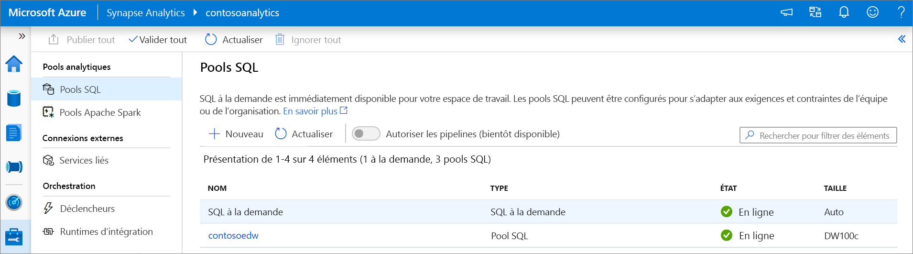
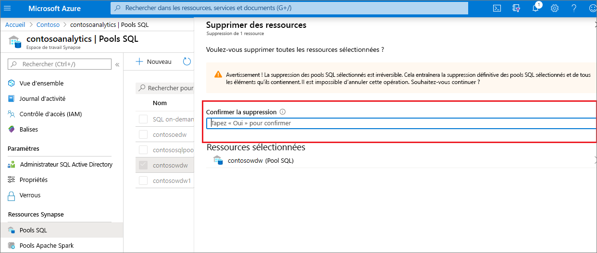

# Démarrage rapide : Créer un pool SQL dédié en utilisant le portail Azure

Azure Synapse Analytics propose différents moteurs d’analytique pour vous aider à ingérer, transformer, modéliser et analyser vos données. Un pool SQL dédié offre des fonctionnalités de calcul et de stockage basées sur T-SQL. Après avoir créé un pool SQL dédié dans votre espace de travail Synapse, vous pouvez charger, modéliser, traiter et distribuer les données pour obtenir plus rapidement des insights.

Dans ce guide de démarrage rapide, vous allez apprendre à créer un pool SQL dédié dans un espace de travail Synapse à l’aide du portail Azure.

Si vous n’avez pas d’abonnement Azure, [créez un compte gratuit avant de commencer](https://azure.microsoft.com/free/).

## Prérequis

- Abonnement Azure : [créez-en un gratuitement](https://azure.microsoft.com/free/)
- [Espace de travail Synapse](./quickstart-create-workspace.md)

## Connectez-vous au portail Azure.

Connectez-vous au [portail Azure](https://portal.azure.com/)

## Accéder à l’espace de travail Synapse

1. Accédez à l’espace de travail Synapse dans lequel vous allez créer le pool SQL dédié en tapant le nom du service (ou directement le nom de la ressource) dans la barre de recherche.
. 
1. Dans la liste des espaces de travail, saisissez le nom (ou une partie du nom) de l’espace de travail à ouvrir. Pour cet exemple, nous allons utiliser un espace de travail nommé **contosoanalytics**.

## Créer un pool SQL dédié

1. Dans l’espace de travail Synapse où vous souhaitez créer le pool SQL dédié, sélectionnez **Nouveau pool SQL dédié** dans la barre supérieure.

2. Sous l’onglet **Informations de base**, entrez ce qui suit :

    | Paramètre | Valeur suggérée | Description |
    | :------ | :-------------- | :---------- |
    | **Nom du pool SQL dédié** | Nom valide | Nom du pool SQL dédié. |
    | **Niveau de performances** | DW100c | Plus petite taille définie pour réduire les coûts de ce guide de démarrage rapide |

  
    

    > [!IMPORTANT]
    > Notez que les noms que vous pouvez attribuer aux pools SQL dédiés sont soumis à des limitations spécifiques. Les noms ne peuvent pas contenir de caractères spéciaux, ne doivent pas dépasser 15 caractères, ne doivent pas contenir de mots réservés et doivent être uniques dans l’espace de travail.

3. Sélectionnez **Suivant : Paramètres supplémentaires**.
4. Sélectionnez **Aucune** pour provisionner le pool SQL dédié sans données. Laissez le classement par défaut tel quel.

    Si vous souhaitez restaurer votre pool SQL dédié à partir d’un point de restauration, sélectionnez **Point de restauration**. Pour plus d’informations sur la procédure de restauration, consultez [Guide pratique : Restaurer un pool SQL dédié existant](backuprestore/restore-sql-pool.md)

5. Sélectionnez **Revoir + créer**.
6. Vérifiez que les informations reflètent bien ce que vous avez entré. Sélectionnez **Create** (Créer).

7. À ce stade, le flux de provisionnement des ressources démarre.
 

8. Quand vous revenez à l’espace de travail au terme du provisionnement, une entrée apparaît pour le pool SQL dédié créé.
 

Une fois le pool SQL dédié créé, vous pouvez l’utiliser dans l’espace de travail pour charger des données, traiter des flux, lire dans le lac, etc.

## Nettoyer les ressources

Effectuez les étapes ci-dessous pour supprimer le pool SQL dédié de l’espace de travail.
> [!WARNING]
> Le fait de supprimer un pool SQL dédié supprime à la fois le moteur d’analytique et les données stockées dans la base de données du pool SQL dédié supprimé de l’espace de travail. Il n’est plus possible de se connecter au pool SQL dédié, et l’ensemble des requêtes, pipelines et notebooks qui lisent ou écrivent dans ce pool SQL dédié ne fonctionnent plus.

Si vous souhaitez supprimer le pool SQL dédié, effectuez les étapes suivantes :

1. Accédez au panneau des pools SQL du panneau de l’espace de travail.
1. Sélectionnez le pool SQL dédié à supprimer (dans ce cas, **contosowdw**)
1. Une fois le pool sélectionné, appuyez sur **Supprimer**
1. Confirmez la suppression, puis appuyez sur le bouton **Supprimer** 
1. À la fin du processus, le pool SQL dédié ne figure plus dans la liste des ressources de l’espace de travail.

## Étapes suivantes

- Consultez [Démarrage rapide : Créer un pool Apache Spark serverless dans Synapse Studio à l’aide des outils web](quickstart-apache-spark-notebook.md).
- Consultez [Démarrage rapide : Création d’un pool Apache Spark serverless avec le portail Azure](quickstart-create-apache-spark-pool-portal.md).
