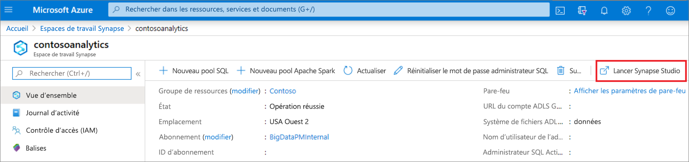
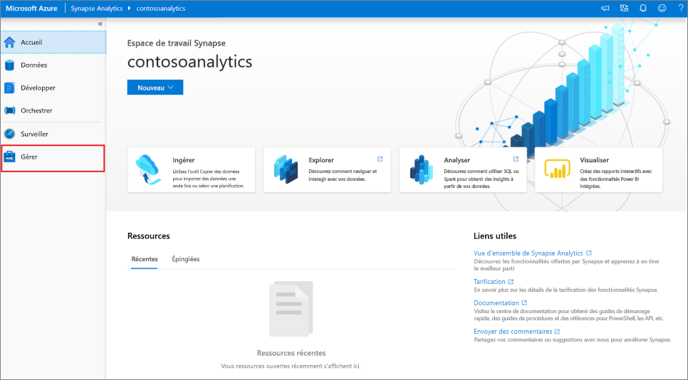
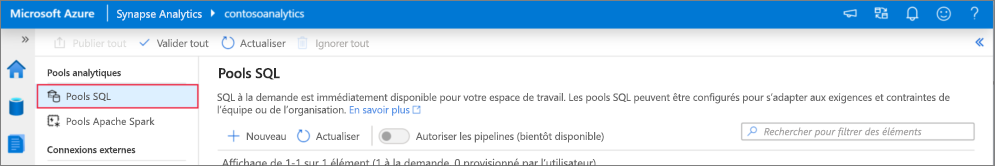
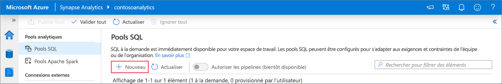
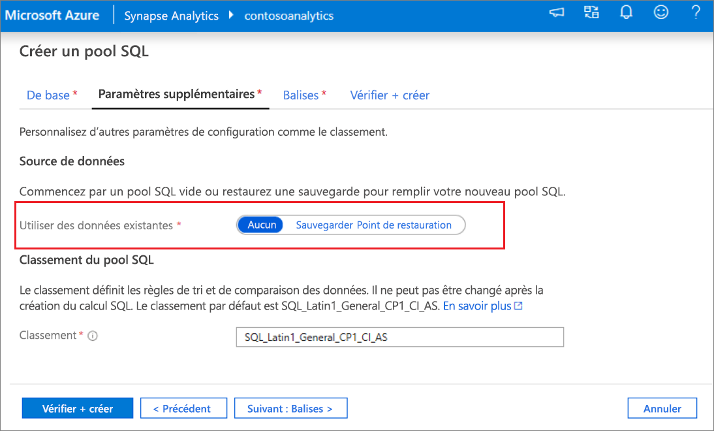
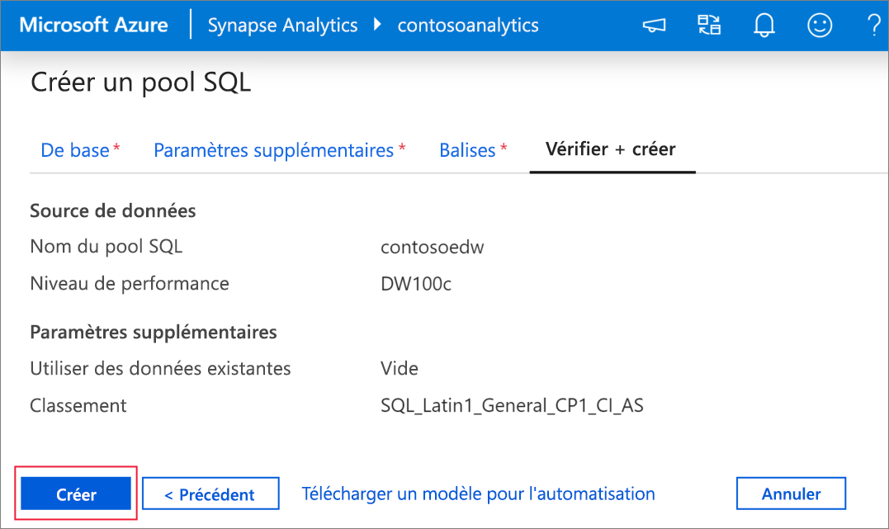
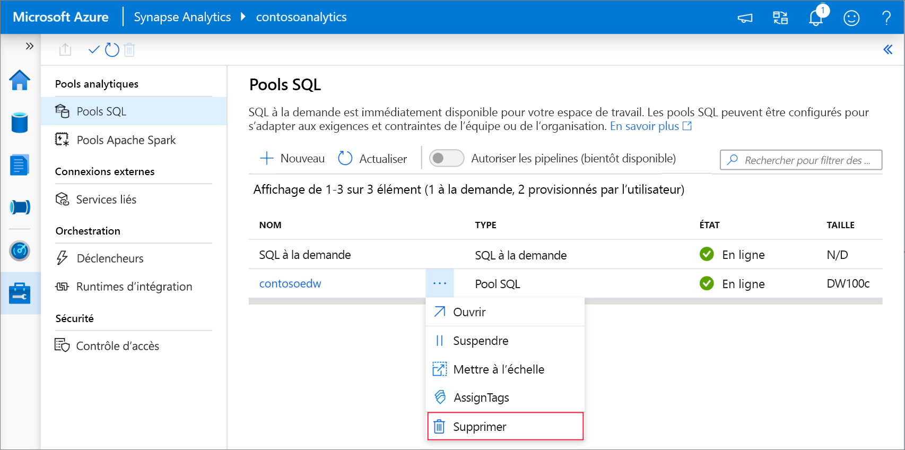

# Démarrage rapide : créer un pool Synapse SQL à l’aide de Synapse Studio

Azure Synapse Analytics propose différents moteurs d’analytique pour vous aider à ingérer, transformer, modéliser et analyser vos données. Un pool SQL offre des fonctionnalités de calcul et de stockage basées sur T-SQL. Après avoir créé un pool SQL dans votre espace de travail Synapse, vous pouvez charger, modéliser, traiter et distribuer les données pour obtenir plus rapidement des insights.

Ce guide de démarrage rapide décrit les étapes à suivre pour créer un pool SQL dans un espace de travail Synapse à l’aide de Synapse Studio.

Si vous n’avez pas d’abonnement Azure, [créez un compte gratuit avant de commencer](https://azure.microsoft.com/free/).

## Prérequis

- Abonnement Azure : [créez-en un gratuitement](https://azure.microsoft.com/free/)
- [Espace de travail Synapse](quickstart-create-workspace.md)

## Connectez-vous au portail Azure.

Connectez-vous au [portail Azure](https://portal.azure.com/)

## Accéder à l’espace de travail Synapse

1. Accédez à l’espace de travail Synapse dans lequel vous allez créer le pool SQL en saisissant le nom du service (ou directement le nom de la ressource) dans la barre de recherche.

1. Dans la liste des espaces de travail, saisissez le nom (ou une partie du nom) de l’espace de travail à ouvrir. Pour cet exemple, nous allons utiliser un espace de travail nommé **contosoanalytics**.

## Lancer Synapse Studio

1. Dans la vue d’ensemble de l’espace de travail, sélectionnez **Lancer Synapse Studio** pour ouvrir l’emplacement où le pool SQL sera créé. Saisissez le nom du service ou de la ressource directement dans la barre de recherche.

## Créer un pool SQL dans Synapse Studio

1. Sur la page d’accueil de Synapse Studio, accédez au **hub de gestion** dans le volet de navigation gauche en sélectionnant l’icône **Gérer**.

1. Une fois dans le hub de gestion, accédez à la section **Pools SQL** pour afficher la liste actuelle des pools SQL disponibles dans l’espace de travail.

1. Sélectionnez la commande **+ Nouveau** ; l’assistant de création d’un pool SQL s’affiche. 

1. Sous l’onglet **Informations de base**, entrez ce qui suit :

    | Paramètre | Valeur suggérée | Description |
    | :------ | :-------------- | :---------- |
    | **Nom du pool SQL** | contosoedw | Il s’agit du nom du pool SQL. |
    | **Niveau de performances** | DW100c | Définissez ce paramètre sur la plus petite taille pour réduire les coûts de ce guide de démarrage rapide. |

    
    > [!IMPORTANT]
    > Notez que les noms que vous pouvez attribuer aux pools SQL sont soumis à des limitations spécifiques. Les noms ne peuvent pas contenir de caractères spéciaux, ne doivent pas dépasser 15 caractères, ne doivent pas contenir de mots réservés et doivent être uniques dans l’espace de travail.

4. Dans l’onglet suivant, **Paramètres supplémentaires**, sélectionnez **aucun** pour approvisionner le pool SQL sans données. Laissez le classement par défaut tel quel.

1. Nous n’ajoutons aucune étiquette pour le moment. Par conséquent, sélectionnez **Suivant : Vérifier + créer**.

1. Dans l’onglet **Vérifier + créer**, vérifiez que les informations reflètent bien ce que vous avez entré, puis appuyez **Créer**. 

1. À ce stade, le flux de provisionnement des ressources démarre.

1. Quand vous revenez à l’espace de travail au terme du provisionnement, une entrée apparaît pour le pool SQL nouvellement créé.
 

1. Une fois le pool SQL créé, vous pouvez l’utiliser dans l’espace de travail pour charger des données, traiter des flux, lire dans le lac, etc.

## Nettoyer un pool SQL à l’aide de Synapse Studio    

Effectuez les étapes ci-dessous pour supprimer le pool SQL de l’espace de travail à l’aide de Synapse Studio.
> [!WARNING]
> La suppression d’un pool SQL supprime le moteur d’analytique de l’espace de travail. Il n’est plus possible de se connecter au pool, et l’ensemble des requêtes, pipelines et scripts qui utilisent ce pool SQL ne fonctionnent plus.

Si vous souhaitez supprimer le pool SQL, procédez comme suit :

1. Accédez aux pools SQL dans le hub de gestion de Synapse Studio.
1. Sélectionnez les points de suspension dans le pool SQL à supprimer (dans ce cas, **contosoedw**) pour afficher les commandes du pool SQL : 
1. Appuyez sur la touche **Supprimer**.
1. Confirmez la suppression, puis appuyez sur le bouton **Supprimer**.
 
1. À la fin du processus, le pool SQL ne figure plus dans la liste des ressources de l’espace de travail.

## Étapes suivantes 
- Consultez [Démarrage rapide : Créer un notebook Apache Spark](quickstart-apache-spark-notebook.md).
- Consultez [Démarrage rapide : Créer un pool SQL Synapse avec le portail Azure](quickstart-create-sql-pool-portal.md).
