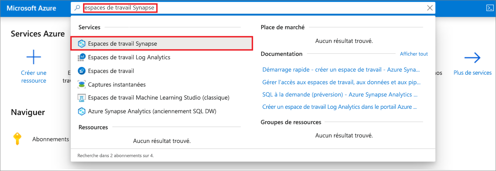
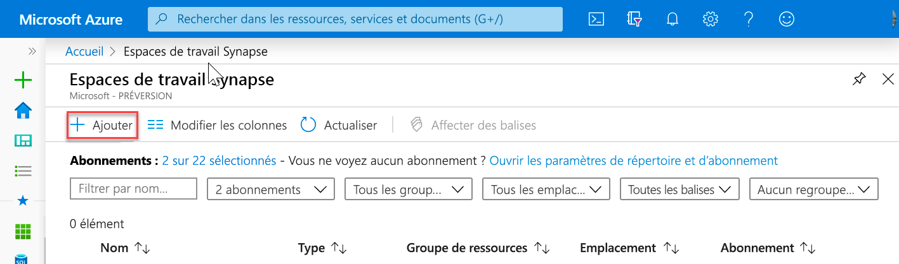
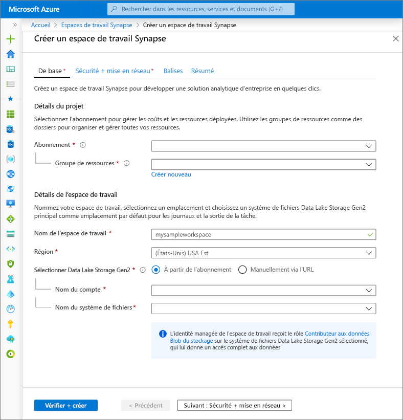
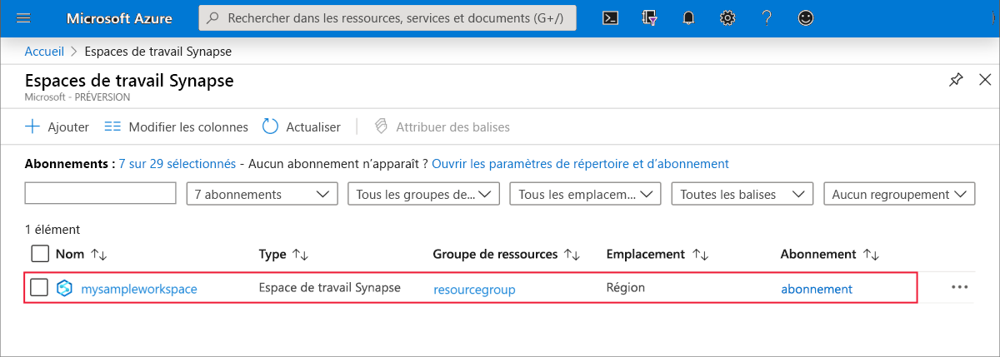
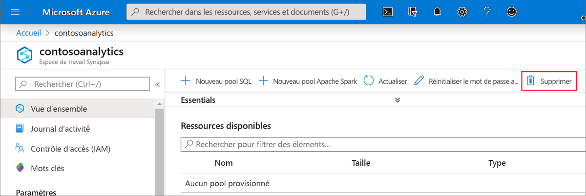
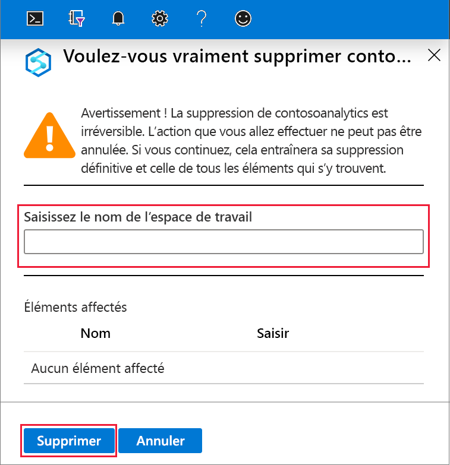

# Démarrage rapide : Créer un espace de travail Azure Synapse Analytics (préversion)

Ce guide de démarrage rapide décrit les étapes à suivre pour créer un espace de travail Azure Synapse à l’aide du portail Azure.

Si vous n’avez pas d’abonnement Azure, [créez un compte gratuit avant de commencer](https://azure.microsoft.com/free/).

## Prérequis

- [Compte de stockage Azure Data Lake Storage Gen2](../storage/common/storage-account-create.md?toc=/azure/synapse-analytics/toc.json&bc=/azure/synapse-analytics/breadcrumb/toc.json)

## Connectez-vous au portail Azure.

Connectez-vous au [portail Azure](https://portal.azure.com/)

## Créer un espace de travail Azure Synapse à l’aide du portail Azure

1. Dans le volet de recherche Microsoft Azure, entrez **espace de travail Synapse**, puis sélectionnez ce service.
.
2. Dans la page **Espaces de travail Synapse**, cliquez sur **+ Ajouter**.
.
3. Renseignez le formulaire **Espace de travail Azure Synapse** avec les informations suivantes :

    | Paramètre | Valeur suggérée | Description |
    | :------ | :-------------- | :---------- |
    | **Abonnement** | *Votre abonnement* | Pour plus d’informations sur vos abonnements, consultez [Abonnements](https://account.windowsazure.com/Subscriptions). |
    | **Groupe de ressources** | *N’importe quel groupe de ressources* | Pour les noms de groupe de ressources valides, consultez [Naming conventions](/azure/architecture/best-practices/resource-naming.md?toc=/azure/synapse-analytics/toc.json&bc=/azure/synapse-analytics/breadcrumb/toc.json&view=azure-sqldw-latest) (Conventions d’affectation de nom). |
    | **Nom de l’espace de travail** | mysampleworkspace | Spécifie le nom de l’espace de travail, qui sera également utilisé pour les points de terminaison de connexion.|
    | **Région** | USA Est 2 | Spécifie l’emplacement de l’espace de travail.|
    | **Data Lake Storage Gen2** | Compte : `storage account name`   Système de fichiers : `root file system to use` | Spécifie le nom du compte de stockage ADLS Gen2 à utiliser comme stockage principal et le système de fichiers à utiliser.|
    ||||

    .

    Pour sélectionner le compte de stockage, vous pouvez :
    - Soit le choisir dans une liste de comptes ADLS Gen2 disponibles dans votre abonnement
    - Soit l’entrer manuellement à l’aide du nom de compte

    > [!IMPORTANT]
    > L’espace de travail Azure Synapse doit pouvoir lire et écrire dans le compte ADLS Gen2 sélectionné. En outre, pour tout compte de stockage que vous liez en tant que compte de stockage principal, vous devez avoir activé l’**espace de noms hiérarchique** lors de la création du compte de stockage.
    >
    > Sous les champs de sélection ADLS Gen2 se trouve la note suivante : l’identité managée de l’espace de travail reçoit le rôle **Contributeur de données blob de stockage** sur le système de fichiers Data Lake Storage Gen2 sélectionné, qui lui donne un accès complet aux données.

4. (Facultatif) Modifiez un ou plusieurs des paramètres par défaut de l’onglet **Sécurité + réseau** :
5. (Facultatif) Ajoutez une ou plusieurs étiquettes sous l’onglet **Étiquettes**.
6. L’onglet **Résumé** exécute les validations nécessaires pour vérifier que l’espace de travail peut être créé correctement. Une fois la validation effectuée, appuyez sur **Créer**. 
7. Une fois le processus de provisionnement des ressources terminé, une entrée correspondant à l’espace de travail créé apparaît dans la liste des espaces de travail Synapse. .

## Nettoyer les ressources

Effectuez les étapes ci-dessous pour supprimer l’espace de travail Azure Synapse.
> [!WARNING]
> Le fait de supprimer un espace de travail Azure Synapse entraîne la suppression des moteurs d’analytique et des données stockées dans la base de données des pools SQL et des métadonnées de l’espace de travail. Il n’est plus possible de se connecter aux points de terminaison SQL ni aux points de terminaison Apache Spark. Tous les artefacts de code seront supprimés (requêtes, notebooks, définitions de travaux et pipelines).
>
> Le fait de supprimer l’espace de travail **n’affecte pas** les données dans le Data Lake Store Gen2 lié à l’espace de travail.

Pour supprimer l’espace de travail Azure Synapse, effectuez les étapes suivantes :

1. Accédez à l’espace de travail Azure Synapse à supprimer.
1. Appuyez sur **Supprimer** dans la barre de commandes.
 
1. Confirmez la suppression, puis appuyez sur le bouton **Supprimer**.
 
1. Une fois le processus terminé, l’espace de travail Azure Synapse ne figure plus dans la liste des espaces de travail.

## Étapes suivantes

Vous pouvez ensuite [créer des pools SQL](quickstart-create-sql-pool.md) ou [créer des pools Apache Spark](quickstart-create-apache-spark-pool.md) pour commencer à analyser et à explorer vos données.
