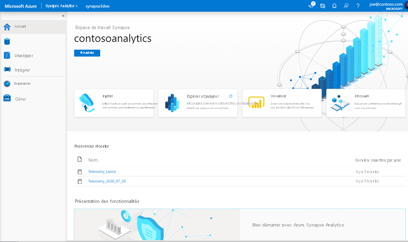
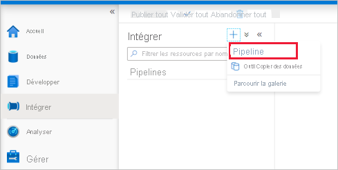

# <a name="quickstart-transform-data-using-mapping-data-flows"></a>Démarrage rapide : Transformer des données avec des flux de données de mappage

Dans ce démarrage rapide, vous allez utiliser Azure Synapse Analytics pour créer un pipeline qui transforme des données d’une source Azure Data Lake Storage Gen2 (ADLS Gen2) en récepteur ADLS Gen2 à l’aide d’un flux de données de mappage. Le modèle de configuration utilisé dans ce démarrage rapide peut être étendu lors de la transformation de données avec le flux de données de mappage.

Dans ce démarrage rapide, vous effectuez les étapes suivantes :

> [!div class="checklist"]
> * Créer un pipeline avec une activité Data Flow dans Azure Synapse Analytics.
> * Générer un flux de données de mappage avec quatre transformations.
> * Effectuer une série de tests sur le pipeline.
> * Superviser une activité de flux de données.

## <a name="prerequisites"></a>Prérequis

* **Abonnement Azure** : Si vous n’avez pas d’abonnement Azure, créez un [compte gratuit](https://azure.microsoft.com/free/) avant de commencer.
* **Espace de travail Azure Synapse** : créez un espace de travail Synapse à l’aide du portail Azure en suivant les instructions fournies dans [Démarrage rapide : Créer un espace de travail Synapse](quickstart-create-workspace.md).
* **Compte de stockage Azure** : Vous utilisez le stockage ADLS comme magasins de données *source* et *récepteur*. Si vous ne possédez pas de compte de stockage, consultez l’article [Créer un compte de stockage Azure](../storage/common/storage-account-create.md) pour découvrir comment en créer un.

    Le fichier que nous transformons dans ce tutoriel est MoviesDB.csv, qui se trouve [ici](https://raw.githubusercontent.com/djpmsft/adf-ready-demo/master/moviesDB.csv). Pour récupérer le fichier à partir de GitHub, copiez le contenu dans l’éditeur de texte de votre choix pour l’enregistrer localement sous la forme d’un fichier .csv. Pour charger le fichier dans votre compte de stockage, consultez [Chargement d’objets blob avec le Portail Azure](../storage/blobs/storage-quickstart-blobs-portal.md). Les exemples feront référence à un conteneur nommé « sample-data ».

### <a name="navigate-to-the-synapse-studio"></a>Accéder à Synapse Studio

Après avoir créé votre espace de travail Azure Synapse, vous pouvez ouvrir Synapse Studio de deux manières :

* Ouvrez votre espace de travail Synapse dans le [Portail Azure](https://ms.portal.azure.com/#home). Sélectionnez **Ouvrir** sur la carte Ouvrir Synapse Studio dans la section Démarrage.
* Ouvrez [Azure Synapse Analytics](https://web.azuresynapse.net/) et connectez-vous à votre espace de travail.

Dans ce guide de démarrage rapide, nous utilisons l’espace de travail nommé « adftest2020 » comme exemple. Vous accéderez automatiquement à la page d’accueil de Synapse Studio.



## <a name="create-a-pipeline-with-a-data-flow-activity"></a>Créer un pipeline avec une activité de flux de données

Un pipeline contient le flux logique pour l’exécution d’un ensemble d’activités. Dans cette section, vous allez créer un pipeline qui contient une activité Data Flow.

1. Accédez à l’onglet **Intégrer**. Sélectionnez l’icône + à côté de l’en-tête Pipelines, puis sélectionnez Pipeline.

   

1. Dans la page de paramètres **Propriétés** du pipeline, entrez **TransformMovies** pour **Nom**.

1. Dans le volet *Activités*, sous *Déplacer et transformer*, faites glisser **Flux de données** sur le canevas du pipeline.

1. Dans la fenêtre contextuelle **Ajout de flux de données**, sélectionnez **Créer un flux de données** -> **Flux de données**. Une fois l’opération terminée, cliquez sur **OK**.

   

1. Nommez votre flux de données **TransformMovies** dans la page **Propriétés**.

## <a name="build-transformation-logic-in-the-data-flow-canvas"></a>Générer une logique de transformation dans le canevas de flux de données

Une fois que vous avez créé votre flux de données, vous êtes automatiquement envoyé vers le canevas de flux de données. Dans cette étape, vous allez créer un flux de données qui prend le fichier MoviesDB.csv dans le stockage ADLS et qui agrège l’évaluation moyenne des comédies des années 1910 à 2000. Vous réécrirez ensuite ce fichier dans le stockage ADLS.

1. Au-dessus du canevas du flux de données, activez le bouton bascule **Déboguer le flux de données**. Le mode de débogage permet un test interactif de la logique de transformation sur un cluster Spark activé. Le préchauffage des clusters de flux de données nécessite 5 à 7 minutes et il est recommandé aux utilisateurs d’activer d’abord le débogage s’ils envisagent d’effectuer un développement de flux de données. Pour plus d’informations, consultez [Mode de débogage](https://docs.microsoft.com/azure/data-factory/concepts-data-flow-debug-mode?toc=/azure/synapse-analytics/toc.json&bc=/azure/synapse-analytics/breadcrumb/toc.json).

    

1. Dans le canevas de flux de données, ajoutez une source en cliquant sur la zone **Ajouter une source**.

1. Nommez votre source **MoviesDB**. Cliquez sur **Nouveau** pour créer un jeu de données source.

    

1. Choisissez **Azure Data Lake Storage Gen2**. Cliquez sur Continuer.

    

1. Choisissez **DelimitedText**. Cliquez sur Continuer.

1. Nommez votre jeu de données **MoviesDB**. Dans la liste déroulante des services liés, choisissez **Nouveau**.

1. Dans l’écran de création de service lié, nommez votre service lié ADLS Gen2 **ADLSGen2**, puis spécifiez votre méthode d’authentification. Entrez ensuite vos informations d’identification de connexion. Dans ce démarrage rapide, nous utilisons une clé de compte pour nous connecter à notre compte de stockage. Vous pouvez cliquer sur **Tester la connexion** pour vérifier que vos informations d’identification ont été entrées correctement. Une fois que vous avez fini, cliquez sur **Créer**.

    

1. Une fois de retour dans l’écran de création du jeu de données, entrez l’emplacement de votre fichier sous le champ **Chemin du fichier**. Dans ce démarrage rapide, le fichier « MoviesDB.csv » se trouve dans le conteneur « sample-data ». Étant donné que le fichier contient des en-têtes, cochez **Première ligne comme en-tête**. Sélectionnez **À partir de la connexion/du magasin** pour importer le schéma d’en-tête directement à partir du fichier situé dans le stockage. Une fois l’opération terminée, cliquez sur **OK**.

    

1. Si votre cluster de débogage a démarré, accédez à l’onglet **Aperçu des données**  de la transformation de la source, puis cliquez sur **Actualiser** pour obtenir une capture instantanée des données. Vous pouvez utiliser l’aperçu des données pour vérifier que votre transformation est correctement configurée.

    

1. En regard de votre nœud source dans le canevas de flux de données, cliquez sur l’icône plus (+) pour ajouter une nouvelle transformation. La première transformation que vous ajoutez est un **Filtre**.

    

1. Nommez votre transformation de filtre **FilterYears**. Cliquez sur la zone d’expression en regard de **Filtrer sur** pour ouvrir le générateur d’expressions. Ici, vous allez spécifier votre condition de filtrage.

1. Le générateur d’expressions de flux de données vous permet de générer de manière interactive des expressions à utiliser dans diverses transformations. Les expressions peuvent inclure des fonctions intégrées, des colonnes du schéma d’entrée et des paramètres définis par l’utilisateur. Pour plus d’informations sur la génération d’expressions, consultez [Générateur d’expressions de flux de données](https://docs.microsoft.com/azure/data-factory/concepts-data-flow-expression-builder?toc=/azure/synapse-analytics/toc.json&bc=/azure/synapse-analytics/breadcrumb/toc.json).

    Dans ce démarrage rapide, vous voulez filtrer les films du genre comédie qui sont sortis entre 1910 et 2000. Comme l’année est actuellement une chaîne, vous devez la convertir en un entier à l’aide de la fonction ```toInteger()```. Utilisez les opérateurs supérieur ou égal à (>=) et inférieur ou égal à (<=) pour effectuer une comparaison avec les valeurs d’années (year) littérales 1910 et 2000. Unissez ces expressions avec l’opérateur And (&&). L’expression se présente comme suit :

    ```toInteger(year) >= 1910 && toInteger(year) <= 2000```

    Pour rechercher les films qui sont des comédies, vous pouvez utiliser la fonction ```rlike()``` pour rechercher le modèle « Comedy » dans la colonne genres. Unissez l’expression rlike avec la comparaison d’année (year) pour obtenir :

    ```toInteger(year) >= 1910 && toInteger(year) <= 2000 && rlike(genres, 'Comedy')```

    

    Si vous avez un cluster de débogage actif, vous pouvez vérifier votre logique en cliquant sur **Actualiser** pour afficher la sortie de l’expression par rapport aux entrées utilisées. Il y a plusieurs réponses appropriées sur la façon dont vous pouvez accomplir cette logique à l’aide du langage d’expression de flux de données.

    Cliquez sur **Enregistrer et terminer** une fois que vous en avez terminé avec votre expression.

1. Pour vérifier que le filtre fonctionne correctement, récupérez un **Aperçu des données**.

1. La transformation suivante que vous allez ajouter est une transformation **Agrégation** sous **Modificateur de schéma**.

    

1. Nommez votre transformation d’agrégation **AggregateComedyRatings**. Sous l’onglet **Grouper par**, sélectionnez **year** (année) dans la liste déroulante pour regrouper les agrégations par année de sortie des films.

    

1. Accédez à l’onglet **Agrégats**. Dans la zone de texte de gauche, nommez la colonne d’agrégation **AverageComedyRating**. Cliquez sur la zone d’expression de droite pour entrer l’expression d’agrégation par le biais du générateur d’expressions.

    

1. Pour afficher la moyenne de la colonne **Évaluation**, utilisez la fonction d’agrégation ```avg()```. Comme **Évaluation** est une chaîne et que ```avg()``` prend une entrée numérique, nous devons convertir la valeur en nombre à l’aide de la fonction ```toInteger()```. Voici comment se présente l’expression :

    ```avg(toInteger(Rating))```

    Quand vous avez terminé, cliquez sur **Enregistrer et terminer**.

    

1. Accédez à l’onglet **Aperçu des données** pour afficher la sortie de la transformation. Notez que seules deux colonnes sont affichées : **year** et **AverageComedyRating**.

    

1. Ensuite, vous voulez ajouter une transformation **Récepteur** sous **Destination**.

    

1. Nommez votre récepteur **Sink**. Cliquez sur **Nouveau** pour créer votre jeu de données récepteur.

1. Choisissez **Azure Data Lake Storage Gen2**. Cliquez sur Continuer.

1. Choisissez **DelimitedText**. Cliquez sur Continuer.

1. Nommez votre jeu de données récepteur **MoviesSink**. Pour le service lié, choisissez le service lié ADLS Gen2 que vous avez créé à l’étape 7. Entrez un dossier de sortie dans lequel écrire vos données. Dans ce démarrage rapide, nous écrivons dans le dossier « output » se trouvant dans le conteneur « sample-data ». Le dossier ne doit pas nécessairement exister au préalable et peut être créé de façon dynamique. Activez **Première ligne comme en-tête**, puis sélectionnez **Aucun** pour **Importer un schéma**. Une fois l’opération terminée, cliquez sur **OK**.

    

Vous avez terminé la génération de votre flux de données. Vous êtes prêt à l’exécuter dans votre pipeline.

## <a name="running-and-monitoring-the-data-flow"></a>Exécution et supervision du flux de données

Vous pouvez déboguer un pipeline avant de le publier. Au cours de cette étape, vous allez déclencher une exécution de débogage du pipeline de flux de données. Alors que l’aperçu des données n’écrit pas de données, une exécution de débogage écrit des données dans la destination de votre récepteur.

1. Accédez au canevas du pipeline. Cliquez sur **Déboguer** pour déclencher une exécution de débogage.

    

1. Le débogage de pipeline des activités de flux de données utilise le cluster de débogage actif, mais son initialisation prend toujours au moins une minute. Vous pouvez suivre la progression par le biais de l’onglet **Sortie**. Une fois l’exécution réussie, cliquez sur l’icône en forme de lunettes pour ouvrir le volet de supervision.

    

1. Dans le volet de supervision, vous pouvez voir le nombre de lignes et de temps passé dans chaque étape de transformation.

    

1. Cliquez sur une transformation pour obtenir des informations détaillées sur les colonnes et le partitionnement des données.

    

Si vous avez suivi ce démarrage rapide correctement, vous devez avoir écrit 83 lignes et 2 colonnes dans votre dossier récepteur. Vous pouvez vérifier les données en vérifiant votre stockage Blob.


## <a name="next-steps"></a>Étapes suivantes

Lisez les articles suivant pour en savoir plus sur la prise en charge d’Azure Synapse Analytics :

> [!div class="nextstepaction"]
> [Pipelines et activités](https://docs.microsoft.com/azure/data-factory/concepts-pipelines-activities?toc=/azure/synapse-analytics/toc.json&bc=/azure/synapse-analytics/breadcrumb/toc.json)
> [Présentation du flux de données de mappage](https://docs.microsoft.com/azure/data-factory/concepts-data-flow-overview?toc=/azure/synapse-analytics/toc.json&bc=/azure/synapse-analytics/breadcrumb/toc.json)
> [Langage d’expression du flux de données](https://docs.microsoft.com/azure/data-factory/data-flow-expression-functions?toc=/azure/synapse-analytics/toc.json&bc=/azure/synapse-analytics/breadcrumb/toc.json)
