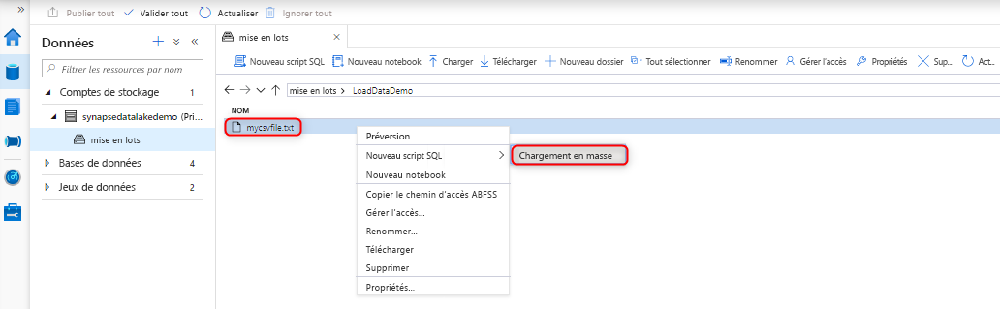
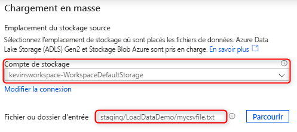
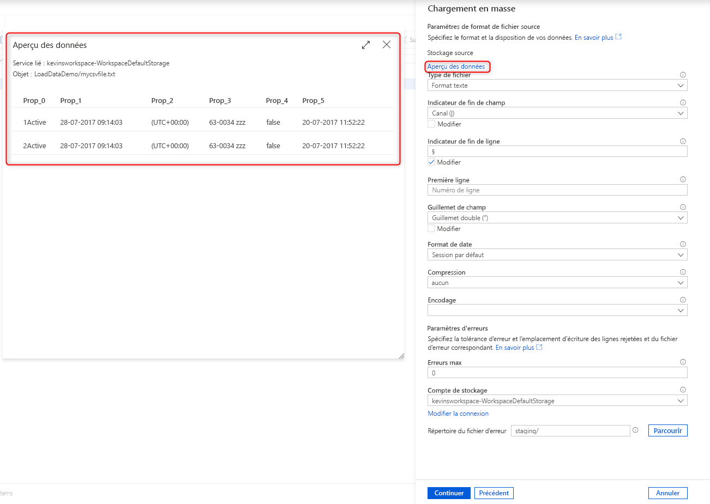
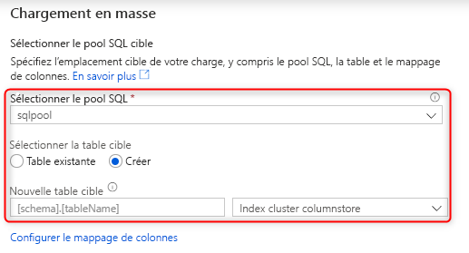
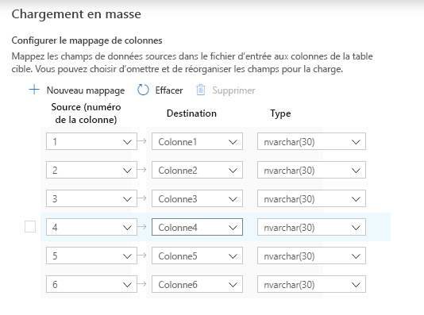
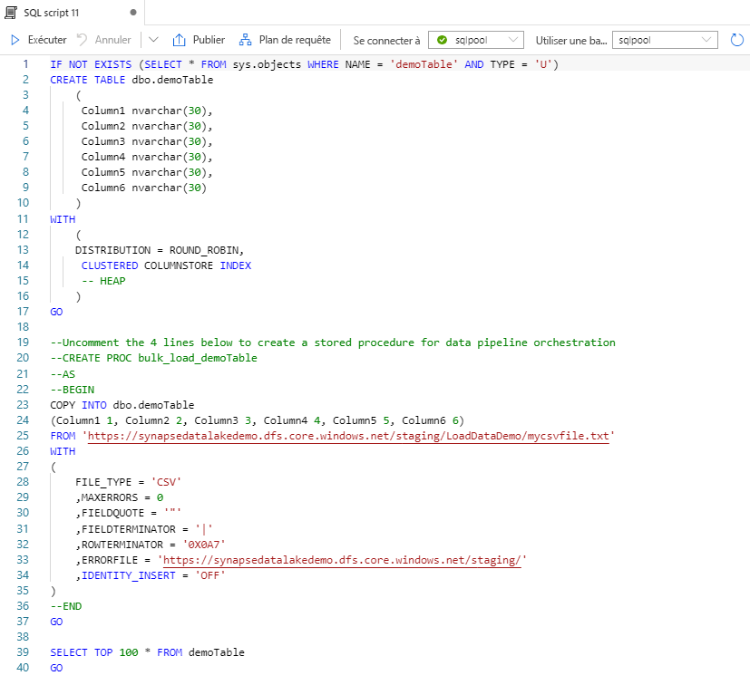

# Démarrage rapide : Chargement en masse avec Synapse Studio

Le chargement de données est une tâche aisée avec l’Assistant Chargement en masse dans Synapse Studio. Synapse Studio est une fonctionnalité d’Azure Synapse Analytics. L’assistant Chargement en masse vous guide tout au long de la création d’un script T-SQL avec l’[instruction COPY](/sql/t-sql/statements/copy-into-transact-sql?view=azure-sqldw-latest&preserve-view=true) pour charger en masse des données dans un pool SQL dédié. 

## Points d’entrée de l’assistant Chargement en masse

Vous pouvez charger des données en masse en cliquant avec le bouton droit sur la zone suivante dans Synapse Studio : un fichier ou un dossier à partir d’un compte de stockage Azure associé à votre espace de travail.

## Prérequis

- L’Assistant génère une instruction COPY, qui utilise le pass-through Active Directory (Azure AD) pour l’authentification. Votre [utilisateur Azure AD doit avoir accès](./sql-data-warehouse/quickstart-bulk-load-copy-tsql-examples.md#d-azure-active-directory-authentication) à l’espace de travail avec au moins le rôle Azure Contributeur aux données Blob du stockage pour le compte Azure Data Lake Storage Gen2. 

- Vous devez disposer des [autorisations requises pour utiliser l’instruction COPY](/sql/t-sql/statements/copy-into-transact-sql?view=azure-sqldw-latest&preserve-view=true#permissions) et les autorisations Create Table si vous créez une table pour le chargement.

- Le service lié associé au compte Data Lake Storage Gen2 *doit avoir accès au fichier ou dossier* à charger. Par exemple, si le mécanisme d’authentification pour le service lié est une identité managée, celle de l’espace de travail doit disposer au moins de l’autorisation Lecteur des données Blob du stockage sur le compte de stockage.

- Si un réseau virtuel est activé sur votre espace de travail, assurez-vous que le runtime intégré associé aux services liés du compte Data Lake Storage Gen2 pour les données sources et l’emplacement du fichier d’erreur est activé pour la création interactive. La création interactive est requise pour la détection de schéma automatique, l’aperçu du contenu du fichier source et le parcours des comptes de stockage Data Lake Storage Gen2 dans l’Assistant.

## Étapes

1. Dans le volet **Emplacement de stockage source**, sélectionnez le compte de stockage et le fichier ou dossier à partir duquel vous effectuez le chargement. L’Assistant tente automatiquement de détecter les fichiers Parquet et les fichiers de texte délimité (CSV), y compris le mappage des champs sources allant du fichier aux types de données SQL cibles appropriés. 

   

2. Sélectionnez les paramètres du format de fichier, entre autres vos paramètres d’erreur quand des lignes sont rejetées pendant le processus de chargement en masse. Vous pouvez également sélectionner **Aperçu des données** afin de voir comment l’instruction COPY analyse le fichier pour vous aider à configurer les paramètres du format de fichier. Sélectionnez **Aperçu des données** chaque fois que vous changez un paramètre de format de fichier pour voir comment l’instruction COPY analyse le fichier avec le paramètre mis à jour.

    

   > [!NOTE]  
   >
   > - L’Assistant Chargement en masse ne prend pas en charge l’affichage de l’aperçu des données avec des marques de fin de champ à plusieurs caractères. Quand vous spécifiez une marque de fin de champ à plusieurs caractères, l’Assistant affiche un aperçu des données dans une seule colonne. 
   > - Lors de la sélection de l’option **Déduire les noms de colonnes**, l’Assistant Chargement en masse analyse les noms des colonnes à partir de la première ligne spécifiée par le champ **Première ligne**. L’Assistant Chargement en masse incrémente automatiquement de 1 la valeur `FIRSTROW` dans l’instruction COPY pour ignorer cette ligne d’en-tête. 
   > - La spécification de marques de fin de ligne à plusieurs caractères est prise en charge dans l’instruction COPY. Toutefois, l’Assistant Chargement en masse ne la prend pas en charge et génère une erreur.

3. Sélectionnez le pool SQL dédié que vous utilisez pour charger, notamment si la charge concerne une table existante ou une nouvelle table.
   
4. Sélectionnez **Configurer le mappage de colonnes** pour vérifier que vous disposez du mappage de colonnes approprié. Notez que les noms de colonnes sont automatiquement détectés si vous avez désactivé l’option **Déduire les noms de colonnes**. Pour les nouvelles tables, la configuration du mappage de colonnes est essentielle pour la mise à jour des types de données des colonnes cibles.

   
5. Sélectionnez **Ouvrir un script**. Un script T-SQL est généré avec l’instruction COPY pour charger à partir de votre lac de données.
   

## Étapes suivantes

- Pour plus d’informations sur les fonctionnalités de COPY, consultez l’article [Instruction COPY](/sql/t-sql/statements/copy-into-transact-sql?view=azure-sqldw-latest&preserve-view=true#syntax).
- Pour plus d’informations sur l’utilisation d’un processus ETL (extraction, transformation et chargement), consultez l’article de [vue d’ensemble du chargement des données](./sql-data-warehouse/design-elt-data-loading.md#what-is-elt).
