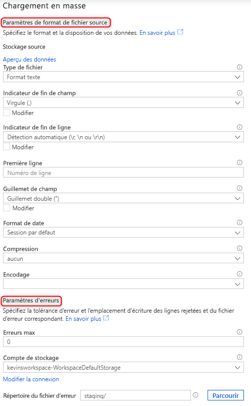

# Chargement en masse avec Synapse SQL

Le chargement de données n’a jamais été aussi simple avec l’utilisation de l’assistant Chargement en masse de Synapse Studio. Cet assistant va vous guider tout au long de la création d’un script T-SQL avec [l’instruction COPY](https://docs.microsoft.com/sql/t-sql/statements/copy-into-transact-sql?view=azure-sqldw-latest) pour charger en masse des données. 

## Points d’entrée de l’assistant Chargement en masse

Vous pouvez désormais facilement charger des données en masse à l’aide de pools SQL en cliquant avec le bouton droit sur les zones suivantes de Synapse Studio :

- Un fichier ou un dossier à partir d’un compte de stockage Azure attaché à votre espace de travail en 

## Prérequis

- Vous devez avoir accès à l’espace de travail avec au moins le rôle d’accès RBAC Contributeur aux données Blob du stockage au compte ADLS Gen2.

- Vous devez disposer des [autorisations requises pour utiliser l’instruction COPY](https://docs.microsoft.com/sql/t-sql/statements/copy-into-transact-sql?view=azure-sqldw-latest#permissions) et les autorisations Create table si vous créez une table pour le chargement.

- Le service lié associé au compte ADLS Gen2 **doit avoir accès au fichier**/**dossier** à charger. Par exemple, si le mécanisme d’authentification du service lié est Managed Identity, l’identité managée de l’espace de travail doit avoir au moins l’autorisation Lecteur des données Blob du stockage sur le compte de stockage.

- Si le réseau virtuel est activé sur votre espace de travail, assurez-vous que le runtime intégré associé aux services liés au compte ADLS Gen2 pour les données sources et l’emplacement du fichier d’erreur est activé pour la création interactive. La création interactive est requise pour la détection de schéma automatique, l’aperçu du contenu du fichier source et le parcours des comptes de stockage ADLS Gen2 dans l’assistant.

### Étapes

1. Sélectionnez le compte de stockage et le fichier ou dossier à partir duquel vous effectuez le chargement dans le volet Emplacement de stockage source : 

2. Sélectionnez les paramètres de format de fichier, notamment le compte de stockage dans lequel vous souhaitez écrire les lignes rejetées (fichier d’erreur). Actuellement, seuls les fichiers CSV et Parquet sont pris en charge.

    

3. Vous pouvez cliquer sur « Aperçu des données » pour voir comment l’instruction COPY analyse le fichier pour vous aider à configurer les paramètres de format de fichier. Cliquez sur « Aperçu des données » chaque fois que vous modifiez un paramètre de format de fichier pour voir comment l’instruction COPY analyse le fichier avec le paramètre mis à jour :  

4. Sélectionnez le pool SQL que vous utilisez pour charger, notamment si la charge concerne une table existante ou une nouvelle table : 

5. Cliquez sur Configurer le mappage de colonnes pour vous assurer que vous disposez du mappage de colonnes approprié. Pour les nouvelles tables, la configuration du mappage de colonnes est essentielle pour la mise à jour des types de données des colonnes cibles : 

6. Cliquez sur « Ouvrir un script » et un script T-SQL sera généré avec l’instruction COPY pour charger à partir de votre lac de données : 

## Étapes suivantes

- Pour plus d’informations sur les fonctionnalités de COPY, consultez l’article [Instruction COPY](https://docs.microsoft.com/sql/t-sql/statements/copy-into-transact-sql?view=azure-sqldw-latest#syntax)
- Consultez l’article [Vue d’ensemble du chargement de données](https://docs.microsoft.com/azure/synapse-analytics/sql-data-warehouse/design-elt-data-loading#what-is-elt)
