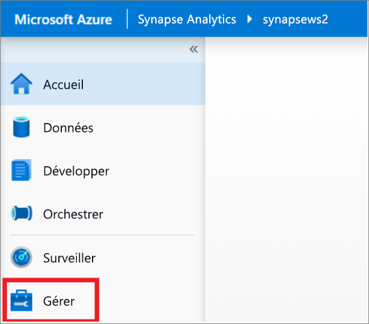
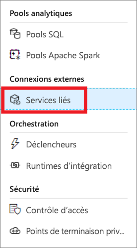
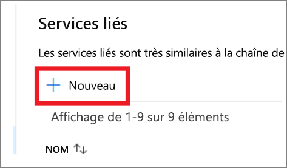
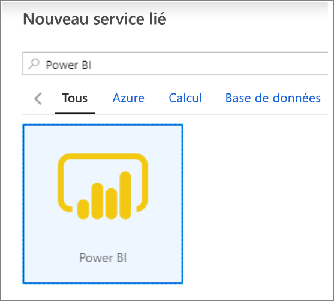
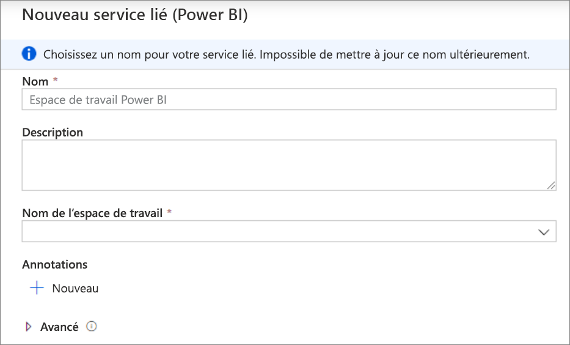
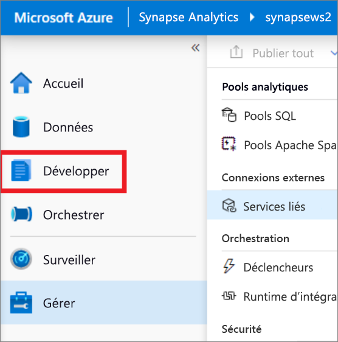
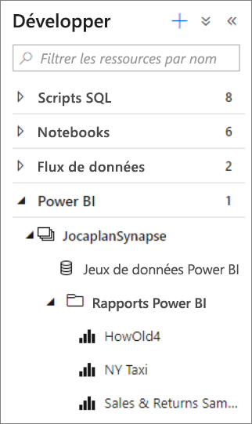
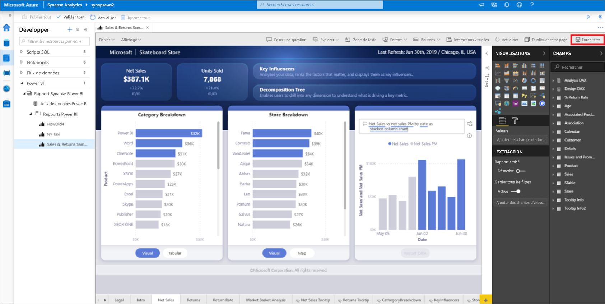

# Démarrage rapide : Liaison d’un espace de travail Power BI à un espace de travail Synapse

Dans ce guide de démarrage rapide, vous allez apprendre à connecter un espace de travail Power BI à un espace de travail Synapse Analytics pour créer des rapports et des jeux de données Power BI à partir de Synapse Studio (préversion).

Si vous n’avez pas d’abonnement Azure, [créez un compte gratuit avant de commencer](https://azure.microsoft.com/free/).

## Prérequis

- [Créer un espace de travail Azure Synapse et un compte de stockage associé](quickstart-create-workspace.md)
- [Un espace de travail Power BI Professional ou Premium](https://docs.microsoft.com/power-bi/service-create-the-new-workspaces)

## Lier un espace de travail Power BI à votre espace de travail Synapse

1. Dans Synapse Studio, cliquez sur **Gérer**.

    

2. Sous **Connexions externes**, cliquez sur **Services liés**.

    

3. Cliquez sur **+ Nouveau**.

    

4. Cliquez sur **Power BI**, puis sur **Continuer**.

    

5. Entrez un nom pour le service lié et sélectionnez un espace de travail dans la liste déroulante.

    

6. Cliquez sur **Créer**.

## Afficher l’espace de travail Power BI dans Synapse Studio

Une fois vos espaces de travail liés, vous pouvez parcourir vos jeux de données Power BI et modifier/créer des rapports Power BI dans Synapse Studio.

1. Cliquez sur **Développer**.

    

2. Développez Power BI et l’espace de travail que vous souhaitez utiliser.

    

Vous pouvez créer des rapports en cliquant sur **+** en haut de l’onglet **Développer**. Vous pouvez modifier des rapports existants en cliquant sur leur nom. Toutes les modifications enregistrées seront réécrites dans l’espace de travail Power BI.

## Étapes suivantes

En savoir plus sur la [création d’un rapport Power BI sur des fichiers stockés dans Stockage Azure](sql/tutorial-connect-power-bi-desktop.md).
