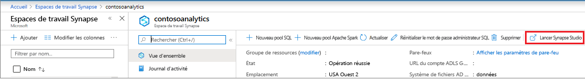
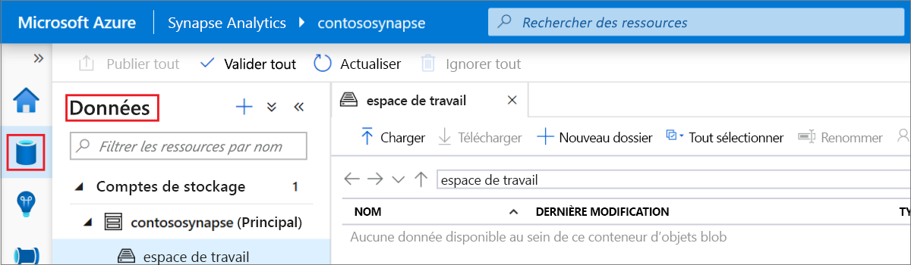
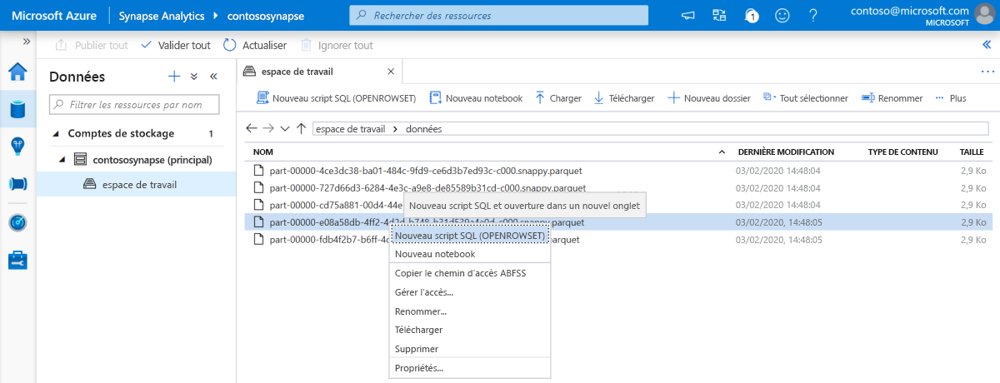
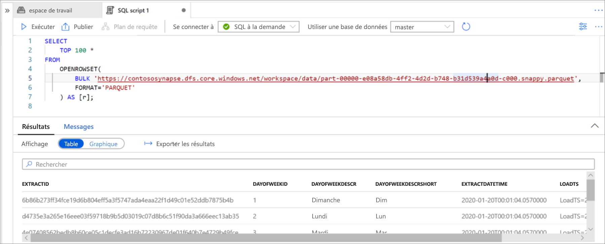

# Démarrage rapide : Utiliser Synapse Studio (préversion)

Dans ce guide de démarrage rapide, vous allez apprendre à interroger des fichiers à l’aide de Synapse Studio.

Si vous n’avez pas d’abonnement Azure, créez un compte [gratuit](https://azure.microsoft.com/free/) avant de commencer.

## Connectez-vous au portail Azure.

Connectez-vous au [portail Azure](https://portal.azure.com/).

## Prérequis

[Créez un espace de travail Azure Synapse et un compte de stockage associé](quickstart-create-workspace.md).

## Lancer Synapse Studio

Dans votre espace de travail Azure Synapse au sein du portail Azure, cliquez sur **Lancer Synapse Studio**.

Vous pouvez également lancer Synapse Studio en cliquant sur [Azure Synapse Analytics](https://web.azuresynapse.net) et en fournissant les valeurs appropriées pour le locataire, l’abonnement et l’espace de travail.

## Parcourir les comptes de stockage

Une fois que vous ouvrez Synapse Studio, accédez à **Données**, puis développez **Comptes de stockage** pour afficher le compte de stockage dans l’espace de travail.

Vous pouvez créer des dossiers et charger des fichiers à l’aide des liens de la barre d’outils pour organiser vos fichiers.

## Interroger des fichiers sur le compte de stockage

> [!IMPORTANT]
> Vous devez être membre du rôle `Storage Blob Reader` sur le stockage sous-jacent afin de pouvoir interroger les fichiers. Découvrez comment [affecter des autorisations RBAC **Lecteur des données Blob du stockage** ou **Contributeur aux données Blob du stockage** sur Stockage Azure](../storage/common/storage-auth-aad-rbac-portal.md?toc=/azure/synapse-analytics/toc.json&bc=/azure/synapse-analytics/breadcrumb/toc.json#assign-an-azure-built-in-role).

1. Chargez certains fichiers `PARQUET`.
2. Sélectionnez un ou plusieurs fichiers, puis créez un script SQL ou un notebook Spark pour voir le contenu des fichiers. Si vous souhaitez créer un notebook, vous devez créer un [pool Apache Spark dans les espaces de travail Synapse](quickstart-create-apache-spark-pool-studio.md).

   

3. Exécutez la requête ou le notebook générés pour voir le contenu du fichier.

   

4. Vous pouvez changer la requête pour filtrer et trier les résultats. Pour découvrir les fonctionnalités de langage disponibles dans SQL à la demande, consultez la [présentation des fonctionnalités SQL](sql/overview-features.md).

## Étapes suivantes

- Autoriser les utilisateurs Azure AD à interroger des fichiers en [affectant des autorisations RBAC **Lecteur des données Blob du stockage** ou **Contributeur aux données Blob du stockage** sur Stockage Azure](../storage/common/storage-auth-aad-rbac-portal.md?toc=/azure/synapse-analytics/toc.json&bc=/azure/synapse-analytics/breadcrumb/toc.json#assign-an-azure-built-in-role)
- [Interroger des fichiers sur le Stockage Azure à l’aide de SQL à la demande](sql/on-demand-workspace-overview.md)
- [Créer un pool Apache Spark à partir du portail Azure](quickstart-create-apache-spark-pool-portal.md)
- [Créer un rapport Power BI sur les fichiers stockés sur le Stockage Azure](sql/tutorial-connect-power-bi-desktop.md)
