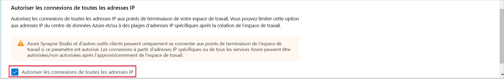
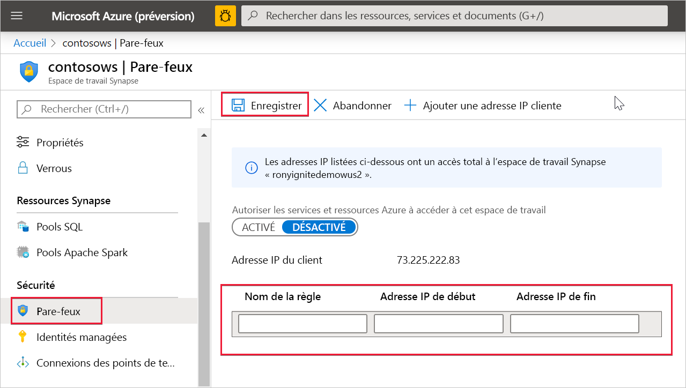

# Règles de pare-feu IP Azure Synapse Analytics (préversion)

Cet article explique ce que sont les règles de pare-feu IP et montre comment les configurer dans Azure Synapse Analytics.

## Règles de pare-feu IP

Les règles de pare-feu IP octroient ou refusent l’accès à votre espace de travail Synapse en fonction de l’adresse IP d’origine de chaque requête. Vous pouvez configurer des règles de pare-feu IP pour votre espace de travail. Les règles de pare-feu IP configurées au niveau de l’espace de travail s’appliquent à tous les points de terminaison publics de l’espace de travail (pools SQL, SQL à la demande et développement).

## Créer et gérer des règles de pare-feu IP

Il existe deux façons d’ajouter des règles de pare-feu IP à un espace de travail Synapse. Pour ajouter un pare-feu IP à votre espace de travail, sélectionnez **Sécurité + réseau** et cochez **Autoriser les connexions de toutes les adresses IP** lors de la création de l’espace de travail.

Vous pouvez également ajouter des règles de pare-feu IP à un espace de travail Synapse après la création de l’espace de travail. Sélectionnez **Pare-feu** sous **Sécurité** dans le portail Azure. Pour ajouter une nouvelle règle de pare-feu IP, attribuez-lui un nom, une adresse IP de début et une adresse IP de fin. Sélectionnez **Enregistrer** lorsque vous avez terminé.

## Se connecter à Synapse à partir de votre propre réseau

Vous pouvez vous connecter à votre espace de travail Synapse à l’aide de Synapse Studio. Vous pouvez également utiliser SQL Server Management Studio (SSMS) pour vous connecter aux ressources SQL (pools SQL et SQL à la demande) dans votre espace de travail.

Vérifiez que le pare-feu sur votre réseau et ordinateur local autorise les communications sortantes sur les ports TCP 80, 443 et 1443 pour Synapse Studio.

Vous devez aussi autoriser les communications sortantes sur le port UDP 53 pour Synapse Studio. Pour vous connecter à l’aide d’outils tels que SSMS et Power BI, vous devez autoriser la communication sortante sur le port TCP 1433.

Si vous utilisez le paramètre de stratégie Rediriger la connexion par défaut, vous devrez peut-être aussi autoriser la communication sortante sur d’autres ports. Vous pouvez en savoir plus sur les stratégies de connexion [ici](https://docs.microsoft.com/azure/sql-database/sql-database-connectivity-architecture#connection-policy).

## Étapes suivantes

Créer un [espace de travail Azure Synapse](../quickstart-create-workspace.md)

Créer un espace de travail Azure Synapse avec un [réseau virtuel d’espace de travail managé](./synapse-workspace-managed-vnet.md)