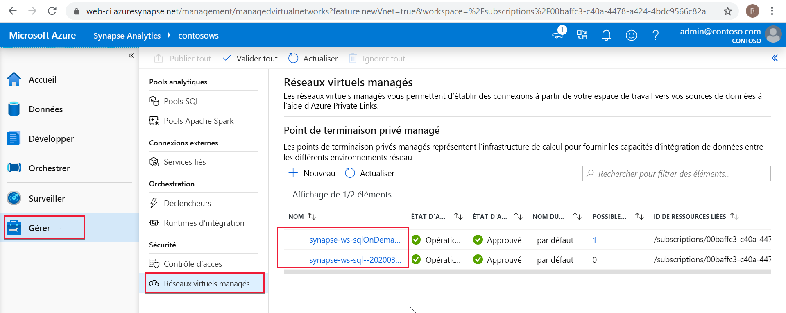

# Points de terminaison privés managés Synapse

Cet article explique ce que sont les points de terminaison privés managés dans Azure Synapse Analytics.

## Points de terminaison privés managés

Les points de terminaison privés managés sont des points de terminaison privés créés dans un réseau virtuel managé qui est associé à votre espace de travail Azure Synapse. Les points de terminaison privés managés établissent une liaison privée avec les ressources Azure. Azure Synapse gère ces points de terminaison privés à votre place. Vous pouvez créer des points de terminaison privés managés à partir de votre espace de travail Azure Synapse pour accéder à des services Azure (tels que Stockage Azure ou Azure Cosmos DB) et à des services clients/partenaires hébergés par Azure.

Quand vous utilisez des points de terminaison privés managés, le trafic entre votre espace de travail Azure Synapse et les autres ressources Azure transitent entièrement par le réseau principal de Microsoft. Les points de terminaison privés managés offrent une protection contre l’exfiltration de données. Un point de terminaison privé managé utilise l’adresse IP privée de votre réseau virtuel managé pour amener efficacement le service Azure avec lequel votre espace de travail Azure Synapse communique dans votre réseau virtuel. Les points de terminaison privés managés sont mappés à une ressource spécifique dans Azure, et non à l’ensemble du service. Les clients peuvent limiter la connectivité à une ressource spécifique approuvée par leur organisation. 

Apprenez-en davantage sur [les liaisons privées et les points de terminaison privés](../../private-link/index.yml).

>[!IMPORTANT]
>Les points de terminaison privés managés sont uniquement pris en charge dans les espaces de travail Azure Synapse avec un Réseau virtuel d’espace de travail managé.

>[!NOTE]
>Quand vous créez un espace de travail Azure Synapse, vous pouvez choisir de lui associer un réseau virtuel managé. Si vous choisissez d’associer un réseau virtuel managé à votre espace de travail, vous pouvez également choisir de limiter le trafic sortant de votre espace de travail à des cibles approuvées. Vous devez créer des points de terminaison privés managés sur ces cibles. 

Une connexion de point de terminaison privé est créée dans un état « en attente » quand vous créez un point de terminaison privé managé dans Azure Synapse. Un workflow d’approbation est démarré. Le propriétaire de la ressource de liaison privée est responsable de l’approbation ou du refus de la connexion. Si le propriétaire approuve la connexion, la liaison privée est établie. Toutefois, si le propriétaire n’approuve pas la connexion, le lien privé n’est pas établi. Dans les deux cas, le point de terminaison privé managé est mis à jour avec l’état de la connexion. Seul un point de terminaison privé managé dans un état approuvé peut être utilisé pour envoyer le trafic à la ressource de liaison privée qui est liée au point de terminaison privé managé.

## Points de terminaison privés managés pour un pool SQL dédié et un pool SQL serverless

Le pool SQL dédié et le pool SQL serverless sont des fonctionnalités d’analytique dans votre espace de travail Azure Synapse. Ces fonctionnalités utilisent une infrastructure multilocataire qui n’est pas déployée sur le [Réseau virtuel d’espace de travail managé](./synapse-workspace-managed-vnet.md).

Quand un espace de travail est créé, Azure Synapse crée deux points de terminaison privés managés dans l’espace de travail, un pour le pool SQL dédié et un pour le pool SQL serverless. 

Ces deux points de terminaison privés managés sont listés dans Synapse Studio. Sélectionnez **Gérer** dans la zone de navigation de gauche, puis sélectionnez **Points de terminaison privés managés** pour les afficher dans Studio.

Le point de terminaison privé managé qui cible le pool SQL est appelé *synapse-ws-sql--\<workspacename\>* et celui qui cible le pool SQL serverless est appelé *synapse-ws-sqlOnDemand--\<workspacename\>* .

Ces deux points de terminaison privés managés sont créés automatiquement pour vous quand vous créez votre espace de travail Azure Synapse. Vous n’êtes pas facturé pour ces deux points de terminaison privés managés.

## Étapes suivantes

Pour plus d’informations, passez à l’article [Créer des points de terminaison privés managés dans vos sources de données](./how-to-create-managed-private-endpoints.md).