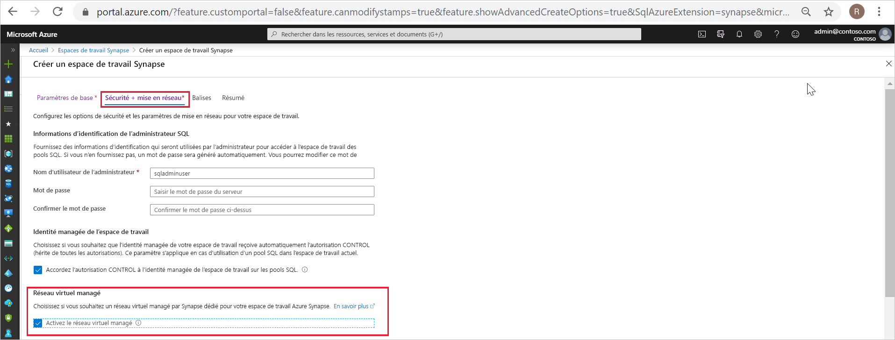
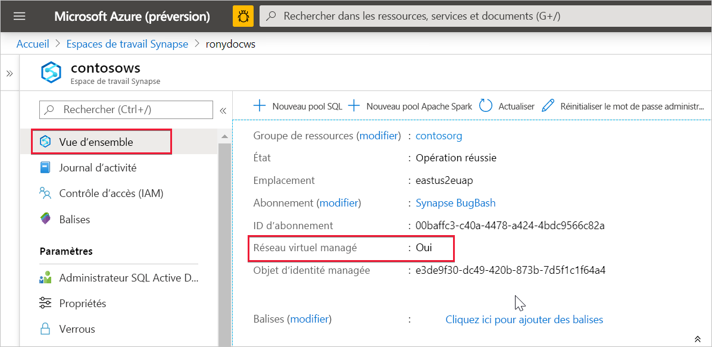

# Réseau virtuel managé Azure Synapse Analytics (préversion)

Cet article explique ce qu’est un réseau virtuel managé dans Azure Synapse Analytics.

## Réseau virtuel d’espace de travail managé

Quand vous créez votre espace de travail Azure Synapse, vous pouvez choisir de l’associer à un réseau virtuel Microsoft Azure. Le réseau virtuel associé à votre espace de travail est managé par Azure Synapse. Ce réseau virtuel est appelé *réseau virtuel d’espace de travail managé*.

Le réseau virtuel d’espace de travail managé offre de la valeur de quatre manières :

- Avec un réseau virtuel d’espace de travail managé, vous pouvez déplacer la charge liée à la gestion du réseau virtuel vers Azure Synapse.
- Vous n’êtes pas obligé de configurer des règles de groupe de sécurité réseau entrantes sur vos propres réseaux virtuels pour autoriser le trafic de gestion Azure Synapse à pénétrer sur votre réseau virtuel. Une configuration incorrecte des règles de groupe de sécurité réseau entraîne une interruption du service pour les clients
- Vous n’avez pas besoin de créer de sous-réseau pour vos clusters Spark en fonction de la charge maximale
- Le réseau virtuel d’espace de travail managé, ainsi que les points de terminaison privés managés, assurent une protection contre l’exfiltration des données. Vous pouvez créer des points de terminaison privés managés uniquement dans un espace de travail associé à un réseau virtuel d’espace de travail managé.

La création d’un espace de travail avec un réseau virtuel d’espace de travail managé associé permet de garantir que le réseau de votre espace de travail est isolé de celui des autres espaces de travail. Azure Synapse fournit diverses fonctionnalités d’analytique dans un espace de travail : intégration de données, Apache Spark, pool SQL et SQL à la demande.

Si votre espace de travail a un réseau virtuel d’espace de travail managé, les ressources Spark et l’intégration de données sont déployées dans celui-ci. Un réseau virtuel d’espace de travail managé fournit également une isolation au niveau de l’utilisateur pour les activités Spark, car chaque cluster Spark est sur son propre sous-réseau.

Le pool SQL et SQL à la demande sont des fonctionnalités multi-locataires ; par conséquent, elles résident en dehors du réseau virtuel d’espace de travail managé. La communication intra-espace de travail avec le pool SQL et SQL à la demande utilise des liaisons privées Azure. Ces liaisons privées sont créées automatiquement quand vous créez un espace de travail associé à un réseau virtuel d’espace de travail managé.

>[!IMPORTANT]
>Vous ne pouvez pas modifier cette configuration d’espace de travail après la création de l’espace de travail. Par exemple, vous ne pouvez pas reconfigurer un espace de travail qui n’est pas associé à un réseau virtuel d’espace de travail managé et lui associer un réseau virtuel. De même, vous ne pouvez pas reconfigurer un espace de travail qui est associé à un réseau virtuel d’espace de travail managé et le dissocier d’un réseau virtuel.

## Créer un espace de travail Azure Synapse avec un réseau virtuel d’espace de travail managé

Si vous ne l’avez pas encore fait, inscrivez le fournisseur de ressources réseau. L’inscription d’un fournisseur de ressources configure votre abonnement pour travailler avec le fournisseur de ressources. Choisissez *Microsoft.Network* dans la liste des fournisseurs de ressources lors de votre [inscription](https://docs.microsoft.com/azure/azure-resource-manager/management/resource-providers-and-types).

Pour créer un espace de travail Azure Synapse associé à un réseau virtuel d’espace de travail managé, sélectionnez l’onglet **Sécurité + réseau** dans le portail Azure et cochez la case **Activer le réseau virtuel managé**.

Si vous ne cochez pas cette case, aucun réseau virtuel n’est associé à votre espace de travail.

>[!IMPORTANT]
>Vous pouvez utiliser des liaisons privées uniquement dans un espace de travail qui a un réseau virtuel d’espace de travail managé.

>[!NOTE]
>Tout le trafic sortant en provenance du réseau virtuel d’espace de travail managé via des points de terminaison privés sera bloqué à l’avenir. Nous vous recommandons de créer des points de terminaison privés managés pour vous connecter à toutes vos sources de données Azure externes à l’espace de travail. 

Vous pouvez vérifier si votre espace de travail Azure Synapse est associé à un réseau virtuel d’espace de travail managé en sélectionnant **Vue d’ensemble** dans le portail Azure.

## Étapes suivantes

Créer un [espace de travail Azure Synapse](../quickstart-create-workspace.md)

En savoir plus sur les [points de terminaison privés managés](./synapse-workspace-managed-private-endpoints.md)

[Créer des points de terminaison privés managés à vos sources de données](./how-to-create-managed-private-endpoints.md)
