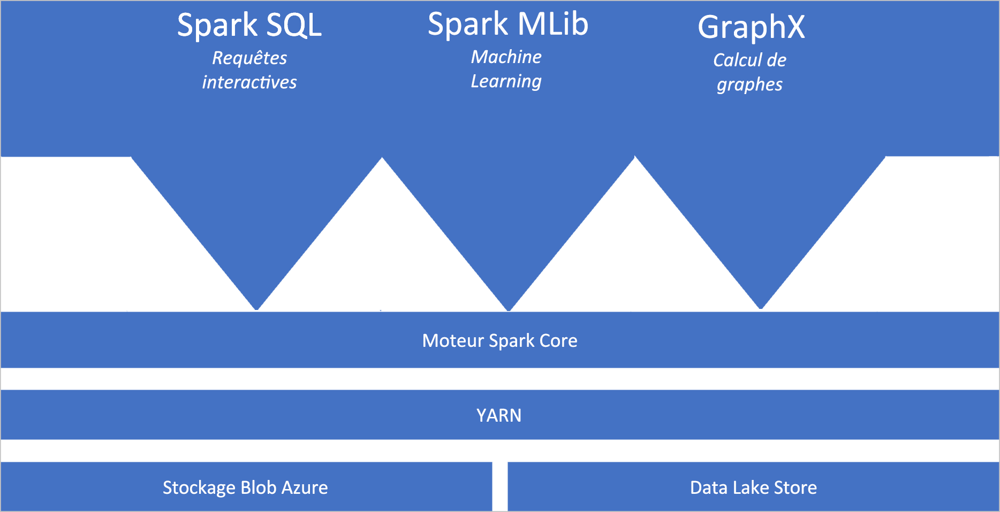
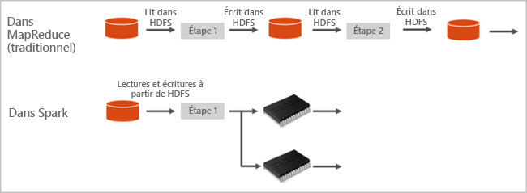

# Présentation d’Apache Spark dans Azure Synapse Analytics

Apache Spark est un framework de traitement parallèle qui prend en charge le traitement en mémoire pour améliorer les performances des applications d’analytique du Big Data. Apache Spark dans Azure Synapse Analytics est l’une des implémentations par Microsoft d’Apache Spark dans le cloud. Azure Synapse facilite la création et la configuration d’un pool Spark (préversion) dans Azure. Les pools Spark dans Azure Synapse sont compatibles avec Stockage Azure et le stockage Azure Data Lake Generation 2. Vous pouvez utiliser des pools Azure Spark pour traiter vos données stockées dans Azure.

[!INCLUDE [preview](../includes/note-preview.md)]

## Qu’est-ce qu’Apache Spark ?

Apache Spark fournit des primitives pour le calcul de cluster en mémoire. Un travail Spark peut charger et mettre en cache des données en mémoire et les interroger à plusieurs reprises. Le calcul en mémoire est beaucoup plus rapide que les applications sur disque. Spark s’intègre également à plusieurs langages de programmation pour vous permettre de manipuler des jeux de données distribués tels que des collections locales. Il n’est pas nécessaire de tout structurer comme des opérations de réduction et de mappage.

Les pools Spark dans Azure Synapse offrent un service Spark complètement managé. Les avantages de la création d’un pool Spark dans Synapse Analytics sont listés ici.

| Fonctionnalité | Description |
| --- | --- |
| Vitesse et efficacité |Les instances Spark démarrent en environ deux minutes pour moins de 60 nœuds, et environ cinq minutes pour plus de 60 nœuds. Par défaut, l’instance s’arrête cinq minutes après l’exécution du dernier travail, sauf si elle est maintenue active par une connexion de notebook. |
| Facilité de création |Vous pouvez créer un pool Spark dans Azure Synapse en quelques minutes à l’aide du portail Azure, d’Azure PowerShell ou du SDK .NET Synapse Analytics. Consultez [Bien démarrer avec les pools Spark dans Synapse Analytics](../quickstart-create-apache-spark-pool-studio.md). |
| Simplicité d'utilisation |Synapse Analytics comprend un notebook personnalisé dérivé de [Nteract](https://nteract.io/). Vous pouvez utiliser les blocs-notes pour le traitement interactif et la visualisation des données.|
| API REST |Spark dans Synapse Analytics comprend [Apache Livy](https://github.com/cloudera/hue/tree/master/apps/spark/java#welcome-to-livy-the-rest-spark-server), un serveur de travaux Spark basé sur une API REST qui permet de soumettre et de superviser à distance des travaux. |
| Prise en charge d’Azure Data Lake Storage Generation 2| Les pools Spark dans Azure Synapse peuvent utiliser Azure Data Lake Storage Generation 2 et le stockage d’objets blob. Pour plus d’informations sur Data Lake Storage, consultez [Vue d’ensemble d’Azure Data Lake Storage](../../data-lake-store/data-lake-store-overview.md). |
| Intégration à des environnements de développement intégrés tiers | Azure Synapse fournit un plug-in d’IDE pour [IntelliJ IDEA de JetBrains](https://www.jetbrains.com/idea/), qui est utile pour créer et soumettre des applications à un pool Spark. |
| Bibliothèques Anaconda préchargées |Les pools Spark dans Azure Synapse sont fournis avec des bibliothèques Anaconda préinstallées. [Anaconda](https://docs.continuum.io/anaconda/) fournit près de 200 bibliothèques pour l’apprentissage automatique, l’analyse des données, la visualisation, etc. |
| Extensibilité | La mise à l’échelle automatique peut être activée pour les pools Apache Spark dans Azure Synapse. Ils peuvent ainsi être adaptés par ajout ou suppression de nœuds en fonction des besoins. De plus, les pools Spark peuvent être arrêtés sans perte de données puisque toutes les données sont stockées dans Stockage Azure ou Data Lake Storage. |

Les pools Spark dans Azure Synapse incluent les composants suivants qui sont disponibles sur les pools par défaut.

- [Spark Core](https://spark.apache.org/docs/latest/). Comprend Spark Core, Spark SQL, GraphX et MLlib.
- [Anaconda](https://docs.continuum.io/anaconda/)
- [Apache Livy](https://github.com/cloudera/hue/tree/master/apps/spark/java#welcome-to-livy-the-rest-spark-server)
- [Notebook Nteract](https://nteract.io/)

## Architecture de pool Spark

Il est facile de comprendre les composants de Spark dès lors que vous regardez comment fonctionne Spark sur Synapse Analytics.

Les applications Spark s’exécutent sous la forme d’ensembles de processus indépendants sur un pool, coordonnées par l’objet SparkContext du programme principal (appelé programme pilote).

Le SparkContext peut se connecter au gestionnaire de cluster, qui alloue des ressources aux différentes applications. Le gestionnaire de cluster est [Apache Hadoop YARN](https://hadoop.apache.org/docs/current/hadoop-yarn/hadoop-yarn-site/YARN.html). Une fois connecté, Spark acquiert des exécuteurs sur les nœuds du pool ; il s’agit de processus qui exécutent des calculs et stockent les données de l’application. Ensuite, il envoie le code de l’application (défini par les fichiers JAR ou Python transmis à SparkContext) aux exécuteurs. Enfin, SparkContext envoie les tâches aux exécuteurs, qui les exécuteront.

Le SparkContext exécute la fonction principale de l’utilisateur et les différentes opérations parallèles sur les nœuds. Ensuite, il collecte les résultats des opérations. Les nœuds lisent et écrivent des données dans le système de fichiers. Ils mettent également en cache les données transformées en mémoire en tant que jeux de données résilients distribués (RDD).

Le SparkContext se connecte au pool Spark et est responsable de la conversion d’une application en graphe orienté acyclique (DAG). Le graphe se compose de tâches individuelles qui sont exécutées dans un processus de l’exécuteur sur les nœuds. Chaque application obtient ses propres processus d’exécution qui restent pour la durée de toute l’application et exécutent des tâches sur plusieurs threads.

## Cas d’usage Apache Spark dans Synapse Analytics

Les pools Spark dans Synapse Analytics autorisent les scénarios clés suivants :

### Engineering données/Préparation des données

Apache Spark comprend de nombreuses fonctionnalités de langage pour prendre en charge la préparation et le traitement de grands volumes de données afin de leur apporter une valeur ajoutée et de les rendre consommables par d’autres services au sein de Synapse Analytics. Cela est possible grâce aux différents langages (C#, Scala, PySpark, Spark SQL) et aux bibliothèques fournies pour le traitement et la connectivité.

### Machine Learning

Apache Spark est fourni avec [MLlib](https://spark.apache.org/mllib/), bibliothèque de Machine Learning basée sur Spark que vous pouvez utiliser à partir d’un pool Spark dans Synapse Analytics. Les pools Spark dans Synapse Analytics incluent également Anaconda, une distribution de Python avec un large éventail de packages pour la science des données, y compris le Machine Learning. Tout ceci, combiné à la prise en charge intégrée des notebooks, vous permet de disposer d’un environnement pour créer des applications de Machine Learning.

## Par où commencer ?

Consultez les articles suivants pour en savoir plus sur Apache Spark dans Synapse Analytics :

- [Démarrage rapide : Créer un pool Spark dans Azure Synapse](../quickstart-create-apache-spark-pool-portal.md)
- [Démarrage rapide : Créer un notebook Apache Spark](../quickstart-apache-spark-notebook.md)
- [Tutoriel : Machine Learning avec Apache Spark](./apache-spark-machine-learning-mllib-notebook.md)
- [Documentation officielle Apache Spark](https://spark.apache.org/docs/latest/)

> [!NOTE]
> Une partie de la documentation Apache Spark officielle repose sur l’utilisation de la console Spark, qui n’est pas disponible sur Azure Synapse Spark. Utilisez plutôt les expériences Notebook ou IntelliJ.

## Étapes suivantes

Cette présentation offre une vue d’ensemble d’Apache Spark dans Azure Synapse Analytics. Passez à l’article suivant pour découvrir comment créer un pool Spark dans Azure Synapse Analytics :

- [Créer un pool Spark dans Azure Synapse](../quickstart-create-apache-spark-pool-portal.md)
