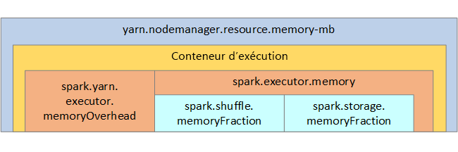

# <a name="optimize-apache-spark-jobs-preview-in-azure-synapse-analytics"></a>Optimiser les travaux Apache Spark (préversion) dans Azure Synapse Analytics

Découvrez comment optimiser la configuration de cluster [Apache Spark](https://spark.apache.org/) pour votre charge de travail.  La principale difficulté est une sollicitation trop importante de la mémoire, causée par une configuration incorrecte (en particulier, par des exécuteurs de taille non adaptée), des opérations longues et des tâches qui entraînent des opérations cartésiennes. Vous pouvez accélérer les travaux avec une mise en cache appropriée et en autorisant [l’asymétrie des données](#optimize-joins-and-shuffles). Pour des performances optimales, surveillez les exécutions de travaux Spark de longue durée et consommatrices de ressources.

Les sections suivantes décrivent des recommandations et des optimisations courantes de travaux Spark.

## <a name="choose-the-data-abstraction"></a>Choisir l’abstraction des données

Les versions antérieures de Spark utilisent des RDD pour abstraire des données ; Spark 1.3 et Spark 1.6 ont introduit respectivement les DataFrames et les DataSets. Voici leurs avantages relatifs respectifs :

* **DataFrames**
  * Meilleur choix dans la plupart des cas
  * Fournit l’optimisation des requêtes par le biais de Catalyst
  * Génération de code à l’échelle globale
  * Accès direct à la mémoire
  * Faible surcharge de garbage collection
  * Convivialité inférieure à celles des DataSets pour les développeurs, car il n’y a aucune programmation d’objet de domaine ni vérification au moment de la compilation
* **DataSets**
  * Convient aux pipelines ETL complexes où l’impact sur les performances est acceptable
  * Ne convient pas dans les agrégations où l’impact sur les performances peut être considérable
  * Fournit l’optimisation des requêtes par le biais de Catalyst
  * Convivialité pour les développeurs, grâce à la programmation des objets de domaine et à la vérification au moment de la compilation
  * Ajoute une surcharge de sérialisation/désérialisation
  * Surcharge de garbage collection élevée
  * Interrompt la génération de code à l’échelle globale
* **RDD**
  * Vous n’avez pas besoin d’utiliser des RDD, sauf si vous devez générer un nouvel RDD personnalisé.
  * Aucune optimisation de requête par le biais de Catalyst
  * Aucune génération de code à l’échelle globale
  * Surcharge de garbage collection élevée
  * Nécessité d’utiliser des API Spark 1.x héritées

## <a name="use-optimal-data-format"></a>Utiliser le format de données optimal

Spark prend en charge de nombreux formats, tels que csv, json, xml, parquet, orc et avro. Spark peut être étendu pour prendre en charge de nombreux autres formats avec des sources de données externes. Pour plus d’informations, consultez [Packages Apache Spark](https://spark-packages.org).

Le meilleur format du point de vue des performances est parquet avec *compression Snappy*, qui est l’option par défaut dans Spark 2.x. Parquet stocke les données sous forme de colonnes et il est fortement optimisé dans Spark. De plus, bien que la *compression Snappy* puisse générer des fichiers plus volumineux que la compression gzip (par exemple), en raison de la nature divisible de ces fichiers, ils seront décompressés plus rapidement.

## <a name="use-the-cache"></a>Utiliser le cache

Spark fournit ses propres mécanismes de mise en cache native, que vous pouvez utiliser par le biais de différentes méthodes telles que `.persist()`, `.cache()` et `CACHE TABLE`. Cette mise en cache native est efficace avec les petits jeux de données, ainsi que dans les pipelines ETL où vous devez mettre en cache des résultats intermédiaires. Toutefois, la mise en cache native de Spark ne fonctionne pas correctement avec le partitionnement, car une table mise en cache ne conserve pas les données de partitionnement.

## <a name="use-memory-efficiently"></a>Utiliser efficacement la mémoire

Spark opère en plaçant les données en mémoire. La gestion des ressources en mémoire est donc un aspect clé de l’optimisation de l’exécution des travaux Spark.  Vous pouvez appliquer plusieurs techniques pour utiliser efficacement la mémoire de votre cluster.

* Privilégiez les partitions de données de petite taille, et prenez en compte la taille, les types et la distribution des données dans votre stratégie de partitionnement.
* Utilisez la [sérialisation des données Kryo](https://github.com/EsotericSoftware/kryo), plus récente et plus efficace, au lieu de la sérialisation Java par défaut.
* Surveillez et affinez les paramètres de configuration de Spark.

Pour référence, la structure de la mémoire Spark et certains des principaux paramètres mémoire de l’exécuteur sont illustrés dans l’image suivante.

### <a name="spark-memory-considerations"></a>Considérations relatives à la mémoire Spark

Apache Spark dans Azure Synapse utilise YARN ([Apache Hadoop YARN](https://hadoop.apache.org/docs/current/hadoop-yarn/hadoop-yarn-site/YARN.html)). YARN contrôle la somme maximale de mémoire utilisée par tous les conteneurs sur chaque nœud Spark.  Le diagramme suivant montre les objets clés et leurs relations.



Pour éviter les messages « Mémoire insuffisante », essayez les solutions suivantes :

* Passez en revue les lectures aléatoires de gestion DAG. Réduisez par la réduction côté mappage, prépartitionnez (ou compartimentez) les données sources, optimisez les lectures aléatoires uniques, et réduisez la quantité de données envoyées.
* Privilégiez `ReduceByKey` (avec sa limite de mémoire fixe) à `GroupByKey`, qui fournit des agrégations, le fenêtrage et d’autres fonctions, mais qui n’a pas de limite de mémoire.
* Privilégiez `TreeReduce`, qui effectue plus de travail sur les partitions ou les exécuteurs, à `Reduce`, qui effectue tout le travail sur le pilote.
* Tirez parti des DataFrames plutôt que des objets RDD de niveau inférieur.
* Créez des ComplexTypes qui encapsulent des actions, telles que « N premiers », différentes agrégations ou opérations de fenêtrage.

## <a name="optimize-data-serialization"></a>Optimiser la sérialisation des données

Les travaux Spark étant distribués, une sérialisation des données appropriée est importante afin d’optimiser les performances.  Il existe deux options de sérialisation pour Spark :

* La sérialisation Java est l’option par défaut.
* La sérialisation Kryo est un format plus récent susceptible d’entraîner une sérialisation plus rapide et plus compacte que Java.  Kryo exige que vous inscriviez les classes dans votre programme, et il ne prend pas encore en charge tous les types sérialisables.

## <a name="use-bucketing"></a>Utiliser la création de compartiments

La création de compartiments est semblable au partitionnement des données, mais chaque compartiment peut contenir un ensemble de valeurs de colonne plutôt qu’une seule valeur. Elle fonctionne bien pour le partitionnement sur un grand nombre de valeurs (plusieurs millions, voire plus), telles que les identificateurs de produits. Un compartiment est déterminé en hachant la clé de compartiment de la ligne. Les tables compartimentées offrent des optimisations uniques, car elles stockent des métadonnées relatives à la façon dont elles ont été compartimentées et triées.

Voici quelques fonctionnalités avancées offertes par les compartiments :

* Optimisation des requêtes en fonction des méta-informations de compartiments
* Optimisation des agrégations
* Optimisation des jointures

Vous pouvez utiliser le partitionnement et la création de compartiments en même temps.

## <a name="optimize-joins-and-shuffles"></a>Optimiser les jointures et les lectures aléatoires

Si vous avez des travaux lents sur une jointure ou une lecture aléatoire, la cause est probablement *l’asymétrie des données* des travaux. Par exemple, un travail de mappage peut prendre 20 secondes, mais l’exécution d’un travail où les données sont jointes ou assignées de manière aléatoire prend des heures. Pour corriger l’asymétrie des données, vous devez convertir l’intégralité de la clé en valeur salt, ou utiliser une *valeur salt isolée* pour uniquement un sous-ensemble de clés. Si vous utilisez une valeur salt isolée, vous devez effectuer un filtrage supplémentaire afin d’isoler votre sous-ensemble de clés salt dans les jointures de mappage. Une autre option consiste à introduire une colonne de compartiment et à pré-agréger d’abord dans les compartiments.

Un autre facteur pouvant ralentir les jointures est le type de jointure. Par défaut, Spark utilise le type de jointure `SortMerge`. Ce type de jointure convient parfaitement aux grands jeux de données, mais il est coûteux en terme de calcul car il doit d’abord trier les côtés gauche et droit des données avant de les fusionner.

Une jointure `Broadcast` est particulièrement adaptée aux petits jeux de données, ou quand un côté de la jointure est beaucoup plus petit que l’autre. Ce type de jointure diffuse un côté à tous les exécuteurs. Il exige donc davantage de mémoire pour les diffusions en général.

Vous pouvez changer le type de jointure dans votre configuration en définissant `spark.sql.autoBroadcastJoinThreshold`, ou vous pouvez définir un indicateur de jointure à l’aide des API DataFrame (`dataframe.join(broadcast(df2))`).

```scala
// Option 1
spark.conf.set("spark.sql.autoBroadcastJoinThreshold", 1*1024*1024*1024)

// Option 2
val df1 = spark.table("FactTableA")
val df2 = spark.table("dimMP")
df1.join(broadcast(df2), Seq("PK")).
    createOrReplaceTempView("V_JOIN")

sql("SELECT col1, col2 FROM V_JOIN")
```

Si vous utilisez des tables compartimentées, vous disposez d’un troisième type de jointure : `Merge`. Un jeu de données correctement prépartitionné et prétrié ignore la phase de tri coûteuse d’une jointure `SortMerge`.

L’ordre des jointures est important, en particulier dans les requêtes plus complexes. Commencez par les jointures les plus sélectives. Dans la mesure du possible, déplacez également les jointures qui augmentent le nombre de lignes après les agrégations.

Pour gérer le parallélisme en cas de jointures cartésiennes, vous pouvez ajouter des structures imbriquées, le fenêtrage, et éventuellement ignorer une ou plusieurs étapes dans votre travail Spark.

### <a name="select-the-correct-executor-size"></a>Sélectionner la taille d’exécuteur correcte

Lors du choix de votre configuration d’exécuteur, n’oubliez pas de prendre en compte la surcharge de garbage collection Java.

* Facteurs permettant de réduire la taille de l’exécuteur :
  * Réduisez la taille de segment de mémoire jusqu’à une valeur inférieure à 32 Go afin de maintenir la surcharge de garbage collection à moins de 10 %.
  * Réduisez le nombre de cœurs afin de maintenir la surcharge de garbage collection à moins de 10 %.

* Facteurs permettant d’augmenter la taille de l’exécuteur :
  * Réduisez la surcharge de communication entre les exécuteurs.
  * Réduisez le nombre de connexions ouvertes entre les exécuteurs (N2) sur les clusters de grande taille (> 100 exécuteurs).
  * Augmentez la taille de segment de mémoire afin de prendre en compte les tâches utilisant beaucoup de mémoire.
  * Facultatif : réduisez la surcharge de mémoire par exécuteur.
  * Facultatif : augmentez l’utilisation et la concurrence en surabonnant le processeur.

En règle générale, lors de la sélection de la taille d’exécuteur :

* Commencez avec 30 Go par exécuteur et distribuez les cœurs disponibles.
* Augmentez le nombre de cœurs d’exécuteur pour les clusters de grande taille (> 100 exécuteurs).
* Modifiez la taille en fonction des tests d’évaluation et de facteurs tels que la surcharge de garbage collection.

Lors de l’exécution de requêtes simultanées, considérez les points suivants :

* Commencez avec 30 Go par exécuteur et tous les cœurs.
* Créez plusieurs applications Spark parallèles en surabonnant les UC (amélioration de la latence d’environ 30 %).
* Distribuez les requêtes parmi les applications parallèles.
* Modifiez la taille en fonction des tests d’évaluation et de facteurs tels que la surcharge de garbage collection.

Surveillez les performances de vos requêtes afin de détecter les valeurs hors norme ou autres problèmes de performances, en examinant l’affichage de la chronologie, le graphique SQL, les statistiques des travaux, et ainsi de suite. Parfois, un ou plusieurs exécuteurs sont plus lents que les autres, et l’exécution des tâches prend beaucoup plus de temps. Cela se produit fréquemment sur les clusters de grande taille (> 30 nœuds). Dans ce cas, répartissez le travail parmi un plus grand nombre de tâches afin que le planificateur puisse compenser cette lenteur. 

Par exemple, faites en sorte d’avoir au moins deux fois plus de tâches que le nombre de cœurs d’exécuteur dans l’application. Vous pouvez également activer l’exécution spéculative des tâches avec `conf: spark.speculation = true`.

## <a name="optimize-job-execution"></a>Optimiser l’exécution des travaux

* Effectuez une mise en cache si nécessaire. Par exemple, si vous utilisez les données à deux reprises, mettez-les en cache.
* Diffusez les variables vers tous les exécuteurs. Les variables ne sont sérialisées qu’une seule fois, ce qui accélère les recherches.
* Utilisez le pool de threads sur le pilote. Cela permet d’accélérer de nombreuses tâches.

Le moteur Tungsten joue un rôle essentiel pour les performances des requêtes Spark 2.x. Il dépend de la génération de code à l’échelle globale. Dans certains cas, la génération de code à l’échelle globale peut être désactivée. 

Par exemple, si vous utilisez un type non mutable (`string`) dans l’expression d’agrégation, `SortAggregate` s’affiche à la place de `HashAggregate`. Par exemple, pour obtenir de meilleures performances, essayez ce qui suit puis réactivez la génération de code :

```sql
MAX(AMOUNT) -> MAX(cast(AMOUNT as DOUBLE))
```

## <a name="next-steps"></a>Étapes suivantes

- [Optimisation d’Apache Spark](https://spark.apache.org/docs/latest/tuning.html)
- [Guide pratique pour paramétrer vos travaux Apache Spark afin qu’ils fonctionnent](https://www.slideshare.net/ilganeli/how-to-actually-tune-your-spark-jobs-so-they-work)
- [Sérialisation Kryo](https://github.com/EsotericSoftware/kryo)
