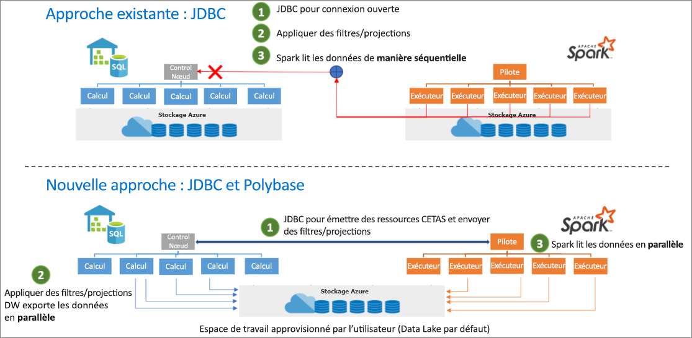

# <a name="introduction"></a>Introduction

Le connecteur Spark SQL Analytics est conçu pour transférer efficacement des données entre un pool Spark (préversion) et des pools SQL dans Azure synapse. Le connecteur Spark SQL Analytics fonctionne uniquement sur les pools SQL. Il ne fonctionne pas avec SQL à la demande.

## <a name="design"></a>Conception

Le transfert de données entre les pools Spark et les pools SQL peut être effectué à l’aide de JDBC. Toutefois, avec deux systèmes distribués tels que les pools SQL et Spark, JDBC tend à être un goulot d’étranglement lors du transfert de données en série.

Le connecteur Spark SQL Analytics est une implémentation de source de données pour Apache Spark. Il utilise Azure Data Lake Storage Gen 2 et Polybase dans les pools SQL pour transférer efficacement des données entre le cluster Spark et l’instance SQL Analytics.



## <a name="authentication-in-azure-synapse-analytics"></a>Authentification dans Azure Synapse Analytics

L’authentification entre systèmes est rendue transparente dans Azure Synapse Analytics. Il existe un service de jeton qui se connecte à Azure Active Directory pour obtenir des jetons de sécurité à utiliser lors de l’accès au compte de stockage ou au serveur de l’entrepôt de données. Pour cette raison, il n’est pas nécessaire de créer des informations d’identification ou de les spécifier dans l’API du connecteur, tant que l’authentification AAD est configurée sur le compte de stockage et le serveur de l’entrepôt de données. Si ce n’est pas le cas, l’authentification SQL peut être spécifiée. Pour plus d’informations, consultez la section [Utilisation](#usage).

## <a name="constraints"></a>Contraintes

- Ce connecteur fonctionne uniquement dans Scala.

## <a name="prerequisites"></a>Prérequis

- Disposer du rôle **db_exporter** dans la base de données/le pool SQL vers ou à partir duquel vous souhaitez transférer des données

Pour créer des utilisateurs, connectez-vous à la base de données et suivez les exemples suivants :

```Sql
CREATE USER Mary FROM LOGIN Mary;
CREATE USER [mike@contoso.com] FROM EXTERNAL PROVIDER;
```

Pour attribuer un rôle :

```Sql
EXEC sp_addrolemember 'db_exporter', 'Mary';
```

## <a name="usage"></a>Utilisation

Les instructions d’importation n’ont pas besoin d’être fournies ; elles sont pré-importées pour l’expérience de notebook.

### <a name="transferring-data-to-or-from-a-sql-pool-in-the-logical-server-dw-instance-attached-with-the-workspace"></a>Transfert de données vers ou à partir d’un pool SQL sur le serveur logique (instance DW) joint à l’espace de travail

> [!NOTE]
> **Importations non nécessaires dans l’expérience de notebook**

```Scala
 import com.microsoft.spark.sqlanalytics.utils.Constants
 import org.apache.spark.sql.SqlAnalyticsConnector._
```

#### <a name="read-api"></a>API de lecture

```Scala
val df = spark.read.sqlanalytics("[DBName].[Schema].[TableName]")
```

L’API ci-dessus fonctionne pour les tables internes (gérées) et externes dans le pool SQL.

#### <a name="write-api"></a>API d’écriture

```Scala
df.write.sqlanalytics("[DBName].[Schema].[TableName]", [TableType])
```

où TableType peut être Constants.INTERNAL ou Constants.EXTERNAL.

```Scala
df.write.sqlanalytics("[DBName].[Schema].[TableName]", Constants.INTERNAL)
df.write.sqlanalytics("[DBName].[Schema].[TableName]", Constants.EXTERNAL)
```

L’authentification auprès du stockage et du serveur SQL est effectuée.

### <a name="if-you-are-transferring-data-to-or-from-a-sql-pool-or-database-in-a-logical-server-outside-the-workspace"></a>Si vous transférez des données vers ou à partir d’un pool ou d’une base de données SQL sur un serveur logique situé en dehors de l’espace de travail

> [!NOTE]
> Importations non nécessaires dans l’expérience de notebook

```Scala
 import com.microsoft.spark.sqlanalytics.utils.Constants
 import org.apache.spark.sql.SqlAnalyticsConnector._
```

#### <a name="read-api"></a>API de lecture

```Scala
val df = spark.read.
option(Constants.SERVER, "samplews.database.windows.net").
sqlanalytics("<DBName>.<Schema>.<TableName>")
```

#### <a name="write-api"></a>API d’écriture

```Scala
df.write.
option(Constants.SERVER, "[samplews].[database.windows.net]").
sqlanalytics("[DBName].[Schema].[TableName]", [TableType])
```

### <a name="using-sql-auth-instead-of-aad"></a>Utilisation de l’authentification SQL au lieu d’AAD

#### <a name="read-api"></a>API de lecture

Actuellement, le connecteur ne prend pas en charge l’authentification basée sur les jetons pour un pool SQL qui se trouve en dehors de l’espace de travail. Vous devez utiliser l’authentification SQL.

```Scala
val df = spark.read.
option(Constants.SERVER, "samplews.database.windows.net").
option(Constants.USER, [SQLServer Login UserName]).
option(Constants.PASSWORD, [SQLServer Login Password]).
sqlanalytics("<DBName>.<Schema>.<TableName>")
```

#### <a name="write-api"></a>API d’écriture

```Scala
df.write.
option(Constants.SERVER, "[samplews].[database.windows.net]").
option(Constants.USER, [SQLServer Login UserName]).
option(Constants.PASSWORD, [SQLServer Login Password]).
sqlanalytics("[DBName].[Schema].[TableName]", [TableType])
```

### <a name="using-the-pyspark-connector"></a>Utilisation du connecteur PySpark

> [!NOTE]
> Cet exemple est fourni avec uniquement l’expérience de notebook à l’esprit.

Supposez que vous avez un tableau « pyspark_df » que vous souhaitez écrire dans le DW.

Créez une table temporaire à l’aide du dataframe dans PySpark :

```Python
pyspark_df.createOrReplaceTempView("pysparkdftemptable")
```

Exécutez une cellule Scala dans le notebook PySpark à l’aide de magics :

```Scala
%%spark
val scala_df = spark.sqlContext.sql ("select * from pysparkdftemptable")

pysparkdftemptable.write.sqlanalytics("sqlpool.dbo.PySparkTable", Constants.INTERNAL)
```
De même, dans le scénario de lecture, lisez les données à l’aide de Scala et écrivez-les dans une table temporaire, puis utilisez Spark SQL dans PySpark pour interroger la table temp dans un dataframe.

## <a name="next-steps"></a>Étapes suivantes

- [Créer un pool SQL]([Create a new Apache Spark pool for an Azure Synapse Analytics workspace](../../synapse-analytics/quickstart-create-apache-spark-pool.md))
- [Créer un pool Apache Spark pour un espace de travail Azure Synapse Analytics](../../synapse-analytics/quickstart-create-apache-spark-pool.md) 