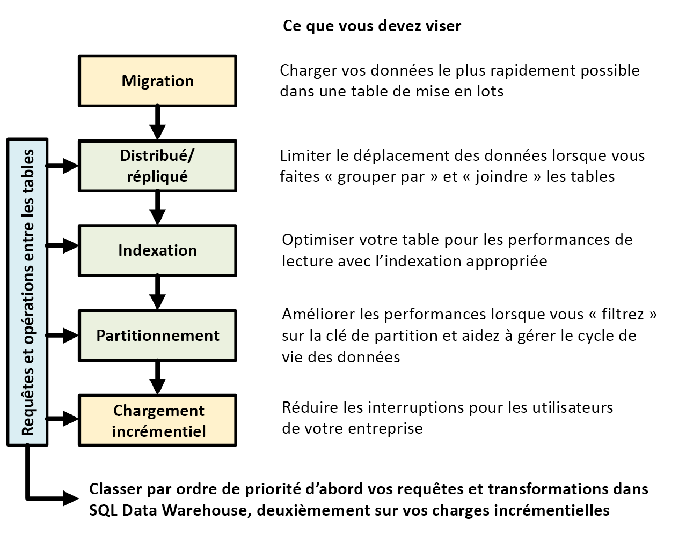

# Aide-mémoire pour Azure Synapse Analytics (anciennement SQL DW)

Cet aide-mémoire vous procure des conseils et des meilleures pratiques à suivre pour générer vos solutions Azure Synapse. 

Le graphique suivant illustre le processus de conception d’un entrepôt de données :

## Requêtes et opérations entre les tables

Lorsque vous connaissez à l’avance les opérations et les requêtes principales à exécuter dans votre entrepôt de données, vous pouvez hiérarchiser l’architecture de votre entrepôt de données pour ces opérations. Il peut s’agir des requêtes et opérations suivantes :
* Joindre une ou deux tables de faits à des tables de dimension, filtrer la table combinée, puis ajouter les résultats dans un mini-Data Warehouse.
* Effectuer des mises à jour minimes ou majeures dans vos tables de faits de ventes.
* Ajouter uniquement des données dans vos tables.

Le fait de bien déterminer le type des opérations à l’avance vous aide à optimiser la conception de vos tables.

## Migration des données

Commencez par charger vos données dans [Azure Data Lake Storage](../../data-factory/connector-azure-data-lake-store.md) ou le stockage Blob Azure. Ensuite, utilisez PolyBase pour charger vos données dans des tables de mise en lots. Utilisez la configuration suivante :

| Conception | Recommandation |
|:--- |:--- |
| Distribution | Tourniquet (round robin) |
| Indexation | Segment de mémoire (heap) |
| Partitionnement | None |
| Classe de ressource | largerc ou xlargerc |

En savoir plus sur la [migration des données](https://blogs.msdn.microsoft.com/sqlcat/20../../migrating-data-to-azure-sql-data-warehouse-in-practice/), le [chargement des données](design-elt-data-loading.md) et le [processus ELT (extraire, charger et transformer)](design-elt-data-loading.md). 

## Tables répliquées ou distribuées

Appliquez les stratégies suivantes, en fonction des caractéristiques de vos tables :

| Type | Usage recommandé| À utiliser avec précaution dans ces cas|
|:--- |:--- |:--- |
| Répliquée | * Petites tables de dimension dans un schéma en étoile avec moins de 2 Go de stockage après compression (compression par 5 environ) |*    Nombreuses transactions d’écriture sur la table (par exemple, insert, upsert, delete, update)  *    Vous changez souvent le provisionnement d’unités DWU (Data Warehouse Units)  *    Vous utilisez uniquement 2 ou 3 colonnes, mais votre table en a plusieurs  *    Vous indexez une table répliquée |
| Tourniquet (par défaut) | *    Table temporaire/de mise en lots   * Pas de clé de jointure évidente ou ni de colonne candidate appropriée |*    Les performances sont lentes en raison du déplacement des données |
| Hachage | * Tables de faits  *    Grandes tables de dimension |* Mise à jour impossible de la clé de distribution |

**Conseils :**
* Choisissez initialement une distribution par tourniquet (round robin), mais envisagez ensuite de passer à une stratégie de distribution par hachage pour tirer pleinement parti d’une architecture de traitement massivement parallèle.
* Assurez-vous que les clés de hachage communes ont toutes le même format de données.
* N’effectuez pas de distribution sur le format varchar.
* Les tables de dimension ayant une clé de hachage commune avec une table de faits soumise à de fréquentes opérations de jointure peuvent faire l’objet d’une distribution par hachage.
* Utilisez *[sys.dm_pdw_nodes_db_partition_stats](/sql/relational-databases/system-dynamic-management-views/sys-dm-db-partition-stats-transact-sql)* pour analyser l’asymétrie dans les données.
* Utilisez *[sys.dm_pdw_request_steps](/sql/relational-databases/system-dynamic-management-views/sys-dm-pdw-request-steps-transact-sql)* pour analyser les mouvements de données subséquents aux requêtes, et surveiller la durée des opérations de diffusion et de lecture aléatoire. Ces informations sont utiles pour la revue de votre stratégie de distribution.

Découvrez plus en détail les [tables répliquées](design-guidance-for-replicated-tables.md) et les [tables distribuées](sql-data-warehouse-tables-distribute.md).

## Indexer votre table

L’indexation sert à accélérer la lecture des tables. Selon vos besoins, vous pouvez utiliser un ensemble unique de technologies :

| Type | Usage recommandé | À utiliser avec précaution dans ces cas|
|:--- |:--- |:--- |
| Segment de mémoire (heap) | * Table de mise en lots/temporaire  * Petites tables avec des recherches réduites |* Toute recherche analyse la table entière |
| Index cluster | * Tables avec jusqu’à 100 millions de lignes  * Grandes tables (plus de 100 millions de lignes) avec seulement 1 ou 2 colonnes souvent utilisées |*    Utilisé sur une table répliquée  *    Vous avez des requêtes complexes impliquant plusieurs opérations de jointure et de regroupement  *    Vous faites des mises à jour sur les colonnes indexées, ce qui prend de la mémoire |
| Index columnstore cluster (par défaut) | *    Grandes tables (plus de 100 millions de lignes) | *    Utilisé sur une table répliquée  *    Vous faites des opérations de mise à jour massives sur votre table  *    Vous partitionnez votre table de manière excessive : les groupes de lignes ne sont pas répartis entre les différents nœuds et partitions de la distribution |

**Conseils :**
* En plus d’un index cluster, vous pouvez ajouter un index non cluster à une colonne souvent utilisée comme filtre. 
* Gérez avec attention la mémoire pour une table avec un index columnstore cluster. Quand vous chargez des données, l’utilisateur (ou la requête) doit pouvoir disposer d’une large classe de ressources. Ainsi, vous empêchez la suppression et la création de nombreux petits groupes de lignes compressés.
* Avec Gen2, les tables CCI sont mises en cache localement sur les nœuds de calcul afin d’optimiser les performances.
* Avec un index columnstore cluster, vous pouvez observer une exécution moins rapide en raison de la faible compression de vos groupes de lignes. Dans ce cas, essayez de régénérer ou de réorganiser votre index columnstore cluster. Prévoyez au moins 100 000 lignes par groupe de lignes compressé. L’idéal est d’avoir un million de lignes dans un groupe de lignes.
* Selon la fréquence et la taille du chargement incrémentiel, il peut être utile d’automatiser la réorganisation ou la regénération de vos index. Un nettoyage est toujours conseillé.
* Faites preuve de stratégie lors de la suppression d’un groupe de lignes. De quelle taille sont les groupes de ligne ouverts ? Quelle quantité de données prévoyez-vous de charger dans les jours à venir ?

Découvrez plus en détail les [index](sql-data-warehouse-tables-index.md).

## Partitionnement
Vous pouvez partitionner votre table quand vous avez des tables de faits volumineuses contenant plus d’un milliard de lignes. Dans 99 % des cas, la clé de partition doit être basée sur la date. Veillez à ne pas effectuer de partitionnement excessif, en particulier si vous utilisez un index columnstore cluster.

Avec les tables de mise en lots qui nécessitent ELT, le partitionnement peut être bénéfique. Il simplifie la gestion du cycle de vie des données.
Là-aussi, n’effectuez pas de partitionnement excessif, notamment avec un index columnstore cluster.

Découvrez plus en détail les [partitions](sql-data-warehouse-tables-partition.md).

## Chargement incrémentiel

Si vous envisagez de charger vos données de manière incrémentielle, assurez-vous d’allouer des classes de ressources plus grandes au chargement de vos données.  C’est particulièrement important lors d’un chargement dans des tables contenant des index columnstore en cluster.  Pour plus d’informations, consultez [Classes de ressources](resource-classes-for-workload-management.md).  

Nous vous recommandons d’utiliser PolyBase et ADF V2 pour automatiser vos pipelines ELT dans votre entrepôt de données.

Pour un grand lot de mises à jour dans vos données d’historique, envisagez d’utiliser une opération [CTAS](sql-data-warehouse-develop-ctas.md) afin d’écrire les données à conserver dans une table plutôt que d’utiliser une opération INSERT, UPDATE et DELETE.

## Mettre à jour les statistiques
 Jusqu’à la disponibilité générale des statistiques automatiques, la maintenance manuelle des statistiques est requise. Il est important de mettre à jour les statistiques dès que des modifications *significatives* ont été apportées à vos données. Cela permet d’optimiser davantage vos plans de requête. Si vous trouvez que la mise à jour de toutes vos statistiques prend trop de temps, vous pouvez sélectionner moins de colonnes contenant des statistiques. 

Vous pouvez également définir la fréquence des mises à jour. Par exemple, vous pouvez mettre à jour des colonnes de date, où de nouvelles valeurs peuvent être ajoutées de façon quotidienne. Pour obtenir des performances optimales, effectuez des statistiques sur les colonnes utilisées dans les jointures, celles utilisées dans la clause WHERE et celles figurant dans GROUP BY.

Découvrez plus en détail les [statistiques](sql-data-warehouse-tables-statistics.md).

## classe de ressources
Des groupes de ressources sont utilisés pour allouer de la mémoire aux requêtes. Si vous avez besoin de davantage de mémoire pour accélérer les requêtes ou le chargement, allouez des classes de ressources plus grandes. L’utilisation de classes de ressources plus grandes impacte toutefois la concurrence. C’est un point à prendre en compte avant de déplacer tous vos utilisateurs dans une classe de ressources de plus grande taille.

Si vous remarquez que les requêtes prennent trop de temps, vérifiez que vos utilisateurs ne se trouvent pas dans des grandes classes de ressources. Les grandes classes de ressources consomment beaucoup d’emplacements de concurrence. Elles peuvent aussi entraîner la mise en file d’attente d’autres requêtes.

Enfin, avec le [pool SQL](sql-data-warehouse-overview-what-is.md#sql-analytics-and-sql-pool-in-azure-synapse) Gen2, chaque classe de ressource obtient 2,5 fois plus de mémoire qu’avec Gen1.

Découvrez plus en détail comment utiliser les [classes de ressources et la concurrence](resource-classes-for-workload-management.md).

## Réduire vos coûts
Une fonctionnalité clé d’Azure Synapse est la possibilité de [gérer des ressources de calcul](sql-data-warehouse-manage-compute-overview.md). Vous pouvez suspendre le pool SQL lorsque vous ne l’utilisez pas, ce qui permet d’arrêter la facturation des ressources de calcul. Vous pouvez faire évoluer les ressources pour répondre à vos exigences de performances. Pour suspendre, utilisez le [portail Azure](../../synapse-analytics/sql-data-warehouse/pause-and-resume-compute-portal.md) ou [PowerShell](../../synapse-analytics/sql-data-warehouse/pause-and-resume-compute-powershell.md). Pour mettre à l’échelle, utilisez le [portail Azure](quickstart-scale-compute-portal.md), [Powershell](quickstart-scale-compute-powershell.md), [T-SQL](quickstart-scale-compute-tsql.md) ou une [API REST](sql-data-warehouse-manage-compute-rest-api.md#scale-compute).

Une fonctionnalité clé d’Azure Synapse est la possibilité de [gérer des ressources de calcul](sql-data-warehouse-manage-compute-overview.md). Vous pouvez suspendre le pool SQL lorsque vous ne l’utilisez pas, ce qui permet d’arrêter la facturation des ressources de calcul. Vous pouvez faire évoluer les ressources pour répondre à vos exigences de performances. Pour suspendre, utilisez le [portail Azure](../../sql-data-warehouse/pause-and-resume-compute-portal.md) ou [PowerShell](../../sql-data-warehouse/pause-and-resume-compute-powershell.md). Pour mettre à l’échelle, utilisez le [portail Azure](quickstart-scale-compute-portal.md), [Powershell](quickstart-scale-compute-powershell.md), [T-SQL](quickstart-scale-compute-tsql.md) ou une [API REST](sql-data-warehouse-manage-compute-rest-api.md#scale-compute).

Vous pouvez maintenant effectuer une mise à l’échelle automatique à tout moment à l’aide d’Azure Functions :

## Optimiser votre architecture pour améliorer les performances

Nous vous recommandons d’envisager SQL Database et Azure Analysis Services dans une architecture hub-and-spoke. Cette solution peut fournir l’isolation de la charge de travail entre les différents groupes d’utilisateurs, tout en rendant possible l’utilisation de certaines fonctionnalités de sécurité avancées offertes par SQL Database et Azure Analysis Services. C’est également un moyen de fournir une concurrence illimitée à vos utilisateurs.

Découvrez plus en détail les [architectures classiques qui tirent parti d’Azure Synapse](https://blogs.msdn.microsoft.com/sqlcat/20../../common-isv-application-patterns-using-azure-sql-data-warehouse/).

Déployez en un seul clic vos rayons dans les bases de données SQL à partir du pool SQL :

