# <a name="quickstart-create-and-query-a-synapse-sql-pool-using-the-azure-portal"></a>Démarrage rapide : Créer et interroger un pool SQL Synapse avec le portail Azure

Créez et interrogez rapidement un pool SQL Synapse (entrepôt de données) dans Azure Synapse Analytics (anciennement SQL DW) à l’aide du portail Azure.

## <a name="prerequisites"></a>Prérequis

1. Si vous n’avez pas d’abonnement Azure, créez un compte [gratuit](https://azure.microsoft.com/free/) avant de commencer.

   > [!NOTE]
   > La création d’un pool SQL dans Azure Synapse peut donner lieu à un nouveau service facturable. Pour plus d’informations, consultez [Tarification Azure Synapse Analytics](https://azure.microsoft.com/pricing/details/synapse-analytics/).

2. Téléchargez et installez la dernière version de [SQL Server Management Studio](/sql/ssms/download-sql-server-management-studio-ssms?toc=/azure/synapse-analytics/sql-data-warehouse/toc.json&bc=/azure/synapse-analytics/sql-data-warehouse/breadcrumb/toc.json&view=azure-sqldw-latest) (SSMS).

## <a name="sign-in-to-the-azure-portal"></a>Connectez-vous au portail Azure.

Connectez-vous au [portail Azure](https://portal.azure.com/).

## <a name="create-a-sql-pool"></a>Créer un pool SQL

Les entrepôts de données sont créés à l’aide d’un pool SQL dans Azure Synapse Analytics. Un pool SQL est créé avec un ensemble défini de [ressources de calcul](memory-concurrency-limits.md). La base de données est créée dans un [groupe de ressources Azure](../../azure-resource-manager/management/overview.md?toc=/azure/synapse-analytics/sql-data-warehouse/toc.json&bc=/azure/synapse-analytics/sql-data-warehouse/breadcrumb/toc.json) et dans un [serveur logique Azure SQL](../../sql-database/sql-database-servers.md?toc=/azure/synapse-analytics/sql-data-warehouse/toc.json&bc=/azure/synapse-analytics/sql-data-warehouse/breadcrumb/toc.json).

Suivez ces étapes pour créer un pool SQL qui contient l’exemple de données **AdventureWorksDW**.

1. Sélectionnez **Créer une ressource** en haut à gauche du portail Azure.

   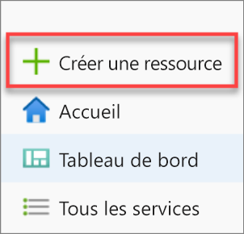

2. Sélectionnez **Bases de données** dans la page **Nouveau**, puis sélectionnez **Azure Synapse Analytics (anciennement SQL DW)** dans la liste **Proposé**.

   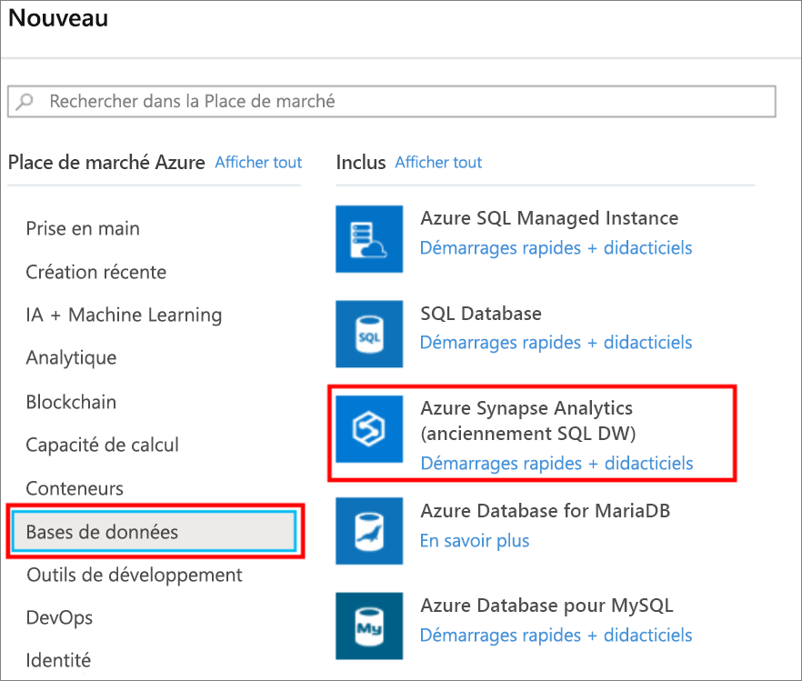

3. Dans **De base**, indiquez votre abonnement, le groupe de ressources, le nom du pool SQL et le nom du serveur :

   | Paramètre | Valeur suggérée | Description |
   | :------ | :-------------- | :---------- |
   | **Abonnement** | Votre abonnement | Pour plus d’informations sur vos abonnements, consultez [Abonnements](https://account.windowsazure.com/Subscriptions). |
   | **Groupe de ressources** | myResourceGroup | Pour les noms de groupe de ressources valides, consultez [Naming conventions](/azure/architecture/best-practices/resource-naming?toc=/azure/synapse-analytics/sql-data-warehouse/toc.json&bc=/azure/synapse-analytics/sql-data-warehouse/breadcrumb/toc.json) (Conventions d’affectation de nom). |
   | **Nom du pool SQL** | Tout nom globalement unique (par exemple, *mySampleDataWarehouse*) | Pour les noms de base de données valides, consultez [Database Identifiers](/sql/relational-databases/databases/database-identifiers?toc=/azure/synapse-analytics/sql-data-warehouse/toc.json&bc=/azure/synapse-analytics/sql-data-warehouse/breadcrumb/toc.json&view=azure-sqldw-latest) (Identificateurs de base de données). Notez qu’un pool SQL est un type de base de données. |
   | **Serveur** | Nom globalement unique | Sélectionnez un serveur existant ou créez un nom de serveur en sélectionnant **Créer**. Pour les noms de serveur valides, consultez [Naming conventions](/azure/architecture/best-practices/resource-naming?toc=/azure/synapse-analytics/sql-data-warehouse/toc.json&bc=/azure/synapse-analytics/sql-data-warehouse/breadcrumb/toc.json) (Conventions d’affectation de nom). |

   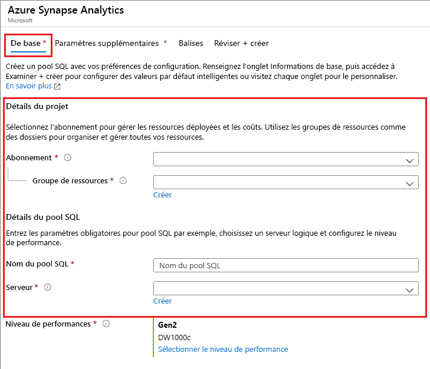

4. Sous **Niveau de performance**, sélectionnez **Sélectionner le niveau de performance** pour éventuellement changer votre configuration à l’aide d’un curseur.

   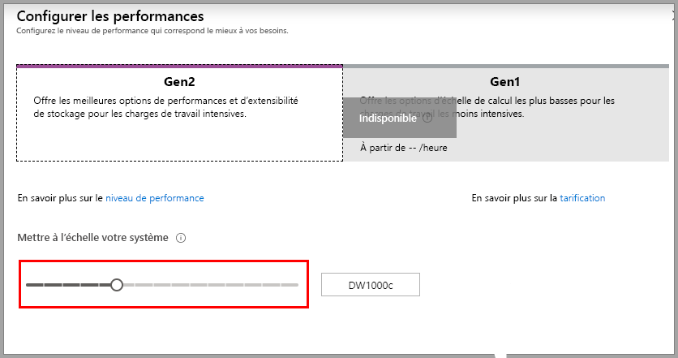  

   Pour plus d’informations sur les niveaux de performance, consultez [Gérer le calcul dans Azure SQL Data Warehouse](sql-data-warehouse-manage-compute-overview.md).

5. Maintenant que vous avez renseigné l’onglet Informations de base du formulaire Azure Synapse Analytics, sélectionnez **Vérifier + créer**, puis **Créer** pour créer le pool SQL. Le provisionnement prend quelques minutes.

   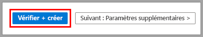

   

6. Dans la barre d’outils, sélectionnez **Notifications** pour superviser le processus de déploiement.

   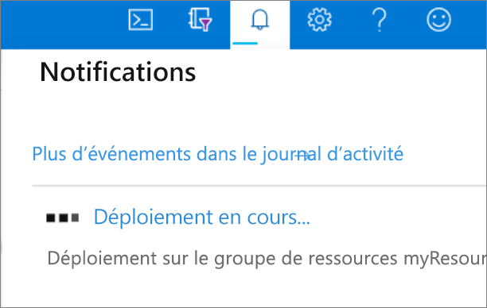

## <a name="create-a-server-level-firewall-rule"></a>Créer une règle de pare-feu au niveau du serveur

Le service Azure Synapse crée un pare-feu au niveau du serveur. Ce pare-feu empêche les outils et les applications externes de se connecter au serveur ou aux bases de données sur le serveur. Pour activer la connectivité, vous pouvez ajouter des règles de pare-feu qui activent la connectivité pour des adresses IP spécifiques. Suivez ces étapes pour créer une [règle de pare-feu au niveau du serveur](../../sql-database/sql-database-firewall-configure.md?toc=/azure/synapse-analytics/sql-data-warehouse/toc.json&bc=/azure/synapse-analytics/sql-data-warehouse/breadcrumb/toc.json) pour l’adresse IP de votre client.

> [!NOTE]
> Azure Synapse communique par le biais du port 1433. Si vous essayez de vous connecter à partir d’un réseau d’entreprise, le trafic sortant sur le port 1433 peut être bloqué par le pare-feu de votre réseau. Dans ce cas, vous ne pouvez pas vous connecter à votre serveur Azure SQL Database, sauf si votre service informatique ouvre le port 1433.

1. Lorsque le déploiement est terminé, sélectionnez **Tous les services** dans le menu de gauche. Sélectionnez **Bases de données**, puis sélectionnez l’étoile en regard d’**Azure Synapse Analytics** pour ajouter Azure Synapse Analytics à vos favoris.

2. Sélectionnez **Azure Synapse Analytics** dans le menu de gauche, puis sélectionnez **mySampleDataWarehouse** dans la page **Azure Synapse Analytics**. La page de vue d’ensemble de votre base de données s’ouvre. Elle affiche le nom complet du serveur (par exemple, **sqlpoolservername**) et fournit des options permettant de poursuivre la configuration.

3. Copiez le nom complet du serveur pour vous connecter à votre serveur et à ses bases de données dans ce guide de démarrage rapide et les suivants. Pour ouvrir les paramètres du serveur, sélectionnez le nom de ce dernier.

   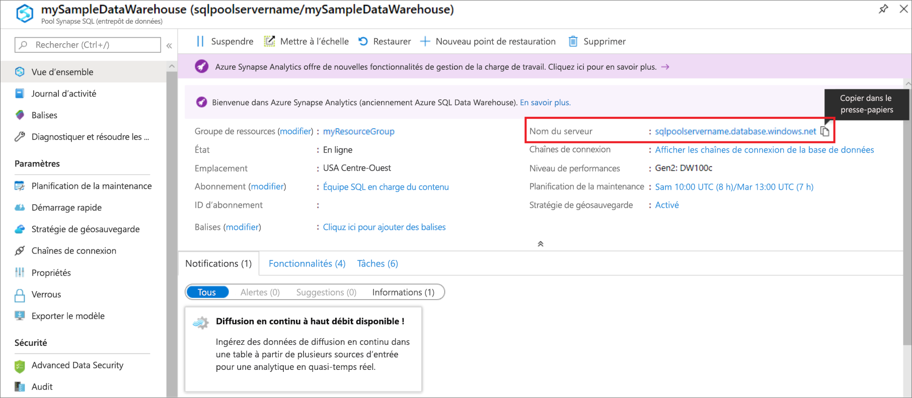

4. Sélectionnez **Afficher les paramètres de pare-feu**.

   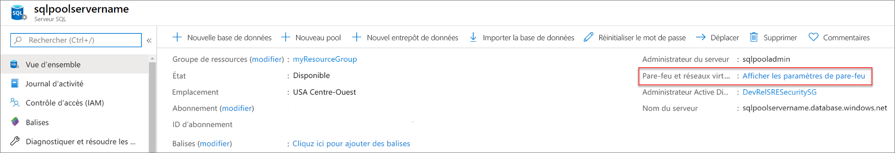

5. La page **Paramètres de pare-feu** du serveur SQL Database s’ouvre.

   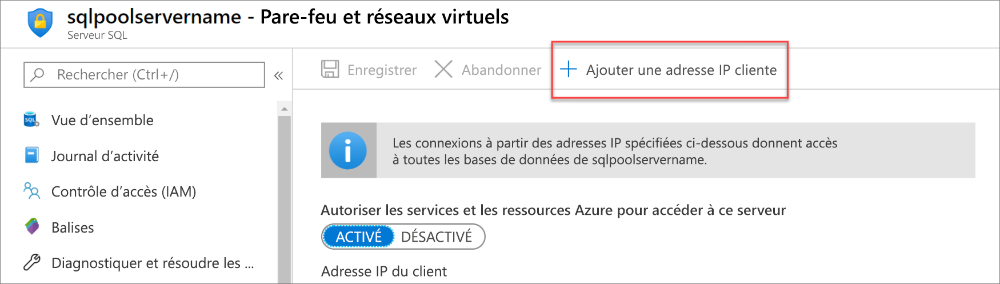

6. Pour ajouter votre adresse IP actuelle à une nouvelle règle de pare-feu, sélectionnez **Ajouter une adresse IP cliente** dans la barre d’outils. Une règle de pare-feu peut ouvrir le port 1433 pour une seule adresse IP ou une plage d’adresses IP.

7. Sélectionnez **Enregistrer**. Une règle de pare-feu au niveau du serveur est créée pour votre adresse IP actuelle et ouvre le port 1433 sur le serveur logique.

8. Sélectionnez **OK**, puis fermez la page **Paramètres de pare-feu**.

Vous pouvez maintenant vous connecter au serveur SQL et à ses pools SQL à l’aide de cette adresse IP. La connexion fonctionne à partir de SQL Server Management Studio ou d’un autre outil de votre choix. Quand vous vous connectez, utilisez le compte ServerAdmin que vous avez créé précédemment.

> [!IMPORTANT]
> Par défaut, l’accès via le pare-feu SQL Database est activé pour tous les services Azure. Sélectionnez **OFF** (Désactivé) dans cette page, puis **Enregistrer** pour désactiver le pare-feu pour tous les services Azure.

## <a name="get-the-fully-qualified-server-name"></a>Obtenir le nom complet du serveur

Obtenez le nom complet de votre serveur SQL dans le portail Azure. Vous utiliserez le nom complet du serveur par la suite pour vous connecter au serveur.

1. Connectez-vous au [portail Azure](https://portal.azure.com/).

2. Sélectionnez **Azure Synapse Analytics** dans le menu de gauche, puis sélectionnez votre pool dans la page **Azure Synapse Analytics**.

3. Dans le volet **Essentials** de la page du portail Azure pour votre base de données, recherchez et copiez le **nom du serveur**. Dans cet exemple, le nom complet est sqlpoolservername.database.windows.net.

    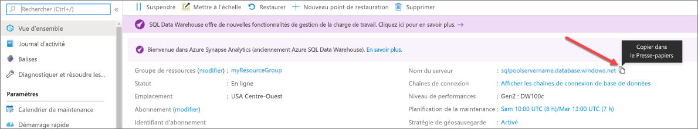

## <a name="connect-to-the-server-as-server-admin"></a>Se connecter au serveur comme administrateur du serveur

Cette section utilise [SQL Server Management Studio](/sql/ssms/download-sql-server-management-studio-ssms?toc=/azure/synapse-analytics/sql-data-warehouse/toc.json&bc=/azure/synapse-analytics/sql-data-warehouse/breadcrumb/toc.json&view=azure-sqldw-latest) (SSMS) pour établir une connexion à votre serveur Azure SQL.

1. Ouvrez SQL Server Management Studio.

2. Dans la fenêtre **Se connecter au serveur**, entrez les valeurs suivantes :

   | Paramètre | Valeur suggérée | Description |
   | :------ | :-------------- | :---------- |
   | Type de serveur | Moteur de base de données | Cette valeur est obligatoire |
   | Nom du serveur | Nom complet du serveur | Voici un exemple : **sqlpoolservername.database.windows.net**. |
   | Authentification | l’authentification SQL Server | L’authentification SQL est le seul type d’authentification configuré dans ce didacticiel. |
   | Connexion | Compte d’administrateur de serveur | Compte que vous avez spécifié lorsque vous avez créé le serveur. |
   | Mot de passe | Mot de passe de votre compte d’administrateur de serveur | Mot de passe que vous avez spécifié quand vous avez créé le serveur. |
   ||||

   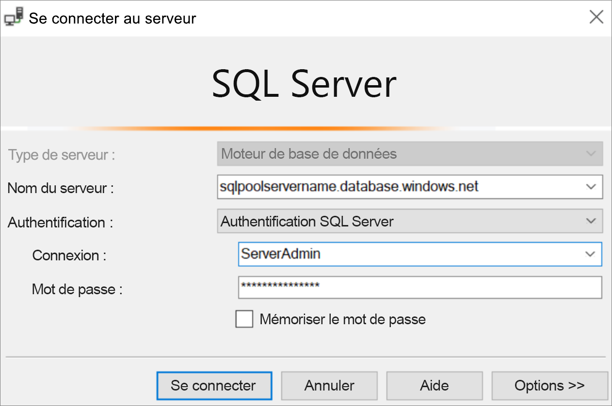

3. Sélectionnez **Connecter**. La fenêtre Explorateur d’objets s’ouvre dans SSMS.

4. Dans l’Explorateur d’objets, développez **Bases de données**. Ensuite, développez **mySampleDatabase** pour afficher les objets dans votre nouvelle base de données.

   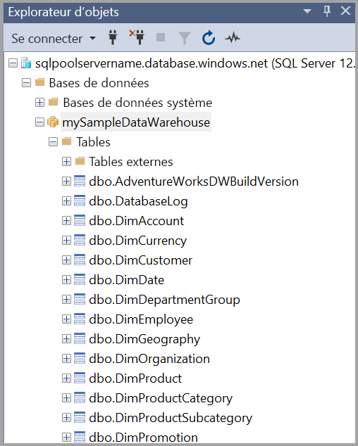

## <a name="run-some-queries"></a>Exécuter des requêtes

SQL Data Warehouse utilise T-SQL comme langage de requête. Pour ouvrir une fenêtre de requête et exécuter des requêtes T-SQL, effectuez les étapes suivantes :

1. Cliquez avec le bouton droit sur **mySampleDataWarehouse**, puis sélectionnez **Nouvelle requête**. Une nouvelle fenêtre de requête s’ouvre.

2. Dans la fenêtre de requête, entrez la commande suivante pour afficher la liste des bases de données.

    ```sql
    SELECT * FROM sys.databases
    ```

3. sélectionnez **Exécuter**. Les résultats de requête montrent deux bases de données : **master** et **mySampleDataWarehouse**.

   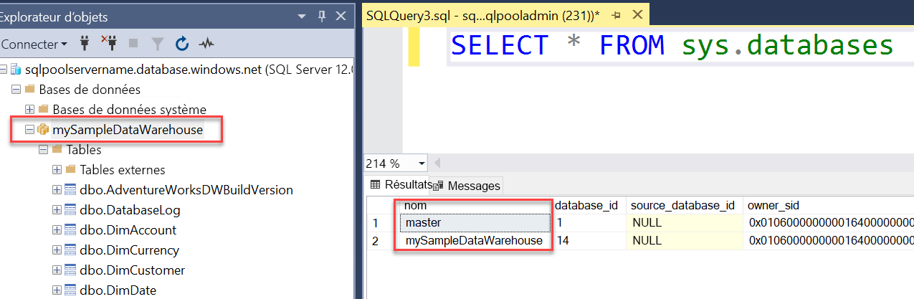

4. Pour examiner des données, utilisez la commande suivante pour afficher le nombre de clients dont le nom de famille est Adams et qui ont trois enfants au foyer. Les résultats donnent six clients.

    ```sql
    SELECT LastName, FirstName FROM dbo.dimCustomer
    WHERE LastName = 'Adams' AND NumberChildrenAtHome = 3;
    ```

   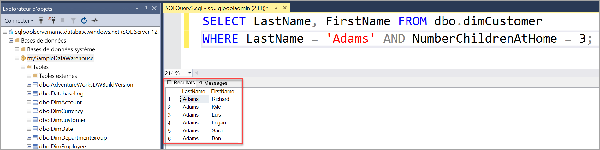

## <a name="clean-up-resources"></a>Nettoyer les ressources

Les unités Data Warehouse Unit et les données stockées dans votre pool SQL vous sont facturées. Ces ressources de calcul et de stockage sont facturées séparément.

- Si vous voulez conserver les données dans le stockage, vous pouvez suspendre le calcul quand vous n’utilisez pas le pool SQL. Quand vous suspendez le calcul, vous êtes facturé uniquement pour le stockage des données. Vous pouvez reprendre le calcul chaque fois que vous êtes prêt à travailler avec les données.

- Si vous voulez éviter des frais à venir, vous pouvez supprimer le pool SQL.

Suivez ces étapes pour nettoyer les ressources dont vous n’avez plus besoin.

1. Connectez-vous au [portail Azure](https://portal.azure.com), puis sélectionnez votre pool SQL.

   

2. Pour suspendre le calcul, sélectionnez le bouton **Suspendre**. Quand le pool SQL est en pause, vous voyez un bouton **Reprendre**. Pour reprendre le calcul, sélectionnez **Reprendre**.

3. Pour supprimer le pool SQL afin de ne pas être facturé pour le calcul ou le stockage, sélectionnez **Supprimer**.

4. Pour supprimer le serveur SQL que vous avez créé, sélectionnez **sqlpoolservername.database.windows.net** dans l’image précédente, puis **Supprimer**. N’oubliez pas que la suppression du serveur supprime également toutes les bases de données qui lui sont attribuées.

5. Pour supprimer le groupe de ressources, sélectionnez **myResourceGroup**, puis **Supprimer le groupe de ressources**.

## <a name="next-steps"></a>Étapes suivantes

Pour en savoir plus sur le chargement de données dans votre pool SQL, passez à l’article [Charger des données dans un pool SQL](load-data-from-azure-blob-storage-using-polybase.md).
