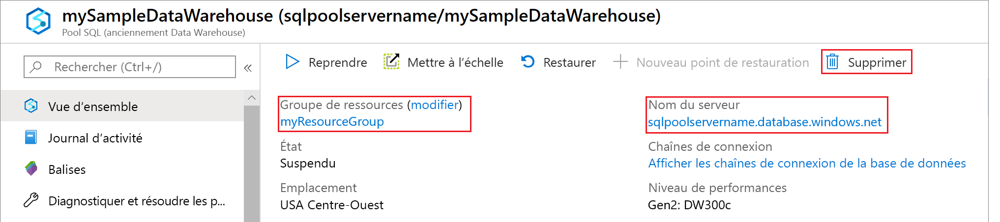

# <a name="tutorial-load-the-new-york-taxicab-dataset"></a>Tutoriel : Charger le jeu de données de New York Taxicab

Ce tutoriel utilise l’[instruction COPY](https://docs.microsoft.com/sql/t-sql/statements/copy-into-transact-sql?view=azure-sqldw-latest) pour charger le jeu de données New York Taxicab à partir d’un objet compte de stockage d’objets blob Azure. Ce didacticiel utilise le [portail Azure](https://portal.azure.com) et [SQL Server Management Studio](/sql/ssms/download-sql-server-management-studio-ssms?toc=/azure/synapse-analytics/sql-data-warehouse/toc.json&bc=/azure/synapse-analytics/sql-data-warehouse/breadcrumb/toc.json&view=azure-sqldw-latest) (SSMS) pour :

> [!div class="checklist"]
>
> * Créer un utilisateur désigné pour le chargement des données
> * Créer les tables pour l’exemple de jeu de données 
> * Utiliser l’instruction T-SQL COPY pour charger les données dans votre entrepôt de données
> * Afficher la progression des données à mesure du chargement

Si vous ne disposez pas d’abonnement Azure, créez un [compte gratuit](https://azure.microsoft.com/free/) avant de commencer.

## <a name="before-you-begin"></a>Avant de commencer

Avant de commencer ce didacticiel, téléchargez et installez la dernière version de [SQL Server Management Studio](/sql/ssms/download-sql-server-management-studio-ssms?toc=/azure/synapse-analytics/sql-data-warehouse/toc.json&bc=/azure/synapse-analytics/sql-data-warehouse/breadcrumb/toc.json&view=azure-sqldw-latest) (SSMS).  

Ce tutoriel présuppose que vous avez déjà créé un pool dédié SQL à partir de [ce tutoriel](https://docs.microsoft.com/azure/synapse-analytics/sql-data-warehouse/create-data-warehouse-portal#connect-to-the-server-as-server-admin).

## <a name="create-a-user-for-loading-data"></a>Créer un utilisateur pour le chargement des données

Le compte d’administrateur de serveur est destiné à effectuer des opérations de gestion et ne convient pas pour l’exécution de requêtes sur les données utilisateur. Le chargement des données est une opération utilisant beaucoup de mémoire. Les valeurs maximales de mémoire sont définies en fonction des [unités DWU (Data Warehouse Unit)](what-is-a-data-warehouse-unit-dwu-cdwu.md) et de la [classe de ressource](resource-classes-for-workload-management.md) configurées.

Il est préférable de créer une connexion et un utilisateur dédiés au chargement des données. Ensuite, ajoutez l’utilisateur de chargement à une [classe de ressource](resource-classes-for-workload-management.md) qui permet une allocation de mémoire maximale appropriée.

Connectez-vous en tant qu’administrateur de serveur pour pouvoir créer des connexions et des utilisateurs. Suivez ces étapes pour créer une connexion et un utilisateur appelé **LoaderRC20**. Ensuite, attribuez l’utilisateur à la classe de ressource **staticrc20**.

1. Dans SSMS, cliquez avec le bouton droit sur **master** pour afficher un menu déroulant, puis choisissez **Nouvelle requête**. Une nouvelle fenêtre de requête s’ouvre.

    

2. Dans la fenêtre de requête, entrez ces commandes T-SQL pour créer une connexion et un utilisateur nommé LoaderRC20, en remplaçant votre mot de passe par « a123STRONGpassword! ».

    ```sql
    CREATE LOGIN LoaderRC20 WITH PASSWORD = 'a123STRONGpassword!';
    CREATE USER LoaderRC20 FOR LOGIN LoaderRC20;
    ```

3. Sélectionnez **Exécuter**.

4. Cliquez avec le bouton droit sur **mySampleDataWarehouse** et choisissez **Nouvelle requête**. Une nouvelle fenêtre de requête s’ouvre.  

    

5. Entrez les commandes T-SQL suivantes pour créer un utilisateur de base de données nommé LoaderRC20 pour la connexion LoaderRC20. La deuxième ligne accorde au nouvel utilisateur des autorisations de contrôle sur le nouvel entrepôt de données.  Ces autorisations reviennent à désigner l’utilisateur comme propriétaire de la base de données. La troisième ligne ajoute le nouvel utilisateur comme membre de la [classe de ressource](resource-classes-for-workload-management.md) staticrc20.

    ```sql
    CREATE USER LoaderRC20 FOR LOGIN LoaderRC20;
    GRANT CONTROL ON DATABASE::[mySampleDataWarehouse] to LoaderRC20;
    EXEC sp_addrolemember 'staticrc20', 'LoaderRC20';
    ```

6. Sélectionnez **Exécuter**.

## <a name="connect-to-the-server-as-the-loading-user"></a>Se connecter au serveur comme utilisateur de chargement

La première étape du chargement des données consiste à se connecter sous LoaderRC20.  

1. Dans l’Explorateur d’objets, sélectionnez le menu déroulant **Se connecter**, puis **Moteur de base de données**. La boîte de dialogue **Se connecter au serveur** s’affiche.

    

2. Entrez le nom complet du serveur, puis **LoaderRC20** comme connexion.  Entrez votre mot de passe pour LoaderRC20.

3. Sélectionnez **Connecter**.

4. Quand votre connexion est prête, vous voyez deux connexions de serveur dans l’Explorateur d’objets. Une connexion sous ServerAdmin et une connexion sous MedRCLogin.

    

## <a name="create-tables-for-the-sample-data"></a>Créer des tables pour les exemples de données

Vous êtes prêt à commencer le processus de chargement des données dans votre nouvel entrepôt de données. Cette partie du tutoriel vous montre comment utiliser l’instruction COPY pour charger le jeu de données New York Taxicab à partir d’un objet blob Stockage Azure. À des fins de référence future, pour savoir comment charger vos données vers le stockage d’objets blob Azure ou pour les charger directement à partir de votre source, voir [Vue d’ensemble du chargement](design-elt-data-loading.md).

Exécutez les scripts SQL suivants en spécifiant les informations sur les données que vous voulez charger. Ces informations sont notamment l’emplacement des données, le format du contenu des données et la définition de table pour les données.

1. Dans la section précédente, vous vous êtes connecté à votre entrepôt de données sous LoaderRC20. Dans SSMS, cliquez avec le bouton droit sur votre connexion LoaderRC20 et sélectionnez **Nouvelle requête**.  Une nouvelle fenêtre de requête s’affiche.

    

2. Comparez votre fenêtre de requête à l’image précédente.  Vérifiez que votre fenêtre de nouvelle requête s’exécute sous LoaderRC20 et qu’elle exécute des requêtes sur votre base de données MySampleDataWarehouse. Utilisez cette fenêtre de requête pour effectuer toutes les étapes de chargement.

7. Exécutez les instructions T-SQL suivantes pour créer les tables :

    ```sql
    CREATE TABLE [dbo].[Date]
    (
        [DateID] int NOT NULL,
        [Date] datetime NULL,
        [DateBKey] char(10) COLLATE SQL_Latin1_General_CP1_CI_AS NULL,
        [DayOfMonth] varchar(2) COLLATE SQL_Latin1_General_CP1_CI_AS NULL,
        [DaySuffix] varchar(4) COLLATE SQL_Latin1_General_CP1_CI_AS NULL,
        [DayName] varchar(9) COLLATE SQL_Latin1_General_CP1_CI_AS NULL,
        [DayOfWeek] char(1) COLLATE SQL_Latin1_General_CP1_CI_AS NULL,
        [DayOfWeekInMonth] varchar(2) COLLATE SQL_Latin1_General_CP1_CI_AS NULL,
        [DayOfWeekInYear] varchar(2) COLLATE SQL_Latin1_General_CP1_CI_AS NULL,
        [DayOfQuarter] varchar(3) COLLATE SQL_Latin1_General_CP1_CI_AS NULL,
        [DayOfYear] varchar(3) COLLATE SQL_Latin1_General_CP1_CI_AS NULL,
        [WeekOfMonth] varchar(1) COLLATE SQL_Latin1_General_CP1_CI_AS NULL,
        [WeekOfQuarter] varchar(2) COLLATE SQL_Latin1_General_CP1_CI_AS NULL,
        [WeekOfYear] varchar(2) COLLATE SQL_Latin1_General_CP1_CI_AS NULL,
        [Month] varchar(2) COLLATE SQL_Latin1_General_CP1_CI_AS NULL,
        [MonthName] varchar(9) COLLATE SQL_Latin1_General_CP1_CI_AS NULL,
        [MonthOfQuarter] varchar(2) COLLATE SQL_Latin1_General_CP1_CI_AS NULL,
        [Quarter] char(1) COLLATE SQL_Latin1_General_CP1_CI_AS NULL,
        [QuarterName] varchar(9) COLLATE SQL_Latin1_General_CP1_CI_AS NULL,
        [Year] char(4) COLLATE SQL_Latin1_General_CP1_CI_AS NULL,
        [YearName] char(7) COLLATE SQL_Latin1_General_CP1_CI_AS NULL,
        [MonthYear] char(10) COLLATE SQL_Latin1_General_CP1_CI_AS NULL,
        [MMYYYY] char(6) COLLATE SQL_Latin1_General_CP1_CI_AS NULL,
        [FirstDayOfMonth] date NULL,
        [LastDayOfMonth] date NULL,
        [FirstDayOfQuarter] date NULL,
        [LastDayOfQuarter] date NULL,
        [FirstDayOfYear] date NULL,
        [LastDayOfYear] date NULL,
        [IsHolidayUSA] bit NULL,
        [IsWeekday] bit NULL,
        [HolidayUSA] varchar(50) COLLATE SQL_Latin1_General_CP1_CI_AS NULL
    )
    WITH
    (
        DISTRIBUTION = ROUND_ROBIN,
        CLUSTERED COLUMNSTORE INDEX
    );
    
    CREATE TABLE [dbo].[Geography]
    (
        [GeographyID] int NOT NULL,
        [ZipCodeBKey] varchar(10) COLLATE SQL_Latin1_General_CP1_CI_AS NOT NULL,
        [County] varchar(50) COLLATE SQL_Latin1_General_CP1_CI_AS NULL,
        [City] varchar(50) COLLATE SQL_Latin1_General_CP1_CI_AS NULL,
        [State] varchar(50) COLLATE SQL_Latin1_General_CP1_CI_AS NULL,
        [Country] varchar(50) COLLATE SQL_Latin1_General_CP1_CI_AS NULL,
        [ZipCode] varchar(50) COLLATE SQL_Latin1_General_CP1_CI_AS NULL
    )
    WITH
    (
        DISTRIBUTION = ROUND_ROBIN,
        CLUSTERED COLUMNSTORE INDEX
    );
    
    CREATE TABLE [dbo].[HackneyLicense]
    (
        [HackneyLicenseID] int NOT NULL,
        [HackneyLicenseBKey] varchar(50) COLLATE SQL_Latin1_General_CP1_CI_AS NOT NULL,
        [HackneyLicenseCode] varchar(50) COLLATE SQL_Latin1_General_CP1_CI_AS NULL
    )
    WITH
    (
        DISTRIBUTION = ROUND_ROBIN,
        CLUSTERED COLUMNSTORE INDEX
    );
    
    CREATE TABLE [dbo].[Medallion]
    (
        [MedallionID] int NOT NULL,
        [MedallionBKey] varchar(50) COLLATE SQL_Latin1_General_CP1_CI_AS NOT NULL,
        [MedallionCode] varchar(50) COLLATE SQL_Latin1_General_CP1_CI_AS NULL
    )
    WITH
    (
        DISTRIBUTION = ROUND_ROBIN,
        CLUSTERED COLUMNSTORE INDEX
    );
    
    CREATE TABLE [dbo].[Time]
    (
        [TimeID] int NOT NULL,
        [TimeBKey] varchar(8) COLLATE SQL_Latin1_General_CP1_CI_AS NOT NULL,
        [HourNumber] tinyint NOT NULL,
        [MinuteNumber] tinyint NOT NULL,
        [SecondNumber] tinyint NOT NULL,
        [TimeInSecond] int NOT NULL,
        [HourlyBucket] varchar(15) COLLATE SQL_Latin1_General_CP1_CI_AS NOT NULL,
        [DayTimeBucketGroupKey] int NOT NULL,
        [DayTimeBucket] varchar(100) COLLATE SQL_Latin1_General_CP1_CI_AS NOT NULL
    )
    WITH
    (
        DISTRIBUTION = ROUND_ROBIN,
        CLUSTERED COLUMNSTORE INDEX
    );
    
    CREATE TABLE [dbo].[Trip]
    (
        [DateID] int NOT NULL,
        [MedallionID] int NOT NULL,
        [HackneyLicenseID] int NOT NULL,
        [PickupTimeID] int NOT NULL,
        [DropoffTimeID] int NOT NULL,
        [PickupGeographyID] int NULL,
        [DropoffGeographyID] int NULL,
        [PickupLatitude] float NULL,
        [PickupLongitude] float NULL,
        [PickupLatLong] varchar(50) COLLATE SQL_Latin1_General_CP1_CI_AS NULL,
        [DropoffLatitude] float NULL,
        [DropoffLongitude] float NULL,
        [DropoffLatLong] varchar(50) COLLATE SQL_Latin1_General_CP1_CI_AS NULL,
        [PassengerCount] int NULL,
        [TripDurationSeconds] int NULL,
        [TripDistanceMiles] float NULL,
        [PaymentType] varchar(50) COLLATE SQL_Latin1_General_CP1_CI_AS NULL,
        [FareAmount] money NULL,
        [SurchargeAmount] money NULL,
        [TaxAmount] money NULL,
        [TipAmount] money NULL,
        [TollsAmount] money NULL,
        [TotalAmount] money NULL
    )
    WITH
    (
        DISTRIBUTION = ROUND_ROBIN,
        CLUSTERED COLUMNSTORE INDEX
    );
    
    CREATE TABLE [dbo].[Weather]
    (
        [DateID] int NOT NULL,
        [GeographyID] int NOT NULL,
        [PrecipitationInches] float NOT NULL,
        [AvgTemperatureFahrenheit] float NOT NULL
    )
    WITH
    (
        DISTRIBUTION = ROUND_ROBIN,
        CLUSTERED COLUMNSTORE INDEX
    );
    ```
    

## <a name="load-the-data-into-your-data-warehouse"></a>Charger les données dans votre entrepôt de données

Cette section utilise l’[instruction COPY pour charger](https://docs.microsoft.com/sql/t-sql/statements/copy-into-transact-sql?view=azure-sqldw-latest) les exemples de données à partir d’Azure Storage Blob.  

> [!NOTE]
> Ce didacticiel charge directement les données dans la table finale. En général, vous les chargez dans une table de mise en lots pour vos charges de travail de production. Lorsque les données se trouvent dans la table de mise en lots, vous pouvez effectuer toutes les transformations nécessaires. 

1. Exécutez les instructions suivantes pour charger les données :

    ```sql
    COPY INTO [dbo].[Date]
    FROM 'https://nytaxiblob.blob.core.windows.net/2013/Date'
    WITH
    (
        FILE_TYPE = 'CSV',
        FIELDTERMINATOR = ',',
        FIELDQUOTE = ''
    )
    OPTION (LABEL = 'COPY : Load [dbo].[Date] - Taxi dataset');
    
    
    COPY INTO [dbo].[Geography]
    FROM 'https://nytaxiblob.blob.core.windows.net/2013/Geography'
    WITH
    (
        FILE_TYPE = 'CSV',
        FIELDTERMINATOR = ',',
        FIELDQUOTE = ''
    )
    OPTION (LABEL = 'COPY : Load [dbo].[Geography] - Taxi dataset');
    
    COPY INTO [dbo].[HackneyLicense]
    FROM 'https://nytaxiblob.blob.core.windows.net/2013/HackneyLicense'
    WITH
    (
        FILE_TYPE = 'CSV',
        FIELDTERMINATOR = ',',
        FIELDQUOTE = ''
    )
    OPTION (LABEL = 'COPY : Load [dbo].[HackneyLicense] - Taxi dataset');
    
    COPY INTO [dbo].[Medallion]
    FROM 'https://nytaxiblob.blob.core.windows.net/2013/Medallion'
    WITH
    (
        FILE_TYPE = 'CSV',
        FIELDTERMINATOR = ',',
        FIELDQUOTE = ''
    )
    OPTION (LABEL = 'COPY : Load [dbo].[Medallion] - Taxi dataset');
    
    COPY INTO [dbo].[Time]
    FROM 'https://nytaxiblob.blob.core.windows.net/2013/Time'
    WITH
    (
        FILE_TYPE = 'CSV',
        FIELDTERMINATOR = ',',
        FIELDQUOTE = ''
    )
    OPTION (LABEL = 'COPY : Load [dbo].[Time] - Taxi dataset');
    
    COPY INTO [dbo].[Weather]
    FROM 'https://nytaxiblob.blob.core.windows.net/2013/Weather'
    WITH
    (
        FILE_TYPE = 'CSV',
        FIELDTERMINATOR = ',',
        FIELDQUOTE = '',
        ROWTERMINATOR='0X0A'
    )
    OPTION (LABEL = 'COPY : Load [dbo].[Weather] - Taxi dataset');
    
    COPY INTO [dbo].[Trip]
    FROM 'https://nytaxiblob.blob.core.windows.net/2013/Trip2013'
    WITH
    (
        FILE_TYPE = 'CSV',
        FIELDTERMINATOR = '|',
        FIELDQUOTE = '',
        ROWTERMINATOR='0X0A',
        COMPRESSION = 'GZIP'
    )
    OPTION (LABEL = 'COPY : Load [dbo].[Trip] - Taxi dataset');
    ```

2. Affichez vos données à mesure qu’elles sont chargées. Vous chargez plusieurs gigaoctets de données et les compressez au sein d’index de cluster columnstore hautes performances. Exécutez la requête suivante qui fait appel à des vues de gestion dynamique pour afficher l’état de la charge.

    ```sql
    SELECT  r.[request_id]                           
    ,       r.[status]                               
    ,       r.resource_class                         
    ,       r.command
    ,       sum(bytes_processed) AS bytes_processed
    ,       sum(rows_processed) AS rows_processed
    FROM    sys.dm_pdw_exec_requests r
                  JOIN sys.dm_pdw_dms_workers w
                         ON r.[request_id] = w.request_id
    WHERE [label] = 'COPY : Load [dbo].[Date] - Taxi dataset' OR
        [label] = 'COPY : Load [dbo].[Geography] - Taxi dataset' OR
        [label] = 'COPY : Load [dbo].[HackneyLicense] - Taxi dataset' OR
        [label] = 'COPY : Load [dbo].[Medallion] - Taxi dataset' OR
        [label] = 'COPY : Load [dbo].[Time] - Taxi dataset' OR
        [label] = 'COPY : Load [dbo].[Weather] - Taxi dataset' OR
        [label] = 'COPY : Load [dbo].[Trip] - Taxi dataset' 
    and session_id <> session_id() and type = 'WRITER'
    GROUP BY r.[request_id]                           
    ,       r.[status]                               
    ,       r.resource_class                         
    ,       r.command;
    ```
    
3. Affichez toutes les requêtes du système.

    ```sql
    SELECT * FROM sys.dm_pdw_exec_requests;
    ```

4. Vous pouvez constater que vos données sont efficacement chargées dans votre entrepôt de données.

    

## <a name="clean-up-resources"></a>Nettoyer les ressources

Vous êtes facturé en fonction des ressources de calcul et des données que vous avez chargées dans votre entrepôt de données. Les deux sont facturés séparément.

* Si vous voulez conserver les données dans le stockage, vous pouvez suspendre le calcul quand vous n’utilisez pas l’entrepôt de données. Quand vous suspendez le calcul, vous êtes facturé uniquement pour le stockage des données et vous pouvez reprendre le calcul dès que vous voulez utiliser les données.
* Si vous voulez éviter des frais futurs, vous pouvez supprimer l’entrepôt de données.

Suivez ces étapes pour nettoyer les ressources selon vos besoins.

1. Connectez-vous au [portail Azure](https://portal.azure.com), puis sélectionnez votre entrepôt de données.

    

2. Pour suspendre le calcul, sélectionnez le bouton **Suspendre**. Quand l’entrepôt de données est suspendu, un bouton **Démarrer** s’affiche.  Pour reprendre le calcul, sélectionnez **Démarrer**.

3. Pour supprimer l’entrepôt de données afin de ne pas être facturé pour le calcul ou le stockage, sélectionnez **Supprimer**.

4. Pour supprimer le serveur que vous avez créé, sélectionnez **mynewserver-20180430.database.windows.net** dans l’image précédente, puis **Supprimer**.  N’oubliez pas que la suppression du serveur supprime toutes les bases de données attribuées au serveur.

5. Pour supprimer le groupe de ressources, sélectionnez **myResourceGroup**, puis **Supprimer le groupe de ressources**.

## <a name="next-steps"></a>Étapes suivantes

Dans ce didacticiel, vous avez appris à créer un entrepôt de données et un utilisateur pour le chargement des données. Vous avez utilisé l’[instruction COPY](https://docs.microsoft.com/sql/t-sql/statements/copy-into-transact-sql?view=azure-sqldw-latest#examples) pour charger des données dans votre entrepôt de données.

Voici les étapes que vous avez effectuées :
> [!div class="checklist"]
>
> * Créer un entrepôt de données dans le portail Azure
> * Configurer une règle de pare-feu au niveau du serveur dans le portail Azure
> * Se connecter à l’entrepôt de données avec SSMS
> * Créer un utilisateur désigné pour le chargement des données
> * Créer les tables pour les exemples de données
> * Utiliser l’instruction T-SQL COPY pour charger les données dans votre entrepôt de données
> * Afficher la progression des données à mesure du chargement

Passez à la vue d’ensemble du développement pour savoir comment migrer une base de données existante vers Azure Synapse Analytics :

> [!div class="nextstepaction"]
> [Décisions de conception pour migrer une base de données existante vers Azure Synapse Analytics](sql-data-warehouse-overview-develop.md)

Pour obtenir plus d’exemples et de références sur le chargement, consultez la documentation suivante :

- [Documentation de référence sur l’instruction COPY](https://docs.microsoft.com/sql/t-sql/statements/copy-into-transact-sql?view=azure-sqldw-latest#syntax)
- [Exemples COPY pour chaque méthode d’authentification](https://docs.microsoft.com/azure/synapse-analytics/sql-data-warehouse/quickstart-bulk-load-copy-tsql-examples)
- [Démarrage rapide : Instruction COPY pour une table unique](https://docs.microsoft.com/azure/synapse-analytics/sql-data-warehouse/quickstart-bulk-load-copy-tsql)
